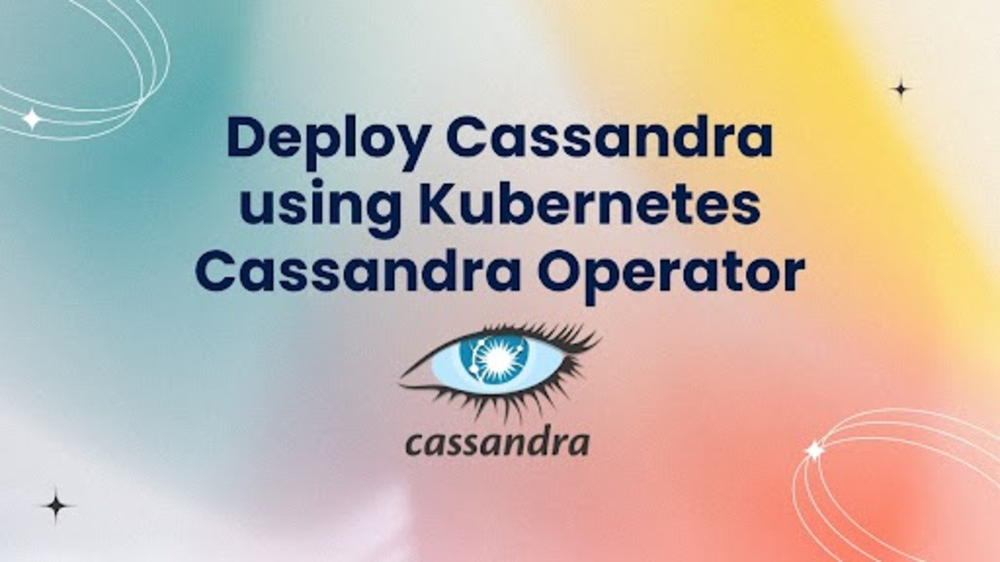

# Deploy Cassandra via Kubernetes Cassandra Operator



In today’s cloud-first era, the need for highly-available, scalable databases is more critical than ever. The industry-leading container orchestration platform, Kubernetes, is well-known for effectively administering containerized workloads. For stateless applications, it makes deployment and scaling easier, but stateful services, like databases, need additional tools to be deployed. **Kubernetes Cassandra Operator** — a tool that makes this complex process much easier and simpler by setting up and maintaining Cassandra databases in a Kubernetes environment.

In this article, we will have an overview of the Cassandra database setup by using the Kubernetes Cassandra operator managed by [KubeDB](https://kubedb.com/). We will also have a look at the features and advantages of the KubeDB Cassandra operator in the Kubernetes environment.

## Why Cassandra in Kubernetes
Kubernetes is an open-source technology. It was created specifically for container orchestration. It provides a standardized method for managing the lifetime of containers, automating their deployment, and guaranteeing their dependability and availability. For businesses looking to create scalable, robust, and effective cloud-native apps, Kubernetes has become the go-to option.

Apache Cassandra is a popular NoSQL database. It is widely used for applications that require high read and write throughput. It was made to manage massive volumes of data across multiple nodes. It is popular for its high availability, fault tolerance, and no single point of failure.

By combining Cassandra's scalability and fault tolerance with Kubernetes' orchestration capabilities, Cassandra in Kubernetes allows for smooth deployment, scaling, and management. Kubernetes ensures high availability and portability across environments by automating resource allocation, monitoring, and self-healing. It is perfect for contemporary, distributed applications since it incorporates Cassandra into the cloud-native ecosystem and supports tools for monitoring, backups, and CI/CD.

## Deploy Cassandra on Kubernetes
### Pre-requisites
We have to configure the environment to deploy Cassandra on Kubernetes using a Kubernetes Cassandra operator. You need to have a Kubernetes cluster. You should have the basic knowledge of Kubernetes concepts like cluster, pod, service, secret and also have a primary knowledge of [Cassandra](https://cassandra.apache.org/_/index.html) database. Here, we will use [Kind](https://kubernetes.io/docs/tasks/tools/#kind) to create our Kubernetes cluster. Also, we will need to install [Helm](https://helm.sh/docs/intro/install/) to our Kubernetes cluster.

In this article, We will use the Kubernetes Cassandra operator [KubeDB](https://kubedb.com/) to deploy Cassandra on Kubernetes. But before starting, you must ensure that KubeDB is already installed in your Kubernetes cluster. For using KubeDB on Kubernetes cluster, a license is needed, which you can obtain for free from the [Appscode License Server](https://license-issuer.appscode.com/). To get this license, you'll need the Kubernetes cluster ID. You can find this ID by running the command we have provided below.

 
```bash
$ kubectl get ns kube-system -o jsonpath='{.metadata.uid}'
e5b4a1a0-5a67-4657-b370-db7200108cae
```

After providing the necessary information and hitting the submit button, the license server will email a "license.txt" file. To install KubeDB, run the following commands:

```bash
$ helm install kubedb oci://ghcr.io/appscode-charts/kubedb \
  --version v2025.1.9 \
  --namespace kubedb --create-namespace \
  --set-file global.license=/path/to/the/license.txt \
  --wait --burst-limit=10000 --debug \
  --set global.featureGates.cassandra=true
```


Verify the installation by the following command:

```bash
$ kubectl get pods --all-namespaces -l "app.kubernetes.io/instance=kubedb"
NAMESPACE   NAME                                            READY   STATUS    RESTARTS   AGE
kubedb      kubedb-kubedb-autoscaler-7d98f45f84-fhtcj       1/1     Running   0          5m
kubedb      kubedb-kubedb-ops-manager-64bdc96d99-85xhz      1/1     Running   0          5m
kubedb      kubedb-kubedb-provisioner-c765ffcd5-5fzxc       1/1     Running   0          5m
kubedb      kubedb-kubedb-webhook-server-7b97d992f8-m8cxw   1/1     Running   0          5m
kubedb      kubedb-petset-operator-6b5fddcd9-wl2dp          1/1     Running   0          5m
kubedb      kubedb-petset-webhook-server-59ff65f4fd-tf52g   2/2     Running   0          5m
kubedb      kubedb-sidekick-f8674fc4f-qkstf                 1/1     Running   0          5m
``` 
Within a short time all the pods in kubedb namespace will start running. If all pod statuses are running, we can move on to the next phase.

For any confusion reguarding KubeDB installation, you can follow the [KubeDB-Setup](https://kubedb.com/docs/latest/setup/) page.

### Create a Namespace
After that, we'll create a new namespace in which we will deploy Cassandra. In this case, we have created cassandra-demo namespace, but you can create namespace with any name that you want. To create the namespace, we can use the following command:

```bash
$ kubectl create namespace cassandra-demo
namespace/cassandra-demo created
``` 

### Deploy Cassandra via Kubernetes Cassandra operator
We need to create a yaml configuration to deploy Cassandra database on Kubernetes. We will apply this yaml below:

```yaml
apiVersion: kubedb.com/v1alpha2
kind: Cassandra
metadata:
  name: cassandra-quickstart
  namespace: cassandra-demo
spec:
  version: 5.0.0
  topology:
    rack:
      - name: myrack
        replicas: 2
        storageType: Ephemeral
        storage:
          accessModes:
            - ReadWriteOnce
          resources:
            requests:
              storage: 1Gi
        podTemplate:
          spec:
            containers:
              - name: cassandra
                resources:
                  limits:
                    memory: 4Gi
                    cpu: 4
                  requests:
                    cpu: 1
                    memory: 1Gi
  deletionPolicy: WipeOut
```

We will save this yaml configuration to `cassandra.yaml`. Then create the above Cassandra object.

```bash
$ kubectl create -f cassandra.yaml
Cassandra.kubedb.com/cassandra-quickstart created
```

This will create a cassandra custom resource. The kubernetes Cassandra Operator will watch this and create two pods of Cassandra in the specified namespace.
If all the above steps are handled correctly and the Cassandra is deployed, you will see that the following objects are created:

```bash
$ kubectl get all -n cassandra-demo
NAME                         READY   STATUS    RESTARTS   AGE
pod/cassandra-quickstart-0   1/1     Running   0          4m51s
pod/cassandra-quickstart-1   1/1     Running   0          3m23s

NAME                                TYPE        CLUSTER-IP     EXTERNAL-IP   PORT(S)     AGE
service/cassandra-quickstart        ClusterIP   10.96.70.253   <none>        9042/TCP   5m51s
service/cassandra-quickstart-pods   ClusterIP   None           <none>        9042/TCP   5m51s

NAME                                                      TYPE                   VERSION   AGE
appbinding.appcatalog.appscode.com/cassandra-quickstart   kubedb.com/Cassandra   1.6.22    5m51s

NAME                                        VERSION   STATUS   AGE
cassandra.kubedb.com/cassandra-quickstart   5.0.0    Ready    5m51s

```

We have successfully deployed Cassandra to Kubernetes via the Kubernetes Cassandra operator. Now, we will connect to the Cassandra database to insert some sample data and verify whether our Cassandra database is usable or not. First, check the database status,

```bash
$ kubectl get cassandra -n cassandra-demo
NAME                   VERSION   STATUS   AGE
cassandra-quickstart   5.0.0    Ready    5m56s
```

To connect to the database in this case, we should need the required credentials. Let's export the credentials to our current shell as an environment variable. KubeDB will create Secret and Service for the database `cassandra-cluster` that we have deployed. Let’s check them,

```bash
$ kubectl get secret -n cassandra-demo -l=app.kubernetes.io/instance=cassandra-quickstart
NAME                          TYPE     DATA   AGE
cassandra-quickstart-config   Opaque   1      8m1s

$ kubectl get service -n cassandra-demo -l=app.kubernetes.io/instance=cassandra-quickstart
NAME                        TYPE        CLUSTER-IP     EXTERNAL-IP   PORT(S)     AGE
cassandra-quickstart        ClusterIP   10.96.70.253   <none>        9042/TCP   8m58s
cassandra-quickstart-pods   ClusterIP   None           <none>        9042/TCP   8m58s
```
### Accessing Database Through CLI

You must first have the database credentials in order to access your database via the CLI. KubeDB will create several Kubernetes Secrets and Services for your Cassandra Server instance. To view them, use the following commands:

```bash
$ kubectl get secret -n cassandra-demo -l=app.kubernetes.io/instance=cassandra-quickstart 
NAME                                 TYPE                       DATA   AGE
cassandra-quickstart-auth            kubernetes.io/basic-auth   2      8m31s
cassandra-quickstart-config          Opaque                     1      8m31s


$ kubectl get service -n cassandra-demo -l=app.kubernetes.io/instance=cassandra-quickstart 
NAME                             TYPE        CLUSTER-IP       EXTERNAL-IP   PORT(S)    AGE
cassandra-quickstart             ClusterIP   10.128.113.192   <none>        9042/TCP   8m37s
cassandra-quickstart-pods        ClusterIP   None             <none>        9042/TCP   8m37s
```

From the above list, the `cassandra-quickstart-auth` Secret contains the admin-level credentials needed to connect to the database. The credencials are stored as base64 format. So we need to decode those. Use the following commands to obtain the username and password:

```bash
$ kubectl get secret -n demo cassandra-quickstart-auth  -o jsonpath='{.data.username}' | base64 -d
admin
$ kubectl get secret -n demo cassandra-quickstart-auth  -o jsonpath='{.data.password}' | base64 -d
dS57E93oLDi5wezv
```

### Insert sample data to the Cassandra database
In this section, we are going to login into our Cassandra database pod and insert some sample data.
First of all, we need to connect to this database using cqlsh. A command-line utility called cqlsh is used to communicate with Apache Cassandra through the Cassandra Query Language (CQL).

```bash
$ kubectl get pods -n cassandra-demo
NAME                             READY   STATUS    RESTARTS   AGE
cassandra-quickstart-rack-r0-0   1/1     Running   0          13m
cassandra-quickstart-rack-r0-1   1/1     Running   0          12m

# We will connect to `cassandra-quickstart-0` pod using cqlsh.
$ kubectl exec -it -n cassandra-demo cassandra-quickstart-0 -- cqlsh -u admin -p "dS57E93oLDi5wezv"

Connected to Test Cluster at 127.0.0.1:9042
[cqlsh 6.2.0 | Cassandra 5.0.2 | CQL spec 3.4.7 | Native protocol v5]
Use HELP for help.
cqlsh> 

# We have connected to cqlsh. Now we will create a keyspace named `kubedb` and within this `kubedb` keyspace, we will create a table named `users` and insert data into it.
cqlsh> CREATE KEYSPACE kubedb  WITH REPLICATION = { 'class' : 'SimpleStrategy', 'replication_factor' : 1 };
cqlsh> USE kubedb;
cqlsh:kubedb> CREATE TABLE users (
          ... id UUID PRIMARY KEY,
          ... name TEXT 
          ... );
          
cqlsh:kubedb> INSERT INTO users (id, name, email) VALUES (uuid(), 'cassandra');
cqlsh:kubedb> INSERT INTO kubedb.users (id, name) VALUES (uuid(), 'cassandra_kubedb');
cqlsh:kubedb> INSERT INTO kubedb.users (id, name) VALUES (uuid(), 'kubedb_cassandra');


# Now to see the contents of `users` table, we will use another query, and the output will be like below- 
cqlsh:kubedb> select * from users;
 id                                   | name
--------------------------------------+-----------
 65d2d071-7e65-4f82-b359-021893005a41 | kubedb_cassandra
 0e87779a-ca9c-4007-b281-a975a6991f9f | cassandra
 3c0e0fe8-b342-4cf3-97dc-90e111c3bce9 | cassandra_kubedb

```


We’ve successfully deployed Cassandra to Kubernetes via Kubernetes Cassandra operator and insert some sample data into it.

## Cassandra on Kubernetes: Best Practices
Implementing Cassandra on Kubernetes with the Kubernetes Cassandra Operator requires following best practices. These procedures ensure the stability and dependability of your application. To optimize your Cassandra deployment within a Kubernetes environment, adhere to these essential recommendations.

* **Resource Availablility:** As Cassandra needs resources like CPU and Memory to run properly, so ensure that you have given enough CPU and Memory to your Cassandra pods. Also define resource Requests and Limits efficiently for CPU and Memory. You may also need to monitor cluster's resource usage as well as the resource usage for each pods of Cassandra regularly. 

* **Network Configuration:** For stable network identities and DNS resolution for Cassandra pods in your cluster, you may use Statefulset with headless service. While using network policies, ensure you are using it properly so that you do not mistakenly block communication between Cassandra nodes within the same cluster.

* **Version Compatibility:** Ensure that the Cassandra version you have decided to use is compatible with the Kubernetes version you are currently using, especially when deploying with the Kubernetes Cassandra Operator. Because compatibility problems can result in unexpected behavior, planning, and extensive testing are essential. For version upgrades, rolling upgrades can be used to minimize disruptions.

* **Monitoring and Health Checks:** Configure your Cassandra pods for monitoring and health checks. Monitor key metrics such as query performance, CPU utilization, disk I/O, and memory consumption. Visualize performance data using programs like Prometheus and Grafana to see any problems or bottlenecks early. You can have a similar setup of Prometheus like [builtin-prometheus](https://kubedb.com/docs/v2025.1.9/setup/monitoring/builtin-prometheus/) for monitoring .Make proactive use of alerting systems to be informed of irregularities before they affect system availability or performance. Kubernetes provides features for monitoring, whereas Cassandra delivers useful performance indicators. You can proactively find and then fix performance bottlenecks or problems by gathering and evaluating these metrics, guaranteeing peak Cassandra performance. 

* **Disaster Recovery Strategies:** Create a proper disaster recovery strategies for Cassandra to address data corruption, pod failures, and potential cluster-wide outages. By establishing clear, effective recovery plans, you can reduce downtime as well as safeguard data integrity, ensuring continuity even in adverse conditions.

* **Scalability:** You may need to scale your database based on your need. This can be horizontal scaling or vertical scaling. While scaling, do it carefully, ensuring proper token allocation and data distribution across nodes.

* **Security Practices:** One may store any sensetive and important data in the database. So, authentication and authorization is a must. You need to properly maintain the security concepts in your cluster. You may apply Password authentication and may need to modify the cassandra.yaml files to configure a proper security configuration. May be you need to use TLS for securing intra-node and client-server communication. You may also need to run Cassandra in a dedicated namespace which is isolated from other Kubernetes workloads. All these security concepts are based on your need and you must make proper decision of which one you want to use for your specific security need.


## Conclusion

Cassandra an open-source and widely used data storage known for its scalability and high availability, especially in case of handling large amounts of data efficiently. By following the above process, you can successfully deploy a Cassandra database on Kubernetes, by utilizing the Kubernetes Cassandra Operator. Effective database maintenance, whether on-premises or in the cloud, requires skills as well as consistent procedures. To ensure that your database management fulfills high performance and availability standards, KubeDB offers a comprehensive suite of support tools. Regardless of whether your database infrastructure is built on cloud-based or database-as-a-service platforms, is hosted locally, or spans numerous regions, KubeDB optimizes and improves the entire process in a production-grade environment. By using kubernetes cassandra operator, one can simplify provisioning, Monitoring, Authentication  and the overall process to maintain cassandra database. That is how one can lower administrative burden, increase the manageability, and ensure a better performance for his cassandra cluster.  
