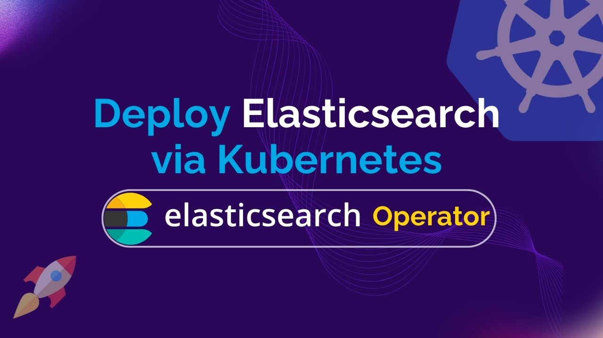

# Deploy Elasticsearch via Kubernetes Elasticsearch Operator



In today's environment of containerized applications and orchestration, effectively deploying and maintaining databases such as Elasticsearch demands an flexible and effective strategy. The **Kubernetes Elasticsearch Operator** simplifies the task of setting up, maintaining, and expanding Elasticsearch databases within a Kubernetes framework. This document explores the basics of Elasticsearch database installation through the Elasticsearch Kubernetes Operator, analyzing its advantages, characteristics, and stepwise instructions. Through this solution, you can attain increased adaptability and automation when it comes to provisioning and managing your Elasticsearch databases, while also following containerized infrastructure best practices.

Kubernetes is a revolutionary open-source platform that simplifies the whole process of containerized applications. With Kubernetes, you can acquire the ability to effortlessly launch, expand, and oversee applications, whether they operate on a single machine or span across a multi-cloud environment.

Kubernetes simplifies the management of numerous containers by automating essential tasks like load balancing, real-time scaling, and ensuring application resilience through automatic recovery. When it's time to release a new version of your application, Kubernetes handles updates, minimizing downtime and reducing the potential for errors.

With a simple declarative configuration, you can specify your desired application behavior, and Kubernetes ensures it follows those specifications. This allows you to concentrate on developing exceptional applications, while Kubernetes guarantees their reliable and efficient operation. Now, you can simplify the provisioning and troubleshooting process and empowering you to confidently tackle the complexity of application deployment.

## Why Elasticsearch in Kubernetes
Elasticsearch is an open-source, highly scalable search engine designed to handle massive amounts of data. It has many features, including full-text search, structured search, analytics, logging, and can be applied to a wide range of applications and use cases. Elasticsearch is an excellent choice for enterprises that need to manage and search through massive amounts of information in real-time since it provides fast and accurate search results.


Elasticsearch employs a distributed architecture that enables horizontal scaling across multiple nodes, ensuring it can effectively manage extensive data loads while ensuring continuous accessibility. In addition to its distributed design, Elasticsearch supports a flexible data format, enabling you to store and index various data types, including text, numerical data, and geospatial information, both structured and unstructured.

Integrating Elasticsearch within a Kubernetes environment offers a powerful combination that brings a host of advantages. It allows for the seamless management of Elasticsearch clusters at scale, ensuring optimal resource utilization and high availability, all within the robust orchestration framework of Kubernetes. Kubernetes simplifies the deployment and scaling of Elasticsearch instances, making it easier to adapt to evolving data demands. Additionally, it provides a unified platform for handling both application and data infrastructure, streamlining operations and reducing complexity. This integration enhances the overall efficiency and resilience of Elasticsearch deployments, facilitating real-time data processing and search capabilities within Kubernetes clusters, making it a formidable solution for modern data-driven applications.

## Deploy Elasticsearch on Kubernetes
### Pre-requisites
We have to set up the environment to deploy Elasticsearch on Kubernetes using a Kubernetes Elasticsearch operator. A running Kubernetes cluster and a fundamental understanding of Elasticsearch are required to conduct this tutorial. Here, we are going to create our kubernetes cluster using [Kind](https://kubernetes.io/docs/tasks/tools/#kind). Additionally, you need to install [Helm](https://helm.sh/docs/intro/install/) to your Kubernetes cluster.

In this article, We will use the Kubernetes Elasticsearch operator [KubeDB](https://kubedb.com/) to deploy Elasticsearch on Kubernetes. We must have KubeDB installed in our Kubernetes cluster. To set up KubeDB in our Kubernetes cluster, we require a license. Through the [Appscode License Server](https://license-issuer.appscode.com/), we can get a free enterprise license. We must provide our Kubernetes cluster ID to obtain a license. Run the following command below to get the cluster ID.

 
```bash
$ kubectl get ns kube-system -o jsonpath='{.metadata.uid}'
6c08dcb8-8440-4388-849f-1f2b590b731e
```

The license server will email us with a "license.txt" file attached after we provide the necessary data. Run the following commands listed below to install KubeDB. 

```bash
$ helm install kubedb oci://ghcr.io/appscode-charts/kubedb \
  --version v2023.12.11 \
  --namespace kubedb --create-namespace \
  --set-file global.license=/path/to/the/license.txt \
  --wait --burst-limit=10000 --debug
```


Verify the installation by the following command,

```bash
$ kubectl get pods --all-namespaces -l "app.kubernetes.io/instance=kubedb"
NAMESPACE   NAME                                            READY   STATUS    RESTARTS   AGE
kubedb      kubedb-kubedb-autoscaler-b99bbb595-kr96z        1/1     Running   0          2m33s
kubedb      kubedb-kubedb-dashboard-69b476d689-tglfl        1/1     Running   0          2m33s
kubedb      kubedb-kubedb-ops-manager-7c6c7b6c97-9h25q      1/1     Running   0          2m33s
kubedb      kubedb-kubedb-provisioner-66f9cb9b99-pfrzb      1/1     Running   0          2m33s
kubedb      kubedb-kubedb-schema-manager-7654cd4457-d7s7j   1/1     Running   0          2m33s
kubedb      kubedb-kubedb-webhook-server-f89bc674b-g7lcb    1/1     Running   0          2m33s
``` 
We can go on to the next stage if every pod status is running.

## Create a Namespace
Now we'll create a new namespace in which we will deploy Elasticsearch. To create a namespace, we can use the following command:

```bash
$ kubectl create namespace es-demo
namespace/es-demo created
``` 

## Deploy Elasticsearch via Kubernetes Elasticsearch operator
We need to create a yaml configuration to deploy Elasticsearch on Kubernetes. And we will apply this yaml below,

```yaml
apiVersion: kubedb.com/v1alpha2
kind: Elasticsearch
metadata:
  name: es-topology-cluster
  namespace: es-demo
spec:
  enableSSL: true 
  version: xpack-8.11.1
  storageType: Durable
  topology:
    master:
      replicas: 2
      storage:
        storageClassName: "standard"
        accessModes:
        - ReadWriteOnce
        resources:
          requests:
            storage: 512Mi
    data:
      replicas: 2
      storage:
        storageClassName: "standard"
        accessModes:
        - ReadWriteOnce
        resources:
          requests:
            storage: 512Mi
    ingest:
      replicas: 2
      storage:
        storageClassName: "standard"
        accessModes:
        - ReadWriteOnce
        resources:
          requests:
            storage: 512Mi
```

You can see the detailed yaml specifications in the [Kubernetes Elasticsearch](https://kubedb.com/docs/latest/guides/elasticsearch/) documentation.

We will save this yaml configuration to `es-topology-cluster.yaml`. Then create the above Elasticsearch object.

```bash
$ kubectl apply -f es-topology-cluster.yaml
elasticsearch.kubedb.com/es-topology-cluster created
```

If all the above steps are handled correctly and the Elasticsearch is deployed, you will see that the following objects are created:


```bash
$ kubectl get all -n es-demo
NAME                               READY   STATUS    RESTARTS   AGE
pod/es-topology-cluster-data-0     1/1     Running   0          4m
pod/es-topology-cluster-data-1     1/1     Running   0          4m
pod/es-topology-cluster-ingest-0   1/1     Running   0          4m
pod/es-topology-cluster-ingest-1   1/1     Running   0          4m
pod/es-topology-cluster-master-0   1/1     Running   0          4m
pod/es-topology-cluster-master-1   1/1     Running   0          4m

NAME                                 TYPE        CLUSTER-IP   EXTERNAL-IP   PORT(S)    AGE
service/es-topology-cluster          ClusterIP   10.8.11.95   <none>        9200/TCP   4m
service/es-topology-cluster-master   ClusterIP   None         <none>        9300/TCP   4m
service/es-topology-cluster-pods     ClusterIP   None         <none>        9200/TCP   4m

NAME                                          READY   AGE
statefulset.apps/es-topology-cluster-data     2/2     4m
statefulset.apps/es-topology-cluster-ingest   2/2     4m
statefulset.apps/es-topology-cluster-master   2/2     4m

NAME                                                     TYPE                       VERSION   AGE
appbinding.appcatalog.appscode.com/es-topology-cluster   kubedb.com/elasticsearch   8.5.2     4m

NAME                                           VERSION       STATUS   AGE
elasticsearch.kubedb.com/es-topology-cluster   xpack-8.11.1   Ready    4m
```

We have successfully deployed Elasticsearch to Kubernetes via the Kubernetes Elasticsearch operator. Now, we will connect to the Elasticsearch database to insert some sample data and verify whether our Elasticsearch is usable or not. First, check the database status,

```bash
$ kubectl get elasticsearch -n es-demo es-topology-cluster
NAME                  VERSION       STATUS   AGE
es-topology-cluster   xpack-8.11.1   Ready    4m
```
## Insert sample data to the Elasticsearch database
Now, we will create few indexes in Elasticsearch. The Kubernetes Elasticsearch operator establishes a governing service with the name of the Elasticsearch object itself when Elasticsearch yaml is deployed. Using this service, we will port-forward to the database from our local workstation and establish a connection. After that, we'll add some data to Elasticsearch.

## Port-forward the Service
KubeDB will create few Services to connect with the database. Let’s see the Services created by KubeDB for our Elasticsearch,

```bash
$ kubectl get service -n es-demo -l=app.kubernetes.io/instance=es-topology-cluster
NAME                         TYPE        CLUSTER-IP   EXTERNAL-IP   PORT(S)    AGE
es-topology-cluster          ClusterIP   10.8.11.95   <none>        9200/TCP   4m
es-topology-cluster-master   ClusterIP   None         <none>        9300/TCP   4m
es-topology-cluster-pods     ClusterIP   None         <none>        9200/TCP   4m
```
Here, we are going to use the `es-topology-cluster` Service to connect with the database. Now, let’s port-forward the `es-topology-cluster` Service.

```bash
$ kubectl port-forward -n es-demo svc/es-topology-cluster 9200
Forwarding from 127.0.0.1:9200 -> 9200
Forwarding from [::1]:9200 -> 9200
``` 
## Export the Credentials
Kubernetes Elasticsearch operator will create some Secrets for the database. Let’s list the Secrets for our `es-topology-cluster`.

```bash
$ kubectl get secret -n es-demo -l=app.kubernetes.io/instance=es-topology-cluster
NAME                                              TYPE                       DATA   AGE
es-topology-cluster-apm-system-cred               kubernetes.io/basic-auth   2      5m
es-topology-cluster-beats-system-cred             kubernetes.io/basic-auth   2      5m
es-topology-cluster-ca-cert                       kubernetes.io/tls          2      5m
es-topology-cluster-client-cert                   kubernetes.io/tls          3      5m
es-topology-cluster-config                        Opaque                     1      5m
es-topology-cluster-elastic-cred                  kubernetes.io/basic-auth   2      5m
es-topology-cluster-http-cert                     kubernetes.io/tls          3      5m
es-topology-cluster-kibana-system-cred            kubernetes.io/basic-auth   2      5m
es-topology-cluster-logstash-system-cred          kubernetes.io/basic-auth   2      5m
es-topology-cluster-remote-monitoring-user-cred   kubernetes.io/basic-auth   2      5m
es-topology-cluster-transport-cert                kubernetes.io/tls          3      5m
```
Now, we can connect to the database with any of these secret that have the prefix `cred`. Here, we will use `es-topology-cluster-elastic-cred` which contains the admin level credentials to connect with the database.

```bash
$ kubectl get secret -n es-demo es-topology-cluster-elastic-cred -o jsonpath='{.data.username}' | base64 -d
elastic
$ kubectl get secret -n es-demo es-topology-cluster-elastic-cred -o jsonpath='{.data.password}' | base64 -d
q)UC;l!!euEnk.ZZ
```
We will now use curl to post some sample data into Elasticsearch. Use the -k flag to disable attempts to verify self-signed certificates for testing purposes.

```bash
$ curl -XPOST -k --user 'elastic:q)UC;l!!euEnk.ZZ' "https://localhost:9200/music/_doc?pretty" -H 'Content-Type: application/json' -d'
                  {
                      "Artist": "Bon Jovi",
                      "Song": "Its My Life"
                  }
                  '
{
  "_index" : "music",
  "_id" : "oyO52YYBpvYWEhqZyPph",
  "_version" : 1,
  "result" : "created",
  "_shards" : {
    "total" : 2,
    "successful" : 2,
    "failed" : 0
  },
  "_seq_no" : 0,
  "_primary_term" : 1
}
```
Now, let’s verify that the index has been created successfully.

```bash
$ curl -XGET -k --user 'elastic:q)UC;l!!euEnk.ZZ' "https://localhost:9200/_cat/indices?v&s=index&pretty"
health status index         uuid                   pri rep docs.count docs.deleted store.size pri.store.size
green  open   kubedb-system zeIvl0RAQ6uhhcvW5GoWfg   1   1          1            5      834kb        404.9kb
green  open   music         _dAwOpXMSK2eHmc2Un7MNA   1   1          1            0     10.6kb          5.3kb
```
Also, let’s verify the data in the indexes:

```bash
$ curl -XGET -k --user 'elastic:q)UC;l!!euEnk.ZZ' "https://localhost:9200/music/_search?pretty"
{
  "took" : 11,
  "timed_out" : false,
  "_shards" : {
    "total" : 1,
    "successful" : 1,
    "skipped" : 0,
    "failed" : 0
  },
  "hits" : {
    "total" : {
      "value" : 1,
      "relation" : "eq"
    },
    "max_score" : 1.0,
    "hits" : [
      {
        "_index" : "music",
        "_id" : "oyO52YYBpvYWEhqZyPph",
        "_score" : 1.0,
        "_source" : {
          "Artist" : "Bon Jovi",
          "Song" : "Its My Life"
        }
      }
    ]
  }
}
```

We’ve successfully Deploy Elasticsearch to Kubernetes via **Kubernetes Elasticsearch operator** KubeDB and insert some sample data into it.

## Elasticsearch on Kubernetes: Best Practices
To ensure the stability of your application while using Elasticsearch on Kubernetes using Kubernetes Elasticsearch operator, there are some best practices that you should follow:

* **Use Dashboard like Kibana:** Deploy Kibana alongside Elasticsearch for real-time performance insights and data visualization. Secure Kibana with access controls and encryption, and leverage its dashboards and visualization tools to monitor Elasticsearch cluster health and gain valuable application performance insights.

* **High Availability:** Ensure high availability by utilizing Elasticsearch's data replication features, distributing data across multiple nodes for redundancy. Kubernetes pod anti-affinity rules help prevent single points of failure, and using a load balancer evenly distributes traffic among nodes.

* **Backup and Recovery:**  Prioritize backup and recovery with regular data backups using Elasticsearch snapshots or available backup and recovery solutions. Store backups in separate locations or cloud storage for disaster recovery, and routinely test data restoration processes for reliability.

* **Monitoring & Security:** Implement comprehensive monitoring using tools like Prometheus, Grafana, or Elasticsearch's monitoring features to track cluster health and performance metrics. Strengthen security with RBAC and robust authentication mechanisms, and implement Kubernetes network policies to Elasticsearch pods.

## Conclusion
Elasticsearch is a powerful, open-source search and analytics engine renowned for its ability to handle large and diverse datasets with speed and precision. You have now successfully installed an Elasticsearch database on Kubernetes using the Kubernetes Elasticsearch operator, which is suitable for a variety of use cases. You can visit the official [Elasticsearch documentation](https://www.elastic.co/guide/index.html) for further details. Managing database, whether on-premises or in the cloud, requires extensive knowledge and consistent practice. KubeDB provides a full support solution to ensure that your database management fulfills performance and uptime requirements. Whether your database infrastructure is hosted on-site, geographically distributed, or utilizing cloud services or database-as-a-service providers, KubeDB offers assistance in managing the entire process in a production-grade environment.

