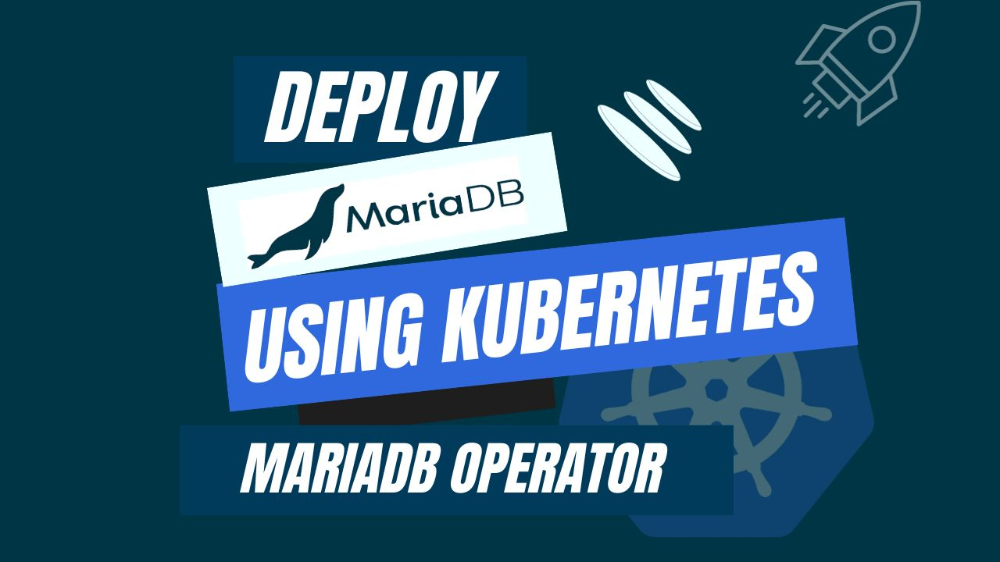

# Deploy MariaDB using Kubernetes MariaDB Operator



With the increasing importance of Kubernetes in the DevOps model, the operator extends the Kubernetes API by providing a custom resource definition (CRD) specifically designed for MariaDB. The **Kubernetes MariaDB** Operator makes it simpler to deploy, manage, and scale MariaDB databases in a Kubernetes ecosystem. This article explores advantages, features, and instructions for deploying MariaDB databases using the MariaDB Kubernetes Operator. By adopting this, you can achieve a dynamic and efficient approach to deploying and managing MariaDB databases on Kubernetes.

Kubernetes is a revolutionary open-source platform that simplifies the complexities of containerized applications. By using Kubernetes, you unlock the ability to effortlessly deploy, expand, and manage applications, irrespective of whether they operate on a solitary machine or extend across a multi-cloud ecosystem.

Kubernetes simplifies and automates tasks such as load balancing, scaling based on real-time demands, and ensuring application resilience through automatic healing. With a straightforward declarative configuration, users can define the desired behavior of their applications, leaving Kubernetes to handle the execution. This allows developers to concentrate on creating exceptional applications while Kubernetes ensures they run smoothly and efficiently. Kubernetes boosts users to effortlessly navigate the difficulties of modern application deployment.

## Why MariaDB in Kubernetes
MariaDB, a fork of MySQL, continues the legacy of a resilient and feature-rich relational database management system (RDBMS). Renowned for its open-source nature and community-driven development, MariaDB builds upon the strengths of MySQL while introducing enhancements and new features. Like MySQL, MariaDB excels in providing a structured approach to data management, enabling efficient retrieval based on complex relationships within the database.

As an open-source database and a derivative of MySQL, seamlessly integrates scalability features, making it proficient in managing expanding data volumes and user numbers, particularly beneficial for dynamic web-based applications. Beyond scalability, MariaDB maintains compliance with the ACID principles, ensuring Atomicity, Consistency, Isolation, and Durability in transactions, catering to applications prioritizing data integrity. With a top-tier emphasis on security, MariaDB incorporates robust measures like authentication, encryption, and role-based access control, positioning itself as an ideal choice for organizations seeking databases that scale effectively with growth while prioritizing security and transactional integrity in modern, data-intensive scenarios.

Integrating MariaDB with Kubernetes offers a range of benefits that revolutionize conventional database management. This integration of Kubernetes MariaDB allows seamless scalability, ensuring that the database can effortlessly handle increasing data demands. It also enhances performance, providing optimal speed and efficiency. In terms of reliability, the integration simplifies backup and disaster recovery processes, ensuring data safety. Moreover, it optimizes resource utilization, making efficient use of computing power. Additionally, this integration streamlines development and testing, aligning with DevOps principles. Overall, it offers flexibility and advantages in various IT environments.

## Deploy MariaDB on Kubernetes
### Pre-requisites
We have to set up the environment to deploy MariaDB on Kubernetes using a Kubernetes MariaDB operator. A running Kubernetes cluster and a fundamental understanding of MariaDB queries are required to conduct this tutorial. Here we are using [Kind](https://kubernetes.io/docs/tasks/tools/#kind) to create our Kubernetes cluster. Additionally, you should install [Helm](https://helm.sh/docs/intro/install/) to your Kubernetes cluster.

In this tutorial, We will use the Kubernetes MariaDB operator [KubeDB](https://kubedb.com/) to deploy MariaDB on Kubernetes. In our Kubernetes cluster, we must install KubeDB. To set up KubeDB in our Kubernetes cluster, we need a license. Through the [Appscode License Server](https://license-issuer.appscode.com/), we can get a free enterprise license. We must provide our Kubernetes cluster ID to obtain a license. Run the following command below to get the cluster ID.

 
```bash
$ kubectl get ns kube-system -o jsonpath='{.metadata.uid}'
6c08dcb8-8440-4388-849f-1f2b590b731e
```

The license server will email us with a "license.txt" file attached after we provide the necessary data. Run the following commands listed below to install KubeDB. 

```bash
$ helm install kubedb oci://ghcr.io/appscode-charts/kubedb \
  --version v2023.12.11 \
  --namespace kubedb --create-namespace \
  --set-file global.license=/path/to/the/license.txt \
  --wait --burst-limit=10000 --debug
```


Verify the installation by the following command,

```bash
$ kubectl get pods --all-namespaces -l "app.kubernetes.io/instance=kubedb"
NAMESPACE   NAME                                            READY   STATUS    RESTARTS   AGE
kubedb      kubedb-kubedb-autoscaler-54df5f5c49-52hhk       1/1     Running   0          110s
kubedb      kubedb-kubedb-dashboard-5979bf69cf-8plb6        1/1     Running   0          110s
kubedb      kubedb-kubedb-ops-manager-c6df99c84-xrpnt       1/1     Running   0          110s
kubedb      kubedb-kubedb-provisioner-59697f5c7b-j78l7      1/1     Running   0          110s
kubedb      kubedb-kubedb-schema-manager-79675cc7b8-bj95l   1/1     Running   0          110s
kubedb      kubedb-kubedb-webhook-server-74b77cb94-qdbph    1/1     Running   0          110s
``` 
We can go on to the next stage if every pod status is running.

## Create a Namespace
Now we'll create a new namespace in which we will deploy MariaDB. To create a namespace, we can use the following command:

```bash
$ kubectl create namespace maria-demo
namespace/maria-demo created
``` 
## Deploy MariaDB via Kubernetes MariaDB operator

We need to create a yaml manifest to install MariaDB on Kubernetes. And we will apply this yaml below,

```yaml
apiVersion: kubedb.com/v1alpha2
kind: MariaDB
metadata:
  name: mariadb-cluster
  namespace: maria-demo
spec:
  version: "10.11.2"
  replicas: 3
  storageType: Durable
  storage:
    storageClassName: "standard"
    accessModes:
    - ReadWriteOnce
    resources:
      requests:
        storage: 1Gi
  terminationPolicy: WipeOut
```

You can see the detailed yaml specifications in the [Kubernetes MariaDB](https://kubedb.com/docs/latest/guides/mariadb/concepts/mariadb/) documentation.

We will save this yaml configuration to `mariadb-cluster.yaml`. Then create the above MariaDB object.

```bash
$ kubectl apply -f mariadb-cluster.yaml
mariadb.kubedb.com/mariadb-cluster created
```

If all the above steps are handled correctly and the MariaDB is deployed, you will see that the following objects are created:


```bash
$ kubectl get all -n maria-demo
NAME                    READY   STATUS    RESTARTS   AGE
pod/mariadb-cluster-0   2/2     Running   0          2m25s
pod/mariadb-cluster-1   2/2     Running   0          2m25s
pod/mariadb-cluster-2   2/2     Running   0          2m25s

NAME                           TYPE        CLUSTER-IP     EXTERNAL-IP   PORT(S)    AGE
service/mariadb-cluster        ClusterIP   10.96.217.40   <none>        3306/TCP   2m30s
service/mariadb-cluster-pods   ClusterIP   None           <none>        3306/TCP   2m30s

NAME                               READY   AGE
statefulset.apps/mariadb-cluster   3/3     2m26s

NAME                                                 TYPE                 VERSION   AGE
appbinding.appcatalog.appscode.com/mariadb-cluster   kubedb.com/mariadb   10.11.2   2m26s

NAME                                 VERSION   STATUS   AGE
mariadb.kubedb.com/mariadb-cluster   10.11.2   Ready    2m30s
```

We have successfully deployed MariaDB to Kubernetes via the Kubernetes MariaDB operator. Now, we will connect to the MariaDB database to insert some sample data and verify whether our MariaDB is usable or not. First, check the database status,

```bash
$ kubectl get mariadb -n maria-demo mariadb-cluster
NAME              VERSION   STATUS   AGE
mariadb-cluster   10.11.2   Ready    3m
```

In order to connect to the database, we required to obtain the appropriate credentials here. We need to access the `Secret` and `Service` for the database `mariadb-cluster` created by KubeDB. Using the commands below, let's check them,

```bash
$ kubectl get secret -n maria-demo -l=app.kubernetes.io/instance=mariadb-cluster
NAME                   TYPE                       DATA   AGE
mariadb-cluster-auth   kubernetes.io/basic-auth   2      3m49s

$ kubectl get service -n maria-demo -l=app.kubernetes.io/instance=mariadb-cluster
NAME                   TYPE        CLUSTER-IP     EXTERNAL-IP   PORT(S)    AGE
mariadb-cluster        ClusterIP   10.96.217.40   <none>        3306/TCP   4m6s
mariadb-cluster-pods   ClusterIP   None           <none>        3306/TCP   4m6s
``` 

Now, we are going to use `mariadb-cluster-auth` to get the credentials.

```bash
$ kubectl get secrets -n maria-demo mariadb-cluster-auth -o jsonpath='{.data.username}' | base64 -d
root

$ kubectl get secrets -n maria-demo mariadb-cluster-auth -o jsonpath='{.data.password}' | base64 -d
e~J1pzOFCKPpwr!7
```

## Insert sample data to the MariaDB database
Now, we will connect to the MariaDB database using the required credentials and insert some sample data,

```bash
$ kubectl exec -it mariadb-cluster-0 -n maria-demo -c mariadb -- bash
root@mariadb-cluster-0:/# mariadb --user=root --password='e~J1pzOFCKPpwr!7'

Welcome to the MariaDB monitor.  Commands end with ; or \g.
Copyright (c) 2000, 2018, Oracle, MariaDB Corporation Ab and others.

Type 'help;' or '\h' for help. Type '\c' to clear the current input statement.

MariaDB [(none)]> CREATE DATABASE Music;
Query OK, 1 row affected (0.006 sec)

MariaDB [(none)]> CREATE TABLE Music.Artist (id INT(6) UNSIGNED AUTO_INCREMENT PRIMARY KEY, Name VARCHAR(50), Song VARCHAR(50));
Query OK, 0 rows affected (0.009 sec)

MariaDB [(none)]> INSERT INTO Music.Artist (Name, Song) VALUES ("Bon Jovi", "It's My Life");
Query OK, 1 row affected (0.001 sec)

MariaDB [(none)]> SELECT * FROM Music.Artist;
+----+----------+--------------+
| id | Name     | Song         |
+----+----------+--------------+
|  1 | Bon Jovi | It's My Life |
+----+----------+--------------+
1 row in set (0.001 sec)

MariaDB [(none)]> exit
Bye
```
We’ve successfully deploy MariaDB to Kubernetes via **Kubernetes MariaDB operator** KubeDB. Additionally, we establish a database connection and add some test data to it.

## MariaDB on Kubernetes: Best Practices
To ensure the stability of your application while using MariaDB on Kubernetes, there are some best practices that you should follow:

* **Using the Kubernetes MariaDB Operator:** Using MariaDB operator within a Kubernetes cluster offers a streamlined approach to installing and managing MariaDB. Serving as a controller, the MariaDB operator encapsulates operational knowledge, automating administrative tasks and simplifying the deployment and scaling of MariaDB instances. This not only improves operational efficiency but also reduces the workload on database administrators, making it an advantageous solution for Kubernetes-based environments.

* **Ensuring High Availability:** To guarantee uninterrupted service availability, configure MariaDB for high availability utilizing technologies like MariaDB Galera Cluster. This approach minimizes downtime in the face of node failures, providing a resilient solution for continuous and reliable database services within Kubernetes clusters.

* **Implementing Monitoring and Logging:** Track MariaDB's performance by implementing monitoring and logging solutions such as Prometheus and Grafana. These tools facilitate the collection and visualization of crucial performance metrics, enabling proactive identification and resolution of potential issues, thereby maintaining optimal database performance.

* **Disaster Recovery Strategy:**  Safeguard your MariaDB data by implementing a robust backup strategy, ensuring regular backups are performed and securely stored. This strategy not only facilitates data recoverability in the event of failures or disasters but also aligns with best practices for ensuring the integrity and continuity of MariaDB databases within Kubernetes environments.

## Conclusion

MariaDB is a leading relational database management system, is renowned for its versatility and widespread adoption in addressing diverse data management needs. Here, you have successfully deployed a MariaDB database on Kubernetes using the Kubernetes MariaDB operator, which is appropriate for a wide range of use cases. You can visit the official [MariaDB documentation](https://mariadb.com/docs/) for further details. Managing database operations with highest efficiency and availability requires an advanced level of expertise and consistent practice.  KubeDB offers a comprehensive range of support solutions, ensuring that your database management consistently meets the most rigorous standards for performance and uninterrupted operation. Whether your database infrastructure is hosted on-site, geographically distributed, or utilizing cloud services or database-as-a-service providers, KubeDB offers assistance in managing the entire process in a production-grade environment.

