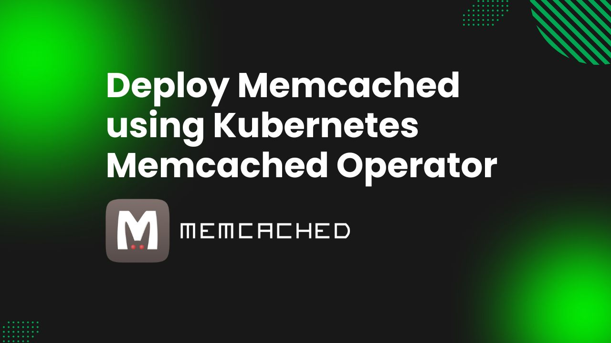

# Deploy Memcached using Kubernetes Memcached Operator



In today's world of containerized applications and orchestration, the successful deployment and maintenance of databases, such as Memcached, require a flexible and efficient approach. **Kubernetes Memcached Operator** —a tool that streamlines the intricate tasks of configuring, managing, and scaling Memcached databases within the Kubernetes environment.

Within this article, we will dive deep into the realm of Memcached database setup, leveraging the power of the Kubernetes Memcached Operator. We'll explore its array of benefits, distinctive features, and provide you with a comprehensive, go to guide. With this solution, you'll empower yourself with enhanced flexibility and automation for provisioning and administering your Memcached databases, all while embracing the containerized infrastructure's best practices.

## Why Memcached in Kubernetes
Kubernetes, an open-source platform for container orchestration, often abbreviated as K8s—simplifies the deployment, scaling, and management of containerized applications. It provides a standardized way to automate the deployment of containers, manage their lifecycle, and ensure their availability and reliability. Kubernetes has become the go-to choice for organizations looking to build scalable, resilient, and efficient cloud-native applications.

Memcached, on the other hand, is a blazing-fast, open-source, in-memory data store that serves as a versatile tool for a wide range of use cases. Though primarily a caching mechanism, Memcached serves as a robust solution for high-speed data access, message queuing, and efficient management of computational tasks. Memcached is celebrated for its sub-millisecond response times, making it an ideal choice for applications that require lightning-fast data access.

Integration of Kubernetes Memcached brings a wealth of benefits to the table. First and foremost, Memcached's lightning-fast, in-memory data access ensures rapid retrieval of critical data, effectively reducing latency and enhancing overall performance. Furthermore, Kubernetes excels in scaling containerized workloads, making it effortless to expand your Memcached databases as your application's data load grows. The resilience provided by Kubernetes guarantees that your Memcached instances remain operational, even in the face of hardware or software failures, ensuring robust and fault-tolerant data storage. 

Dynamic resource allocation in Kubernetes optimizes resource usage, enhancing cost-effectiveness. Management becomes a breeze as Kubernetes automates tasks like deployment, scaling, and failover, and seamlessly integrates with monitoring tools for real-time insights into your Memcached database health. In Kubernetes environment, Memcached becomes a pivotal component for caching, session management, and real-time data processing within your microservices architecture. In an era of cloud-native adoption, Kubernetes Memcached emerges as the strategic choice for those who demand both top-tier performance and scalable applications.

## Deploy Memcached on Kubernetes
### Pre-requisites
We have to configure the environment to deploy Memcached on Kubernetes using a Kubernetes Memcached operator. This tutorial requires you to have a functional Kubernetes cluster in place and a basic grasp of Memcached concepts. Here, we are going to create our kubernetes cluster using [Kind](https://kubernetes.io/docs/tasks/tools/#kind). Also, you’ll require to install [Helm](https://helm.sh/docs/intro/install/) to your Kubernetes cluster.

In this article, We will use the Kubernetes Memcached operator [KubeDB](https://kubedb.com/) to deploy Memcached on Kubernetes. But before we start, you need to make sure you have KubeDB already installed in your Kubernetes setup. To use KubeDB, you'll also need a license, which you can get for free from the [Appscode License Server](https://license-issuer.appscode.com/). To get this license, you'll need the Kubernetes cluster ID. You can find this ID by running the command we'll provide below.

 
```bash
$ kubectl get ns kube-system -o jsonpath='{.metadata.uid}'
e5b4a1a0-5a67-4657-b390-db7200108bae
```

The license server will email us with a "license.txt" file attached after we provide the necessary data. To install KubeDB, run the following commands,

```bash
$ helm install kubedb oci://ghcr.io/appscode-charts/kubedb \
  --version v2024.9.30 \
  --namespace kubedb --create-namespace \
  --set-file global.license=/home/appscodepc/license.txt \
  --wait --burst-limit=10000 --debug \
  --set global.featureGates.Memcached=true
```


Verify the installation by the following command,

```bash
$ kubectl get pods --all-namespaces -l "app.kubernetes.io/instance=kubedb"
NAMESPACE   NAME                                            READY   STATUS    RESTARTS   AGE
kubedb      kubedb-kubedb-autoscaler-7d98f45f84-fhttj       1/1     Running   0          37m
kubedb      kubedb-kubedb-ops-manager-64bdc96d99-85bhz      1/1     Running   0          37m
kubedb      kubedb-kubedb-provisioner-c765ffcd5-5pzxc       1/1     Running   0          37m
kubedb      kubedb-kubedb-webhook-server-7b97d994f8-m8lxw   1/1     Running   0          37m
kubedb      kubedb-petset-operator-6b5fddcd9-wl2cp          1/1     Running   0          37m
kubedb      kubedb-petset-webhook-server-59ff65f4fd-tg52g   2/2     Running   0          37m
kubedb      kubedb-sidekick-f8674fc4f-qkwtr                 1/1     Running   0          37m
``` 
We can go on to the next stage if every pod status is running.

### Create a Namespace
Now we'll create a new namespace in which we will deploy Memcached. To create a namespace, we can use the following command:

```bash
$ kubectl create namespace memcached-demo
namespace/memcached-demo created
``` 

### Deploy Memcached via Kubernetes Memcached operator
We need to create a yaml configuration to deploy Memcached database on Kubernetes. And we will apply this yaml below,

```yaml
apiVersion: kubedb.com/v1
kind: Memcached
metadata:
  name: memcd-quickstart
  namespace: memcached-demo
spec:
  replicas: 1
  version: "1.6.22"
  podTemplate:
    spec:
      containers:
        - name: memcached
          resources:
            limits:
              cpu: 500m
              memory: 128Mi
            requests:
              cpu: 250m
              memory: 64Mi
  deletionPolicy: WipeOut
```

You can see the detailed yaml specifications in the [Kubernetes Memcached](https://kubedb.com/docs/latest/guides/Memcached/) documentation.

We will save this yaml configuration to `memcached.yaml`. Then create the above Memcached object.

```bash
$ kubectl create -f memcached.yaml
memcached.kubedb.com/memcd-quickstart created
```

If all the above steps are handled correctly and the Memcached is deployed, you will see that the following objects are created:

```bash
$ kubectl get all -n memcached-demo
NAME                     READY   STATUS    RESTARTS   AGE
pod/memcd-quickstart-0   1/1     Running   0          4m51s

NAME                            TYPE        CLUSTER-IP     EXTERNAL-IP   PORT(S)     AGE
service/memcd-quickstart        ClusterIP   10.96.70.253   <none>        11211/TCP   4m51s
service/memcd-quickstart-pods   ClusterIP   None           <none>        11211/TCP   4m51s

NAME                                                  TYPE                   VERSION   AGE
appbinding.appcatalog.appscode.com/memcd-quickstart   kubedb.com/memcached   1.6.22    4m51s

NAME                                    VERSION   STATUS   AGE
memcached.kubedb.com/memcd-quickstart   1.6.22    Ready    4m51s

```

We have successfully deployed Memcached to Kubernetes via the Kubernetes Memcached operator. Now, we will connect to the Memcached database to insert some sample data and verify whether our Memcached database is usable or not. First, check the database status,

```bash
$ kubectl get memcached -n memcached-demo
NAME               VERSION   STATUS   AGE
memcd-quickstart   1.6.22    Ready    6m50s
```

Here, we should have to obtain necessary credentials in order to connect to the database. Let’s export the credentials as environment variable to our current shell. KubeDB will create Secret and Service for the database `Memcached-cluster` that we have deployed. Let’s check them,

```bash
$ kubectl get secret -n memcached-demo -l=app.kubernetes.io/instance=memcd-quickstart
NAME                      TYPE     DATA   AGE
memcd-quickstart-config   Opaque   1      8m1s

$ kubectl get service -n memcached-demo -l=app.kubernetes.io/instance=memcd-quickstart
NAME                    TYPE        CLUSTER-IP     EXTERNAL-IP   PORT(S)     AGE
memcd-quickstart        ClusterIP   10.96.70.253   <none>        11211/TCP   8m58s
memcd-quickstart-pods   ClusterIP   None           <none>        11211/TCP   8m58s
```

### Insert sample data to the Memcached database
In this section, we are going to login into our Memcached database pod and insert some sample data.
First, we have to connect to this database using telnet. Here, we will connect to Memcached server from local-machine through port-forwarding.
```bash
$ kubectl get pods -n memcached-demo
NAME                 READY   STATUS    RESTARTS   AGE
memcd-quickstart-0   1/1     Running   0          13m

# We will connect to `memcd-quickstart-0` pod from local-machine using port-frowarding.
$ kubectl port-forward -n memcached-demo memcd-quickstart-0 11211
Forwarding from 127.0.0.1:11211 -> 11211
Forwarding from [::1]:11211 -> 11211

# Connect to Memcached from localmachine through telnet.
~ $ telnet 127.0.0.1 11211
Trying 127.0.0.1...
Connected to 127.0.0.1.
Escape character is '^]'.

# Save data Command:
set my_key 0 2592000 1
2
# Output:
STORED

# Meaning:
# 0       => no flags
# 2592000 => TTL (Time-To-Live) in [s]
# 1       => size in bytes
# 2       => value

# View data command
get my_key
# Output
VALUE my_key 0 1
2
END

# Exit
quit
```
We’ve successfully Deploy Memcached to Kubernetes via **Kubernetes Memcached operator** KubeDB and insert some sample data into it.

## Memcached on Kubernetes: Best Practices
When deploying Memcached on Kubernetes, following best practices is essential to ensure the stability and reliability of your application. Here are some key best practices for optimizing your Memcached deployment within a Kubernetes environment:

* **Version Compatibility:** Ensure that the version of Memcached you choose is compatible with the version of Kubernetes you're running. Compatibility issues can lead to unexpected behavior, so thorough testing and planning are crucial. Rolling upgrades are often recommended to minimize disruptions during version upgrades.

* **Monitoring and Health Checks:** Set up comprehensive monitoring and health checks for your Memcached pods. Kubernetes offers powerful monitoring capabilities, and Memcached provides valuable performance metrics. By collecting and analyzing these metrics, you can proactively identify and address performance bottlenecks or issues, ensuring optimal Memcached performance.

* **Disaster Recovery Strategies:** Develop robust disaster recovery strategies for Memcached. Consider procedures for recovering from data corruption, pod failures, and potential cluster-wide outages. Having well-defined disaster recovery plans in place minimizes downtime and ensures data integrity, even in challenging situations.

## Conclusion
Memcached is a robust, open-source in-memory data store celebrated for its exceptional performance and versatility in handling real-time data needs. You have now successfully deployed a Memcached database on Kubernetes, leveraging the capabilities of Kubernetes Memcached to meet various use cases efficiently. For further insights and details, refer to the official [Memcached documentation](https://kubedb.com/kubernetes/databases/run-and-manage-memcached-on-kubernetes/). Effective database management, whether on-premises or in the cloud, demands expertise and consistent practices. KubeDB offers a comprehensive range of support solutions, ensuring that your database management consistently meets the most rigorous standards for performance and uninterrupted operation. Whether your database infrastructure is hosted locally, spans multiple geographic regions, or is built upon cloud-based services or database-as-a-service providers, KubeDB streamlines and enhances the entire process within a production-grade context.
