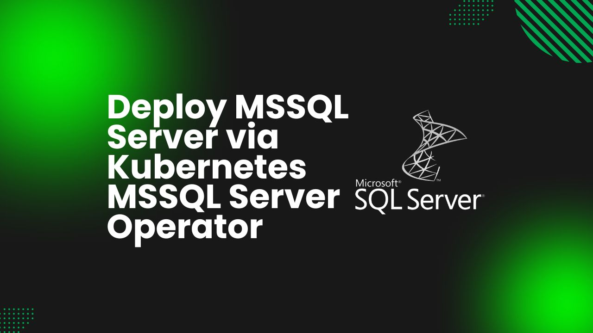

# Deploy MSSQL Server via Kubernetes MSSQL Server Operator



In today’s cloud-first era, the need for high-performance, scalable relational databases is more critical than ever. Kubernetes is the industry-standard container orchestration platform, renowned for its ability to manage containerized applications with efficiency and reliability. While it simplifies deployment and scaling for stateless applications, deploying stateful services such as databases requires additional tooling.

Microsoft SQL Server (MSSQL Server), a widely-adopted relational database management system, offers enterprise-grade solutions known for reliability, security, and advanced analytics capabilities. When deployed on Kubernetes, MSSQL Server can take advantage of the cloud-native principles of automation, scalability, and high availability, empowering businesses to meet the demands of modern, data-driven applications.

To streamline the deployment and operation of MSSQL Server on Kubernetes, the **Kubernetes MSSQL Server Operator** has emerged as a powerful tool. The Kubernetes MSSQL Server Operator simplifies the process of deploying, managing, and scaling MSSQL Server instances on Kubernetes clusters by automating key operational tasks. By extending Kubernetes native capabilities, this operator makes it easier to manage MSSQL Server as a declarative resource, reducing the complexity of database operations. In this article, we'll dive into the process of deploying MSSQL Server using the Kubernetes MSSQL Server Operator, highlighting the advantages and providing a step-by-step guide.

## Why MSSQL Server on Kubernetes
MSSQL Server is known for its enterprise-level performance, robust security, and seamless integration with the broader Microsoft ecosystem. It supports both OLTP (Online Transaction Processing) and OLAP (Online Analytical Processing) workloads, making it a versatile solution for businesses with varied database needs. Running MSSQL Server on Kubernetes provides enhanced flexibility, scalability, and operational efficiency, helping organizations better manage and optimize their database infrastructure.

Kubernetes offers several features that complement MSSQL Server’s capabilities. With built-in orchestration and automation, Kubernetes allows MSSQL Server to benefit from self-healing, auto-scaling, rolling updates, and high availability. These capabilities enable MSSQL Server to scale dynamically and handle growing data workloads with minimal manual intervention. Resource optimization of Kubernetes ensures that MSSQL Server instances are running efficiently, while its self-healing mechanisms reduce downtime by automatically recovering from failures, ensuring higher availability and resilience.

Additionally, deploying MSSQL Server on Kubernetes makes it easier to manage the lifecycle of your database instances. Kubernetes persistent storage solutions provide durability and data consistency, even in the event of infrastructure failures. This ensures that your MSSQL Server databases are highly available and protected against data loss, offering the stability and reliability needed for mission-critical applications.

By utilizing Kubernetes, MSSQL Server can be effortlessly integrated into cloud-native environments, allowing organizations to minimize operational complexity, streamline infrastructure management, and scale database resources to meet evolving business demands. This makes it an ideal platform for organizations seeking to optimize database performance and infrastructure efficiency in a modern, containerized ecosystem.

## Deploy MSSQL Server on Kubernetes
### Pre-requisites

We have to set up the environment to deploy MSSQL Server on Kubernetes using a [Kubernetes MSSQL Server operator](https://kubedb.com/kubernetes/databases/run-and-manage-mssqlserver-on-kubernetes/). A running Kubernetes cluster and fundamental understanding of MSSQL Server is required to conduct this tutorial. Here we are using [Kind](https://kubernetes.io/docs/tasks/tools/#kind) to create our Kubernetes cluster. Additionally, you should install [Helm](https://helm.sh/docs/intro/install/) to your Kubernetes cluster.

In this tutorial, We will use the Kubernetes MSSQL Server operator [KubeDB](https://kubedb.com/) to deploy MSSQL Server on Kubernetes. We must install KubeDB to our Kubernetes cluster. To set up KubeDB in our Kubernetes cluster, we need a license. We can get a free license using the [Appscode License Server](https://license-issuer.appscode.com/). We should use Kubernetes cluster ID to get a license. Use the following command below to get the cluster ID.

 
```bash
$ kubectl get ns kube-system -o jsonpath='{.metadata.uid}'
89c4f6f6-39fc-4b04-ad93-11deac96d5c3
```

The license server will email us with a "license.txt" file attached after we provide the necessary data. Run the following commands listed below to install KubeDB. 

```bash
$ helm install kubedb oci://ghcr.io/appscode-charts/kubedb \
  --version v2024.8.21 \
  --namespace kubedb --create-namespace \
  --set-file global.license=/path/to/the/license.txt \
  --set global.featureGates.MSSQLServer=true \
  --wait --burst-limit=10000 --debug
```

Verify the installation by the following command,

```bash
$ kubectl get pods --all-namespaces -l "app.kubernetes.io/instance=kubedb"
NAMESPACE   NAME                                            READY   STATUS    RESTARTS   AGE
kubedb      kubedb-kubedb-autoscaler-76f47cb964-ckz7c       1/1     Running   0          3m56s
kubedb      kubedb-kubedb-ops-manager-69b5bfdc4d-lm7jv      1/1     Running   0          3m56s
kubedb      kubedb-kubedb-provisioner-5dd9c86655-j7ph7      1/1     Running   0          3m56s
kubedb      kubedb-kubedb-webhook-server-867b8cf8c4-nmgpc   1/1     Running   0          3m56s
kubedb      kubedb-petset-operator-77b6b9897f-cjgtc         1/1     Running   0          3m56s
kubedb      kubedb-petset-webhook-server-556b48c68b-sc6fw   2/2     Running   0          3m56s
kubedb      kubedb-sidekick-c898cff4c-4q58x                 1/1     Running   0          3m56s
``` 
We can go on to the next stage if every pod status is running.

### Create a Namespace

To keep resources isolated, we'll use a separate namespace called `demo` throughout this tutorial.
Run the following command to create the namespace:

```bash
$ kubectl create namespace demo
namespace/demo created
```

### Install Cert Manager

To manage TLS certificates within Kubernetes, we need to install [Cert Manager](https://cert-manager.io/). Follow these steps to install Cert Manager using the YAML manifest:

```bash
$ kubectl apply -f https://github.com/cert-manager/cert-manager/releases/download/v1.15.0/cert-manager.yaml
namespace/cert-manager created
...
```

### Create Issuer

Next, we need to create an Issuer, which will be used to generate certificates for TLS settings and internal endpoint authentication of availability group replicas.

Start by generating CA certificates using OpenSSL:
```bash
$ openssl req -x509 -nodes -days 365 -newkey rsa:2048 -keyout ./ca.key -out ./ca.crt -subj "/CN=MSSQLServer/O=KubeDB"
Generating a RSA private key
..........................................................................+++++
..+++++
writing new private key to './ca.key'
-----
```

Create a Kubernetes Secret to store the CA certificate:
```bash
$ kubectl create secret tls mssqlserver-ca --cert=ca.crt  --key=ca.key --namespace=demo
secret/mssqlserver-ca created
```

Create an Issuer using the CA certificate stored in the `mssqlserver-ca` Secret. Below is the YAML definition for the Issuer:
```yaml
apiVersion: cert-manager.io/v1
kind: Issuer
metadata:
  name: mssqlserver-issuer
  namespace: demo
spec:
  ca:
    secretName: mssqlserver-ca
```


Below is the YAML definition for the Issuer:
```bash
$ kubectl apply -f issuer.yaml
issuer.cert-manager.io/mssqlserver-issuer created
```

## Deploy MSSQL Server using Kubernetes MSSQL Server operator

Now, we can deploy an MSSQL Server Availability Group Cluster using the following YAML definition:

```yaml
apiVersion: kubedb.com/v1alpha2
kind: MSSQLServer
metadata:
  name: mssqlserver-ag-cluster
  namespace: demo
spec:
  version: "2022-cu12"
  replicas: 3
  topology:
    mode: AvailabilityGroup
    availabilityGroup:
      databases:
        - music
  internalAuth:
    endpointCert:
      issuerRef:
        apiGroup: cert-manager.io
        name: mssqlserver-issuer
        kind: Issuer
  tls:
    issuerRef:
      name: mssqlserver-issuer
      kind: Issuer
      apiGroup: "cert-manager.io"
    clientTLS: false
  storageType: Durable
  storage:
    storageClassName: "standard"
    accessModes:
      - ReadWriteOnce
    resources:
      requests:
        storage: 1Gi
  deletionPolicy: WipeOut
```

Let's save this yaml configuration into `mssqlserver-ag-cluster.yaml` 
Then apply the above MSSQL Server yaml,

```bash
$ kubectl apply -f mssqlserver-ag-cluster.yaml 
mssqlserver.kubedb.com/mssqlserver-ag-cluster created
```

You can see the detailed yaml specifications in the [Kubernetes MSSQL Server documentation](https://kubedb.com/docs/latest/guides/mssqlserver/).

Once these are handled correctly and the MSSQLServer object is deployed, you will see that the following resources are created:

```bash
$ kubectl get all -n demo
NAME                           READY   STATUS    RESTARTS   AGE
pod/mssqlserver-ag-cluster-0   2/2     Running   0          5m29s
pod/mssqlserver-ag-cluster-1   2/2     Running   0          4m24s
pod/mssqlserver-ag-cluster-2   2/2     Running   0          3m1s

NAME                                       TYPE        CLUSTER-IP       EXTERNAL-IP   PORT(S)    AGE
service/mssqlserver-ag-cluster             ClusterIP   10.128.113.192   <none>        1433/TCP   6m35s
service/mssqlserver-ag-cluster-pods        ClusterIP   None             <none>        1433/TCP   6m35s
service/mssqlserver-ag-cluster-secondary   ClusterIP   10.128.213.243   <none>        1433/TCP   6m35s

NAME                                                        TYPE                     VERSION   AGE
appbinding.appcatalog.appscode.com/mssqlserver-ag-cluster   kubedb.com/mssqlserver   2022      5m31s

NAME                                            VERSION     STATUS   AGE
mssqlserver.kubedb.com/mssqlserver-ag-cluster   2022-cu12   Ready    6m35s
```
Let’s check if the database is ready to use,

```bash
$ kubectl get mssqlserver -n demo mssqlserver-ag-cluster
NAME                     VERSION     STATUS   AGE
mssqlserver-ag-cluster   2022-cu12   Ready    7m11s
```


### Accessing Database Through CLI

To access your database through the CLI, you first need the credentials for the database. KubeDB will create several Kubernetes Secrets and Services for your MSSQL Server instance. To view them, use the following commands:

```bash
$ kubectl get secret -n demo -l=app.kubernetes.io/instance=mssqlserver-ag-cluster 
NAME                                   TYPE                       DATA   AGE
mssqlserver-ag-cluster-auth            kubernetes.io/basic-auth   2      8m31s
mssqlserver-ag-cluster-client-cert     kubernetes.io/tls          3      8m31s
mssqlserver-ag-cluster-dbm-login       kubernetes.io/basic-auth   1      8m31s
mssqlserver-ag-cluster-endpoint-cert   kubernetes.io/tls          3      8m31s
mssqlserver-ag-cluster-master-key      kubernetes.io/basic-auth   1      8m31s
mssqlserver-ag-cluster-server-cert     kubernetes.io/tls          3      8m31s

$ kubectl get service -n demo -l=app.kubernetes.io/instance=mssqlserver-ag-cluster 
NAME                               TYPE        CLUSTER-IP       EXTERNAL-IP   PORT(S)    AGE
mssqlserver-ag-cluster             ClusterIP   10.128.113.192   <none>        1433/TCP   8m37s
mssqlserver-ag-cluster-pods        ClusterIP   None             <none>        1433/TCP   8m37s
mssqlserver-ag-cluster-secondary   ClusterIP   10.128.213.243   <none>        1433/TCP   8m37s
```

From the above list, the `mssqlserver-ag-cluster-auth` Secret contains the admin-level credentials needed to connect to the database. Use the following commands to obtain the username and password:

```bash
$ kubectl get secret -n demo mssqlserver-ag-cluster-auth  -o jsonpath='{.data.username}' | base64 -d
sa
$ kubectl get secret -n demo mssqlserver-ag-cluster-auth  -o jsonpath='{.data.password}' | base64 -d
dS57E93oLDi6wezv
```


### Insert Sample Data

In this section, we will insert sample data into our MSSQL Server deployed on Kubernetes. Before we can insert data, we need to identify the primary node, as data writes are only permitted on the primary node.

To determine which pod is the primary node, run the following command to list the pods along with their roles:

```bash
$ kubectl get pods -n demo --selector=app.kubernetes.io/instance=mssqlserver-ag-cluster -o jsonpath='{range .items[*]}{.metadata.name}{"\t"}{.metadata.labels.kubedb\.com/role}{"\n"}{end}'

mssqlserver-ag-cluster-0	primary
mssqlserver-ag-cluster-1	secondary
mssqlserver-ag-cluster-2	secondary
```

From the output above, we can see that `mssqlserver-ag-cluster-0` is the primary node. To insert data, log into the primary MSSQL Server pod. Use the following command,

```bash
$ kubectl exec -it mssqlserver-ag-cluster-0 -n demo bash
Defaulted container "mssql" out of: mssql, mssql-coordinator, mssql-init (init)
mssql@mssqlserver-ag-cluster-0:/$ /opt/mssql-tools/bin/sqlcmd -S localhost -U sa -P "dS57E93oLDi6wezv"

1> SELECT name FROM sys.databases
2> GO
name                                                                                                                            
--------------------------------------------------------------------------------------------------------------------------------
master                                                                                                                          
tempdb                                                                                                                          
model                                                                                                                           
msdb                                                                                                                            
music                                                                                                                           
kubedb_system                                                                                                                   

(6 rows affected)

# Verify that the database 'music' has been created and added to the `availability group cluster`. Then, we will insert data into this `music` database.
1> SELECT database_name
2> FROM sys.availability_databases_cluster
3> GO
database_name                                                                                                                   
--------------------------------------------------------------------------------------------------------------------------------
music                                                                                                                           

(1 rows affected)

1> USE music
2> GO
Changed database context to 'music'.

1> CREATE TABLE Playlist (Artist NVARCHAR(255), Song NVARCHAR(255));
2> GO
1> INSERT INTO Playlist(Artist, Song) VALUES ('Bobby Bare', 'Five Hundred Miles');
2> GO

(1 rows affected)
1> SELECT * FROM Playlist
2> GO

Artist                                                                          Song
---------------------------------------------------------------------------------------------------------------------------------
---------------------------------------------------------------------------------------------------------------------------------
---------------------------------------------------------------------------------------------------------------------------------
Bobby Bare                                                                      Five Hundred Miles

(1 rows affected)
1> exit

...

# Confirm that the data inserted into the primary node has been replicated to the secondary nodes.
# Access the secondary node (Node 2) to verify that the data is present.
$ kubectl exec -it mssqlserver-ag-cluster-1 -n demo bash
Defaulted container "mssql" out of: mssql, mssql-coordinator, mssql-init (init)
mssql@mssqlserver-ag-cluster-1:/$ /opt/mssql-tools/bin/sqlcmd -S localhost -U sa -P "dS57E93oLDi6wezv"

1> USE music
2> GO
Changed database context to 'music'.

1> SELECT * FROM Playlist
2> GO

Artist                                                                          Song
---------------------------------------------------------------------------------------------------------------------------------
---------------------------------------------------------------------------------------------------------------------------------
---------------------------------------------------------------------------------------------------------------------------------
Bobby Bare                                                                      Five Hundred Miles

(1 rows affected)
1> exit

...

# Access the secondary node (Node 3) to verify that the data is present.
$ kubectl exec -it mssqlserver-ag-cluster-2 -n demo bash
Defaulted container "mssql" out of: mssql, mssql-coordinator, mssql-init (init)
mssql@mssqlserver-ag-cluster-2:/$ /opt/mssql-tools/bin/sqlcmd -S localhost -U sa -P "dS57E93oLDi6wezv"

1> USE music
2> GO
Changed database context to 'music'.

1> SELECT * FROM Playlist
2> GO

Artist                                                                          Song
---------------------------------------------------------------------------------------------------------------------------------
---------------------------------------------------------------------------------------------------------------------------------
---------------------------------------------------------------------------------------------------------------------------------
Bobby Bare                                                                      Five Hundred Miles

(1 rows affected)
1> exit
```

> Congratulations! We’ve successfully deployed MSSQL Server on Kubernetes using **Kubernetes MSSQL Server operator** KubeDB. Additionally, we've added sample data to the MSSQL Server and access it from every node of Availability Group Cluster.

## MSSQL Server on Kubernetes: Best Practices
To ensure optimal performance and reliability of your MSSQL Server instances running within Kubernetes, consider the following best practices:

* **Optimize Resource Utilization:** For efficient database performance and cost management, it’s essential to allocate resources appropriately for MSSQL Server. Carefully assess CPU, memory, and storage needs based on the specific workload requirements. Implement Horizontal Pod Autoscaler (HPA) to dynamically adjust resources according to workload fluctuations, ensuring your MSSQL Server instances can handle changes in demand without manual intervention.

* **Monitoring and Observability:** To maintain optimal performance, set up comprehensive monitoring and observability for your MSSQL Server instances. Monitor key metrics such as query performance, CPU utilization, disk I/O, and memory consumption. Use tools like Prometheus and Grafana to visualize performance data and identify any potential bottlenecks or issues early. Proactively implement alerting mechanisms to get notified of anomalies before they impact system performance or availability.

* **Disaster Recovery:** Establish a robust disaster recovery strategy for your SQL Server instances. Leverage Kubernetes features like StatefulSets for managing persistent storage and enable Always On Availability Groups for high availability. Regularly back up your databases and test your recovery procedures to ensure minimal downtime and data loss in the event of a failure.

* **Security Configurations:** Protect your SQL Server environment in Kubernetes with strong security measures. Use Kubernetes Network Policies to enforce access restrictions for SQL Server pods. Enable Transparent Data Encryption (TDE) for data at rest, and utilize SQL Server’s role-based access control (RBAC) to define user permissions. 

## Conclusion

Microsoft SQL Server, recognized for its robust performance and reliability in managing enterprise-grade data workloads, provides a powerful solution for organizations looking to optimize their database operations. Adopting best practices in database management, particularly within the dynamic Kubernetes environment, is essential for achieving efficiency and reliability. For more detailed information on MSSQL Server, refer to the official [MSSQL Server documentation](https://learn.microsoft.com/en-us/sql/sql-server/). Deploying MSSQL Server on Kubernetes using the Kubernetes MSSQL Server Operator simplifies management, combining the strengths of a traditional relational database with the scalability and flexibility of container orchestration. This approach facilitates automated provisioning, seamless scaling, and efficient resource management, ensuring high availability and optimal performance. The Kubernetes MSSQL Server Operator KubeDB streamlines these processes, supporting your infrastructure whether on-premises or in the cloud. By using this combination, you position your MSSQL Server deployments to be agile, resilient, and well-equipped to meet the demands of modern applications.

