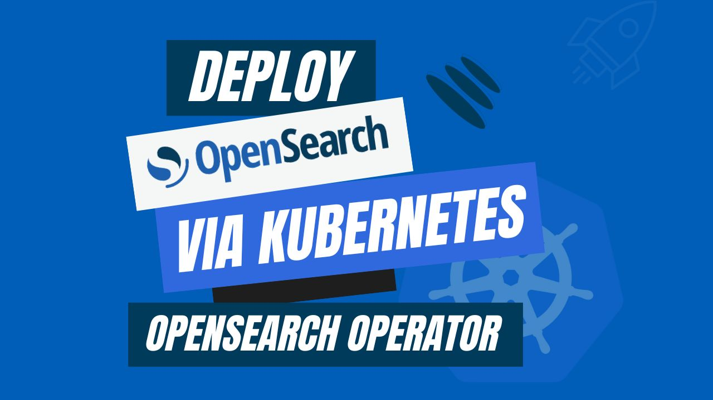

# Deploy OpenSearch via Kubernetes OpenSearch Operator



In the current landscape of containerized applications and orchestration, the efficient deployment and upkeep of databases like OpenSearch require a versatile and efficient approach. The **Kubernetes OpenSearch Operator** streamlines the process of configuring, sustaining, and scaling OpenSearch databases within a Kubernetes environment. This guide delves into the fundamentals of installing OpenSearch databases using the OpenSearch Kubernetes Operator, examining its benefits, features, and step-by-step guidelines. By adopting this solution, you can achieve enhanced flexibility and automation in the provisioning and administration of your OpenSearch databases, all while adhering to best practices for containerized infrastructure.

Kubernetes is a groundbreaking open-source platform that streamlines the entire workflow for containerized applications. It emphasizes that Kubernetes provides the capability to easily deploy, scale, and manage applications, whether they are running on a single machine or distributed across a multi-cloud environment.

Kubernetes streamlines the administration of multiple containers by automating critical functions such as load balancing, dynamic scaling, and ensuring application robustness with automatic recovery mechanisms. When introducing a new version of your application, Kubernetes takes charge of the update process, minimizing downtime and mitigating the risk of errors.

With a simple declarative configuration, you can specify your desired application behavior, and Kubernetes ensures it follows those specifications. This allows you to concentrate on developing exceptional applications, while Kubernetes guarantees their reliable and efficient operation. Now, you can simplify the provisioning and troubleshooting process and empowering you to confidently tackle the complexity of application deployment.

## Why OpenSearch in Kubernetes
OpenSearch, an open-source and exceptionally scalable search engine explicitly created for processing extensive volumes of data. It has many features, including full-text search, structured search, analytics, and logging, OpenSearch proves versatile and applicable across a diverse array of applications and use scenarios. Particularly advantageous for enterprises dealing with substantial real-time data management and search requirements, OpenSearch stands out for its ability to deliver rapid and precise search results.

OpenSearch facilitates horizontal scaling across multiple nodes, ensuring efficient handling of large data loads while maintaining continuous accessibility. Alongside its distributed design, OpenSearch accommodates a versatile data format, allowing the storage and indexing of diverse data types, such as text, numerical data, and geospatial information, whether structured or unstructured.

Integrating OpenSearch within a Kubernetes environment offers a powerful combination that brings a host of advantages. It allows for the seamless management of OpenSearch clusters at scale, ensuring optimal resource utilization and high availability, all within the robust orchestration framework of Kubernetes. Kubernetes simplifies the deployment and scaling of OpenSearch instances, making it easier to adapt to evolving data demands. Additionally, it provides a unified platform for handling both application and data infrastructure, streamlining operations and reducing complexity. This integration enhances the overall efficiency and resilience of OpenSearch deployments, facilitating real-time data processing and search capabilities within Kubernetes clusters, making it a formidable solution for modern data-driven applications.

## Deploying OpenSearch on Kubernetes
### Pre-requisites
We have to set up the environment to deploy OpenSearch on Kubernetes using a Kubernetes OpenSearch operator. A running Kubernetes cluster and a fundamental understanding of OpenSearch are required to conduct this tutorial. Here, we are going to create our kubernetes cluster using [Kind](https://kubernetes.io/docs/tasks/tools/#kind). Additionally, you need to install [Helm](https://helm.sh/docs/intro/install/) to your Kubernetes cluster.

In this article, We will use the Kubernetes OpenSearch operator [KubeDB](https://kubedb.com/) to deploy OpenSearch on Kubernetes. We must have KubeDB installed in our Kubernetes cluster. KubeDB provides supports for the official Elasticsearch by [Elastic](https://www.elastic.co/) and [OpenSearch](https://opensearch.org/) by AWS, but also other open source distributions like [SearchGuard](https://search-guard.com/) and [OpenDistro](https://opendistro.github.io/for-elasticsearch/). **KubeDB provides all of these distribution’s support under the Elasticsearch CR of KubeDB**. To set up KubeDB in our Kubernetes cluster, we require a license. Through the [Appscode License Server](https://license-issuer.appscode.com/), we can get a free enterprise license. We must provide our Kubernetes cluster ID to obtain a license. Run the following command below to get the cluster ID.
 
```bash
$ kubectl get ns kube-system -o jsonpath='{.metadata.uid}'
6c08dcb8-8440-4388-849f-1f2b590b731e
```

The license server will email us with a "license.txt" file attached after we provide the necessary data. Run the following commands listed below to install KubeDB. 

```bash
$ helm install kubedb oci://ghcr.io/appscode-charts/kubedb \
  --version v2023.12.11 \
  --namespace kubedb --create-namespace \
  --set-file global.license=/path/to/the/license.txt \
  --wait --burst-limit=10000 --debug
```

Verify the installation by the following command,

```bash
$ kubectl get pods --all-namespaces -l "app.kubernetes.io/instance=kubedb"
NAMESPACE   NAME                                            READY   STATUS    RESTARTS   AGE
kubedb      kubedb-kubedb-autoscaler-8685b5f5f8-kwh9r       1/1     Running   0          2m38s
kubedb      kubedb-kubedb-dashboard-677448dff8-ggrz6        1/1     Running   0          2m38s
kubedb      kubedb-kubedb-ops-manager-f4d869f54-xbtd7       1/1     Running   0          2m38s
kubedb      kubedb-kubedb-provisioner-778795d79-zbn74       1/1     Running   0          2m38s
kubedb      kubedb-kubedb-schema-manager-64f9cc9445-vwfsk   1/1     Running   0          2m38s
kubedb      kubedb-kubedb-webhook-server-85cb5f5fdb-jtpgt   1/1     Running   0          2m38s
``` 
We can go on to the next stage if every pod status is running.

## Create a Namespace
Now we'll create a new namespace in which we will deploy OpenSearch. To create a namespace, we can use the following command:

```bash
$ kubectl create namespace os-demo
namespace/os-demo created
``` 

## Deploy OpenSearch via Kubernetes OpenSearch operator
We need to create a yaml configuration to deploy OpenSearch on Kubernetes. And we will apply this yaml below,

```yaml
apiVersion: kubedb.com/v1alpha2
kind: Elasticsearch
metadata:
  name: os-cluster
  namespace: os-demo
spec:
  enableSSL: true 
  version: opensearch-2.11.1
  storageType: Durable
  topology:
    master:
      replicas: 2
      resources:
      storage:
        storageClassName: "standard"
        accessModes:
        - ReadWriteOnce
        resources:
          requests:
            storage: 1Gi
    data:
      replicas: 2
      resources:
      storage:
        storageClassName: "standard"
        accessModes:
        - ReadWriteOnce
        resources:
          requests:
            storage: 1Gi
    ingest:
      replicas: 2
      resources:
      storage:
        storageClassName: "standard"
        accessModes:
        - ReadWriteOnce
        resources:
          requests:
            storage: 1Gi
  terminationPolicy: WipeOut
```

You can see the detailed yaml specifications in the [Kubernetes OpenSearch](https://kubedb.com/docs/latest/guides/elasticsearch/quickstart/overview/opensearch/) documentation.

We will save this yaml configuration to `os-cluster.yaml`. Then create the above OpenSearch object.

```bash
$ kubectl apply -f os-cluster.yaml
elasticsearch.kubedb.com/os-cluster created
```

If all the above steps are handled correctly and the OpenSearch is deployed, you will see that the following objects are created:


```bash
$ kubectl get all -n os-demo
NAME                      READY   STATUS    RESTARTS   AGE
pod/os-cluster-data-0     1/1     Running   0          4m37s
pod/os-cluster-data-1     1/1     Running   0          2m39s
pod/os-cluster-ingest-0   1/1     Running   0          4m47s
pod/os-cluster-ingest-1   1/1     Running   0          2m42s
pod/os-cluster-master-0   1/1     Running   0          4m42s
pod/os-cluster-master-1   1/1     Running   0          2m36s

NAME                        TYPE        CLUSTER-IP     EXTERNAL-IP   PORT(S)    AGE
service/os-cluster          ClusterIP   10.96.99.212   <none>        9200/TCP   4m55s
service/os-cluster-master   ClusterIP   None           <none>        9300/TCP   4m55s
service/os-cluster-pods     ClusterIP   None           <none>        9200/TCP   4m55s

NAME                                 READY   AGE
statefulset.apps/os-cluster-data     2/2     4m37s
statefulset.apps/os-cluster-ingest   2/2     4m47s
statefulset.apps/os-cluster-master   2/2     4m42s

NAME                                            TYPE                       VERSION   AGE
appbinding.appcatalog.appscode.com/os-cluster   kubedb.com/elasticsearch   2.8.0     4m37s

NAME                                  VERSION            STATUS   AGE
elasticsearch.kubedb.com/os-cluster   opensearch-2.11.1   Ready    4m55s
```

We have successfully deployed OpenSearch to Kubernetes via the Kubernetes OpenSearch operator. Now, we will connect to the OpenSearch database to insert some sample data and verify whether our OpenSearch is usable or not. First, check the database status,

```bash
$ kubectl get es -n os-demo os-cluster
NAME         VERSION            STATUS   AGE
os-cluster   opensearch-2.11.1   Ready    4m59s
```
## Insert sample data to the OpenSearch database

Now, we will create few indexes in OpenSearch. The Kubernetes OpenSearch operator establishes a governing service with the name of the OpenSearch object itself when OpenSearch yaml is deployed. Using this service, we will port-forward to the database from our local workstation and establish a connection. After that, we'll add some data to OpenSearch.

## Port-forward the Service
KubeDB will create few Services to connect with the database. Let’s see the Services created by KubeDB for our OpenSearch,

```bash
$ kubectl get service -n os-demo -l=app.kubernetes.io/instance=os-cluster
NAME                TYPE        CLUSTER-IP      EXTERNAL-IP   PORT(S)    AGE
os-cluster          ClusterIP   10.96.220.157   <none>        9200/TCP   5m
os-cluster-master   ClusterIP   None            <none>        9300/TCP   5m
os-cluster-pods     ClusterIP   None            <none>        9200/TCP   5m
```
Here, we are going to use the `os-cluster` Service to connect with the database. Now, let’s port-forward the `os-cluster` Service.

```bash
$ kubectl port-forward -n os-demo svc/os-cluster 9200
Forwarding from 127.0.0.1:9200 -> 9200
Forwarding from [::1]:9200 -> 9200
``` 
## Export the Credentials
Kubernetes OpenSearch operator will create some Secrets for the database. Let’s list the Secrets for our `os-cluster`.

```bash
$ kubectl get secret -n os-demo -l=app.kubernetes.io/instance=os-cluster
NAME                              TYPE                       DATA   AGE
os-cluster-admin-cert             kubernetes.io/tls          3      5m
os-cluster-admin-cred             kubernetes.io/basic-auth   2      5m
os-cluster-ca-cert                kubernetes.io/tls          2      5m
os-cluster-client-cert            kubernetes.io/tls          3      5m
os-cluster-config                 Opaque                     3      5m
os-cluster-http-cert              kubernetes.io/tls          3      5m
os-cluster-kibanaro-cred          kubernetes.io/basic-auth   2      5m
os-cluster-kibanaserver-cred      kubernetes.io/basic-auth   2      5m
os-cluster-logstash-cred          kubernetes.io/basic-auth   2      5m
os-cluster-readall-cred           kubernetes.io/basic-auth   2      5m
os-cluster-snapshotrestore-cred   kubernetes.io/basic-auth   2      5m
os-cluster-transport-cert         kubernetes.io/tls          3      5m
```
Now, we can connect to the database with any of these secret that have the prefix `cred`. Here, we will use `os-cluster-admin-cred` which contains the admin level credentials to connect with the database.

```bash
$ kubectl get secret -n os-demo os-cluster-admin-cred -o jsonpath='{.data.username}' | base64 -d
admin
$ kubectl get secret -n os-demo os-cluster-admin-cred -o jsonpath='{.data.password}' | base64 -d
t;gmkX(o!4DuU6XP
```
We will now use curl to post some sample data into OpenSearch. Use the -k flag to disable attempts to verify self-signed certificates for testing purposes.

```bash
$ curl -XPOST -k --user 'admin:t;gmkX(o!4DuU6XP' "https://localhost:9200/music/_doc?pretty" -H 'Content-Type: application/json' -d'
                           {
                               "Artist": "Backstreet Boys",
                               "Song": "Show Me The Meaning"
                           }
                           '
{
  "_index" : "music",
  "_id" : "MRIPuYsBGygDWO9F_G9o",
  "_version" : 1,
  "result" : "created",
  "_shards" : {
    "total" : 2,
    "successful" : 2,
    "failed" : 0
  },
  "_seq_no" : 0,
  "_primary_term" : 1
}
```
Now, let’s verify that the index has been created successfully.

```bash
$ curl -XGET -k --user 'admin:t;gmkX(o!4DuU6XP' "https://localhost:9200/_cat/indices?v&s=index&pretty"
health status index                        uuid                   pri rep docs.count docs.deleted store.size pri.store.size
green  open   .opendistro_security         MtD1G8t7SCKHdRdgESbglw   1   1         10            0    120.8kb         75.4kb
green  open   .opensearch-observability    5miOoG23QQ2tQKJYDlDV1A   1   1          0            0       416b           208b
green  open   kubedb-system                cL0sZYAaTEa7MeE_OYVXcg   1   1          1          270      1.3mb        706.3kb
green  open   music                        7jmr68IFT9S5s0W_2IaP1g   1   1          1            0      9.3kb          4.6kb
green  open   security-auditlog-2023.11.10 EbBSYaTATuaiE7efHLFaKA   1   1         12            0    346.9kb        173.2kb
```
Also, let’s verify the data in the indexes:

```bash
$ curl -XGET -k --user 'admin:t;gmkX(o!4DuU6XP' "https://localhost:9200/music/_search?pretty"
{
  "took" : 93,
  "timed_out" : false,
  "_shards" : {
    "total" : 1,
    "successful" : 1,
    "skipped" : 0,
    "failed" : 0
  },
  "hits" : {
    "total" : {
      "value" : 1,
      "relation" : "eq"
    },
    "max_score" : 1.0,
    "hits" : [
      {
        "_index" : "music",
        "_id" : "MRIPuYsBGygDWO9F_G9o",
        "_score" : 1.0,
        "_source" : {
          "Artist" : "Backstreet Boys",
          "Song" : "Show Me The Meaning"
        }
      }
    ]
  }
}
```

We’ve successfully Deploy OpenSearch to Kubernetes via **Kubernetes OpenSearch Operator** KubeDB and insert some sample data into it.

## OpenSearch on Kubernetes: Best Practices
To ensure the robustness and reliability of your application when leveraging OpenSearch on Kubernetes through the Kubernetes OpenSearch operator, there are some best practices that you should follow:

* **Dashboard Integration:** Deploy OpenSearch Dashboards alongside your OpenSearch cluster to access real-time performance insights and efficient data visualization. Secure OpenSearch Dashboards by implementing access controls and encryption. Leverage the dashboard features to monitor the health of your OpenSearch cluster and extract valuable performance insights for your application.

* **High Availability:** Ensuring high availability by leveraging OpenSearch's built-in data replication capabilities. Distribute data across multiple nodes to ensure redundancy and resilience. Implement load balancing to evenly distribute traffic among nodes.

* **Backup and Recovery:**  Give precedence to backup and recovery protocols by consistently generating data backups using OpenSearch snapshots or alternative compatible backup tools. Safeguard backups by storing them in distinct locations or employing cloud storage, simulate the effectiveness of disaster recovery capabilities. Regularly assess the reliability of data restoration procedures to ensure their effectiveness in crucial scenarios.

* **Monitoring & Security:** Implement a robust monitoring strategy using tools such as Prometheus, Grafana, or OpenSearch's native monitoring features. Keep a close eye on cluster health and performance metrics to proactively address potential issues. Strengthen security by incorporating Role-Based Access Control (RBAC) and robust authentication mechanisms. Enforce Kubernetes network policies to secure communication between OpenSearch pods and maintain a resilient security posture.

## Conclusion
OpenSearch is a robust open-source search and analytics engine known for its capability to handle extensive and varied datasets with speed and accuracy. You have now successfully deployed an OpenSearch database on Kubernetes using the Kubernetes OpenSearch operator, a versatile solution suitable for various applications. Additional details can be found in the official [OpenSearch documentation](https://opensearch.org/). Managing databases, whether they are located on-premises or in cloud environments, demands a substantial understanding and ongoing commitment. KubeDB provides a full support solution to ensure that your database management fulfills performance and uptime requirements. Regardless of whether your database infrastructure is localized on-site, spread across diverse geographical regions, or relies on cloud services or database-as-a-service providers, KubeDB offers indispensable support in managing the complete process within a production-grade environment.

