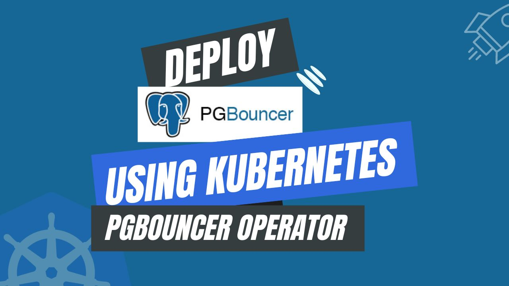

# Deploy PgBouncer using Kubernetes PgBouncer Operator



As businesses increasingly integrate containerization and orchestration technologies, the management of databases in dynamic and scalable environments presents a significant challenge. Kubernetes, a prevalent container orchestration technology, offers robust features for automating the deployment, scaling, and maintenance of containerized applications. However, effectively managing databases within a Kubernetes cluster requires careful consideration to ensure peak performance and scalability.

This article covers the importance of PgBouncer in the area of database management within a Kubernetes environment. We will explore the basics of PgBouncer, highlighting its significance in effective database management, and offering best practices for the deployment and configuration of PgBouncer on Kubernetes. By the end of this article, you will have acquired a thorough understanding of how the integration of **Kubernetes PgBouncer** elevates your strategy for database management within the Kubernetes ecosystem.

## Advantage of PgBouncer in Kubernetes

PgBouncer is a high-performance open-source connection pooler for PostgreSQL databases, specifically designed to manage database connections efficiently. Operating as an intermediary layer between applications and databases, PgBouncer optimizes connection pooling and query handling. With PgBouncer, you can achieve load balancing of queries across multiple PostgreSQL database instances, route read and write operations to replicas, and ensure failover support.

A compelling reason to opt for PgBouncer is its capability to enhance database performance and scalability. Through efficient connection pooling and query distribution, PgBouncer effectively manages the database workload, preventing any single instance from becoming a bottleneck. This load distribution becomes particularly crucial in a Kubernetes environment, where applications dynamically scale, requiring the database to adapt to fluctuating demand.

PgBouncer, in addition to connection pooling, offers transaction pooling, which can be advantageous in scenarios with a high number of short-lived connections. This feature contributes to resource optimization and efficient handling of connection requests in Kubernetes deployments.

Moreover, PgBouncer facilitates connection pooling, resulting in minimized overhead and improved resource utilization, making it well-suited for dynamic and scalable Kubernetes environments. Its ability to handle connections and queries efficiently makes PgBouncer an essential component for optimizing PostgreSQL database performance in Kubernetes deployments.

## Deploying PgBouncer on Kubernetes

### Pre-requisites

We have to set up the environment to deploy PgBouncer on Kubernetes using a Kubernetes PgBouncer operator. You requires to have a running Kubernetes cluster and a basic understanding of PgBouncer. Here we are using [Kind](https://kubernetes.io/docs/tasks/tools/#kind) to create our Kubernetes cluster. Additionally, you should install [Helm](https://helm.sh/docs/intro/install/) to your Kubernetes cluster.

In this tutorial, We will use the Kubernetes PgBouncer operator [KubeDB](https://kubedb.com/) to deploy PgBouncer on Kubernetes. First, We must install KubeDB in our Kubernetes cluster. It requires a license to setup KubeDB in our Kubernetes cluster. We can obtain a free license via the [AppsCode License Server](https://license-issuer.appscode.com/). To obtain the license we must provide our Kubernetes cluster ID. Run the following command to get the cluster ID.

```bash
$ kubectl get ns kube-system -o jsonpath='{.metadata.uid}'
6c08dcb8-8440-4388-849f-1f2b590b731e
```

After providing the required information, we will receive an email from the license server including a `license.txt` file. To install KubeDB, use the following helm commands.

```bash
$ helm install kubedb oci://ghcr.io/appscode-charts/kubedb \
  --version v2023.12.28 \
  --namespace kubedb --create-namespace \
  --set-file global.license=/path/to/the/license.txt \
  --wait --burst-limit=10000 --debug
```

Verify the KubeDB installation by the following command,

```bash
$ kubectl get pods --all-namespaces -l "app.kubernetes.io/instance=kubedb"
NAMESPACE   NAME                                           READY   STATUS    RESTARTS        AGE
kubedb      kubedb-kubedb-autoscaler-6d6ffb847c-bpb9c      1/1     Running   0               3m57s
kubedb      kubedb-kubedb-dashboard-65cd5f6ddf-l72vc       1/1     Running   0               3m57s
kubedb      kubedb-kubedb-ops-manager-9665f8666-2qnbb      1/1     Running   0               3m57s
kubedb      kubedb-kubedb-provisioner-7984979d86-xphhz     1/1     Running   0               3m57s
kubedb      kubedb-kubedb-webhook-server-95989684b-jdsj4   1/1     Running   0               3m57s
```

If all of the pod status is running, we can move to the next step.

## Create a Namespace

We will now create a new namespace and deploy the server. The following command can be used to create a namespace:

```bash
$ kubectl create namespace pgdemo
namespace/pgdemo created
```

## Deploy PostgreSQL Cluster

We need to create a yaml manifest to Deploy PostgreSQL on Kubernetes. Here is the yaml manifest we’ll be using,

```yaml
apiVersion: kubedb.com/v1alpha2 
kind: Postgres
metadata:
  name: postgres
  namespace: pgdemo
spec:
  version: "15.1"
  replicas: 3 
  standbyMode: Hot 
  storageType: Durable 
  storage:
    storageClassName: "standard" 
    accessModes:
    - ReadWriteOnce
    resources:
      requests:
        storage: 1Gi 
  terminationPolicy: WipeOut
```

You can see the detailed yaml specifications in the [Kubernetes PostgreSQL](https://kubedb.com/docs/latest/guides/postgres/concepts/postgres/) documentation.

We will save this yaml configuration to `postgres.yaml`. Then create the above PostgreSQL object.

```bash
$ kubectl create -f postgres.yaml
postgres.kubedb.com/postgres created
```

Let’s check if the server is ready to use,

```bash
$ kubectl get postgres -n pgdemo postgres
NAME       VERSION   STATUS   AGE
postgres   15.1      Ready    2m50s
```

### Create Database, User & Grant Privileges

Here, we are going to create a database with user and grant them all privileges to the database.

```bash
$ kubectl exec -it postgres-0 -n pgdemo -- bash
Defaulted container "postgres" out of: postgres, pg-coordinator, postgres-init-container (init)

postgres-0:/$ psql -c "create database test"
CREATE DATABASE

postgres-0:/$ psql -c "create role roy with login password '12345'"
CREATE ROLE

postgres-0:/$ psql -c "grant all privileges on database test to roy"
GRANT

postgres-0:/$ psql test
psql (15.1)
Type "help" for help.

test=# GRANT ALL ON SCHEMA public TO roy;
GRANT

test=# exit

postgres-0:/$ exit
exit
```
#### Create Secret

Now, we’ll create a secret that includes the `User` and `Password` that we created as Postgres roles above.

```yaml
apiVersion: v1
stringData:
  password: "12345"
  username: roy
kind: Secret
metadata:
  name: db-user-pass
  namespace: pgdemo
type: kubernetes.io/basic-auth
```
Let’s save this yaml configuration into `db-user-pass.yaml`, Then create the above `Secret`

```bash
$ kubectl apply -f db-user-pass.yaml 
secret/db-user-pass created
```

#### Create AppBinding

Now, we are going to create a `AppBinding` which we will connect as a database reference to PgBouncer,
```yaml
apiVersion: appcatalog.appscode.com/v1alpha1
kind: AppBinding
metadata:
  name: pg-appbinding
  namespace: pgdemo
  labels:
    app.kubernetes.io/component: database
    app.kubernetes.io/instance: pg-appbinding
    app.kubernetes.io/managed-by: kubedb.com
    app.kubernetes.io/name: postgreses.kubedb.com
spec:
  appRef:
    apiGroup: kubedb.com
    kind: Postgres
    name: postgres
    namespace: pgdemo
  clientConfig:
    service:
      name: postgres
      path: /
      port: 5432
      query: sslmode=disable
      scheme: postgresql
  parameters:
    apiVersion: appcatalog.appscode.com/v1alpha1
    kind: StashAddon
    stash:
      addon:
        backupTask:
          name: postgres-backup-15.1
        restoreTask:
          name: postgres-restore-15.1
  secret:
    name: db-user-pass
  type: kubedb.com/postgres
  version: "15.1"
```

Let’s save this yaml configuration into `pg-appbinding.yaml`, Then create the above `AppBinding`

You can see the detailed yaml specifications in the [Kubernetes PgBouncer AppBinding](https://kubedb.com/docs/latest/guides/pgbouncer/concepts/appbinding/) documentation.


## Deploy PgBouncer Cluster

We will use KubeDB to deploy the PgBouncer cluster. Here is the yaml manifest that will be used.

```yaml
apiVersion: kubedb.com/v1alpha2
kind: PgBouncer
metadata:
  name: pgbouncer
  namespace: pgdemo
spec:
  version: "1.18.0"
  replicas: 3
  databases:
  - alias: "testdb"
    databaseName: "test"
    databaseRef:
      name: "pg-appbinding"
      namespace: pgdemo
  connectionPool:
    port: 5432
    poolMode: session
    authType: md5
  terminationPolicy: WipeOut
```

You can see the detailed yaml specifications in the [Kubernetes PgBouncer](https://kubedb.com/docs/latest/guides/pgbouncer/concepts/pgbouncer/) documentation.

Let’s save this yaml configuration into `pgbouncer.yaml` Then create the above PgBouncer CRO,

```bash
$ kubectl apply -f pgbouncer.yaml
pgbouncer.kubedb.com/pgbouncer created
```

If all of the previous steps are followed correctly, and PostgreSQL and PgBouncer are deployed, the following objects will be created:

```bash
$ kubectl get all -n pgdemo
NAME              READY   STATUS    RESTARTS   AGE
pod/pgbouncer-0   1/1     Running   0          2m29s
pod/pgbouncer-1   1/1     Running   0          2m17s
pod/pgbouncer-2   1/1     Running   0          2m11s
pod/postgres-0    2/2     Running   0          6m29s
pod/postgres-1    2/2     Running   0          7m11s
pod/postgres-2    2/2     Running   0          7m59s

NAME                       TYPE        CLUSTER-IP   EXTERNAL-IP   PORT(S)                      AGE
service/pgbouncer          ClusterIP   10.8.6.63    <none>        5432/TCP                     3m7s
service/pgbouncer-pods     ClusterIP   None         <none>        5432/TCP                     3m7s
service/postgres           ClusterIP   10.8.6.135   <none>        5432/TCP,2379/TCP            7m32s
service/postgres-pods      ClusterIP   None         <none>        5432/TCP,2380/TCP,2379/TCP   7m32s
service/postgres-standby   ClusterIP   10.8.0.37    <none>        5432/TCP                     7m32s

NAME                         READY   AGE
statefulset.apps/pgbouncer   3/3     2m3s
statefulset.apps/postgres    3/3     8m34s

NAME                                               TYPE                   VERSION   AGE
appbinding.appcatalog.appscode.com/pg-appbinding   kubedb.com/postgres    15.1      2m52s
appbinding.appcatalog.appscode.com/pgbouncer       kubedb.com/pgbouncer   1.18.0    2m7s
appbinding.appcatalog.appscode.com/postgres        kubedb.com/postgres    15.1      7m58s

NAME                           VERSION   STATUS   AGE
postgres.kubedb.com/postgres   15.1      Ready    8m

NAME                             VERSION   STATUS   AGE
pgbouncer.kubedb.com/pgbouncer   1.18.0    Ready    2m27s
```

We have successfully deployed PgBouncer to Kubernetes via the Kubernetes PgBouncer operator. Now, we will connect to the PostgreSQL database through PgBouncer to insert some sample data to verify the deployed PgBouncer is working.

## Insert Sample Data

Let’s exec to the PgBouncer Pod to enter into PostgreSQL server using previously created user credentials to write and read some sample data to the database,

```bash
$ kubectl exec -it -n pgdemo pgbouncer-0 -- sh
Defaulted container "pgbouncer" out of: pgbouncer, pgbouncer-init-container (init)

$ psql -d "host=localhost user=roy password=12345 dbname=testdb"
psql (15.1)
Type "help" for help.

testdb=> create table music(id int, artist varchar, name varchar);
CREATE TABLE

testdb=> insert into music values(1, 'John Denver', 'Country Roads');
INSERT 0 1

testdb=> select * from music;
 id |   artist     |  name        
----+--------------+---------------
  1 |  John Denver | Country Roads
(1 row)

testdb=> exit
$ exit
```

## Verify Data in PostgreSQL

Here, we are going to exec into PostgreSQL pod to verify the inserted data through PgBouncer.

```bash
$ kubectl exec -it -n pgdemo postgres-0 -- bash
Defaulted container "postgres" out of: postgres, pg-coordinator, postgres-init-container (init)

$ psql
psql (15.1)
Type "help" for help.

postgres=# \l
                                   List of databases
     Name      |  Owner   | Encoding |  Collate   |   Ctype    |   Access privileges   
---------------+----------+----------+------------+------------+-----------------------
 kubedb_system | postgres | UTF8     | en_US.utf8 | en_US.utf8 | 
 postgres      | postgres | UTF8     | en_US.utf8 | en_US.utf8 | 
 template0     | postgres | UTF8     | en_US.utf8 | en_US.utf8 | =c/postgres          +
               |          |          |            |            | postgres=CTc/postgres
 template1     | postgres | UTF8     | en_US.utf8 | en_US.utf8 | =c/postgres          +
               |          |          |            |            | postgres=CTc/postgres
 test          | postgres | UTF8     | en_US.utf8 | en_US.utf8 | =Tc/postgres         +
               |          |          |            |            | postgres=CTc/postgres+
               |          |          |            |            | roy=CTc/postgres
(5 rows)

postgres=# \c test
You are now connected to database "test" as user "postgres".

test=# \dt
       List of relations
 Schema | Name  | Type  | Owner 
--------+-------+-------+-------
 public | music | table | roy
(1 row)

test=# select * from music;
 id |   artist     |  name        
----+--------------+---------------
  1 |  John Denver | Country Roads
(1 row)

test=# exit
$ exit
```

We’ve successfully deployed PgBouncer to Kubernetes via **Kubernetes PgBouncer operator** KubeDB. Also, we use PgBouncer to connect to the PostgreSQL database and insert some sample data into it.

## PgBouncer on Kubernetes: Best Practices

To ensure the stability of your application when using PgBouncer on Kubernetes, there are some best practices that you should follow:

- **Utilizing the Kubernetes PgBouncer Operator:** Streamlining the deployment and management of PgBouncer in a Kubernetes environment is best achieved by leveraging the Kubernetes PgBouncer Operator. This operator encapsulates operational knowledge, automates administrative tasks, and simplifies the configuration and scaling of PgBouncer instances. By adopting the Kubernetes PgBouncer Operator, database administrators can efficiently manage and deploy PgBouncer instances, optimizing performance with minimal effort.

- **Ensuring High Availability:** High availability remains a paramount consideration in a production-grade database setup. When deploying PgBouncer on Kubernetes, the scalability option becomes instrumental in meeting dynamic demands and ensuring optimal performance. This flexibility allows swift resource allocation to handle expanding workloads in real-time, contributing to a highly available architecture.

- **Configuring Connection Pooling:** Efficiently managing the connections between PgBouncer and the database backends is achieved through proper configuration of connection pooling. Striking the right balance ensures resource efficiency and prevents the database from being overloaded with excessive connections. Configuring connection pooling is pivotal to providing a maximum number of connections while also keeping some connections open to meet varying demand.

- **Monitoring & Security:** Implementing robust monitoring practices is essential for identifying performance issues, optimizing resource utilization, and ensuring seamless operations. Monitoring key metrics such as connection rate, query cache hit rate, and backend server status enables proactive responses to changes in the database workload. Enabling TLS/SSL Support in the database ensures secure communication, protecting sensitive data from unauthorized access or interception. Establishing an encrypted connection between the client and the database not only enhances data privacy but also upholds high-security standards.

## Conclusion

In conclusion, PgBouncer emerges as a highly effective solution for enhancing database management within a Kubernetes framework. PgBouncer proves instrumental in optimizing database performance and scalability by efficiently managing connections, employing proper pooling configurations, and providing valuable transaction pooling support. Here, you have successfully deployed PgBouncer on Kubernetes using the Kubernetes PgBouncer operator, which is suitable for various scenarios. For more detailed information on implementing PgBouncer in Kubernetes, you can visit the official [PgBouncer documentation](https://www.pgbouncer.org/). Achieving peak efficiency and availability in database operations necessitates a deep understanding of PgBouncer-specific best practices and a commitment to continuous improvement. Leveraging KubeDB's extensive support services ensures that your database management aligns consistently with rigorous performance and operational standards. Whether your database infrastructure is on-premises, spans multiple geographical locations, or relies on cloud services and database-as-a-service providers, KubeDB offers comprehensive support to manage the entire process within a robust production-grade environment.