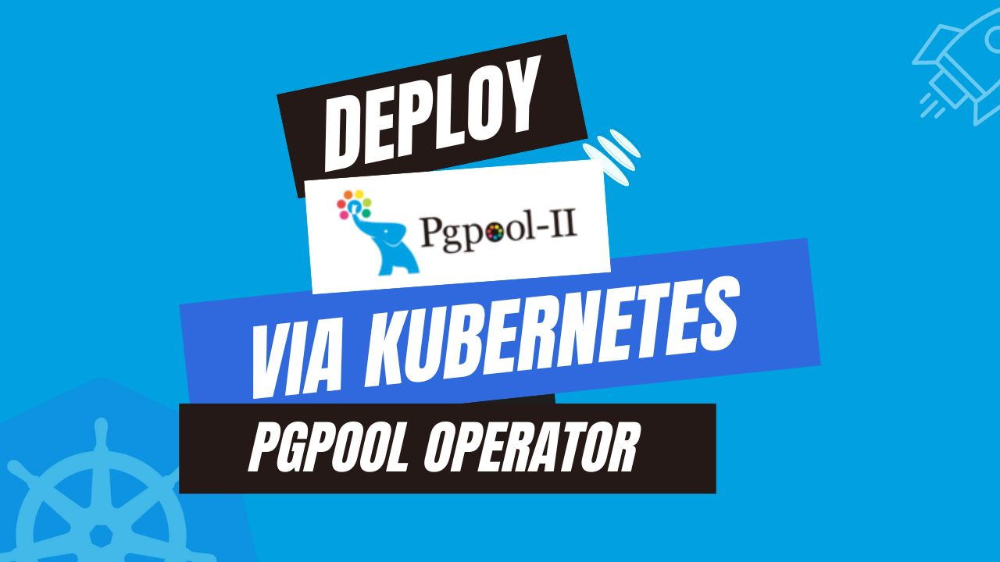

# Deploy Pgpool using Kubernetes Pgpool Operator



Containerization and orchestration are changing the game, but managing databases in these dynamic, highly scalable environments brings a new challenge. While Kubernetes, the leading container orchestration platform excels at automating deployment, scaling, and maintenance of containerized applications, effectively managing databases within a Kubernetes cluster requires a different approach for optimal performance and scalability.

This article explores Pgpool, a powerful middleware that elevates your PostgreSQL database management strategy within the Kubernetes ecosystem. We'll dive into the fundamentals of Pgpool, showcasing its significance in effective database management. We'll also provide best practices for deploying and configuring Pgpool on Kubernetes. By the end of this article, you'll be well-equipped to integrate Kubernetes Pgpool via Kubernetes Pgpool operator and streamline your database management approach within your Kubernetes environment.

## Advantage of Pgpool in Kubernetes

Pgpool is a high-performance open-source middleware specifically designed to manage database connections efficiently for PostgreSQL databases, offers significant advantages for managing them within Kubernetes environments. As an intermediary layer between applications and databases, Pgpool optimizes PostgreSQL database connection management through efficient connection pooling. It distributes read queries across multiple PostgreSQL instances for effective load balancing. This capability is particularly beneficial in Kubernetes, where applications can scale dynamically, requiring the database to handle fluctuating workloads. 

Additionally, Pgpool facilitates routing of read and write operations to replicas, ensuring high availability and data redundancy. Furthermore, advanced features like parallel query execution, suitable for complex queries and large datasets, contribute to resource optimization and efficient query handling in Kubernetes deployments.

Beyond these core functionalities, Pgpool also streamlines health monitoring of PostgreSQL instances. It can automatically detect and remove unhealthy replicas from the pool, ensuring applications only interact with functional databases. This proactive approach minimizes downtime and improves the overall stability of your database cluster within Kubernetes.

Moreover, Pgpool integrates seamlessly with Kubernetes deployments. Configuration options can be leveraged to manage Pgpool instances as Kubernetes resources, enabling them to benefit from Kubernetes built-in features for scaling, self-healing, and automated rollouts. This tight integration simplifies management and streamlines operations for Pgpool within your Kubernetes environment.

## Deploying Pgpool on Kubernetes

### Pre-requisites

We have to set up the environment to deploy Pgpool on Kubernetes using a Kubernetes Pgpool operator. You requires to have a functional Kubernetes cluster and a basic understanding of Pgpool. Here, we are going to create our kubernetes cluster using [Kind](https://kubernetes.io/docs/tasks/tools/#kind). Furthermore, you should install [Helm](https://helm.sh/docs/intro/install/) to your Kubernetes cluster.

In this article, We will use the Kubernetes Pgpool operator [KubeDB](https://kubedb.com/) to deploy Pgpool on Kubernetes. But before we start, you need to make sure you have KubeDB already installed in your Kubernetes setup. To use KubeDB, you’ll also need a license, which you can get for free from the [Appscode License Server](https://appscode.com/issue-license/). To obtain the license we must provide our Kubernetes cluster ID. Run the following command to get the cluster ID.

```bash
$ kubectl get ns kube-system -o jsonpath='{.metadata.uid}'
8e336615-0dbb-4ae8-b72f-2e7ec34c399d
```

After providing the required information, we will receive an email from the license server including a `license.txt` file. To install KubeDB, use the following helm commands.

```bash
$ helm install kubedb oci://ghcr.io/appscode-charts/kubedb \
  --version v2024.4.27 \
  --namespace kubedb --create-namespace \
  --set-file global.license=/path/to/the/license.txt \
  --set global.featureGates.Pgpool=true \
  --wait --burst-limit=10000 --debug
```

Verify the KubeDB installation by the following command,

```bash
$ kubectl get pods --all-namespaces -l "app.kubernetes.io/instance=kubedb"
NAMESPACE   NAME                                            READY   STATUS    RESTARTS   AGE
kubedb      kubedb-kubedb-autoscaler-9dfbd954f-8fjzt        1/1     Running   0          2m39s
kubedb      kubedb-kubedb-ops-manager-7669786dcc-hlcg5      1/1     Running   0          2m39s
kubedb      kubedb-kubedb-provisioner-6d9db6f7dc-km8th      1/1     Running   0          2m39s
kubedb      kubedb-kubedb-webhook-server-758f57c4c4-q7r8z   1/1     Running   0          2m39s
kubedb      kubedb-petset-operator-5d94b4ddb8-kk5bn         1/1     Running   0          2m39s
kubedb      kubedb-petset-webhook-server-b89bf7d9b-ng27h    2/2     Running   0          2m39s
kubedb      kubedb-sidekick-5d9947bd9-r2j8s                 1/1     Running   0          2m39s
```

If all of the pod status is running, we can move to the next step.

## Create a Namespace

We will now create a new namespace and deploy the server. The following command can be used to create a namespace:

```bash
$ kubectl create namespace pgpooldemo
namespace/pgpooldemo created
```

PostgreSQL is readily available in KubeDB as CRD and can easily be deployed. But by default this will create a PostgreSQL server with `max_connections=100`, but we need more than 100 connections for our Pgpool to work as expected.

Pgpool requires at least `2*num_init_children*max_pool*spec.replicas` connections in PostgreSQL server. So we can use [Custom Configuration File](https://kubedb.com/docs/latest/guides/postgres/configuration/using-config-file/) to create a PostgreSQL server with custom `max_connections`.

Now, create a Secret using this configuration file.

#### Create Secret with Custom Configuration
```yaml
apiVersion: v1
kind: Secret
metadata:
  name: pg-configuration
  namespace: pgpooldemo
stringData:
  user.conf: max_connections=400
```

Let’s save this yaml configuration into `pg-configuration.yaml` Then create the above Secret,

```bash
$ kubectl apply -f pg-configuration.yaml
secret/pg-configuration created
```

## Deploy PostgreSQL Cluster

Here, is the yaml of the PostgreSQL CR we are going to use:

```yaml
apiVersion: kubedb.com/v1alpha2
kind: Postgres
metadata:
  name: postgres-cluster
  namespace: pgpooldemo
spec:
  replicas: 3
  version: "16.1"
  configSecret:
    name: pg-configuration
  storageType: Durable
  storage:
    storageClassName: "standard"
    accessModes:
      - ReadWriteOnce
    resources:
      requests:
        storage: 1Gi
  terminationPolicy: WipeOut
```

You can see the detailed yaml specifications in the [Kubernetes PostgreSQL](https://kubedb.com/docs/latest/guides/postgres/concepts/postgres/) documentation.

Let’s save this yaml configuration into `postgres-cluster.yaml`. Then create the above PostgreSQL object.

```bash
$ kubectl apply -f postgres-cluster.yaml
postgres.kubedb.com/postgres-cluster created
```

Let’s check if the server is ready to use,

```bash
$ kubectl get postgres -n pgpooldemo postgres
NAME               VERSION   STATUS   AGE
postgres-cluster   16.1      Ready    2m7s
```

### Create Database, User & Grant Privileges

Here, we are going to create a database with a new user and grant all privileges to the database.

```bash
$ kubectl exec -it postgres-cluster-0 -n pgpooldemo -- bash
Defaulted container "postgres" out of: postgres, pg-coordinator, postgres-init-container (init)

postgres-cluster-0:/$ psql -c "create database test"
CREATE DATABASE

postgres-cluster-0:/$ psql -c "create role roy with login password '12345'"
CREATE ROLE

postgres-cluster-0:/$ psql -c "grant all privileges on database test to roy"
GRANT

postgres-cluster-0:/$ psql test
psql (16.1)
Type "help" for help.

test=# GRANT ALL ON SCHEMA public TO roy;
GRANT

test=# exit

postgres-cluster-0:/$ exit
exit
```
#### Create Secret

Now, we’ll create a secret that includes the `User` and `Password` with values from newly created role and password above. The secret must have two labels, one is `app.kubernetes.io/name: postgreses.kubedb.com` and another is `app.kubernetes.io/instance: <appbinding name>`.

```yaml
apiVersion: v1
kind: Secret
metadata:
  name: db-user-pass
  namespace: pgpooldemo
  labels:
    app.kubernetes.io/instance: postgres-cluster
    app.kubernetes.io/name: postgreses.kubedb.com
stringData:
  password: "12345"
  username: roy
```
Let’s save this yaml configuration into `db-user-pass.yaml`, Then create the above `Secret`,

```bash
$ kubectl apply -f db-user-pass.yaml 
secret/db-user-pass created
```

## Deploy Pgpool

We are going to deploy Pgpool using Kubernetes Pgpool operator KubeDB. Here, is the yaml of the Pgpool CRO we are going to use:

```yaml
apiVersion: kubedb.com/v1alpha2
kind: Pgpool
metadata:
  name: pgpool
  namespace: pgpooldemo
spec:
  version: "4.5.0"
  replicas: 1
  postgresRef:
    name: postgres-cluster
    namespace: pgpooldemo
  syncUsers: true
  terminationPolicy: WipeOut
```

You can see the detailed yaml specifications in the [Kubernetes Pgpool](https://kubedb.com/docs/latest/guides/pgpool/concepts/pgpool/) documentation.

Let’s save this yaml configuration into `pgpool.yaml` Then create the above Pgpool CRO,

```bash
$ kubectl apply -f pgpool.yaml
pgpool.kubedb.com/pgpool created
```

Let’s check if the server is ready to use,

```bash
$ kubectl get pgpool -n pgpooldemo pgpool
NAME     TYPE                  VERSION   STATUS   AGE
pgpool   kubedb.com/v1alpha2   4.5.0     Ready    53s
```

Once all of the above things are handled correctly then you will see that the following objects are created:

```bash
$ kubectl get all -n pgpooldemo
NAME                     READY   STATUS    RESTARTS   AGE
pod/pgpool-0             1/1     Running   0          59s
pod/postgres-cluster-0   2/2     Running   0          5m7s
pod/postgres-cluster-1   2/2     Running   0          4m52s
pod/postgres-cluster-2   2/2     Running   0          4m52s

NAME                               TYPE        CLUSTER-IP     EXTERNAL-IP   PORT(S)                      AGE
service/pgpool                     ClusterIP   10.96.81.203   <none>        9999/TCP                     60s
service/pgpool-pods                ClusterIP   None           <none>        9999/TCP                     60s
service/postgres-cluster           ClusterIP   10.96.252.10   <none>        5432/TCP,2379/TCP            5m7s
service/postgres-cluster-pods      ClusterIP   None           <none>        5432/TCP,2380/TCP,2379/TCP   5m7s
service/postgres-cluster-standby   ClusterIP   10.96.203.14   <none>        5432/TCP                     5m7s

NAME                                READY   AGE
statefulset.apps/postgres-cluster   3/3     5m7s

NAME                                                  TYPE                  VERSION   AGE
appbinding.appcatalog.appscode.com/postgres-cluster   kubedb.com/postgres   16.1      5m7s

NAME                       TYPE                  VERSION   STATUS   AGE
pgpool.kubedb.com/pgpool   kubedb.com/v1alpha2   4.5.0     Ready    60s

NAME                                   VERSION   STATUS   AGE
postgres.kubedb.com/postgres-cluster   16.1      Ready    5m7s
```

We have successfully deployed Pgpool to Kubernetes via the Kubernetes Pgpool operator. Now, we will connect to the PostgreSQL database via Pgpool to insert some sample data to verify the deployed Pgpool is working.

### Connect via Pgpool

To connect via Pgpool we have to expose its service to localhost. KubeDB will create few Services to connect with the database. Let’s check the Services by following command,

```bash
$ kubectl get service -n pgpooldemo
NAME                       TYPE        CLUSTER-IP     EXTERNAL-IP   PORT(S)                      AGE
pgpool                     ClusterIP   10.96.81.203   <none>        9999/TCP                     89s
pgpool-pods                ClusterIP   None           <none>        9999/TCP                     89s
postgres-cluster           ClusterIP   10.96.252.10   <none>        5432/TCP,2379/TCP            5m48s
postgres-cluster-pods      ClusterIP   None           <none>        5432/TCP,2380/TCP,2379/TCP   5m48s
postgres-cluster-standby   ClusterIP   10.96.203.14   <none>        5432/TCP                     5m48s
```
Here, we are going to use `pgpool` Service to connect. Now, let’s port-forward the `pgpool` Service to the port `9999` to local machine:

```bash
$ kubectl port-forward -n pgpooldemo svc/pgpool 9999
Forwarding from 127.0.0.1:9999 -> 9999
```

## Insert Sample Data

Let’s read and write some sample data to the database via Pgpool,

```bash
$ psql --host=localhost --port=9999 --username=roy test
psql (12.18 (Ubuntu 12.18-0ubuntu0.20.04.1), server 16.1)
Type "help" for help.

test=> CREATE TABLE music(id int, artist varchar, name varchar);
CREATE TABLE

test=> INSERT INTO music VALUES(1, 'John Denver', 'Country Roads');
INSERT 0 1

test=> SELECT * FROM music;
 id |   artist    |     name      
----+-------------+---------------
  1 | John Denver | Country Roads
(1 row)

test=> exit
```

## Verify Data in PostgreSQL

Here, we are going to exec into PostgreSQL pod to verify the inserted data through Pgpool.

```bash
$ kubectl exec -it -n pgpooldemo postgres-cluster-0 -- bash
Defaulted container "postgres" out of: postgres, pg-coordinator, postgres-init-container (init)
postgres-cluster-0:/$ psql
psql (16.1)
Type "help" for help.

postgres=# \l
                                                        List of databases
     Name      |  Owner   | Encoding | Locale Provider |  Collate   |   Ctype    | ICU Locale | ICU Rules |   Access privileges   
---------------+----------+----------+-----------------+------------+------------+------------+-----------+-----------------------
 kubedb_system | postgres | UTF8     | libc            | en_US.utf8 | en_US.utf8 |            |           | 
 postgres      | postgres | UTF8     | libc            | en_US.utf8 | en_US.utf8 |            |           | 
 template0     | postgres | UTF8     | libc            | en_US.utf8 | en_US.utf8 |            |           | =c/postgres          +
               |          |          |                 |            |            |            |           | postgres=CTc/postgres
 template1     | postgres | UTF8     | libc            | en_US.utf8 | en_US.utf8 |            |           | =c/postgres          +
               |          |          |                 |            |            |            |           | postgres=CTc/postgres
 test          | postgres | UTF8     | libc            | en_US.utf8 | en_US.utf8 |            |           | =Tc/postgres         +
               |          |          |                 |            |            |            |           | postgres=CTc/postgres+
               |          |          |                 |            |            |            |           | roy=CTc/postgres
(5 rows)

postgres=# \c test
You are now connected to database "test" as user "postgres".

test=# \dt
       List of relations
 Schema | Name  | Type  | Owner 
--------+-------+-------+-------
 public | music | table | roy
(1 row)

test=# SELECT * FROM music;
 id |   artist    |     name      
----+-------------+---------------
  1 | John Denver | Country Roads
(1 row)

test=# exit
postgres-cluster-0:/$ exit
exit
```

We’ve successfully deployed Pgpool to Kubernetes via **Kubernetes Pgpool operator** KubeDB. Also, we use Pgpool to connect to the PostgreSQL database and insert some sample data into it.

## Pgpool on Kubernetes: Best Practices

To ensure the stability of your application when using Pgpool on Kubernetes, there are some best practices that you should follow:

- **Persistent Storage:** Use Persistent Volumes (PVs) and Persistent Volume Claims (PVCs) to ensure that Pgpool configuration and state are preserved across pod restarts. Choose a reliable storage backend that meets the performance requirements of your workload.

- **Configuration Management:** Store Pgpool configuration files in Kubernetes ConfigMaps for easy management and updates, and use Secrets to securely handle sensitive information like database credentials. Enable dynamic configuration reloads to apply changes without downtime, ensuring continuous availability and minimal disruption.

- **Resource Management:** Define appropriate resource requests and limits for Pgpool pods to ensure they have sufficient CPU and memory, preventing resource contention and ensuring stable performance. Implement Horizontal Pod Autoscaling (HPA) to automatically scale Pgpool instances based on resource usage, ensuring optimal performance under varying loads.

- **Networking & Security:** Use Kubernetes Services to expose Pgpool to application pods, employing ClusterIP services for internal communication and NodePort or LoadBalancer services for external access with proper security controls. Implement Network Policies to restrict traffic flow and ensure that only authorized pods can communicate with Pgpool, enhancing security. Apply Role-Based Access Control (RBAC) to restrict access to Pgpool resources and use Pod Security Policies to enforce security standards, such as running containers as non-root and preventing privileged escalation. Secure communication between Pgpool and PostgreSQL servers by enabling TLS encryption, protecting data in transit.

- **Utilizing the Kubernetes Pgpool Operator:** Leverage the power of the Kubernetes Pgpool Operator for effortless Pgpool deployment and management. Kubernetes Pgpool operator acts as a helping hand, automating administrative tasks and simplifying configuration and scaling. With the operator at your side, database administrators can deploy and manage Pgpool instances with ease, optimizing performance without the heavy lifting.

## Conclusion

In conclusion, Pgpool has established itself as a highly effective solution for enhancing database management within Kubernetes environments. Its efficient connection management, optimized pooling configurations, and robust load balancing and replication support significantly contribute to optimized PostgreSQL database performance and scalability. This guide has successfully equipped you with the knowledge to deploy Pgpool on Kubernetes using the Kubernetes Pgpool Operator, a suitable approach for various deployment scenarios. For a more in-depth exploration of implementing Pgpool in Kubernetes, the official [Pgpool documentation](https://www.pgpool.net/) offers comprehensive information. Remember, achieving peak database efficiency and availability requires ongoing optimization and a strong understanding of Pgpool-specific best practices. Additionally, services offered by KubeDB can provide valuable expertise to ensure your database management maintains high performance and operational standards.