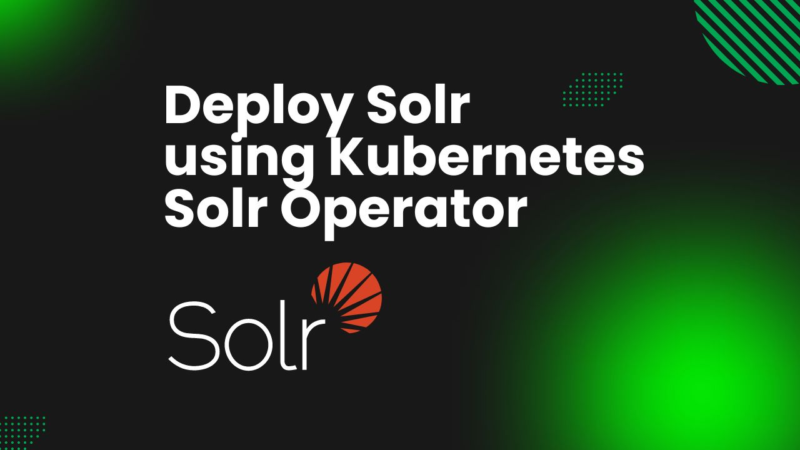

# Deploy Solr using Kubernetes Solr Operator



In a world dominated by data, powerful search capabilities are crucial for businesses looking to improve user experience and drive engagement. Apache Solr, a highly scalable open-source search platform built on Apache Lucene, provides the tools necessary to handle complex search requirements across vast datasets. By deploying Solr on Kubernetes, organizations can use the orchestration power of Kubernetes to create a resilient, scalable, and easily manageable search solution.

Kubernetes has transformed how applications are deployed, managed, and scaled, making it an ideal environment for running Solr. Central to this deployment is the **Kubernetes Solr** Operator, which simplifies the management of Solr clusters by allowing you to define Solr instances as declarative resources. This operator automates many operational tasks such as scaling, backups, and upgrades, enabling you to focus on your application rather than the underlying infrastructure. In this article, we will explore how to deploy Apache Solr using the Kubernetes Solr Operator, outlining its benefits and providing a step-by-step guide to get you started.

## Why Solr in Kubernetes

Apache Solr excels at full-text search, faceted search, and real-time indexing, making it an ideal choice for applications requiring powerful search functionality. Integrating Solr with Kubernetes improves its capabilities in several significant ways.

First, Kubernetes provides the ability to scale Solr instances dynamically based on demand. This is particularly useful for handling varying workloads, such as during peak traffic periods or large data ingestion events. By implementing Horizontal Pod Autoscaler of Kubernetes, you can automatically adjust the number of Solr replicas in response to real-time metrics, ensuring optimal performance without manual intervention. Kubernetes continuously monitors the health of your Solr pods. In the event of a pod failure, Kubernetes automatically restarts or replaces it, maintaining high availability. This self-healing capability is crucial for search applications where downtime can negatively impact user experience and operational efficiency.

Additionally, Kubernetes enables efficient resource management customized to Solr's specific needs. You can define resource requests and limits for each Solr pod, ensuring that each instance has the necessary CPU and memory to handle indexing and query workloads effectively. This helps prevent resource contention in your cluster, particularly in environments where multiple services are deployed alongside Solr.

Lastly, deploying Solr on Kubernetes simplifies the management of complex configurations. For instance, you can use the Kubernetes Solr Operator, which automates tasks such as scaling, backups, and upgrades. This operator allows you to manage your Solr clusters as declarative resources, streamlining operations and making it easier to implement changes with minimal disruption. Overall, the combination of Solr and Kubernetes creates a powerful, resilient search infrastructure that can scale with your application’s needs.

## Deploy Solr on Kubernetes
### Pre-requisites

To deploy Solr on Kubernetes using the [Kubernetes Solr Operator](https://kubedb.com/kubernetes/databases/run-and-manage-solr-on-kubernetes/), you'll first need to set up your environment. Begin by ensuring you have a functional Kubernetes cluster. In this guide, we will create our cluster using [Kind](https://kubernetes.io/docs/tasks/tools/#kind). A basic understanding of Solr will also be beneficial as you navigate the deployment process. Also, it’s important to install [Helm](https://helm.sh/docs/intro/install/) in your Kubernetes cluster, as it is essential for managing packages effectively.

This guide uses the Kubernetes Solr operator, [KubeDB](https://kubedb.com/), so you'll need to install KubeDB in your Kubernetes environment. To install KubeDB, you'll also need a license, which you can obtain for free from the [Appscode License Server](https://appscode.com/issue-license/).

To get a license, use your Kubernetes cluster ID. Run the following command to retrieve your cluster ID:
 
```bash
$ kubectl get ns kube-system -o jsonpath='{.metadata.uid}'
6d446615-0doo-3he8-b14f-8y5ec34c451u
```

The license server will email us with a "license.txt" file attached after we provide the necessary data. Run the following commands listed below to install KubeDB. 

```bash
$ helm install kubedb oci://ghcr.io/appscode-charts/kubedb \
  --version v2024.8.21 \
  --namespace kubedb --create-namespace \
  --set-file global.license=/path/to/the/license.txt \
  --set global.featureGates.Solr=true \
  --set global.featureGates.ZooKeeper=true \
  --wait --burst-limit=10000 --debug
```

Verify the installation by the following command,

```bash
$ kubectl get pods --all-namespaces -l "app.kubernetes.io/instance=kubedb"
NAMESPACE   NAME                                            READY   STATUS    RESTARTS   AGE
kubedb      kubedb-kubedb-autoscaler-7bf9c48b5c-sk6wq       1/1     Running   0          2m27s
kubedb      kubedb-kubedb-ops-manager-56bbd9b584-9wrmh      1/1     Running   0          2m27s
kubedb      kubedb-kubedb-provisioner-595f6757cd-hmgvx      1/1     Running   0          2m27s
kubedb      kubedb-kubedb-webhook-server-574f8d5767-4gj6p   1/1     Running   0          2m27s
kubedb      kubedb-petset-operator-77b6b9897f-69g2n         1/1     Running   0          2m27s
kubedb      kubedb-petset-webhook-server-75b578785f-wc469   2/2     Running   0          2m27s
kubedb      kubedb-sidekick-c898cff4c-h99wd                 1/1     Running   0          2m27s
``` 
We can go on to the next stage if every pod status is running.


### Create a Namespace
To keep resources isolated, we’ll use a separate namespace called `solr-demo` throughout this tutorial. Run the following command to create the namespace:

```bash
$ kubectl create namespace solr-demo
namespace/solr-demo created
```

### Create ZooKeeper Instance
Since KubeDB Solr operates in `solrcloud` mode, it requires an external ZooKeeper to manage replica distribution and configuration.

In this tutorial, we will use KubeDB ZooKeeper. Below is the configuration for the ZooKeeper instance we’ll create:

```yaml
apiVersion: kubedb.com/v1alpha2
kind: ZooKeeper
metadata:
  name: zookeeper
  namespace: solr-demo
spec:
  version: 3.9.1
  replicas: 3
  adminServerPort: 8080
  storage:
    resources:
      requests:
        storage: "100Mi"
    storageClassName: standard
    accessModes:
      - ReadWriteOnce
  deletionPolicy: "WipeOut"
```

You can see the detailed yaml specifications in the [Kubernetes ZooKeeper documentation](https://kubedb.com/docs/latest/guides/zookeeper/).

Let’s save this yaml configuration into `zookeeper.yaml` Then create the above ZooKeeper CRO,

```bash
$ kubectl apply -f zookeeper.yaml 
zookeeper.kubedb.com/zookeeper created
```
Once the ZooKeeper instance’s `STATUS` is `Ready`, we can proceed to deploy Solr in our cluster.

```bash
$ kubectl get zookeeper -n solr-demo zookeeper
NAME        TYPE                  VERSION   STATUS   AGE
zookeeper   kubedb.com/v1alpha2   3.9.1     Ready    4m14s
```

## Deploy Solr Cluster using Kubernetes Solr operator

Here is the yaml of the Solr we are going to use:

```yaml
apiVersion: kubedb.com/v1alpha2
kind: Solr
metadata:
  name: solr-cluster
  namespace: solr-demo
spec:
  version: 9.4.1
  replicas: 3
  zookeeperRef:
    name: zookeeper
    namespace: solr-demo
  storage:
    accessModes:
      - ReadWriteOnce
    resources:
      requests:
        storage: 2Gi
    storageClassName: standard
  deletionPolicy: "WipeOut"
```
You can see the detailed yaml specifications in the [Kubernetes Solr documentation](https://kubedb.com/docs/latest/guides/solr/).

Let’s save this yaml configuration into `solr-cluster.yaml` Then apply the above Solr yaml,

```bash
$ kubectl apply -f solr-cluster.yaml 
solr.kubedb.com/solr-cluster created
```

Once these are handled correctly and the Solr object is deployed, you will see that the following resources are created:

```bash
$ kubectl get all -n solr-demo
NAME                 READY   STATUS    RESTARTS   AGE
pod/solr-cluster-0   1/1     Running   0          2m56s
pod/solr-cluster-1   1/1     Running   0          52s
pod/solr-cluster-2   1/1     Running   0          44s
pod/zookeeper-0      1/1     Running   0          5m6s
pod/zookeeper-1      1/1     Running   0          4m37s
pod/zookeeper-2      1/1     Running   0          4m28s

NAME                             TYPE        CLUSTER-IP      EXTERNAL-IP   PORT(S)                      AGE
service/solr-cluster             ClusterIP   10.96.247.137   <none>        8983/TCP                     2m58s
service/solr-cluster-pods        ClusterIP   None            <none>        8983/TCP                     2m58s
service/zookeeper                ClusterIP   10.96.179.181   <none>        2181/TCP                     5m10s
service/zookeeper-admin-server   ClusterIP   10.96.99.105    <none>        8080/TCP                     5m10s
service/zookeeper-pods           ClusterIP   None            <none>        2181/TCP,2888/TCP,3888/TCP   5m10s

NAME                                              TYPE                   VERSION   AGE
appbinding.appcatalog.appscode.com/solr-cluster   kubedb.com/solr        9.4.1     2m58s
appbinding.appcatalog.appscode.com/zookeeper      kubedb.com/zookeeper   3.9.1     5m10s

NAME                           TYPE                  VERSION   STATUS   AGE
solr.kubedb.com/solr-cluster   kubedb.com/v1alpha2   9.4.1     Ready    2m58s

NAME                             TYPE                  VERSION   STATUS   AGE
zookeeper.kubedb.com/zookeeper   kubedb.com/v1alpha2   3.9.1     Ready    5m10s
```
Let’s check if the database is ready to use,

```bash
$ kubectl get solr -n solr-demo solr-cluster
NAME           TYPE                  VERSION   STATUS   AGE
solr-cluster   kubedb.com/v1alpha2   9.4.1     Ready    3m21s
```

### Connect with Solr Database

We will use [port forwarding](https://kubernetes.io/docs/tasks/access-application-cluster/port-forward-access-application-cluster/) to connect with our Solr database. Then we will use curl to send HTTP requests to check cluster health to verify that our Solr database is working well.

#### Port-forward the Service

KubeDB will create few Services to connect with the database. Let’s check the Services by following command,

```bash
$ kubectl get service -n solr-demo
NAME                     TYPE        CLUSTER-IP      EXTERNAL-IP   PORT(S)                      AGE
solr-cluster             ClusterIP   10.96.247.137   <none>        8983/TCP                     3m53s
solr-cluster-pods        ClusterIP   None            <none>        8983/TCP                     3m53s
zookeeper                ClusterIP   10.96.179.181   <none>        2181/TCP                     6m5s
zookeeper-admin-server   ClusterIP   10.96.99.105    <none>        8080/TCP                     6m5s
zookeeper-pods           ClusterIP   None            <none>        2181/TCP,2888/TCP,3888/TCP   6m5s
```
To connect to the Solr database, we will use the `solr-cluster` service. First, we need to port-forward the `solr-cluster` service to port `8983` on the local machine:

```bash
$ kubectl port-forward -n solr-demo svc/solr-cluster 8983
Forwarding from 127.0.0.1:8983 -> 8983
Forwarding from [::1]:8983 -> 8983
```
Now, the Solr cluster is accessible at `localhost:8983`.

#### Export the Credentials

KubeDB creates several Secrets for managing the database. To view the Secrets created for `solr-cluster`, run the following command:

```bash
$ kubectl get secret -n solr-demo | grep solr-cluster
solr-cluster-admin-cred           kubernetes.io/basic-auth   2      4m27s
solr-cluster-auth-config          Opaque                     1      4m27s
solr-cluster-config               Opaque                     1      4m27s
solr-cluster-zk-digest            kubernetes.io/basic-auth   2      4m27s
solr-cluster-zk-digest-readonly   kubernetes.io/basic-auth   2      4m27s
```

From the above list, the `solr-cluster-admin-cred` Secret contains the admin-level credentials needed to connect to the database.

### Accessing Database Through CLI

To access the database via the CLI, you first need to retrieve the credentials. Use the following commands to obtain the username and password:

```bash
$ kubectl get secret -n solr-demo solr-cluster-admin-cred -o jsonpath='{.data.username}' | base64 -d
admin
$ kubectl get secret -n solr-demo solr-cluster-admin-cred -o jsonpath='{.data.password}' | base64 -d
2bJLLUK0!*)Dsnd5
```

Now, let’s check the health of our Solr cluster.

```bash
# curl -XGET -k -u 'username:password' "http://localhost:8983/solr/admin/collections?action=CLUSTERSTATUS"
$ curl -XGET -k -u 'admin:2bJLLUK0!*)Dsnd5' "http://localhost:8983/solr/admin/collections?action=CLUSTERSTATUS"

{
  "responseHeader":{
    "status":0,
    "QTime":1
  },
  "cluster":{
    "collections":{
      "kubedb-system":{
        "pullReplicas":"0",
        "configName":"kubedb-system.AUTOCREATED",
        "replicationFactor":1,
        "router":{
          "name":"compositeId"
        },
        "nrtReplicas":1,
        "tlogReplicas":"0",
        "shards":{
          "shard1":{
            "range":"80000000-7fffffff",
            "state":"active",
            "replicas":{
              "core_node2":{
                "core":"kubedb-system_shard1_replica_n1",
                "node_name":"solr-cluster-1.solr-cluster-pods.solr-demo:8983_solr",
                "type":"NRT",
                "state":"active",
                "leader":"true",
                "force_set_state":"false",
                "base_url":"http://solr-cluster-1.solr-cluster-pods.solr-demo:8983/solr"
              }
            },
            "health":"GREEN"
          }
        },
        "health":"GREEN",
        "znodeVersion":4
      }
    },
    "live_nodes":["solr-cluster-1.solr-cluster-pods.solr-demo:8983_solr","solr-cluster-2.solr-cluster-pods.solr-demo:8983_solr","solr-cluster-0.solr-cluster-pods.solr-demo:8983_solr"]
  }
}
```

### Insert Sample Data

In this section, we’ll create a collection in Solr and insert some sample data using `curl`. To disable certificate verification (useful for testing with self-signed certificates), use the `-k` flag.

Execute the following command to create a collection named `music` in Solr:

```bash
$ curl -XPOST -k -u 'admin:2bJLLUK0!*)Dsnd5' "http://localhost:8983/solr/admin/collections?action=CREATE&name=music&numShards=2&replicationFactor=2&wt=xml"

<?xml version="1.0" encoding="UTF-8"?>
<response>
<lst name="responseHeader">
  <int name="status">0</int>
  <int name="QTime">3712</int>
</lst>
<lst name="success">
  <lst name="solr-cluster-1.solr-cluster-pods.solr-demo:8983_solr">
    <lst name="responseHeader">
      <int name="status">0</int>
      <int name="QTime">2428</int>
    </lst>
    <str name="core">music_shard1_replica_n2</str>
  </lst>
  <lst name="solr-cluster-2.solr-cluster-pods.solr-demo:8983_solr">
    <lst name="responseHeader">
      <int name="status">0</int>
      <int name="QTime">2634</int>
    </lst>
    <str name="core">music_shard2_replica_n1</str>
  </lst>
  <lst name="solr-cluster-2.solr-cluster-pods.solr-demo:8983_solr">
    <lst name="responseHeader">
      <int name="status">0</int>
      <int name="QTime">2869</int>
    </lst>
    <str name="core">music_shard1_replica_n6</str>
  </lst>
  <lst name="solr-cluster-0.solr-cluster-pods.solr-demo:8983_solr">
    <lst name="responseHeader">
      <int name="status">0</int>
      <int name="QTime">3031</int>
    </lst>
    <str name="core">music_shard2_replica_n4</str>
  </lst>
</lst>
</response>

$ curl -X POST -u 'admin:2bJLLUK0!*)Dsnd5' -H 'Content-Type: application/json' "http://localhost:8983/solr/music/update" --data-binary '[{ "Artist": "John Denver","Song": "Country Roads"}]'
{
  "responseHeader":{
    "rf":2,
    "status":0,
    "QTime":527
  }
}
```

To verify that the collection has been created successfully, run the following command:


```bash
$ curl -X GET -u 'admin:2bJLLUK0!*)Dsnd5' 'http://localhost:8983/solr/admin/collections?action=LIST&wt=json'
{
  "responseHeader":{
    "status":0,
    "QTime":0
  },
  "collections":["kubedb-system","music"]
}
```

To check the sample data in the `music` collection, use the following command:

```bash
$ curl -X GET -u 'admin:2bJLLUK0!*)Dsnd5' "http://localhost:8983/solr/music/select" -H 'Content-Type: application/json' -d '{"query": "*:*"}'
{
  "responseHeader":{
    "zkConnected":true,
    "status":0,
    "QTime":87,
    "params":{
      "json":"{\"query\": \"*:*\"}"
    }
  },
  "response":{
    "numFound":1,
    "start":0,
    "maxScore":1.0,
    "numFoundExact":true,
    "docs":[{
      "Artist":["John Denver"],
      "Song":["Country Roads"],
      "id":"798b62b5-adcf-4ed3-b83e-af79efe019f6",
      "_version_":1810618668053168128
    }]
  }
}
```

> We’ve successfully deployed Solr to Kubernetes using the Kubernetes Solr Operator, KubeDB. Additionally, we accessed Solr and inserted some sample data.

## Solr on Kubernetes: Best Practices
To maintain the stability of your application when using Solr on Kubernetes, consider the following best practices:

* **Configure Sharding and Replication:** Take advantage of Solr’s sharding and replication capabilities to improve performance and availability. Strategically distribute your data across multiple shards to improve query speed and scale horizontally. Ensure that your replication strategy is configured to provide redundancy, reducing the risk of data loss.

* **Monitoring and Health Checks:** Set up robust monitoring to gain insights into Solr’s performance and health. Use tools like Prometheus and Grafana to visualize key metrics such as query response times, indexing rates, and resource utilization. Continuously analyze query performance to identify bottlenecks and optimize Solr configurations, such as caching and query rewriting.

* **Disaster Recovery Options:** Implement automated backup solutions to regularly capture Solr indexes and configurations. Store backups in a durable storage solution, ensuring quick recovery in the event of a failure. Test your disaster recovery procedures regularly to confirm that you can restore functionality with minimal downtime.

* **Security Configurations:** Protect your Solr environment by enforcing strict security protocols. Use network policies to segment Solr pods and restrict access based on roles. Implement TLS encryption for data in transit and utilize Solr’s authentication mechanisms to manage user access. Regularly audit your security configurations to align with industry standards.

* **Utilizing the Kubernetes Solr Operator:** Use the Kubernetes Solr Operator to streamline the management of your Solr clusters. The operator automates deployment, scaling, and configuration tasks, significantly reducing administrative overhead. It also provides a declarative approach to resource management, helping you maintain consistency and reliability across your deployments.

## Conclusion

Apache Solr, renowned for its powerful search capabilities and scalability, provides an exceptional solution for organizations looking to enhance their search functionality across large datasets. Deploying Solr on Kubernetes using the Kubernetes Solr Operator simplifies the deployment process, merging the strengths of a robust search platform with the flexibility and orchestration capabilities of Kubernetes. This method enhances your search infrastructure with automated provisioning, seamless scaling, and efficient management, ensuring high availability and optimal performance. For more information about Solr, visit the [Apache Solr documentation](https://solr.apache.org/guide/). By implementing the Kubernetes Solr Operator from KubeDB, you can streamline operations and simplify the management of your Solr clusters. KubeDB automates deployment and scaling, allowing for quick adaptations to changing workload demands while ensuring that your search solution remains resilient and agile. Following best practices in managing your Solr deployment, especially within the dynamic Kubernetes environment, is crucial for achieving greater efficiency and reliability.


