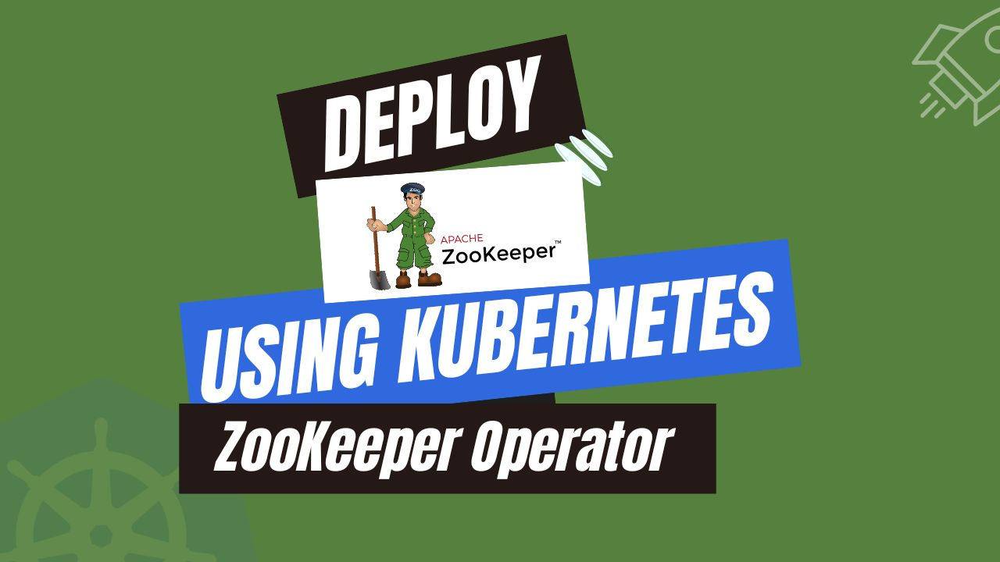

# Deploy ZooKeeper using Kubernetes ZooKeeper Operator



Kubernetes has revolutionized the landscape of containerized applications, simplifying the complexities associated with managing them. At its core, Kubernetes empowers users to effortlessly deploy, scale, and manage applications – regardless of whether they reside on a single machine or spread across a multi-cloud environment.

Kubernetes streamlines and automates critical tasks such as load balancing, real-time demand-based scaling, and guaranteeing application resilience through self-healing mechanisms. Through a user-friendly, declarative configuration approach, users specify their desired application configuration, and Kubernetes handles the execution. This frees developers to focus on developing exceptional applications while Kubernetes ensures they run smoothly and efficiently. In essence, Kubernetes equips users to effortlessly navigate the challenges of modern application deployment.

The **Kubernetes ZooKeeper Operator**, extends the Kubernetes API through a custom resource definition (CRD) tailored for ZooKeeper. By leveraging the Operator, you can effortlessly deploy, manage, and scale ZooKeeper instances within your Kubernetes ecosystem. This guide dives into the advantages, functionalities, and steps involved in deploying ZooKeeper using the Kubernetes ZooKeeper Operator. By adopting this approach, you can achieve a dynamic and efficient strategy for deploying and managing ZooKeeper on Kubernetes.

## Advantage of ZooKeeper in Kubernetes

ZooKeeper, a cornerstone of distributed systems, excels at providing a centralized service for coordinating and managing distributed applications. It offers a robust and scalable solution for crucial tasks like distributed locking, leader election, service discovery, and configuration management.

As a distributed service, it thrives in Kubernetes environments. Inherent scalability of Kubernetes perfectly complements ZooKeeper's ability to handle growing workloads. This integration simplifies management by providing a centralized platform to deploy, manage, and monitor ZooKeeper alongside your containerized applications.

Integrating ZooKeeper with Kubernetes offers several benefits. The Kubernetes ZooKeeper Operator streamlines deployment and configuration. This means you can ignore manual processes and manage ZooKeeper instances centrally within Kubernetes. Kubernetes inherently scales applications based on demand, and this seamlessly extends to ZooKeeper, ensuring it can handle growing workloads. Additionally, leveraging Kubernetes self-healing capabilities makes ZooKeeper deployments more resilient. In the event of an instance failure, Kubernetes automatically restarts the ZooKeeper pod, minimizing disruption to your distributed systems. The integration also aligns perfectly with DevOps principles by facilitating smoother development and testing workflows. Deploying and managing ZooKeeper alongside your containerized applications becomes a unified process within the Kubernetes ecosystem. By combining Kubernetes ZooKeeper together, you gain a powerful and dynamic solution for managing distributed systems within modern containerized environments.

## Deploy ZooKeeper on Kubernetes

### Pre-requisites

Before deploying ZooKeeper on Kubernetes using, ensure you have a functional Kubernetes cluster and a basic understanding of ZooKeeper. Here, we'll assume you've already set up your cluster. Here we are using [Kind](https://kubernetes.io/docs/tasks/tools/#kind) to set up our Kubernetes cluster. Additionally, you'll need [Helm](https://helm.sh/docs/intro/install/) installed on your Kubernetes cluster.

In this tutorial, We will use the [Kubernetes ZooKeeper operator](https://kubedb.com/kubernetes/databases/run-and-manage-zookeeper-on-kubernetes/) KubeDB to deploy ZooKeeper on Kubernetes. First, we need to install [KubeDB](https://kubedb.com/) on our Kubernetes cluster, which requires a license. You can obtain a free license from the [Appscode License Server](https://appscode.com/issue-license/). To get a license, use your Kubernetes cluster ID. Run the following command to retrieve your cluster ID.

```bash
$ kubectl get ns kube-system -o jsonpath='{.metadata.uid}'
de1c6058-fa66-4d22-a7ae-d17e221c1533
```

The license server will email us with a "license.txt" file attached after we provide the necessary data. Run the following commands listed below to install KubeDB.

```bash
$ helm install kubedb oci://ghcr.io/appscode-charts/kubedb \
  --version v2024.6.4 \
  --namespace kubedb --create-namespace \
  --set-file global.license=/path/to/the/license.txt \
  --set global.featureGates.ZooKeeper=true \
  --wait --burst-limit=10000 --debug
```

Verify the installation by the following command,

```bash
$ kubectl get pods --all-namespaces -l "app.kubernetes.io/instance=kubedb"
NAMESPACE   NAME                                            READY   STATUS    RESTARTS   AGE
kubedb      kubedb-kubedb-autoscaler-fbf8b5b9d-b5n5l        1/1     Running   0          5m12s
kubedb      kubedb-kubedb-ops-manager-7c647868b9-wf58f      1/1     Running   0          5m12s
kubedb      kubedb-kubedb-provisioner-f4569f959-krjft       1/1     Running   0          5m12s
kubedb      kubedb-kubedb-webhook-server-7787b4c494-6qktv   1/1     Running   0          5m12s
kubedb      kubedb-petset-operator-54877fd499-kngl8         1/1     Running   0          5m12s
kubedb      kubedb-petset-webhook-server-54c9ccbf89-t8mt8   2/2     Running   0          5m12s
kubedb      kubedb-sidekick-5d9947bd9-q2gkx                 1/1     Running   0          5m12s
```

We can go on to the next stage if every pod status is running.

## Create a Namespace

Now we'll create a new namespace in which we will deploy ZooKeeper. To create a namespace, we can use the following command:

```bash
$ kubectl create namespace demo
namespace/demo created
```

## Deploy ZooKeeper using Kubernetes ZooKeeper operator

We need to create a yaml manifest to deploy ZooKeeper on Kubernetes. And we will apply this yaml below,

```yaml
apiVersion: kubedb.com/v1alpha2
kind: ZooKeeper
metadata:
  name: zookeeper
  namespace: demo
spec:
  version: "3.9.1"
  adminServerPort: 8080
  replicas: 3
  storage:
    resources:
      requests:
        storage: "1Gi"
    storageClassName: "standard"
    accessModes:
      - ReadWriteOnce
  deletionPolicy: "WipeOut"
```

You can see the detailed yaml specifications in the [Kubernetes RabbitMQ documentation](https://kubedb.com/docs/latest/guides/zookeeper/).

Let's save this yaml configuration into `zookeeper.yaml`
Then create the above ZooKeeper CRO,

```bash
$ kubectl apply -f zookeeper.yaml
zookeeper.kubedb.com/zookeeper created
```

Once these are handled correctly and the ZooKeeper object is deployed, you will see that the following objects are created:

```bash
$ kubectl get all -n demo
NAME              READY   STATUS    RESTARTS   AGE
pod/zookeeper-0   1/1     Running   0          3m28s
pod/zookeeper-1   1/1     Running   0          86s
pod/zookeeper-2   1/1     Running   0          78s

NAME                             TYPE        CLUSTER-IP     EXTERNAL-IP   PORT(S)                      AGE
service/zookeeper                ClusterIP   10.96.106.95   <none>        2181/TCP                     3m36s
service/zookeeper-admin-server   ClusterIP   10.96.58.77    <none>        8080/TCP                     3m36s
service/zookeeper-pods           ClusterIP   None           <none>        2181/TCP,2888/TCP,3888/TCP   3m36s

NAME                                           TYPE                   VERSION   AGE
appbinding.appcatalog.appscode.com/zookeeper   kubedb.com/zookeeper   3.9.1     3m36s
```

We have successfully deployed ZooKeeper to Kubernetes using the Kubernetes ZooKeeper operator. Now, we will exec into the ZooKeeper pod to create some sample node and verify whether our ZooKeeper is usable or not. Before connect to the ZooKeeper pod let’s check if the ZooKeeper is ready to use,

```bash
$ kubectl get zookeeper -n demo zookeeper
NAME        TYPE                  VERSION   STATUS   AGE
zookeeper   kubedb.com/v1alpha2   3.9.1     Ready    4m37s
```

### Create Sample Node

In this section, we are going to exec into our ZooKeeper pod and create a sample node.

```bash
$ kubectl exec -it -n demo zookeeper-0 -- sh

$ echo ruok | nc localhost 2181
imok

$ zkCli.sh create /product kubedb
Connecting to localhost:2181
...
Connection Log Messeges
...
Created /product

$ zkCli.sh get /product
Connecting to localhost:2181
...
Connection Log Messeges
...
kubedb
```

> We’ve successfully deployed ZooKeeper to Kubernetes using the Kubernetes ZooKeeper operator KubeDB. Also, we successfully accessed ZooKeeper and created a sample ZooKeeper node.

## ZooKeeper on Kubernetes: Best Practices

To guarantee the smooth operation of your ZooKeeper applications within Kubernetes, consider implementing these best practices:

- **Configuration Management:** Leverage Kubernetes ConfigMaps to store ZooKeeper configuration files for easier management and updates. Utilize Secrets for secure handling of sensitive information like ZooKeeper server credentials. Implement dynamic configuration reloading to apply changes without downtime, maintaining continuous availability.

- **Resource Management:** Unlike applications with varying resource demands, ZooKeeper tends to have a more predictable resource footprint. Analyze your ZooKeeper workload to determine appropriate CPU and memory requests and limits for its pods. This ensures ZooKeeper receives sufficient resources without overprovisioning that could waste cluster resources.

- **Networking & Security:** Use Kubernetes Services to expose ZooKeeper to other pods in the environment. Use ClusterIP services for internal communication within the cluster. For external access, utilize NodePort or LoadBalancer services with appropriate security controls. Implement Network Policies to restrict traffic flow and ensure only authorized pods can communicate with ZooKeeper, enhancing security. Leverage Role-Based Access Control (RBAC) to restrict access to ZooKeeper resources and Pod Security Policies to enforce security standards like running containers as non-root users and preventing privileged escalation. Secure communication between ZooKeeper instances and other components by enabling TLS encryption. This protects data in transit within the cluster.

- **Utilizing the Kubernetes ZooKeeper Operator:** Consider using the Kubernetes ZooKeeper Operator for simplified deployment and management. The operator automates administrative tasks and simplifies configuration and scaling. This allows for easier deployment and management of ZooKeeper instances, optimizing performance and reducing manual workload for administrators.

## Conclusion

In conclusion, ZooKeeper has emerged as a powerful tool for coordinating and managing distributed applications within Kubernetes environments. Its core functionalities, including distributed locking, leader election, service discovery, and configuration management, provide a robust foundation for building resilient and scalable distributed systems. This guide has equipped you with the knowledge to deploy ZooKeeper on Kubernetes, leveraging the benefits of the Kubernetes ZooKeeper Operator for simplified management. For a deeper dive into implementing ZooKeeper with Kubernetes, the official [ZooKeeper documentation](https://zookeeper.apache.org/documentation.html) offers comprehensive resources. Remember, achieving optimal performance and reliability within your distributed system requires ongoing optimization and a strong understanding of ZooKeeper best practices. Additionally, expertise from managed Kubernetes service providers like KubeDB can be valuable in ensuring your ZooKeeper deployment maintains high availability and performance.
