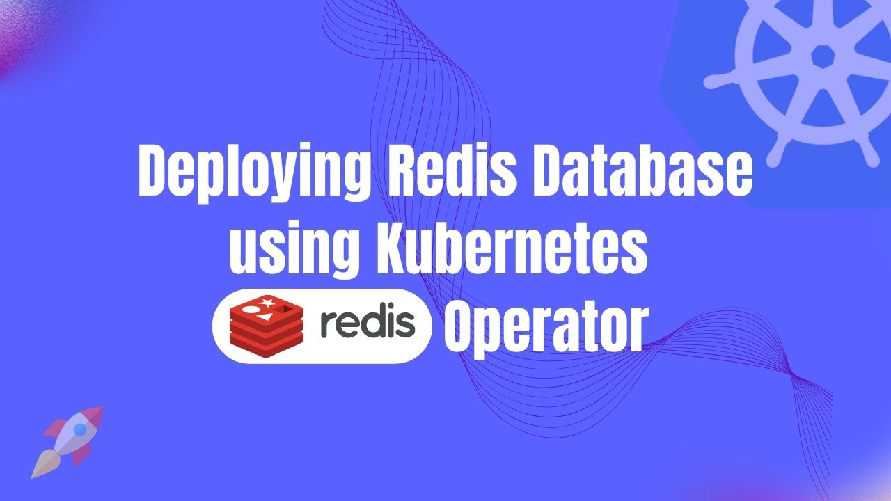

# Deploying Redis Database using Kubernetes Redis Operator



In today's world of containerized applications and orchestration, the successful deployment and maintenance of databases, such as Redis, require a flexible and efficient approach. **Kubernetes Redis Operator** —a tool that streamlines the intricate tasks of configuring, managing, and scaling Redis databases within the Kubernetes environment.

Within this article, we will dive deep into the realm of Redis database setup, leveraging the power of the Kubernetes Redis Operator. We'll explore its array of benefits, distinctive features, and provide you with a comprehensive, go to guide. With this solution, you'll empower yourself with enhanced flexibility and automation for provisioning and administering your Redis databases, all while embracing the containerized infrastructure's best practices.

## Why Redis in Kubernetes
Kubernetes, an open-source platform for container orchestration, often abbreviated as K8s—simplifies the deployment, scaling, and management of containerized applications. It provides a standardized way to automate the deployment of containers, manage their lifecycle, and ensure their availability and reliability. Kubernetes has become the go-to choice for organizations looking to build scalable, resilient, and efficient cloud-native applications.

Redis, on the other hand, is a blazing-fast, open-source, in-memory data store that serves as a versatile tool for a wide range of use cases. It's not just a cache, it's a highly efficient data structure store, message broker, and task queue manager rolled into one. Redis is celebrated for its sub-millisecond response times, making it an ideal choice for applications that require lightning-fast data access.

Integration of Kubernetes Redis brings a wealth of benefits to the table. First and foremost, Redis's lightning-fast, in-memory data access ensures rapid retrieval of critical data, effectively reducing latency and enhancing overall performance. Furthermore, Kubernetes excels in scaling containerized workloads, making it effortless to expand your Redis clusters as your application's data load grows. The resilience provided by Kubernetes guarantees that your Redis instances remain operational, even in the face of hardware or software failures, ensuring robust and fault-tolerant data storage. 

Dynamic resource allocation in Kubernetes optimizes resource usage, enhancing cost-effectiveness. Management becomes a breeze as Kubernetes automates tasks like deployment, scaling, and failover, and seamlessly integrates with monitoring tools for real-time insights into your Redis clusters' health. With Kubernetes ensuring consistency and reproducibility, Redis becomes a pivotal component for caching, session management, and real-time data processing within your microservices architecture. In an era of cloud-native adoption, Kubernetes Redis emerges as the strategic choice for those who demand both top-tier performance and scalable applications.

## Deploy Redis on Kubernetes
### Pre-requisites
We have to configure the environment to deploy Redis on Kubernetes using a Kubernetes Redis operator. This tutorial requires you to have a functional Kubernetes cluster in place and a basic grasp of Redis concepts. Here, we are going to create our kubernetes cluster using [Kind](https://kubernetes.io/docs/tasks/tools/#kind). Also, you’ll require to install [Helm](https://helm.sh/docs/intro/install/) to your Kubernetes cluster.

In this article, We will use the Kubernetes Redis operator [KubeDB](https://kubedb.com/) to deploy Redis on Kubernetes. But before we start, you need to make sure you have KubeDB already installed in your Kubernetes setup. To use KubeDB, you'll also need a license, which you can get for free from the [Appscode License Server](https://license-issuer.appscode.com/). To get this license, you'll need the Kubernetes cluster ID. You can find this ID by running the command we'll provide below.

 
```bash
$ kubectl get ns kube-system -o jsonpath='{.metadata.uid}'
e5b4a1a0-5a67-4657-b390-db7200108bae
```

The license server will email us with a "license.txt" file attached after we provide the necessary data. To install KubeDB, run the following commands,

```bash
$ helm install kubedb oci://ghcr.io/appscode-charts/kubedb \
  --version v2023.12.11 \
  --namespace kubedb --create-namespace \
  --set-file global.license=/path/to/the/license.txt \
  --wait --burst-limit=10000 --debug
```


Verify the installation by the following command,

```bash
$ kubectl get pods --all-namespaces -l "app.kubernetes.io/instance=kubedb"
NAMESPACE   NAME                                            READY   STATUS    RESTARTS   AGE
kubedb      kubedb-kubedb-autoscaler-5fcbf8f78-hslcv        1/1     Running   0          3m3s
kubedb      kubedb-kubedb-dashboard-6d8dc7bffc-nwgrw        1/1     Running   0          3m3s
kubedb      kubedb-kubedb-ops-manager-fd5c796bc-w8llt       1/1     Running   0          3m3s
kubedb      kubedb-kubedb-provisioner-7fc4796bf9-l8kvc      1/1     Running   0          3m3s
kubedb      kubedb-kubedb-schema-manager-95bbcf7b6-t6fgb    1/1     Running   0          3m3s
kubedb      kubedb-kubedb-webhook-server-656788f5bc-2fs7d   1/1     Running   0          3m3s
``` 
We can go on to the next stage if every pod status is running.

### Create a Namespace
Now we'll create a new namespace in which we will deploy Redis. To create a namespace, we can use the following command:

```bash
$ kubectl create namespace redis-demo
namespace/redis-demo created
``` 

### Deploy Redis Database via Kubernetes Redis operator
We need to create a yaml configuration to deploy Redis database on Kubernetes. And we will apply this yaml below,

```yaml
apiVersion: kubedb.com/v1alpha2
kind: Redis
metadata:
  name: redis-cluster
  namespace: redis-demo
spec:
  version: 7.0.9
  mode: Cluster
  cluster:
    master: 3
    replicas: 1
  storageType: Durable
  storage:
    resources:
      requests:
        storage: "1Gi"
    storageClassName: "standard"
    accessModes:
      - ReadWriteOnce
  terminationPolicy: WipeOut
```

You can see the detailed yaml specifications in the [Kubernetes Redis](https://kubedb.com/docs/latest/guides/redis/) documentation.

We will save this yaml configuration to `redis-cluster.yaml`. Then create the above Redis object.

```bash
$ kubectl create -f redis-cluster.yaml
redis.kubedb.com/sample-redis created
```

If all the above steps are handled correctly and the Redis is deployed, you will see that the following objects are created:


```bash
$ kubectl get all -n redis-demo
NAME                         READY   STATUS    RESTARTS   AGE
pod/redis-cluster-shard0-0   1/1     Running   0          2m9s
pod/redis-cluster-shard0-1   1/1     Running   0          104s
pod/redis-cluster-shard1-0   1/1     Running   0          2m7s
pod/redis-cluster-shard1-1   1/1     Running   0          103s
pod/redis-cluster-shard2-0   1/1     Running   0          2m5s
pod/redis-cluster-shard2-1   1/1     Running   0          101s

NAME                         TYPE        CLUSTER-IP     EXTERNAL-IP   PORT(S)    AGE
service/redis-cluster        ClusterIP   10.96.157.40   <none>        6379/TCP   2m11s
service/redis-cluster-pods   ClusterIP   None           <none>        6379/TCP   2m11s

NAME                                    READY   AGE
statefulset.apps/redis-cluster-shard0   2/2     2m9s
statefulset.apps/redis-cluster-shard1   2/2     2m7s
statefulset.apps/redis-cluster-shard2   2/2     2m5s

NAME                                               TYPE               VERSION   AGE
appbinding.appcatalog.appscode.com/redis-cluster   kubedb.com/redis   7.0.9     2m5s

NAME                             VERSION   STATUS   AGE
redis.kubedb.com/redis-cluster   7.0.9     Ready    2m12s
```

We have successfully deployed Redis to Kubernetes via the Kubernetes Redis operator. Now, we will connect to the Redis database to insert some sample data and verify whether our Redis database is usable or not. First, check the database status,

```bash
$ kubectl get redis -n redis-demo
NAME            VERSION   STATUS   AGE
redis-cluster   7.0.9     Ready    2m30s
```

Here, we should have to obtain necessary credentials in order to connect to the database. Let’s export the credentials as environment variable to our current shell. KubeDB will create Secret and Service for the database `redis-cluster` that we have deployed. Let’s check them,

```bash
$ kubectl get secret -n redis-demo -l=app.kubernetes.io/instance=redis-cluster
NAME                   TYPE                       DATA   AGE
redis-cluster-auth     kubernetes.io/basic-auth   2      3m5s
redis-cluster-config   Opaque                     1      3m5s

$ kubectl get service -n redis-demo -l=app.kubernetes.io/instance=redis-cluster
NAME                 TYPE        CLUSTER-IP     EXTERNAL-IP   PORT(S)    AGE
redis-cluster        ClusterIP   10.96.157.40   <none>        6379/TCP   3m31s
redis-cluster-pods   ClusterIP   None           <none>        6379/TCP   3m31s
```
Now, we are going to use `PASSWORD` to authenticate and insert some sample data. At first, let’s export the `PASSWORD` as environment variables to make further commands re-usable.

```bash
$ export PASSWORD=$(kubectl get secrets -n redis-demo redis-cluster-auth -o jsonpath='{.data.\password}' | base64 -d)
``` 
### Insert sample data to the Redis database
In this section, we are going to login into our Redis database pod and insert some sample data.

```bash
$ kubectl exec -it -n redis-demo redis-cluster-shard0-0 -- redis-cli -c -a $PASSWORD
Defaulted container "redis" out of: redis, redis-init (init)

127.0.0.1:6379> set Product1 KubeDB
-> Redirected to slot [15299] located at 10.244.0.16:6379
OK

10.244.0.16:6379> set Product2 Stash
-> Redirected to slot [2976] located at 10.244.0.14:6379

OK
10.244.0.14:6379> get Product1
-> Redirected to slot [15299] located at 10.244.0.16:6379
"KubeDB"

10.244.0.16:6379> get Product2
-> Redirected to slot [2976] located at 10.244.0.14:6379
"Stash"
10.244.0.14:6379> exit
```
We’ve successfully Deploy Redis to Kubernetes via **Kubernetes Redis operator** KubeDB and insert some sample data into it.

## Redis on Kubernetes: Best Practices
When deploying Redis on Kubernetes, following best practices is essential to ensure the stability and reliability of your application. Here are some key best practices for optimizing your Redis deployment within a Kubernetes environment:

* **Version Compatibility:** Ensure that the version of Redis you choose is compatible with the version of Kubernetes you're running. Compatibility issues can lead to unexpected behavior, so thorough testing and planning are crucial. Rolling upgrades are often recommended to minimize disruptions during version upgrades.

* **High Availability with Redis Sentinel:** Implement Redis Sentinel for high availability. Redis Sentinel is a built-in Redis feature that monitors Redis instances and provides automatic failover in case of node failures. Deploy Redis Sentinel alongside your Redis instances to enhance fault tolerance.

* **Monitoring and Health Checks:** Set up comprehensive monitoring and health checks for your Redis pods. Kubernetes offers powerful monitoring capabilities, and Redis provides valuable performance metrics. By collecting and analyzing these metrics, you can proactively identify and address performance bottlenecks or issues, ensuring optimal Redis performance.

* **Disaster Recovery Strategies:** Develop robust disaster recovery strategies for Redis. Consider procedures for recovering from data corruption, pod failures, and potential cluster-wide outages. Having well-defined disaster recovery plans in place minimizes downtime and ensures data integrity, even in challenging situations.

## Conclusion
Redis is a robust, open-source in-memory data store celebrated for its exceptional performance and versatility in handling real-time data needs. You have now successfully deployed a Redis database on Kubernetes, leveraging the capabilities of Kubernetes Redis to meet various use cases efficiently. For further insights and details, refer to the official [Redis documentation](https://redis.io/docs/). Effective database management, whether on-premises or in the cloud, demands expertise and consistent practices. KubeDB offers a comprehensive range of support solutions, ensuring that your database management consistently meets the most rigorous standards for performance and uninterrupted operation. Whether your database infrastructure is hosted locally, spans multiple geographic regions, or is built upon cloud-based services or database-as-a-service providers, KubeDB streamlines and enhances the entire process within a production-grade context.
