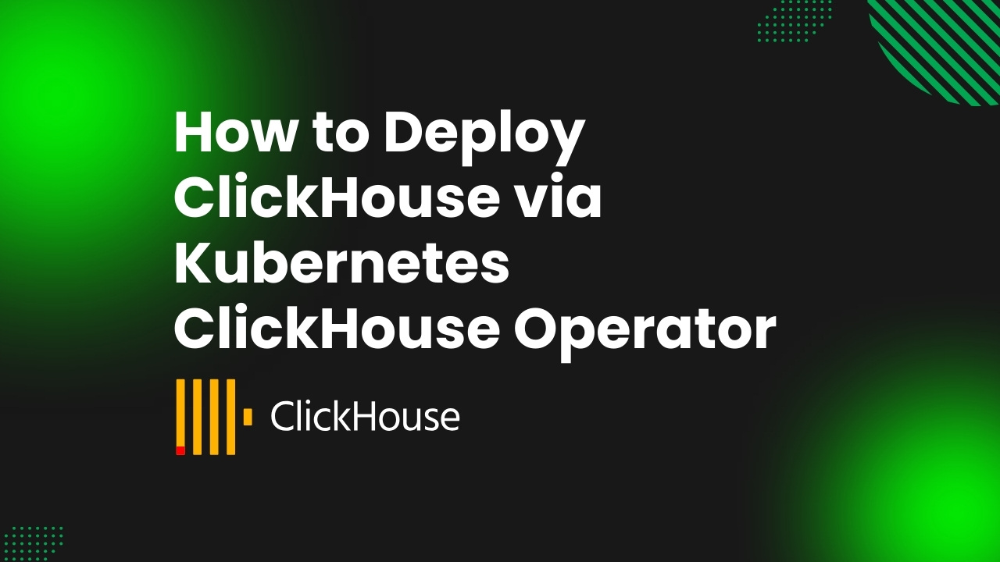

# How to Deploy ClickHouse via Kubernetes ClickHouse Operator



In today's data-driven world, high-performance and scalable databases are crucial for businesses to gain insights and drive innovation. ClickHouse, a column-oriented SQL database, is purpose-built for analytical processing and excels at managing large-scale, complex workloads with exceptional speed and efficiency. Kubernetes ClickHouse Operator enhances ClickHouse's capabilities, providing a powerful combination for building and scaling robust, data-driven applications with ease.

Kubernetes has transformed the way modern applications and services are deployed and managed. Its orchestration capabilities enable seamless scaling, rolling updates, and centralized monitoring, making it an ideal platform for running distributed databases like ClickHouse.

To simplify the deployment and operation of ClickHouse on Kubernetes, the ClickHouse Operator for Kubernetes serves as a game-changer. This operator extends Kubernetes functionality, enabling declarative management of ClickHouse clusters. It automates provisioning, configuration, scaling, and maintenance, reducing operational complexity and improving reliability.

In this article, we’ll explore the process of deploying ClickHouse using the Kubernetes ClickHouse Operator, highlighting its benefits and providing step-by-step instructions to help you optimize your database infrastructure.
## Why ClickHouse in Kubernetes
Deploying ClickHouse in Kubernetes combines high-performance analytics with the flexibility and scalability of container orchestration. Kubernetes simplifies horizontal scaling by enabling the addition of replicas or shards to handle growing workloads while efficiently managing resources like CPU, memory, and storage. It ensures high availability by automatically restarting failed pods and preserving data integrity with Persistent Volumes (PVs) and replication. Tools like the Kubernetes ClickHouse Operator streamline complex tasks such as provisioning, configuration, and scaling, while Kubernetes enables seamless rolling updates with minimal downtime. 

Additionally, Kubernetes provides consistent workflows for managing ClickHouse alongside other applications, optimizes resource utilization to reduce costs, and integrates seamlessly with monitoring tools like Prometheus and Grafana. This combination empowers organizations to deploy agile, resilient, and cost-efficient analytics platforms capable of meeting modern data demands.
## Deploy ClickHouse on Kubernetes
### Pre-requisites
To deploy ClickHouse on Kubernetes using the Kubernetes ClickHouse Operator, you need to prepare your environment thoroughly. Here’s a step-by-step guide:

Prepare a Kubernetes Cluster
* Start with a functional Kubernetes cluster. This guide uses [Kind](https://kubernetes.io/docs/tasks/tools/#kind) to create the cluster, but any Kubernetes distribution will work. A basic understanding of ClickHouse is recommended to navigate the deployment process effectively.

* Install Helm
  Helm must be installed on your Kubernetes cluster, as it is essential for managing Kubernetes packages and dependencies.

* Install KubeDB
  This guide utilizes the Kubernetes ClickHouse Operator provided by KubeDB. Install [KubeDB](https://kubedb.com/) in your Kubernetes environment. Note that KubeDB requires a valid license, which you can obtain for free.

* Obtain a License for KubeDB
  You’ll need a license to use KubeDB. Obtain it from the [Appscode License Server](https://appscode.com/issue-license/). Use your Kubernetes cluster ID to request the license.

Run the following command in your Kubernetes environment to retrieve your cluster ID, which is required to generate the license:

```bash
$ kubectl get ns kube-system -o jsonpath='{.metadata.uid}'
250a26e3-2413-4ed2-99dc-57b0548407ff
```

The license server will email us with a "license.txt" file attached after we provide the necessary data. Run the following commands listed below to install KubeDB.

```bash
$ helm install kubedb oci://ghcr.io/appscode-charts/kubedb \
  --version v2024.11.18 \
  --namespace kubedb --create-namespace \
  --set-file global.license=/path/to/the/license.txt \
  --set global.featureGates.ClickHouse=true \
  --wait --burst-limit=10000 --debug
```

Verify the installation by the following command,

```bash
$ kubectl get pods --all-namespaces -l "app.kubernetes.io/instance=kubedb"
NAMESPACE   NAME                                            READY   STATUS    RESTARTS      AGE
kubedb      kubedb-kubedb-autoscaler-849f7b8d8-26xdx        1/1     Running   0             67s
kubedb      kubedb-kubedb-ops-manager-9f46c95b6-ffd6x       1/1     Running   0             67s
kubedb      kubedb-kubedb-provisioner-7cd66fc98c-cf8mm      1/1     Running   0             67s
kubedb      kubedb-kubedb-webhook-server-78f9bc4c6f-fsgx2   1/1     Running   0             67s
kubedb      kubedb-petset-operator-77b6b9897f-px2l2         1/1     Running   0             67s
kubedb      kubedb-petset-webhook-server-58df6f6488-lhtvl   2/2     Running   0             67s
kubedb      kubedb-sidekick-c898cff4c-w22l8                 1/1     Running   0             67s
``` 
We can go on to the next stage if every pod status is running.


### Create Namespace
First, we need to create a namespace for our ClickHouse deployment. Open your terminal and run the following command:

```bash
$ kubectl create namespace demo
namespace/demo created
```
## Deploy ClickHouse using Kubernetes ClickHouse Operator

Here is the yaml of the ClickHouse CR we are going to use:

```yaml
apiVersion: kubedb.com/v1alpha2
kind: ClickHouse
metadata:
  name: ch
  namespace: demo
spec:
  version: 24.4.1
  clusterTopology:
    clickHouseKeeper:
      externallyManaged: false
      spec:
        replicas: 3
        storage:
          accessModes:
            - ReadWriteOnce
          resources:
            requests:
              storage: 1Gi
    cluster:
      - name: appscode-cluster
        shards: 2
        replicas: 2
        podTemplate:
          spec:
            containers:
              - name: clickhouse
                resources:
                  limits:
                    memory: 4Gi
                  requests:
                    cpu: 500m
                    memory: 2Gi
            initContainers:
              - name: clickhouse-init
                resources:
                  limits:
                    memory: 1Gi
                  requests:
                    cpu: 500m
                    memory: 1Gi
        storage:
          accessModes:
            - ReadWriteOnce
          resources:
            requests:
              storage: 1Gi
  deletionPolicy: WipeOut
```

Let's save this yaml configuration into `clickhouse-cluster.yaml`
Then create the above ClickHouse CR,

```bash
$ kubectl apply -f clickhouse-cluster.yaml
clickhouse.kubedb.com/ch created
```

Once the ClickHouse cluster is successfully deployed and configured, the following Kubernetes objects are typically created.

```bash
$ kubectl get all -n demo
NAME                                READY   STATUS    RESTARTS   AGE
pod/ch-appscode-cluster-shard-0-0   1/1     Running   0          5m49s
pod/ch-appscode-cluster-shard-0-1   1/1     Running   0          4m16s
pod/ch-appscode-cluster-shard-1-0   1/1     Running   0          5m46s
pod/ch-appscode-cluster-shard-1-1   1/1     Running   0          4m16s
pod/ch-keeper-0                     1/1     Running   0          5m54s
pod/ch-keeper-1                     1/1     Running   0          5m13s
pod/ch-keeper-2                     1/1     Running   0          4m29s

NAME                                       TYPE        CLUSTER-IP      EXTERNAL-IP   PORT(S)             AGE
service/ch                                 ClusterIP   10.43.209.110   <none>        9000/TCP,8123/TCP   5m57s
service/ch-appscode-cluster-shard-0-pods   ClusterIP   None            <none>        9000/TCP,8123/TCP   5m51s
service/ch-appscode-cluster-shard-1-pods   ClusterIP   None            <none>        9000/TCP,8123/TCP   5m49s
service/ch-keeper                          ClusterIP   10.43.202.197   <none>        9181/TCP            5m57s
service/ch-keeper-pods                     ClusterIP   None            <none>        9234/TCP            5m57s

NAME                                                     TYPE      VERSION   AGE
appbinding.appcatalog.appscode.com/ch   kubedb.com/clickhouse      24.4.1    5m46s

```
To check the status of the `ch` ClickHouse instance after deploying it using the Kubernetes ClickHouse Operator, follow these steps:
```bash
$ kubectl get clickhouse -n demo ch
NAME                       TYPE                  VERSION   STATUS   AGE
clickhouse.kubedb.com/ch   kubedb.com/v1alpha2   24.4.1    Ready    5m58s

```

### Accessing Database Through CLI

To access the ClickHouse database through the command-line interface (CLI), you'll first need to retrieve the credentials (usually stored as Kubernetes secrets) and the service to connect to the ClickHouse instance. KubeDB, which manages ClickHouse deployments, will automatically create a Secret and Service for the database.


```bash
$ kubectl get secret -n demo -l=app.kubernetes.io/instance=ch
NAME               TYPE                       DATA   AGE
ch-auth            kubernetes.io/basic-auth   2      16h
ch-config          Opaque                     3      16h
ch-keeper-config   Opaque                     1      16h

$ kubectl get service -n demo -l=app.kubernetes.io/instance=ch
NAME                               TYPE        CLUSTER-IP      EXTERNAL-IP   PORT(S)             AGE
ch                                 ClusterIP   10.43.209.110   <none>        9000/TCP,8123/TCP   16h
ch-appscode-cluster-shard-0-pods   ClusterIP   None            <none>        9000/TCP,8123/TCP   16h
ch-appscode-cluster-shard-1-pods   ClusterIP   None            <none>        9000/TCP,8123/TCP   16h
ch-keeper                          ClusterIP   10.43.202.197   <none>        9181/TCP            16h
ch-keeper-pods                     ClusterIP   None            <none>        9234/TCP            16h

```

Now, we are going to use `ch-auth ` to get the credentials.

```bash
$ kubectl view-secret -n demo ch-auth -a
password='tK38G7XT9sQRQkc9'
username='admin'
```

#### Insert Sample Data

To log into the ClickHouse database pod and insert sample data, follow these steps:

```bash
$  kubectl exec -it -n demo pod/ch-appscode-cluster-shard-0-0 -- bash
Defaulted container "clickhouse" out of: clickhouse, clickhouse-init (init)
clickhouse@ch-appscode-cluster-shard-0-0:/$ clickhouse-client -uadmin --password="tK38G7XT9sQRQkc9"

ClickHouse client version 24.4.1.2088 (official build).
Connecting to localhost:9000 as user admin.
Connected to ClickHouse server version 24.4.1.

Warnings:
 * Delay accounting is not enabled, OSIOWaitMicroseconds will not be gathered. You can enable it using `echo 1 > /proc/sys/kernel/task_delayacct` or by using sysctl.
 * Available disk space for data at server startup is too low (1GiB): /var/lib/clickhouse/
 * Effective user of the process (clickhouse) does not match the owner of the data (root).

ch-appscode-cluster-shard-0-0.ch-appscode-cluster-shard-0-pods.demo.svc.cluster.local :) show databases

SHOW DATABASES

Query id: 1c49ae77-f9cf-4bd4-88eb-ce7c1d5598f2

SHOW DATABASES

Query id: 1c49ae77-f9cf-4bd4-88eb-ce7c1d5598f2

   ┌─name───────────────┐
1. │ INFORMATION_SCHEMA │
2. │ default            │
3. │ information_schema │
4. │ kubedb_system      │
5. │ system             │
   └────────────────────┘

5 rows in set. Elapsed: 0.001 sec.

ch-appscode-cluster-shard-0-0.ch-appscode-cluster-shard-0-pods.demo.svc.cluster.local :) select * from system.macros;

SELECT *
FROM system.macros

Query id: 0a566335-2a54-4adb-be09-0faa9e04c2cf

   ┌─macro────────┬─substitution─────┐
1. │ cluster      │ appscode-cluster │
2. │ installation │ ch               │
3. │ replica      │ 1                │
4. │ shard        │ 1                │
   └──────────────┴──────────────────┘

4 rows in set. Elapsed: 0.001 sec.

ch-appscode-cluster-shard-0-0.ch-appscode-cluster-shard-0-pods.demo.svc.cluster.local :) CREATE TABLE events_local on cluster '{cluster}' (
    event_date  Date,
    event_type  Int32,
    article_id  Int32,
    title       String
) engine=ReplicatedMergeTree('/clickhouse/{installation}/{cluster}/tables/{shard}/{database}/{table}', '{replica}')
PARTITION BY toYYYYMM(event_date)
ORDER BY (event_type, article_id);

Query id: 951e93c7-89ec-4948-9e63-bc8178f02257

   ┌─host───────────────────────────────────────────────────────────┬─port─┬─status─┬─error─┬─num_hosts_remaining─┬─num_hosts_active─┐
1. │ ch-appscode-cluster-shard-1-0.ch-appscode-cluster-shard-1-pods │ 9000 │      0 │       │                   3 │                2 │
2. │ ch-appscode-cluster-shard-0-1.ch-appscode-cluster-shard-0-pods │ 9000 │      0 │       │                   2 │                2 │
   └────────────────────────────────────────────────────────────────┴──────┴────────┴───────┴─────────────────────┴──────────────────┘
   ┌─host───────────────────────────────────────────────────────────┬─port─┬─status─┬─error─┬─num_hosts_remaining─┬─num_hosts_active─┐
3. │ ch-appscode-cluster-shard-1-1.ch-appscode-cluster-shard-1-pods │ 9000 │      0 │       │                   1 │                1 │
   └────────────────────────────────────────────────────────────────┴──────┴────────┴───────┴─────────────────────┴──────────────────┘
   ┌─host───────────────────────────────────────────────────────────┬─port─┬─status─┬─error─┬─num_hosts_remaining─┬─num_hosts_active─┐
4. │ ch-appscode-cluster-shard-0-0.ch-appscode-cluster-shard-0-pods │ 9000 │      0 │       │                   0 │                0 │
   └────────────────────────────────────────────────────────────────┴──────┴────────┴───────┴─────────────────────┴──────────────────┘

4 rows in set. Elapsed: 1.128 sec.

ch-appscode-cluster-shard-0-0.ch-appscode-cluster-shard-0-pods.demo.svc.cluster.local :) CREATE TABLE events on cluster '{cluster}' AS events_local
ENGINE = Distributed('{cluster}', default, events_local, rand());

Query id: f7147a83-098f-4cdc-a6a0-a04694011b82

   ┌─host───────────────────────────────────────────────────────────┬─port─┬─status─┬─error─┬─num_hosts_remaining─┬─num_hosts_active─┐
1. │ ch-appscode-cluster-shard-1-0.ch-appscode-cluster-shard-1-pods │ 9000 │      0 │       │                   3 │                1 │
2. │ ch-appscode-cluster-shard-0-1.ch-appscode-cluster-shard-0-pods │ 9000 │      0 │       │                   2 │                1 │
3. │ ch-appscode-cluster-shard-1-1.ch-appscode-cluster-shard-1-pods │ 9000 │      0 │       │                   1 │                1 │
   └────────────────────────────────────────────────────────────────┴──────┴────────┴───────┴─────────────────────┴──────────────────┘
   ┌─host───────────────────────────────────────────────────────────┬─port─┬─status─┬─error─┬─num_hosts_remaining─┬─num_hosts_active─┐
4. │ ch-appscode-cluster-shard-0-0.ch-appscode-cluster-shard-0-pods │ 9000 │      0 │       │                   0 │                0 │
   └────────────────────────────────────────────────────────────────┴──────┴────────┴───────┴─────────────────────┴──────────────────┘

4 rows in set. Elapsed: 0.320 sec. 

ch-appscode-cluster-shard-0-0.ch-appscode-cluster-shard-0-pods.demo.svc.cluster.local :) INSERT INTO events SELECT today(), rand()%3, number, 'my title' FROM numbers(100);

Query id: 7d5647d9-b4bd-4d83-8921-554a45ce1c02

Ok.

0 rows in set. Elapsed: 0.057 sec.

ch-appscode-cluster-shard-0-0.ch-appscode-cluster-shard-0-pods.demo.svc.cluster.local :) SELECT count() FROM events_local;

Query id: 5b821cd0-5443-4f29-b17b-1f97ab1e82f8

   ┌─count()─┐
1. │      54 │
   └─────────┘

1 row in set. Elapsed: 0.001 sec.

ch-appscode-cluster-shard-0-0.ch-appscode-cluster-shard-0-pods.demo.svc.cluster.local :) SELECT count() FROM events;

Query id: 1ccf8fe8-1f02-43c0-a304-ac554236f869

   ┌─count()─┐
1. │     100 │
   └─────────┘

1 row in set. Elapsed: 0.013 sec.

ch-appscode-cluster-shard-0-0.ch-appscode-cluster-shard-0-pods.demo.svc.cluster.local :) exit
Bye.

Now, lets connect a different sharded replica and check the data

$ kubectl exec -it -n demo pod/ch-appscode-cluster-shard-1-1 -- bash
Defaulted container "clickhouse" out of: clickhouse, clickhouse-init (init)
clickhouse@ch-appscode-cluster-shard-1-1:/$ clickhouse-client -uadmin --password="tK38G7XT9sQRQkc9"
ClickHouse client version 24.4.1.2088 (official build).
Connecting to localhost:9000 as user admin.
Connected to ClickHouse server version 24.4.1.

Warnings:
 * Delay accounting is not enabled, OSIOWaitMicroseconds will not be gathered. You can enable it using `echo 1 > /proc/sys/kernel/task_delayacct` or by using sysctl.
 * Available disk space for data at server startup is too low (1GiB): /var/lib/clickhouse/
 * Effective user of the process (clickhouse) does not match the owner of the data (root).

ch-appscode-cluster-shard-1-1.ch-appscode-cluster-shard-1-pods.demo.svc.cluster.local :) SELECT count() FROM events_local;
Query id: 014af139-497c-4028-b420-18e2a9fc43ab

   ┌─count()─┐
1. │      46 │
   └─────────┘

1 row in set. Elapsed: 0.002 sec.

ch-appscode-cluster-shard-1-1.ch-appscode-cluster-shard-1-pods.demo.svc.cluster.local :) SELECT count() FROM events;

Query id: e4f26f0c-9e27-401c-950a-9bf33ed2018c

   ┌─count()─┐
1. │     100 │
   └─────────┘

1 row in set. Elapsed: 0.003 sec.

ch-appscode-cluster-shard-1-1.ch-appscode-cluster-shard-1-pods.demo.svc.cluster.local :) exit
Bye.

```

> Great job! You’ve successfully deployed ClickHouse on Kubernetes using the ClickHouse Kubernetes Operator (KubeDB) and inserted sample data into a sharded cluster

## ClickHouse on Kubernetes: Best Practices
To ensure your ClickHouse applications run efficiently on Kubernetes, follow these best practices:

* **Optimize Resource Usage**
  Allocate CPU, memory, and storage thoughtfully based on the specific needs of your workloads. Proper resource management helps balance performance with cost efficiency while avoiding under- or over-provisioning.

* **Achieve High Availability**
  Maintain uninterrupted ClickHouse operations by employing high availability techniques. Utilize replicated tables to ensure data redundancy and distributed tables for effective load distribution. Leverage Kubernetes StatefulSets and persistent volumes to prevent data loss and handle node failures. Additionally, establish robust backup and recovery mechanisms to safeguard your system.

* **Strengthen Security**
  Enhance the security of your ClickHouse setup with strong protective measures. Use network segmentation, encryption, and role-based access controls to secure data integrity, confidentiality, and availability. Adhere to relevant industry compliance standards to meet regulatory requirements.

* **Implement Monitoring and Observability**
  Monitor key metrics to gain a clear understanding of your ClickHouse environment's performance and health. Use these insights to identify and resolve bottlenecks, optimize query performance, and maintain system reliability. Set up alerts to quickly address potential issues before they escalate.

* **Utilize the Kubernetes ClickHouse Operator**
  Simplify the management of ClickHouse clusters on Kubernetes with the ClickHouse Operator. This tool automates tasks like deployment, scaling, and configuration, reducing administrative complexity. Its declarative management approach ensures easy configuration and scaling. Moreover, it provides detailed insights into cluster health and performance, streamlining troubleshooting and optimization efforts.

## Conclusion

ClickHouse, known for its high-performance capabilities in managing real-time data analytical processing at scale.
Its distributed architecture, combined with advanced features for query optimization and storage management, positions it as a leader in modern database technologies. When deployed on Kubernetes, ClickHouse reaches its full potential, benefiting from containerized scalability, resilience, and automation. By leveraging Kubernetes-native tools like the Kubernetes ClickHouse Operator, businesses can simplify cluster management while ensuring consistent performance and high availability. This synergy between ClickHouse and Kubernetes empowers teams to handle complex, data-driven workloads with confidence, paving the way for innovative insights and robust growth in the era of big data.