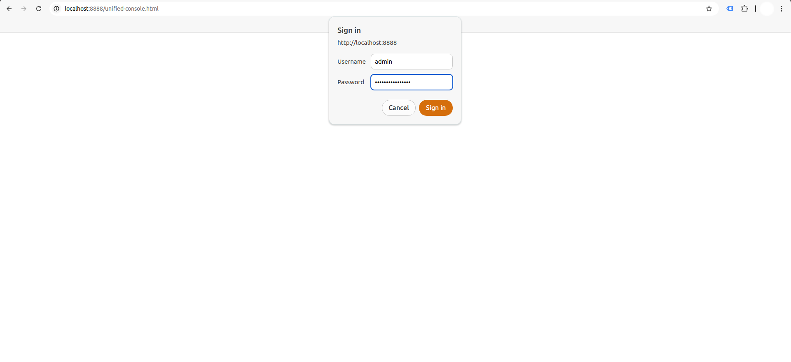
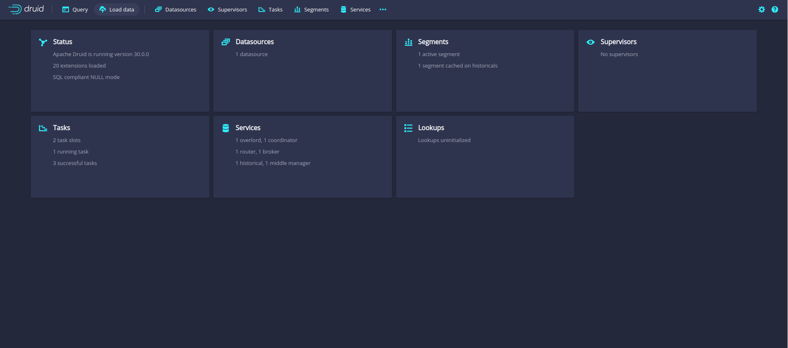
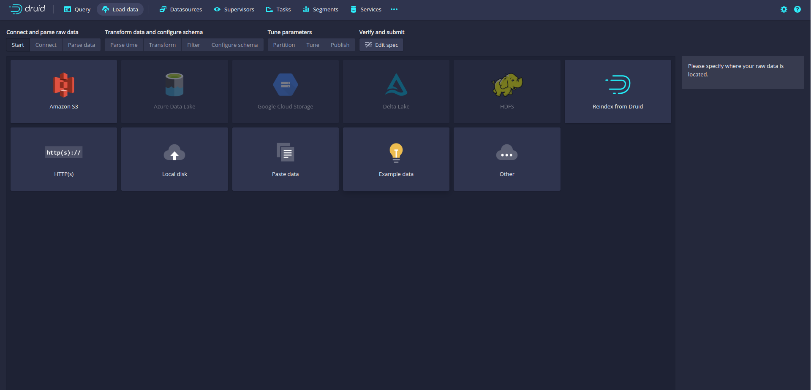
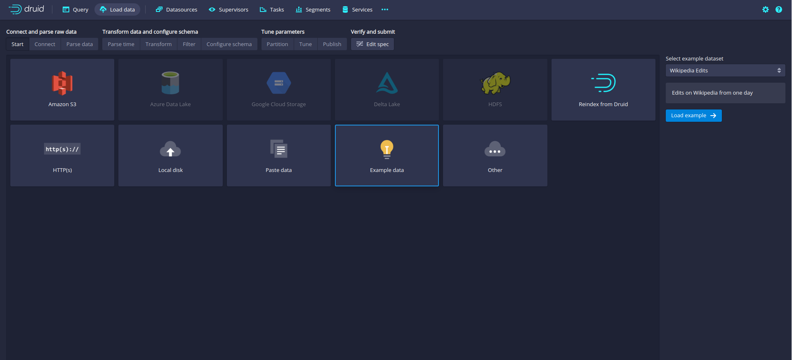
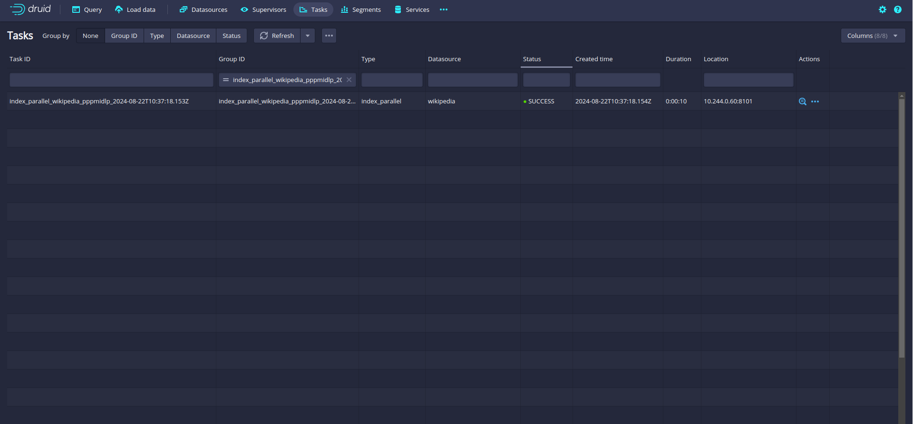
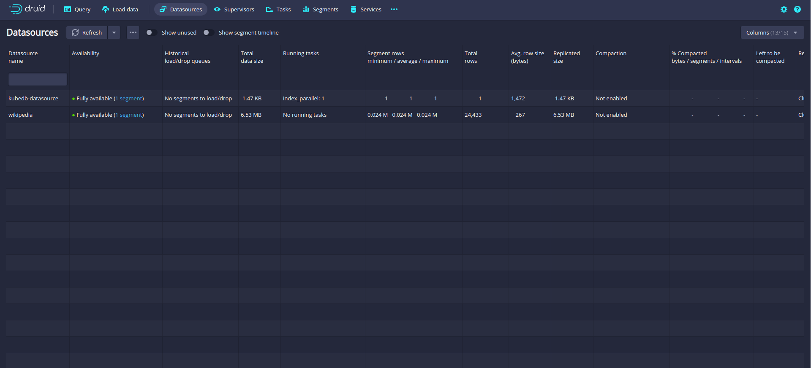
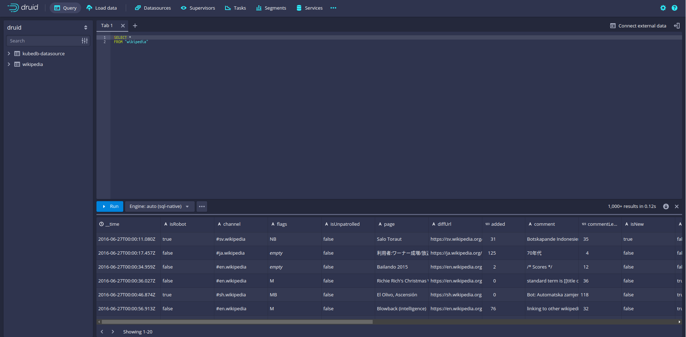

# How to Deploy Druid using Kubernetes Druid Operator


As cloud-native architectures continue to evolve, the management of large-scale, distributed databases and analytics platforms within Kubernetes clusters has become increasingly complex. While Kubernetes excels at automating the deployment, scaling, and operations of containerized applications, effectively managing distributed data systems in such dynamic environments requires a more specialized approach.

Druid, a high-performance, distributed analytics database, is designed to handle real-time data ingestion and interactive analytical queries on large datasets. It is particularly well-suited for use cases involving fast, ad-hoc analytics on high volumes of time-series or event-based data. However, deploying and managing Druid in Kubernetes presents unique challenges, such as ensuring optimal resource allocation, maintaining high availability, and scaling across many nodes.

This article covers the importance of Druid in the context of database management within a Kubernetes environment. We will explore the fundamentals of Druid, highlighting its significance in real-time analytics and effective data handling, while also offering best practices for deploying and configuring Druid on Kubernetes. By the end of this article, you will have a thorough understanding of how to deploy Druid in Kubernetes using the **Kubernetes Druid Operator**, as well as how Druid's integration with Kubernetes strengthens your approach to managing distributed analytics platforms in a dynamic ecosystem.

## Advantage of Druid in Kubernetes
Deploying Druid in Kubernetes presents a unique set of advantages that align with the platform's strengths in managing distributed systems at scale. Kubernetes offers powerful automation and orchestration capabilities, enabling organizations to seamlessly manage the complexities of large-scale, distributed data systems like Druid. As a real-time analytics database, Druid requires a robust environment that can handle high data ingestion rates and provide quick responses to complex queries over large datasets. Kubernetes, with its dynamic scaling, self-healing, and efficient resource management, offers an ideal foundation for deploying and operating Druid at scale.

The ability of Kubernetes to scale applications both horizontally and vertically makes it ideal for managing Druid's distributed architecture, which includes components like coordinator, overlord, historical, and broker nodes. Kubernetes automates scaling based on demand, ensuring Druid can handle spikes in data volume or query load without manual intervention. Whether adding more pods or adjusting resource allocations, Kubernetes simplifies and optimizes the scaling process. Kubernetes provides high availability and fault tolerance, crucial for distributed systems like Druid. If a pod or node fails, Kubernetes automatically redeploys and redistributes the workload, minimizing disruptions. Its built-in load balancing and self-healing mechanisms further ensure that Druid maintains data availability and consistent query performance, even in the face of failures.

Resource management is another key advantage of using Kubernetes with Druid. By allowing administrators to define CPU and memory requests and limits for each Druid component, Kubernetes ensures that resources are allocated efficiently, preventing resource contention and optimizing performance. This fine-grained control over resources is essential in maintaining the performance of resource-intensive analytics workloads.

Additionally, Kubernetes provides declarative management capabilities, which streamline the deployment and management of Druid’s distributed architecture. Through Custom Resource Definitions (CRDs), Druid components can be defined declaratively, making it easier to manage the lifecycle of the system, including configuration updates, scaling, and rolling deployments. This reduces the operational complexity and allows for more predictable and reliable deployments.

## Deploy Druid on Kubernetes
### Pre-requisites
We have to set up the environment to deploy Druid on Kubernetes using a [Kubernetes Druid operator](https://kubedb.com/kubernetes/databases/run-and-manage-druid-on-kubernetes/). You requires to have a running Kubernetes cluster and a basic understanding of Druid. Here we are using [Kind](https://kubernetes.io/docs/tasks/tools/#kind) to create our Kubernetes cluster. Additionally, you should install [Helm](https://helm.sh/docs/intro/install/) to your Kubernetes cluster.

In this tutorial, We will use the Kubernetes Druid operator [KubeDB](https://kubedb.com/) to deploy Druid on Kubernetes. We must install KubeDB to our Kubernetes cluster. To set up KubeDB in our Kubernetes cluster, we need a license. We can get a free license using the [Appscode License Server](https://license-issuer.appscode.com/). To obtain the license we must provide our Kubernetes cluster ID. Run the following command to get the cluster ID.

 
```bash
$ kubectl get ns kube-system -o jsonpath='{.metadata.uid}'
4ed26615-99dc-4ae8-2413-2e7ec357b05
```

The license server will email us with a "license.txt" file attached after we provide the necessary data. Run the following commands listed below to install KubeDB. 

```bash
$ helm install kubedb oci://ghcr.io/appscode-charts/kubedb \
  --version v2024.8.21 \
  --namespace kubedb --create-namespace \
  --set-file global.license=/path/to/the/license.txt \
  --set global.featureGates.Druid=true \
  --set global.featureGates.ZooKeeper=true \
  --wait --burst-limit=10000 --debug
```

Verify the installation by the following command,

```bash
$ kubectl get pods --all-namespaces -l "app.kubernetes.io/instance=kubedb"
NAMESPACE   NAME                                            READY   STATUS    RESTARTS   AGE
kubedb      kubedb-kubedb-autoscaler-67747584cf-t767j       1/1     Running   0          3m37s
kubedb      kubedb-kubedb-ops-manager-68d7f85f64-ks8b9      1/1     Running   0          3m37s
kubedb      kubedb-kubedb-provisioner-5c4669498f-8l7bd      1/1     Running   0          3m37s
kubedb      kubedb-kubedb-webhook-server-66b46b464-xmkrx    1/1     Running   0          3m37s
kubedb      kubedb-petset-operator-77b6b9897f-p4zr8         1/1     Running   0          3m37s
kubedb      kubedb-petset-webhook-server-7d6c8dc854-vfzc5   2/2     Running   0          3m37s
kubedb      kubedb-sidekick-c898cff4c-5ljcj                 1/1     Running   0          3m37s
``` 
We can go on to the next stage if every pod status is running.

### Create a Namespace

To keep resources isolated, we'll use a separate namespace called `demo` throughout this tutorial.
Run the following command to create the namespace:

```bash
$ kubectl create namespace demo
namespace/demo created
```

### Create a Deep Storage

One of the external dependency of Druid is Deep Storage where the segments are stored. It is a storage mechanism that Apache Druid does not provide. **Amazon S3**, **Google Cloud Storage**, or **Azure Blob Storage**, **S3-compatible storage** (like **Minio**), or **HDFS** are generally convenient options for Deep Storage.

In this tutorial, we will run a `minio-server` as deep storage in our cluster using `minio-operator` and create a bucket named `druid` in it, which the deployed druid database will use.


```bash
$ helm repo add minio https://operator.min.io/
$ helm repo update minio
$ helm upgrade --install --namespace "minio-operator" --create-namespace "minio-operator" minio/operator --set operator.replicaCount=1
$ helm upgrade --install --namespace "demo" --create-namespace druid-minio minio/tenant \
--set tenant.pools[0].servers=1 \
--set tenant.pools[0].volumesPerServer=1 \
--set tenant.pools[0].size=1Gi \
--set tenant.certificate.requestAutoCert=false \
--set tenant.buckets[0].name="druid" \
--set tenant.pools[0].name="default"
```

Now we need to create a `Secret` named `deep-storage-config`. It contains the necessary connection information using which the druid database will connect to the deep storage.
```yaml
apiVersion: v1
kind: Secret
metadata:
  name: deep-storage-config
  namespace: demo
stringData:
  druid.storage.type: "s3"
  druid.storage.bucket: "druid"
  druid.storage.baseKey: "druid/segments"
  druid.s3.accessKey: "minio"
  druid.s3.secretKey: "minio123"
  druid.s3.protocol: "http"
  druid.s3.enablePathStyleAccess: "true"
  druid.s3.endpoint.signingRegion: "us-east-1"
  druid.s3.endpoint.url: "http://myminio-hl.demo.svc.cluster.local:9000/"
```
Let’s create the `deep-storage-config` Secret shown above:

```bash
$ kubectl apply -f deep-storage-config.yaml
secret/deep-storage-config created
```

You can also use options like **Amazon S3**, **Google Cloud Storage**, **Azure Blob Storage** or **HDFS** and create a connection information `Secret` like this, and you are good to go.

### Metadata Storage

Druid uses the metadata store to house various metadata about the system, but not to store the actual data. The metadata store retains all metadata essential for a Druid cluster to work. Apache Derby is the default metadata store for Druid, however, it is not suitable for production. MySQL and PostgreSQL are more production suitable metadata stores.

Luckily, PostgreSQL and MySQL both are readily available in KubeDB as CRD and KubeDB operator will automatically create a MySQL cluster and create a database in it named `druid` by default.

If you choose to use PostgreSQL as metadata storage, you can simply mention that in the `spec.metadataStorage.type` of the Druid CR and KubeDB operator will deploy a PostgreSQL cluster for druid to use.

### ZooKeeper

Apache Druid uses [Apache ZooKeeper](https://zookeeper.apache.org/) (ZK) for management of current cluster state i.e. internal service discovery, coordination, and leader election.
Fortunately, KubeDB also has support for [ZooKeeper](https://kubedb.com/kubernetes/databases/run-and-manage-zookeeper-on-kubernetes/) and KubeDB operator will automatically create a ZooKeeper cluster for druid to use.

## Deploy Druid using Kubernetes Druid operator

Here is the yaml of the Druid we are going to use:

```yaml
apiVersion: kubedb.com/v1alpha2
kind: Druid
metadata:
  name: druid-cluster
  namespace: demo
spec:
  deepStorage:
    configSecret:
      name: deep-storage-config
    type: s3
  topology:
    routers:
      replicas: 1
  version: 30.0.0
  deletionPolicy: "WipeOut"
```

Let's save this yaml configuration into `druid-cluster.yaml` 
Then apply the above Druid yaml,

```bash
$ kubectl apply -f druid-cluster.yaml
druid.kubedb.com/druid-cluster created
```

You can see the detailed yaml specifications in the [Kubernetes Druid documentation](https://kubedb.com/docs/latest/guides/druid/).

Once these are handled correctly and the Druid object is deployed, you will see that the following resources are created:

```bash
$ kubectl get all -n demo
NAME                                 READY   STATUS    RESTARTS   AGE
pod/druid-cluster-brokers-0          1/1     Running   0          54s
pod/druid-cluster-coordinators-0     1/1     Running   0          60s
pod/druid-cluster-historicals-0      1/1     Running   0          58s
pod/druid-cluster-middlemanagers-0   1/1     Running   0          56s
pod/druid-cluster-mysql-metadata-0   2/2     Running   0          2m29s
pod/druid-cluster-mysql-metadata-1   2/2     Running   0          2m23s
pod/druid-cluster-mysql-metadata-2   2/2     Running   0          2m17s
pod/druid-cluster-routers-0          1/1     Running   0          52s
pod/druid-cluster-zk-0               1/1     Running   0          2m28s
pod/druid-cluster-zk-1               1/1     Running   0          2m22s
pod/druid-cluster-zk-2               1/1     Running   0          2m16s
pod/myminio-default-0                2/2     Running   0          12m

NAME                                           TYPE        CLUSTER-IP      EXTERNAL-IP   PORT(S)                                                 AGE
service/druid-cluster-brokers                  ClusterIP   10.96.150.199   <none>        8082/TCP                                                62s
service/druid-cluster-coordinators             ClusterIP   10.96.145.130   <none>        8081/TCP                                                62s
service/druid-cluster-mysql-metadata           ClusterIP   10.96.176.254   <none>        3306/TCP                                                2m32s
service/druid-cluster-mysql-metadata-pods      ClusterIP   None            <none>        3306/TCP                                                2m32s
service/druid-cluster-mysql-metadata-standby   ClusterIP   10.96.139.10    <none>        3306/TCP                                                2m32s
service/druid-cluster-pods                     ClusterIP   None            <none>        8081/TCP,8090/TCP,8083/TCP,8091/TCP,8082/TCP,8888/TCP   62s
service/druid-cluster-routers                  ClusterIP   10.96.148.73    <none>        8888/TCP                                                62s
service/druid-cluster-zk                       ClusterIP   10.96.76.149    <none>        2181/TCP                                                2m32s
service/druid-cluster-zk-admin-server          ClusterIP   10.96.139.96    <none>        8080/TCP                                                2m32s
service/druid-cluster-zk-pods                  ClusterIP   None            <none>        2181/TCP,2888/TCP,3888/TCP                              2m32s
service/minio                                  ClusterIP   10.96.31.66     <none>        80/TCP                                                  12m
service/myminio-console                        ClusterIP   10.96.193.192   <none>        9090/TCP                                                12m
service/myminio-hl                             ClusterIP   None            <none>        9000/TCP                                                12m

NAME                               READY   AGE
statefulset.apps/myminio-default   1/1     12m

NAME                                                              TYPE                   VERSION   AGE
appbinding.appcatalog.appscode.com/druid-cluster                  kubedb.com/druid       30.0.0    52s
appbinding.appcatalog.appscode.com/druid-cluster-mysql-metadata   kubedb.com/mysql       8.0.35    2m29s
appbinding.appcatalog.appscode.com/druid-cluster-zk               kubedb.com/zookeeper   3.7.2     2m32s

NAME                                            VERSION   STATUS   AGE
mysql.kubedb.com/druid-cluster-mysql-metadata   8.0.35    Ready    2m32s

NAME                             TYPE                  VERSION   STATUS         AGE
druid.kubedb.com/druid-cluster   kubedb.com/v1alpha2   30.0.0    Provisioning   2m32s

NAME                                    TYPE                  VERSION   STATUS   AGE
zookeeper.kubedb.com/druid-cluster-zk   kubedb.com/v1alpha2   3.7.2     Ready    2m32s
```
Let’s check if the database is ready to use,

```bash
$ kubectl get druid -n demo druid-cluster
NAME            TYPE                  VERSION   STATUS   AGE
druid-cluster   kubedb.com/v1alpha2   30.0.0    Ready    4m37s
```


## Connect with Druid Database

Now, we will access the Druid web UI using [port forwarding](https://kubernetes.io/docs/tasks/access-application-cluster/port-forward-access-application-cluster/), which will allow you to manage the Druid cluster via a web interface. It is also possible to use `External-IP` to access druid nodes if you make `service` type of that node as `LoadBalancer`.


#### Port-forward the Service

KubeDB will create few Services to connect with the database. Let’s check the Services by following command,

```bash
$ kubectl get service -n demo
NAME                                   TYPE        CLUSTER-IP      EXTERNAL-IP   PORT(S)                                                 AGE
druid-cluster-brokers                  ClusterIP   10.96.150.199   <none>        8082/TCP                                                5m1s
druid-cluster-coordinators             ClusterIP   10.96.145.130   <none>        8081/TCP                                                5m1s
druid-cluster-mysql-metadata           ClusterIP   10.96.176.254   <none>        3306/TCP                                                6m31s
druid-cluster-mysql-metadata-pods      ClusterIP   None            <none>        3306/TCP                                                6m31s
druid-cluster-mysql-metadata-standby   ClusterIP   10.96.139.10    <none>        3306/TCP                                                6m31s
druid-cluster-pods                     ClusterIP   None            <none>        8081/TCP,8090/TCP,8083/TCP,8091/TCP,8082/TCP,8888/TCP   5m1s
druid-cluster-routers                  ClusterIP   10.96.148.73    <none>        8888/TCP                                                5m1s
druid-cluster-zk                       ClusterIP   10.96.76.149    <none>        2181/TCP                                                6m31s
druid-cluster-zk-admin-server          ClusterIP   10.96.139.96    <none>        8080/TCP                                                6m31s
druid-cluster-zk-pods                  ClusterIP   None            <none>        2181/TCP,2888/TCP,3888/TCP                              6m31s
minio                                  ClusterIP   10.96.31.66     <none>        80/TCP                                                  16m
myminio-console                        ClusterIP   10.96.193.192   <none>        9090/TCP                                                16m
myminio-hl                             ClusterIP   None            <none>        9000/TCP                                                16m
```
To connect to the Druid database, we will use the `druid-cluster-routers` service. First, we need to port-forward the `druid-cluster-routers` service to port `8888` on the local machine:

```bash
$ kubectl port-forward -n demo svc/druid-cluster-routers 8888
Forwarding from 127.0.0.1:8888 -> 8888
Forwarding from [::1]:8888 -> 8888
```
Now, the Druid cluster is accessible at `localhost:8888`. Open the web browser and navigate to `localhost:8888`. You will see the Druid login panel.

#### Retrieve the Credentials

To access the database through Druid web UI, we have to get the credentials to access. KubeDB creates several Secrets for managing the database. To view the Secrets created for `druid-cluster`, run the following command:

```bash
$ kubectl get secret -n demo | grep druid-cluster
druid-cluster-admin-cred            kubernetes.io/basic-auth   2      8m19s
druid-cluster-config                Opaque                     11     8m19s
druid-cluster-mysql-metadata-auth   kubernetes.io/basic-auth   2      9m49s
druid-cluster-zk-auth               kubernetes.io/basic-auth   2      9m49s
druid-cluster-zk-config             Opaque                     3      9m49s
```
From the above list, the `druid-cluster-admin-cred` Secret contains the admin-level credentials needed to connect to the database.

Use the following commands to obtain the username and password:

```bash
$ kubectl get secret -n demo druid-cluster-admin-cred -o jsonpath='{.data.username}' | base64 -d
admin
$ kubectl get secret -n demo druid-cluster-admin-cred -o jsonpath='{.data.password}' | base64 -d
9eKho82VIuiLt*oe
```


### Access the Web UI

With the credentials in hand, log in to the Druid web UI.



After logging in with the credentials, you’ll see the Druid web console.



First, click on `Load Data` in the top menu, then choose `Batch - classic`. This will bring up the data loading screen.



Next, select `Example data` and click the `Load example` button.



Proceed by following the sequential steps provided: click `Next` at the bottom-right corner of each screen. You will need to go through `Parse data`, `Parse time`, `Transform`, `Filter`, `Configure schema`, `Partition`, `Tune`, `Publish`, `Edit spec`, and finally `Submit`. Once you have submitted the task, monitor the Tasks list for the `Status` update, which will initially show as `RUNNING` and eventually change to `SUCCESS`.



After the task is successfully completed, navigate to the `Datasources` section from the top menu. You should find your new datasource, such as `wikipedia`, listed there. Click on it to open the `Query` option where you can run queries on your data.






> Congratulations! We’ve successfully deployed Druid on Kubernetes using **Kubernetes Druid operator** KubeDB. Additionally, we've added sample data to the Druid database using the web UI. This interface provides a convenient way to monitor and manage the Druid cluster.

## Druid on Kubernetes: Best Practices
To ensure the stability of your application while using Druid on Kubernetes, there are some best practices that you should follow:

* **Security Configurations:** Protect sensitive data and Druid clusters by implementing security best practices. Use Kubernetes Secrets to manage credentials, and consider securing communication between Druid services with TLS encryption. Additionally, enable role-based access control (RBAC) to enforce strict access policies for users and services interacting with Druid.

* **Monitoring and Logging:** Monitoring the performance of your Druid cluster is critical for detecting issues and optimizing resource usage. Integrate Prometheus and Grafana to visualize Druid metrics like query performance, data ingestion rates, and resource consumption. Additionally, enable centralized logging (using tools like Fluentd or Elasticsearch) to collect logs from all Druid nodes for easier debugging and analysis.

* **Data Replication and Backup:** To ensure high availability and fault tolerance, implement data replication across your Druid cluster. Regular backups of Druid’s metadata store and deep storage are essential for disaster recovery. Configure persistent volumes (PVs) for deep storage in Kubernetes, and backup your metadata database (such as MySQL or PostgreSQL).

* **Using the Kubernetes Druid Operator:** The Kubernetes Druid Operator simplifies the management of Druid clusters on Kubernetes. It automates tasks such as scaling, upgrading, and managing Druid components. By utilizing the operator, you reduce the complexity of running Druid in production and benefit from automation that handles many operational tasks.

## Conclusion

Apache Druid, known for its high-performance analytics and real-time data processing capabilities, proves invaluable in modern data architectures. Running Druid on Kubernetes introduces significant operational benefits, such as seamless deployment, automated scaling, and centralized management. By adapting to the best practices like resource management, securing data, setting up monitoring, and using the Kubernetes Druid Operator you can ensure the stability, availability, and scalability of your Druid based data pipelines. As Kubernetes continues to power the modern cloud-native ecosystem, leveraging its full potential with Druid ensures that your data infrastructure is both resilient and scalable. For more detailed information on Druid, refer to the official [Druid documentation](https://druid.apache.org/docs/latest/). When combined with best-in-class practices and tools, such as KubeDB, organizations can ensure efficient database management across complex environments, keeping performance and availability at the highest standards.


