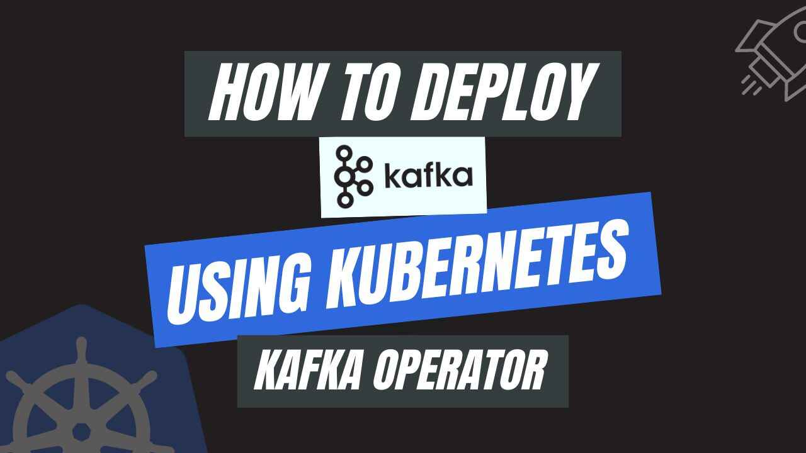

# How to Deploy Kafka using Kubernetes Kafka Operator



In the realm of modern data processing, Kafka stands out as a robust and scalable distributed streaming platform. **Kubernetes Kafka** Operator seamlessly integrates with Kubernetes, expanding the Kubernetes API through a meticulously crafted custom resource definition (CRD) tailored for Kafka. This operator streamlines the deployment, administration, and scalability of Kafka clusters within the Kubernetes environment. This article explores the numerous benefits, distinctive features, and step-by-step guidelines for deploying Kafka clusters utilizing the Kubernetes Kafka Operator. 

Kubernetes is a ground-breaking open-source technology that reduces the complexity of containerized applications. Through the use of Kubernetes, you can expand, deploy, and manage applications with ease, regardless of whether they run on a single computer or distributed between a multi-cloud environment.

Kubernetes streamlines and automates processes like load balancing, real-time scaling, and application resiliency via automatic recovery.  Users can specify the desired behavior of their apps with a simple declarative configuration, and Kubernetes will take care of the execution. This lets developers focus on building amazing apps, and Kubernetes makes sure those apps function seamlessly and efficiently. With the help of Kubernetes, users effortlessly manage the challenges associated with modern application deployment.

## Why Kafka in Kubernetes
Kafka is an open-source distributed event streaming platform that has emerged as a fundamental tool for building real-time data pipelines and streaming applications. Developed by the Apache Software Foundation, Kafka is designed to handle high-throughput, fault-tolerant, and scalable data streams. At its core, Kafka acts as a distributed commit log, allowing applications to publish and subscribe to streams of records in a fault-tolerant and durable manner. It provides a robust and scalable architecture, supporting scaling across multiple nodes and data centers. 

Kafka's versatility extends to its ability to integrate with various programming languages and frameworks, making it a popular choice for organizations dealing with large-scale data processing, analytics, and real-time monitoring. Whether used for ingesting and processing massive amounts of data or enabling real-time data integration between different systems, Apache Kafka has become a cornerstone in the realm of modern, data-driven architecture.

Combining Kafka with Kubernetes brings forth a multitude of benefits, enhancing the overall efficiency and scalability of data streaming applications. This integration of Kubernetes Kafka ensures high availability, fault tolerance, and automatic recovery, critical for maintaining uninterrupted data streaming operations. The dynamic scaling features of Kubernetes align perfectly with Kafka's distributed architecture, enabling organizations to adapt to varying workloads effortlessly. Additionally, the built-in flexibility of Kubernetes facilitates the deployment of Kafka alongside other microservices, creating a modular and scalable ecosystem. The integration of Apache Kafka and Kubernetes not only streamlines the operational aspects of managing distributed systems but also provides a robust foundation for building resilient and scalable real-time data pipelines in modern, containerized environments.

## Deploy Kafka on Kubernetes
### Pre-requisites
We have to set up the environment to deploy Kafka on Kubernetes using a Kubernetes Kafka operator. A functional Kubernetes cluster and a basic understanding of Kafka is required to conduct this tutorial. Here we are using [Kind](https://kubernetes.io/docs/tasks/tools/#kind) to create our Kubernetes cluster. Furthermore, you should install [Helm](https://helm.sh/docs/intro/install/) to your Kubernetes cluster.

In this tutorial, We will use the Kubernetes Kafka operator [KubeDB](https://kubedb.com/) to deploy Kafka on Kubernetes. We must install KubeDB to our Kubernetes cluster. To set up KubeDB in our Kubernetes cluster, we need a license. We can get a free license using the [Appscode License Server](https://license-issuer.appscode.com/). We must provide our Kubernetes cluster ID to obtain a license. Run the following command below to get the cluster ID.

 
```bash
$ kubectl get ns kube-system -o jsonpath='{.metadata.uid}'
250a26e3-2413-4ed2-99dc-57b0548407ff
```

The license server will email us with a "license.txt" file attached after we provide the necessary data. Run the following commands listed below to install KubeDB. 

```bash
$ helm install kubedb oci://ghcr.io/appscode-charts/kubedb \
  --version v2023.12.11 \
  --namespace kubedb --create-namespace \
  --set-file global.license=/path/to/the/license.txt \
  --wait --burst-limit=10000 --debug
```

Verify the installation by the following command,

```bash
$ kubectl get pods --all-namespaces -l "app.kubernetes.io/instance=kubedb"
NAMESPACE   NAME                                            READY   STATUS    RESTARTS       AGE
kubedb      kubedb-kubedb-autoscaler-64bbcfcf8-4bq6l        1/1     Running   0              3m2s
kubedb      kubedb-kubedb-dashboard-6c78448c8b-2gzfz        1/1     Running   0              3m2s
kubedb      kubedb-kubedb-ops-manager-84b9d446b6-9jmbh      1/1     Running   0              3m2s
kubedb      kubedb-kubedb-provisioner-7d6cc98865-mm54t      1/1     Running   0              3m2s
kubedb      kubedb-kubedb-webhook-server-68d6d6b9cb-pk99x   1/1     Running   0              3m2s
``` 
We can go on to the next stage if every pod status is running.

## Create a Namespace
Now we'll create a new namespace in which we will deploy Kafka. To create a namespace, we can use the following command:

```bash
$ kubectl create namespace kafka-demo
namespace/kafka-demo created
``` 
## Deploy Kafka via Kubernetes Kafka operator

We need to create a yaml manifest to install Kafka on Kubernetes. And we will apply this yaml below,

```yaml
apiVersion: kubedb.com/v1alpha2
kind: Kafka
metadata:
  name: kafka-cluster
  namespace: kafka-demo
spec:
  replicas: 3
  version: 3.6.0
  storage:
    accessModes:
      - ReadWriteOnce
    resources:
      requests:
        storage: 1Gi
    storageClassName: standard
  storageType: Durable
  terminationPolicy: WipeOut
```

You can see the detailed yaml specifications in the [Kubernetes Kafka](https://kubedb.com/docs/latest/guides/kafka/concepts/kafka/) documentation.

We will save this yaml configuration to `kafka-cluster.yaml`. Then create the above Kafka object.

```bash
$ kubectl apply -f kafka-cluster.yaml
kafka.kubedb.com/kafka-cluster created
```

If all the above steps are handled correctly and the Kafka is deployed, you will see that the following objects are created:


```bash
$ kubectl get all,secret -n kafka-demo -l 'app.kubernetes.io/instance=kafka-cluster'
NAME                  READY   STATUS    RESTARTS   AGE
pod/kafka-cluster-0   1/1     Running   0          5m22s
pod/kafka-cluster-1   1/1     Running   0          4m50s
pod/kafka-cluster-2   1/1     Running   0          4m11s

NAME                         TYPE        CLUSTER-IP   EXTERNAL-IP   PORT(S)                       AGE
service/kafka-cluster-pods   ClusterIP   None         <none>        9092/TCP,9093/TCP,29092/TCP   5m24s

NAME                             READY   AGE
statefulset.apps/kafka-cluster   3/3     5m25s

NAME                                               TYPE               VERSION   AGE
appbinding.appcatalog.appscode.com/kafka-cluster   kubedb.com/kafka   3.6.0     5m25s

NAME                              TYPE                       DATA   AGE
secret/kafka-cluster-admin-cred   kubernetes.io/basic-auth   2      5m31s
secret/kafka-cluster-config       Opaque                     2      5m31s
```

We have successfully deployed Kafka to Kubernetes using the Kubernetes Kafka operator. First, check the status of the `kafka-cluster` to determine if it is ready.

```bash
$ kubectl get kafka -n kafka-demo kafka-cluster
NAME            TYPE                  VERSION   STATUS   AGE
kafka-cluster   kubedb.com/v1alpha2   3.6.0     Ready    3m48s
```

## Publish & Consume Messages with Kafka
In this section, we will now exec into one of the kafka brokers in interactive mode and then describe the broker metadata for the quorum.

```bash
$ kubectl exec -it -n kafka-demo  kafka-cluster-0 -- bash
kafka@kafka-cluster-0:~$ kafka-metadata-quorum.sh --command-config $HOME/config/clientauth.properties --bootstrap-server localhost:9092 describe --status
ClusterId:              11ee-a481-4ab0c9c3652w
LeaderId:               0
LeaderEpoch:            7
HighWatermark:          1436
MaxFollowerLag:         0
MaxFollowerLagTimeMs:   0
CurrentVoters:          [0,1,2]
CurrentObservers:       []
```
We can see the important metadata information like clusterID, current leader ID, broker IDs which are participating in leader election voting and IDs of those brokers who are observers. It is important to mention that each broker is assigned a numeric ID which is called its broker ID. The ID is assigned sequentially with respect to the host pod name.

### Create a Topic
Let’s create a topic named music with 3 partitions and a replication factor of 3. Once it’s created describe the topic. You will see the leader ID for each partition and their replica IDs along with in-sync-replicas(ISR).

```bash
$ kubectl exec -it -n kafka-demo  kafka-cluster-0 -- bash

kafka@kafka-cluster-0:~$ kafka-topics.sh --create  --bootstrap-server localhost:9092 --command-config $HOME/config/clientauth.properties --topic music --partitions 3 --replication-factor 3

Created topic music.

kafka@kafka-cluster-0:~$ kafka-topics.sh --describe --topic music --bootstrap-server localhost:9092 --command-config $HOME/config/clientauth.properties

Topic: music	TopicId: 4QTWweCFSxaQmd1L-HERKA	PartitionCount: 3	ReplicationFactor: 3	Configs: segment.bytes=1073741824,min.compaction.lag.ms=60000
	Topic: music	Partition: 0	Leader: 2	Replicas: 2,0,1	Isr: 2,0,1
	Topic: music	Partition: 1	Leader: 0	Replicas: 0,1,2	Isr: 0,1,2
	Topic: music	Partition: 2	Leader: 1	Replicas: 1,2,0	Isr: 1,2,0
```
Now, we are going to start a producer and a consumer for topic music. Let’s use this current terminal for producing messages and open a new terminal for consuming messages. From the topic description we can see that the leader partition for partition 1 is 0 (the broker that we are on). If we produce messages to kafka-cluster-0 broker(brokerID=0) it will store those messages in partition 1. Let’s produce messages in the producer terminal and consume them from the consumer terminal.

```bash
$ kubectl exec -it -n kafka-demo  kafka-cluster-0 -- bash
kafka@kafka-cluster-0:~$ kafka-console-producer.sh  --topic music --request-required-acks all --bootstrap-server localhost:9092 --producer.config $HOME/config/clientauth.properties

>Five Hundred Miles
>Annie's Song
>The Nights
```

```bash
$ kubectl exec -it -n kafka-demo  kafka-cluster-0 -- bash
kafka@kafka-cluster-0:~$ kafka-console-consumer.sh --topic music --from-beginning --bootstrap-server localhost:9092 --consumer.config $HOME/config/clientauth.properties

Five Hundred Miles
Annie's Song
The Nights
```

Here, we can see messages are coming to the consumer as you continue sending messages via producer. So, We’ve successfully deployed Kafka on Kubernetes via **Kubernetes Kafka operator** KubeDB. Additionally, we have created a Kafka topic and used Kafka console producer and consumer for publishing and consuming messages successfully. 

## Kafka on Kubernetes: Best Practices
To ensure the stability of your application while using Kafka on Kubernetes, there are some best practices that you should follow:

* **Security Configurations:** Implement robust security measures such as encryption, authentication, and authorization to protect Kafka clusters. Utilize Kubernetes Secrets for managing sensitive information like passwords and certificates.

* **Monitoring and Logging:** Set up comprehensive monitoring using tools like Prometheus and Grafana to track Kafka cluster health, performance metrics, and potential issues. Integrate centralized logging for easy debugging and troubleshooting.

* **Backup and Disaster Recovery:** Establish regular backup procedures for Kafka data and configurations to facilitate quick recovery in case of data loss or cluster failures. Test the backup and recovery processes periodically to ensure their effectiveness.

* **Using the Kubernetes Kafka Operator:** Leveraging the Kafka operator in a Kubernetes cluster provides an efficient method for the installation and administration of Kafka. Functioning as a controller, the Kafka operator consolidates operational insights, automates administrative functions, and streamlines the deployment and scaling processes of Kafka instances. This not only enhances operational efficiency but also diminishes the workload on Kafka administrators, establishing it as a beneficial solution tailored for environments built on Kubernetes.

## Conclusion

Apache Kafka stands as a robust event streaming platform, highly esteemed for its efficiency and extensive usage in meeting a spectrum of real-time data processing requirements. In this context, the implementation of Apache Kafka on Kubernetes, facilitated by the Kubernetes Kafka Operator, signifies a transformative approach to managing distributed event streaming architectures. This integration proves invaluable across diverse scenarios, offering seamless deployment, automated scaling, and resilient operation. You can visit the official [Kafka documentation](https://kafka.apache.org/documentation/) for further details. Achieving optimal efficiency and availability in database operations demands expertise and a continuous commitment to best practices. KubeDB provides an extensive array of support services, guaranteeing that your database management consistently adheres to the most stringent performance and operational standards. Whether your database infrastructure is on-premises, geographically dispersed, or utilizes cloud services and database-as-a-service providers, KubeDB offers comprehensive support for managing the entire process within a production-grade environment.


