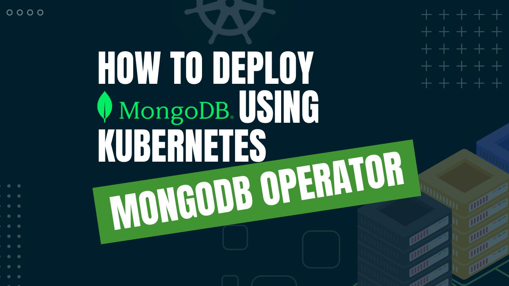

# How to Deploy MongoDB using Kubernetes MongoDB Operator



The combination of MongoDB and Kubernetes is a game-changer in database administration. This article will walk you through the process of deploying MongoDB using the **Kubernetes MongoDB** Operator. Learn how this dynamic combination of Kubernetes MongoDB reduces the difficult task of configuring and managing databases in a complex environment.

Kubernetes represents an open-source container orchestration platform that transforms the manner in which applications are deployed, expanded, and administered within a distributed environment. It offers a remarkably scalable and resilient system to automate the lifecycle management of applications packaged in containers. By utilizing elements such as pods, services, and controllers, Kubernetes abstracts the underlying infrastructure and provides an explicit strategy for deploying and enlarging applications.

This framework incorporates sophisticated scheduling methodologies, load balancing, and mechanisms for discovering services to ensure optimal utilization of resources and peak efficiency. Through its robust API, expandable structure, and integration with cloud-native technologies, Kubernetes has emerged as the industry standard for container orchestration. It enables enterprises to build and run strong, scalable applications with great efficiency.

Kubernetes operators simplify database management. They're specialized tools automating tasks like provisioning, scaling, and security. Operators enable developers to delegate database management, fostering cloud-native DevOps practices. Leveraging custom resources, operators simplify provisioning through familiar Kubernetes interfaces, while automating upgrades, scalability, security configuration, and disaster recovery.

Developers can experience seamless database management without vendor lock-in by Implementing Kubernetes operators. Operators enable efficient database handling within Kubernetes, reducing the need for extensive Kubernetes knowledge and manual configuration.

## Why MongoDB in Kubernetes
MongoDB is a cross-platform, open-source NoSQL database management system. It is designed to be scalable and adaptable while managing and storing massive amounts of data. One of MongoDB's distinctive features is its document-oriented data model, which stores information as documents with optional JSON-like syntax. As a result, there is greater flexibility and faster development because changing the schema is simple and does not require significant data migrations.

MongoDB uses a distributed design in which data is distributed across multiple servers or shards. This offers horizontal scaling, allowing the database to support increasing data volumes, read and write workloads, and workloads without requiring large hardware changes. MongoDB also includes a number of built-in high availability capabilities, such as replica sets and automatic failover. Even in the event of hardware failures or other disruptions, the database remains accessible and functional.

MongoDB is unique among NoSQL databases in that it uses the whole NoSQL technology while maintaining certain critical features from traditional database systems. MongoDB is well-suited to manage the needs of high-performance, large-scale applications because of its document-oriented design, replication and sharding capabilities, and robust developer ecosystem.

It is simple to work with and integrate into existing systems due to the use of BSON encoding, a flexible schema, and widely available drivers. MongoDB provides a powerful and scalable framework for organizing and storing data in today's fast-paced environment, whether for corporate or personal use.

Deploying MongoDB in Kubernetes offers a host of advantages for modern database management. Dynamic scalability, automatic load balancing, and efficient resource allocation of Kubernetes align seamlessly with MongoDB's flexible document-based structure. This combination improves enterprises to effortlessly scale their databases to handle their workloads, enhancing application flexibility and performance. Kubernetes MongoDB enabling organizations to focus more on developing innovative applications rather than dealing with complex infrastructure issues.

## Deploying MongoDB on Kubernetes
### Pre-requisites
We have to set up the environment to deploy MongoDB on Kubernetes using a Kubernetes MongoDB operator. A running Kubernetes cluster and a fundamental understanding of MongoDB queries are required to conduct this tutorial. Here we are using [Kind](https://kubernetes.io/docs/tasks/tools/#kind) to create our Kubernetes cluster. Additionally, you should install [Helm](https://helm.sh/docs/intro/install/) to your Kubernetes cluster.

In this tutorial, We will use the Kubernetes MongoDB operator [KubeDB](https://kubedb.com/) to deploy MongoDB on Kubernetes. First, We must install KubeDB in our Kubernetes cluster. We requires a license to setup KubeDB in our Kubernetes cluster. We can obtain a free enterprise license via the [Appscode License Server](https://license-issuer.appscode.com/). To obtain the license we must provide our Kubernetes cluster ID. Run the following command to get the cluster ID.

 
```bash
$ kubectl get ns kube-system -o jsonpath='{.metadata.uid}'
60b010fb-9ad6-4ac6-89f4-7321e697f469
```

After giving the required information, the license server will send us an email with a "license.txt" file attached. We will run the following commands listed below to install KubeDB. 

```bash
$ helm install kubedb oci://ghcr.io/appscode-charts/kubedb \
  --version v2023.12.11 \
  --namespace kubedb --create-namespace \
  --set-file global.license=/path/to/the/license.txt \
  --wait --burst-limit=10000 --debug
```


Verify the installation by the following command,

```bash
$ kubectl get pods --all-namespaces -l "app.kubernetes.io/instance=kubedb"
NAMESPACE   NAME                                            READY   STATUS    RESTARTS   AGE
kubedb      kubedb-kubedb-autoscaler-5d4d9db7b-7tvjx        1/1     Running   0          94s
kubedb      kubedb-kubedb-dashboard-7b848bb7c-lk2s5         1/1     Running   0          94s
kubedb      kubedb-kubedb-ops-manager-86786bfd4f-bcccw      1/1     Running   0          94s
kubedb      kubedb-kubedb-provisioner-7657456794-dmdcs      1/1     Running   0          94s
kubedb      kubedb-kubedb-schema-manager-bb9f7b758-7pz5m    1/1     Running   0          94s
kubedb      kubedb-kubedb-webhook-server-7f5cbfb695-jndmv   1/1     Running   0          94s
``` 
If all of the pod status is running, we can move to the next step.

## Create a Namespace
Now we'll create a new namespace in which we will deploy MongoDB. We can run the following command to create a namespace,

```bash
$ kubectl create namespace mongons
namespace/mongons created
``` 
## Deploy MongoDB via Kubernetes MongoDB operator
We need to create a yaml manifest to Deploy MongoDB on Kubernetes. And we will apply this yaml manifest below,

```yaml
apiVersion: kubedb.com/v1alpha2
kind: MongoDB
metadata:
  name: mongodb-rs
  namespace: mongons
spec:
  version: "5.0.3"
  replicas: 3
  replicaSet:
    name: rs0
  storage:
    storageClassName: "standard"
    accessModes:
    - ReadWriteOnce
    resources:
      requests:
        storage: 1Gi
  terminationPolicy: WipeOut
```

You can see the detailed yaml specifications in the [Kubernetes MongoDB](https://kubedb.com/docs/latest/guides/mongodb/) documentation.

We will save this yaml configuration to `mongodb.yaml`. Then create the above MongoDB object.

```bash
$ kubectl create -f mongodb.yaml
mongodb.kubedb.com/mongodb-rs created
```

If all the above steps are handled correctly and the MongoDB is deployed, you will see that the following objects are created:


```bash
$ kubectl get all -n mongons
NAME               READY   STATUS    RESTARTS   AGE
pod/mongodb-rs-0   2/2     Running   0          3m40s
pod/mongodb-rs-1   2/2     Running   0          2m50s
pod/mongodb-rs-2   2/2     Running   0          119s

NAME                      TYPE        CLUSTER-IP   EXTERNAL-IP   PORT(S)     AGE
service/mongodb-rs        ClusterIP   10.8.1.145   <none>        27017/TCP   3m44s
service/mongodb-rs-pods   ClusterIP   None         <none>        27017/TCP   3m44s

NAME                          READY   AGE
statefulset.apps/mongodb-rs   3/3     3m45s

NAME                                            TYPE                 VERSION   AGE
appbinding.appcatalog.appscode.com/mongodb-rs   kubedb.com/mongodb   5.0.3     72s

NAME                            VERSION   STATUS   AGE
mongodb.kubedb.com/mongodb-rs   5.0.3     Ready    4m10s
```

We have successfully deployed MongoDB to Kubernetes via the Kubernetes MongoDB operator. Now, we will connect to the MongoDB database to insert some sample data and verify whether our MongoDB is usable or not. First, check the database status,

```bash
$ kubectl get mongodb -n mongons mongodb-rs
NAME         VERSION   STATUS   AGE
mongodb-rs   5.0.3     Ready    5m31s
```

Here, we should have to obtain necessary credentials in order to connect to the database. Let’s export the credentials as environment variable to our current shell: KubeDB will create Secret and Service for the database `mongodb-rs` that we have deployed. Let’s check them,

```bash
$ kubectl get secret -n mongons -l=app.kubernetes.io/instance=mongodb-rs
NAME              TYPE                       DATA   AGE
mongodb-rs-auth   kubernetes.io/basic-auth   2      6m20s
mongodb-rs-key    Opaque                     1      6m20s

$ kubectl get service -n mongons -l=app.kubernetes.io/instance=mongodb-rs
NAME              TYPE        CLUSTER-IP   EXTERNAL-IP   PORT(S)     AGE
mongodb-rs        ClusterIP   10.8.1.145   <none>        27017/TCP   6m39s
mongodb-rs-pods   ClusterIP   None         <none>        27017/TCP   6m39s
``` 

Now we'll use `mongodb-rs-auth` to export credentials. To make future commands more reusable, export `USER` and `PASSWORD` as environment variables.
```bash
$ export USER=$(kubectl get secrets -n mongons mongodb-rs-auth -o jsonpath='{.data.\username}' | base64 -d)

$ export PASSWORD=$(kubectl get secrets -n mongons mongodb-rs-auth -o jsonpath='{.data.\password}' | base64 -d)
```

## Insert sample data to the MongoDB database
Now, we will connect to the MongoDB database using the required credentials and insert some sample data,

```bash
$ kubectl exec -it -n mongons mongodb-rs-0 -- mongo admin -u $USER -p $PASSWORD
Defaulted container "mongodb" out of: mongodb, replication-mode-detector, copy-config (init)
MongoDB shell version v5.0.3
rs0:PRIMARY> show dbs
admin          0.000GB
config         0.000GB
kubedb-system  0.000GB
local          0.000GB

rs0:PRIMARY> use musicdb
switched to db musicdb

rs0:PRIMARY> db.songs.insert({"name":"Take Me Home Country Roads"});
WriteResult({ "nInserted" : 1 })

rs0:PRIMARY> db.songs.find().pretty()
{
	"_id" : ObjectId("6426c44cdf79c82c76cd3e44"),
	"name" : "Take Me Home Country Roads"
}

rs0:PRIMARY> exit
bye
```
We’ve successfully deployed MongoDB to Kubernetes via **Kubernetes MongoDB operator** KubeDB. We also connect to the database and insert some sample data into it.

## MongoDB on Kubernetes: Best Practices
To ensure the stability of your application when deploying MongoDB on Kubernetes, there are some best practices that you should follow:

* **Version Upgrade:** Plan and test version upgrades carefully. MongoDB versions and Kubernetes versions should be compatible, and rolling upgrades are often recommended. A well-executed upgrade strategy avoids disruptions.

* **Replica Sets for High Availability:** Implement MongoDB replica sets for high availability. Each replica set node runs on a separate Kubernetes node, reducing the risk of data loss during node failures. This will upgrade fault tolerance.

* **Monitoring and Health Checks:** Set up health checks and monitoring for MongoDB pods. Kubernetes and MongoDB provide metrics that can be collected and analyzed to identify performance bottlenecks or issues. This proactive monitoring aids in maintaining optimal performance.

* **Disaster Recovery Options:** Develop comprehensive disaster recovery options, including procedures for recovering from data corruption, pod failures, and cluster-wide outages. Having a clear roadmap during crises minimizes downtime.

## Conclusion

MongoDB for Kubernetes is a robust and comprehensive solution for managing databases in a Kubernetes context. Here, you have successfully deployed a MongoDB database on Kubernetes using the Kubernetes MongoDB operator, which is appropriate for a wide range of use cases. You can visit the official [MongoDB documentation](https://www.mongodb.com/docs/) for further details. Managing database operations with the optimal performance and uptime requires substantial expertise and consistent practice. Whether your database infrastructure is hosted on-premises, regionally distributed, or via cloud services or database-as-a-service providers, you can use KubeDB to help you manage the entire process in a production-grade environment.
