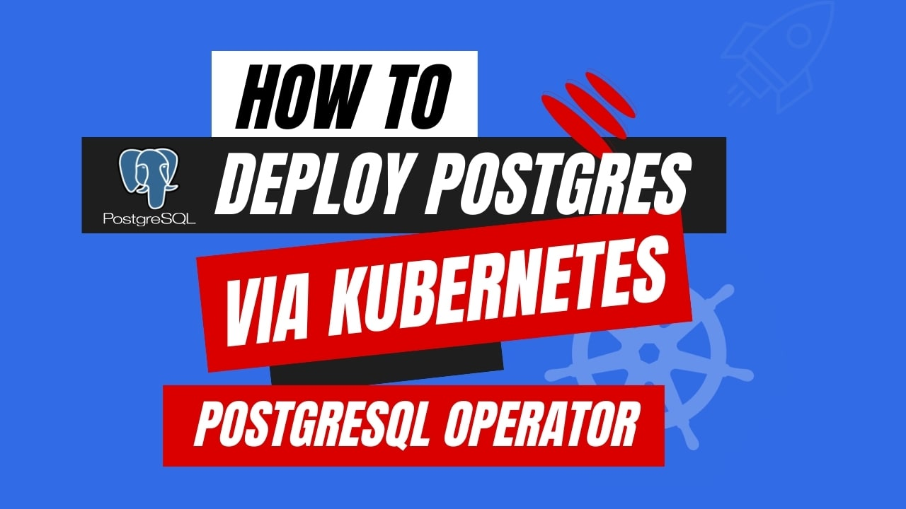

# How to Deploy Postgres via Kubernetes PostgreSQL Operator



Kubernetes is an open-source container orchestration platform that revolutionizes the way applications are deployed, scaled, and managed in a distributed computing environment. It provides a highly scalable and fault-tolerant system for automating the lifecycle management of containerized applications. Leveraging concepts like pods, services, and controllers, Kubernetes abstracts the underlying infrastructure and offers a declarative approach to application deployment and scaling. 

It incorporates advanced scheduling techniques, load balancing, and service discovery mechanisms to ensure efficient resource utilization and optimal performance. With its robust API, extensible architecture, and integration with cloud-native technologies, Kubernetes has emerged as the industry-standard solution for container orchestration, empowering organizations to build and operate resilient and scalable applications in a highly efficient manner. 

Nowadays, Kubernetes has become the most effective option for managing containerized applications. However, handling stateful applications like databases is still a challenge in Kubernetes. To address this complexity, Kubernetes introduced StatefulSets. Even though managing databases on Kubernetes still requires extensive knowledge and manual effort.

To simplify database management on Kubernetes, Kubernetes operators come into play. These specialized applications extend Kubernetes for specific purposes, automating tasks like provisioning, monitoring, scaling, and security. By leveraging Kubernetes operators, developers can delegate database management to application developers, enabling the adoption of cloud-native DevOps practices across multiple Kubernetes clusters. Operators use custom resources, simplifying database provisioning through standard Kubernetes command-line and application programming interfaces (APIs). They also facilitate seamless upgrades, scalability, storage expansion, security configuration, and disaster recovery through automated backup processes. 

By utilizing Kubernetes operators, developers can streamline database management and enjoy the benefits of managed solutions without vendor lock-in. Operators empower developers to efficiently handle databases within Kubernetes, eliminating the need for extensive knowledge of Kubernetes intricacies and manual configurations.


## Why PostgreSQL in Kubernetes

PostgreSQL is a powerful open-source relational database management system (RDBMS)  which is commonly used for managing and analyzing massive datasets. Due to its cutting-edge features and reliable design, PostgreSQL is an extremely preferred solution among enterprises, governments, and other businesses all over the world. PostgreSQL is well-suited for high-performance, mission-critical applications. The integration of PostgreSQL with Kubernetes offers a scalable and highly reliable database solution that is ideal for modern application development and deployment practices.

Microservices are an essential component of modern cloud-native systems. These self-contained, small services can be deployed and scaled independently. By utilizing PostgreSQL as the database for each microservice, combined with Kubernetes for managing overall application deployment and scaling, a robust architecture is achieved.

Maintaining the integrity of operational and user data is paramount in any environment. However, human errors or technical failures can still occur. PostgreSQL's Write-Ahead Logs (WAL) provide an effective disaster recovery mechanism by ensuring that data is first stored in the logs before being written to the database. This facilitates data recovery when necessary and enables the retrieval of even unwritten updates.

Kubernetes excels in efficient scaling, allowing for dynamic pod scaling during peak hours and subsequent downsizing without disrupting the service. This scalability feature optimizes resource utilization and reduces costs by allocating resources as needed, rather than over-provisioning to accommodate sporadic or irregular spikes in demand.

To sum up, PostgreSQL is a powerful and flexible database management system that can be used to handle and analyze significant datasets. With its comprehensive data modeling and manipulation capabilities, scalability, and robust security features, it is appropriate for a number of industries and applications. Whether you're a developer, administrator, or data analyst, Kubernetes PostgreSQL can be a decent choice for managing and analyzing large, complex datasets.

## Deploying PostgreSQL on Kubernetes
### Pre-requisites

We have to set up the environment to deploy PostgreSQL on Kubernetes using a Kubernetes PostgreSQL operator. You need to have a working Kubernetes cluster and a basic understanding of PostgreSQL queries. Here we are using [Kind](https://kubernetes.io/docs/tasks/tools/#kind) to create our Kubernetes cluster. Additionally, you should install [Helm](https://helm.sh/docs/intro/install/) to your Kubernetes cluster.

In this tutorial, We will use the Kubernetes PostgreSQL operator [KubeDB](https://kubedb.com/) to deploy PostgreSQL on Kubernetes. First, We need to install KubeDB to our Kubernetes cluster. We need a license to install KubeDB to our Kubernetes cluster. We can get a free enterprise license from [Appscode License Server](https://license-issuer.appscode.com/). To get the license we need to provide our Kubernetes cluster ID. To get the cluster ID we can run the following command:


```bash
$ kubectl get ns kube-system -o jsonpath='{.metadata.uid}'
60b010fb-9ad6-4ac6-89f4-7321e697f469
```

After providing the necessary information, we will get an email from the license server which includes a `license.txt` file. Now, we will run the following helm commands to install KubeDB. 

```bash
$ helm install kubedb oci://ghcr.io/appscode-charts/kubedb \
  --version v2023.12.11 \
  --namespace kubedb --create-namespace \
  --set-file global.license=/path/to/the/license.txt \
  --wait --burst-limit=10000 --debug
```

You can verify the KubeDB installation by the following command,

```bash
$ kubectl get pods --all-namespaces -l "app.kubernetes.io/instance=kubedb"
NAMESPACE   NAME                                            READY   STATUS    RESTARTS   AGE
kubedb      kubedb-kubedb-autoscaler-fbc6bc99b-dq4lw        1/1     Running   0          3m32s
kubedb      kubedb-kubedb-dashboard-5df5d847d5-7qzms        1/1     Running   0          3m32s
kubedb      kubedb-kubedb-ops-manager-55748d5bc4-d6jnw      1/1     Running   0          3m32s
kubedb      kubedb-kubedb-provisioner-69d5857b87-zhsjj      1/1     Running   0          3m32s
kubedb      kubedb-kubedb-schema-manager-5bff669b5f-vqvhl   1/1     Running   1          3m32s
kubedb      kubedb-kubedb-webhook-server-5bd8d49d84-jqzfj   1/1     Running   0          3m32s

``` 
If all of the pod status is running, we can move to the next step.

### Create a Namespace

Now, we will create a new namespace where we will deploy PostgreSQL. To create a namespace we can run the following command,

```bash
$ kubectl create namespace pgns
namespace/pgns created
``` 


## Deploy PostgreSQL via Kubernetes PostgreSQL operator

We need to create a yaml manifest to Deploy PostgreSQL on Kubernetes. Here is the yaml manifest we are going to use,

```yaml
apiVersion: kubedb.com/v1alpha2
kind: Postgres
metadata:
  name: postgres-cluster
  namespace: pgns
spec:
  version: "15.3"
  replicas: 3
  storageType: Durable
  storage:
    storageClassName: "standard"
    accessModes:
    - ReadWriteOnce
    resources:
      requests:
        storage: 1Gi
  terminationPolicy: WipeOut
```

You can see the detailed yaml specifications in the [Kubernetes PostgreSQL](https://kubedb.com/docs/latest/guides/postgres/concepts/postgres/) documentation.

We will save this yaml configuration to `postgres-cluster.yaml`. Then create the above PostgreSQL object.

```bash
$ kubectl create -f postgres-cluster.yaml
postgres.kubedb.com/postgres-cluster created
```

If all the above steps are handled correctly and the PostgreSQL is deployed, you will see that the following objects are created:


```bash
$ kubectl get all -n pgns -l 'app.kubernetes.io/instance=postgres-cluster'
NAME                     READY   STATUS    RESTARTS   AGE
pod/postgres-cluster-0   2/2     Running   0          2m25s
pod/postgres-cluster-1   2/2     Running   0          2m4s
pod/postgres-cluster-2   2/2     Running   0          97s

NAME                               TYPE        CLUSTER-IP       EXTERNAL-IP   PORT(S)                      AGE
service/postgres-cluster           ClusterIP   10.100.248.168   <none>        5432/TCP,2379/TCP            2m30s
service/postgres-cluster-pods      ClusterIP   None             <none>        5432/TCP,2380/TCP,2379/TCP   2m30s
service/postgres-cluster-standby   ClusterIP   10.100.106.115   <none>        5432/TCP                     2m30s

NAME                                READY   AGE
statefulset.apps/postgres-cluster   3/3     2m32s

NAME                                                  TYPE                  VERSION   AGE
appbinding.appcatalog.appscode.com/postgres-cluster   kubedb.com/postgres   15.1      2m36s

NAME                                   VERSION   STATUS   AGE
postgres.kubedb.com/postgres-cluster   15.1      Ready    2m59s
```

We have successfully deployed PostgreSQL to Kubernetes via the Kubernetes PostgreSQL operator. Now, we will connect to the PostgreSQL database to insert some sample data and verify whether our PostgreSQL is usable or not. Before connect to the database let’s check if the database is ready to use, 

```bash
$ kubectl get postgres -n pgns postgres-cluster
NAME               VERSION   STATUS   AGE
postgres-cluster   15.1      Ready    4m39s
```

Now, we have to get the required credentials to connect to the database. KubeDB will create Secret and Service for the database `postgres-cluster` that we have deployed. Let’s check them using the following commands,

```bash
$ kubectl get secret -n pgns -l=app.kubernetes.io/instance=postgres-cluster
NAME                    TYPE                       DATA   AGE
postgres-cluster-auth   kubernetes.io/basic-auth   2      5m57s

$ kubectl get service -n pgns -l=app.kubernetes.io/instance=postgres-cluster
NAME                       TYPE        CLUSTER-IP       EXTERNAL-IP   PORT(S)                      AGE
postgres-cluster           ClusterIP   10.100.248.168   <none>        5432/TCP,2379/TCP            4m57s
postgres-cluster-pods      ClusterIP   None             <none>        5432/TCP,2380/TCP,2379/TCP   4m57s
postgres-cluster-standby   ClusterIP   10.100.106.115   <none>        5432/TCP  


``` 

Now, we are going to use `postgres-cluster-auth` to get the required credentials.
```bash
$ kubectl get secrets -n pgns postgres-cluster-auth -o jsonpath='{.data.username}' | base64 -d
postgres

$ kubectl get secrets -n pgns postgres-cluster-auth -o jsonpath='{.data.password}' | base64 -d
8~SL94YiCY2~9jQr
```

## Insert sample data to the PostgreSQL database

Now, we will connect to the PostgreSQL database using the required credentials and insert some sample data,

```bash
$ kubectl exec -it postgres-cluster-0 -n demo -c postgres -- bash
postgres-cluster-0:/$ psql -d "user=postgres password=8~SL94YiCY2~9jQr"
psql (15.1)
Type "help" for help.

postgres=# \l
                                                  List of databases
     Name      |  Owner   | Encoding |  Collate   |   Ctype    | ICU Locale | Locale Provider |   Access privileges   
---------------+----------+----------+------------+------------+------------+-----------------+-----------------------
 kubedb_system | postgres | UTF8     | en_US.utf8 | en_US.utf8 |            | libc            | 
 postgres      | postgres | UTF8     | en_US.utf8 | en_US.utf8 |            | libc            | 
 template0     | postgres | UTF8     | en_US.utf8 | en_US.utf8 |            | libc            | =c/postgres          +
               |          |          |            |            |            |                 | postgres=CTc/postgres
 template1     | postgres | UTF8     | en_US.utf8 | en_US.utf8 |            | libc            | =c/postgres          +
               |          |          |            |            |            |                 | postgres=CTc/postgres
(4 rows)

postgres=# CREATE DATABASE music;
CREATE DATABASE

postgres=# \l
                                                  List of databases
     Name      |  Owner   | Encoding |  Collate   |   Ctype    | ICU Locale | Locale Provider |   Access privileges   
---------------+----------+----------+------------+------------+------------+-----------------+-----------------------
 kubedb_system | postgres | UTF8     | en_US.utf8 | en_US.utf8 |            | libc            | 
 music         | postgres | UTF8     | en_US.utf8 | en_US.utf8 |            | libc            | 
 postgres      | postgres | UTF8     | en_US.utf8 | en_US.utf8 |            | libc            | 
 template0     | postgres | UTF8     | en_US.utf8 | en_US.utf8 |            | libc            | =c/postgres          +
               |          |          |            |            |            |                 | postgres=CTc/postgres
 template1     | postgres | UTF8     | en_US.utf8 | en_US.utf8 |            | libc            | =c/postgres          +
               |          |          |            |            |            |                 | postgres=CTc/postgres
(5 rows)

postgres=# \c music
You are now connected to the database "music" as user "postgres".

music=# CREATE TABLE artist (name VARCHAR(50) NOT NULL, song VARCHAR(50) NOT NULL);
CREATE TABLE

music=# INSERT INTO artist (name, song) VALUES('John Denver', 'Country Roads');
INSERT 0 1

music=# SELECT * FROM artist;
    name     |     song      
-------------+---------------
 John Denver | Country Roads
(1 row)

music=# \q

postgres-cluster-0:/$ exit
exit

```

We’ve successfully deployed PostgreSQL to Kubernetes via Kubernetes PostgreSQL operator KubeDB. Also, we connect to the database and write some sample data in it.

## PostgreSQL on Kubernetes: Best Practices

To ensure the stability of your application when deploying PostgreSQL on Kubernetes, there are some best practices that you should follow:

* <strong>Upgrade your database version:</strong> Always try to keep your database version to the latest, to reduce vulnerabilities and improve your database performance.

* <strong>Having the option of scaling:</strong> Having the option of scaling the database provides the flexibility to meet growing demands and ensure optimal performance. It allows them to dynamically allocate resources and seamlessly handle increasing workloads.

* <strong>Backup and Restore the database:</strong> Backup and Restore ensures data protection and enables organizations to recover from potential data loss or system failures. It allows efficient disaster recovery strategies.

* <strong>Monitoring & Security:</strong> Monitoring the database allows organizations to proactively identify performance issues, optimize resource utilization, and ensure efficient database operations. It provides valuable insights into the system's health and enables timely troubleshooting and optimization. Also, having TLS/SSL support in the database ensures secure communication and protects sensitive data from unauthorized access or interception. It establishes a secure connection between the client and the database, enhancing data privacy and compliance with security standards.


## Conclusion

Kubernetes PostgreSQL offers a powerful and comprehensive solution for effectively managing databases in a Kubernetes environment. In this tutorial, you have successfully deployed a PostgreSQL database on Kubernetes using Kubernetes PostgreSQL operator KubeDB, which is suitable for a wide range of use cases. You can visit the official [PostgreSQL documentation](https://www.postgresql.org/docs/) for further details. Managing database operations, whether on-premises or in the cloud, requires extensive knowledge and consistent practice. 
Your decision can significantly impact your application performance. 
KubeDB offers a comprehensive support solution to ensure your database administration meets the required performance and uptime standards. Whether your database infrastructure is hosted on-site, geographically distributed, or utilizing cloud services or database-as-a-service providers, KubeDB offers assistance in managing the entire process in a production-grade environment.
