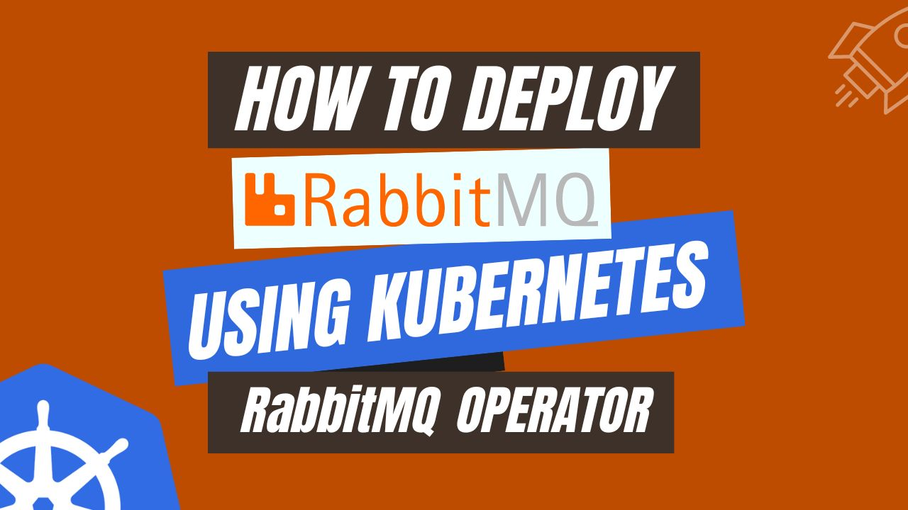
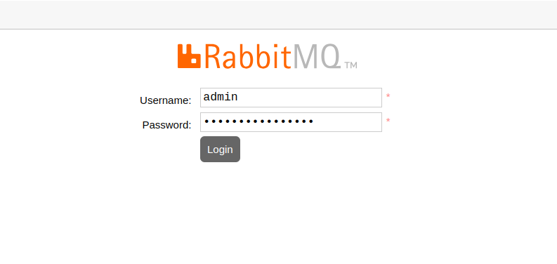
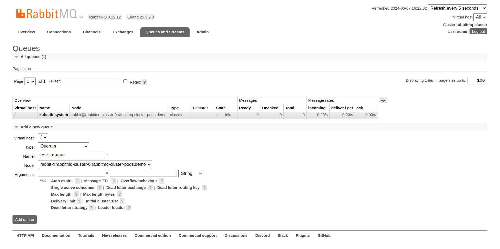
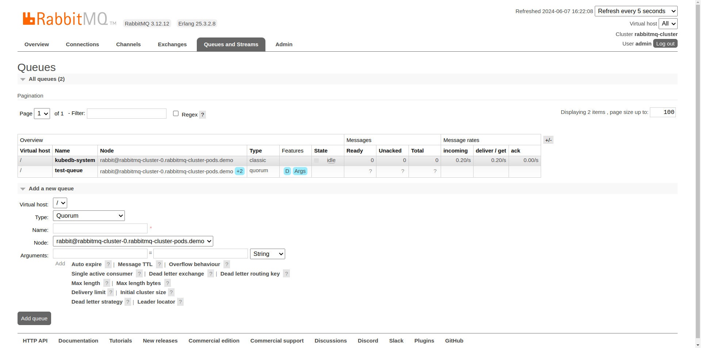
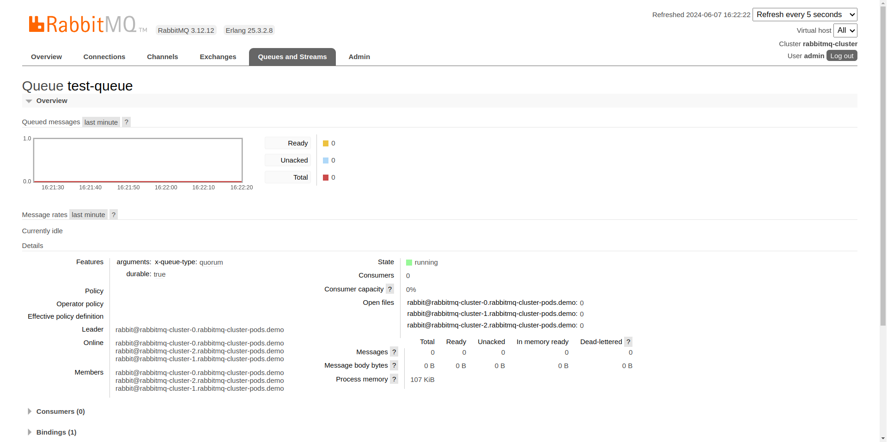
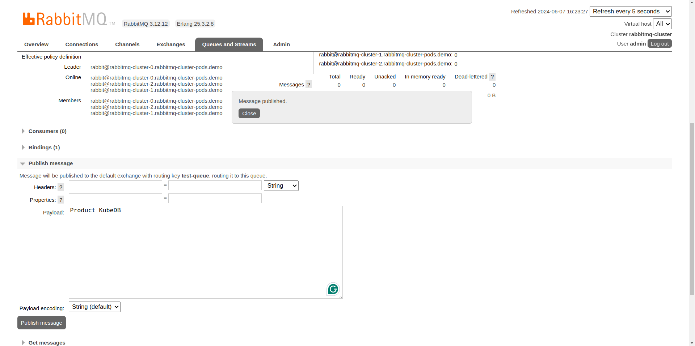
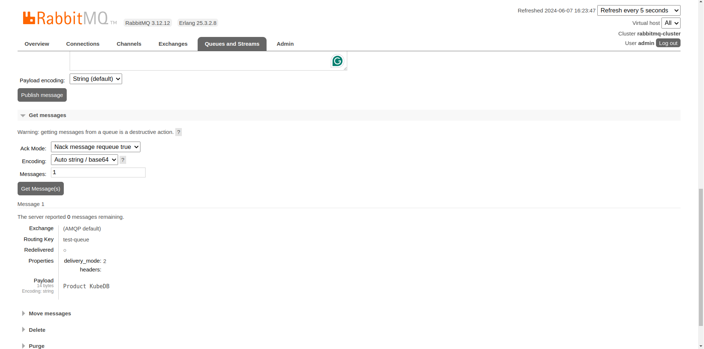
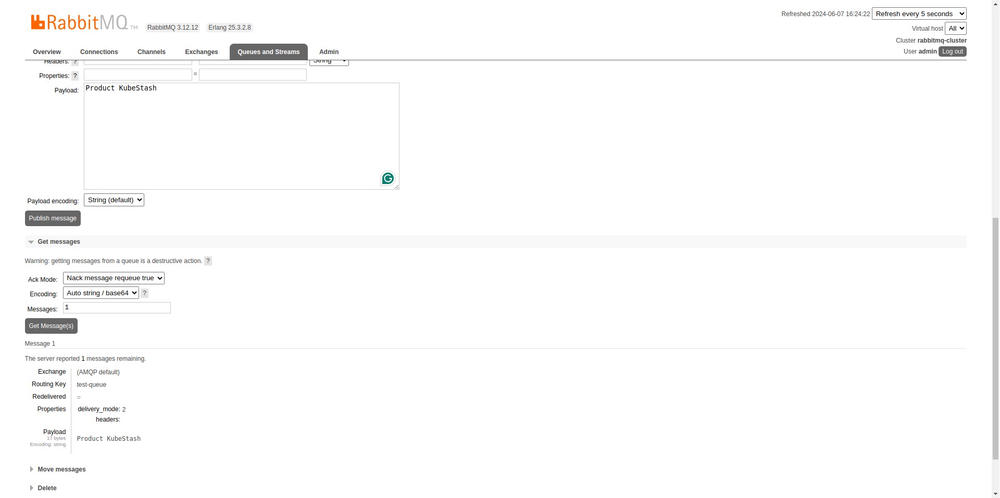
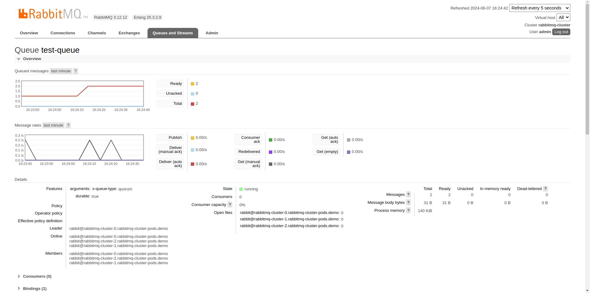

# How to Deploy RabbitMQ using Kubernetes RabbitMQ Operator



When it comes to messaging systems today, RabbitMQ is a heavyweight contender offering both power and versatility. **Kubernetes RabbitMQ** Operator extends Kubernetes with a custom resource definition (CRD) specifically designed for RabbitMQ. With the operator, deploying, managing, and scaling RabbitMQ clusters becomes a breeze within your Kubernetes environment. This article will guide you through the benefits, features, and step-by-step process of deploying RabbitMQ clusters using the RabbitMQ Kubernetes Operator.

While containerized applications offer numerous advantages, managing them can be a challenge. Kubernetes, a powerful open-source technology, simplifies this process. With Kubernetes, deploying and managing applications becomes a breeze, regardless of whether they run on a single server or are distributed across a vast multi-cloud environment.

Kubernetes automates the heavy lifting – load balancing, real-time scaling, and even self-healing app recovery. Developers can simply specify what their applications need to do with a straightforward configuration. Kubernetes takes care of the rest, freeing developers to focus on developing innovative applications. By handling these complexities, Kubernetes empowers users to effortlessly navigate the challenges of modern application deployment.

## Why RabbitMQ in Kubernetes
RabbitMQ, a powerful and versatile open-source message broker, becomes even more effective when deployed on Kubernetes. This dynamic duo offers a perfect blend of flexibility, scalability, and streamlined management, making it ideal for building robust message-driven applications in containerized environments.

At its core, RabbitMQ acts as a central hub, enabling applications to exchange messages asynchronously and reliably. This asynchronous communication style decouples applications, allowing them to operate independently without needing to be aware of each other's availability or processing speed. This promotes a more resilient and scalable architecture, perfect for complex microservices-based systems.

Traditionally, managing RabbitMQ involved dedicated servers, which is complex to handle. Kubernetes revolutionizes this by allowing you to run RabbitMQ within containers. This unlocks the numerous advantages of containerization, including simplified deployment and scaling based on your application's needs, automatic high availability and fault tolerance through pod restarts on healthy nodes, efficient resource allocation, and improved manageability within a unified Kubernetes platform. By combining the strengths of Kubernetes RabbitMQ, you can create a perfect environment for building robust and scalable message-driven applications that meet the demands of modern application development.

## Deploy RabbitMQ on Kubernetes
### Pre-requisites
We have to set up the environment to deploy RabbitMQ on Kubernetes using a [Kubernetes RabbitMQ operator](https://kubedb.com/kubernetes/databases/run-and-manage-rabbitmq-on-kubernetes/). A running Kubernetes cluster and fundamental understanding of RabbitMQ is required to conduct this tutorial. Here we are using [Kind](https://kubernetes.io/docs/tasks/tools/#kind) to create our Kubernetes cluster. Additionally, you should install [Helm](https://helm.sh/docs/intro/install/) to your Kubernetes cluster.

In this tutorial, We will use the Kubernetes RabbitMQ operator [KubeDB](https://kubedb.com/) to deploy RabbitMQ on Kubernetes. We must install KubeDB to our Kubernetes cluster. To set up KubeDB in our Kubernetes cluster, we need a license. We can get a free license using the [Appscode License Server](https://license-issuer.appscode.com/). We should use Kubernetes cluster ID to get a license. Use the following command below to get the cluster ID.

 
```bash
$ kubectl get ns kube-system -o jsonpath='{.metadata.uid}'
8c4498337-358b-4dc0-be52-14440f4e061e
```

The license server will email us with a "license.txt" file attached after we provide the necessary data. Run the following commands listed below to install KubeDB. 

```bash
$ helm install kubedb oci://ghcr.io/appscode-charts/kubedb \
  --version v2024.4.27 \
  --namespace kubedb --create-namespace \
  --set-file global.license=/path/to/the/license.txt \
  --set global.featureGates.RabbitMQ=true \
  --wait --burst-limit=10000 --debug
```

Verify the installation by the following command,

```bash
$ kubectl get pods --all-namespaces -l "app.kubernetes.io/instance=kubedb"
NAMESPACE   NAME                                            READY   STATUS    RESTARTS   AGE
kubedb      kubedb-kubedb-autoscaler-69b46c5c7b-s85w2       1/1     Running   0          3m17s
kubedb      kubedb-kubedb-ops-manager-6f8bd5b9c9-2klvr      1/1     Running   0          3m17s
kubedb      kubedb-kubedb-provisioner-5d778764bb-pd79k      1/1     Running   0          3m17s
kubedb      kubedb-kubedb-webhook-server-fbbfd96bd-479qv    1/1     Running   0          3m17s
kubedb      kubedb-petset-operator-5d94b4ddb8-lwrsd         1/1     Running   0          3m17s
kubedb      kubedb-petset-webhook-server-5f6c89d8c8-lfxvf   2/2     Running   0          3m17s
kubedb      kubedb-sidekick-5d9947bd9-gs4vh                 1/1     Running   0          3m17s
``` 
We can go on to the next stage if every pod status is running.

## Create a Namespace
Now we'll create a new namespace in which we will deploy RabbitMQ. To create a namespace, we can use the following command:

```bash
$ kubectl create namespace demo
namespace/demo created
``` 
## Deploy RabbitMQ via Kubernetes RabbitMQ operator

We need to create a yaml manifest to install RabbitMQ on Kubernetes. And we will apply this yaml below,

```yaml
apiVersion: kubedb.com/v1alpha2
kind: RabbitMQ
metadata:
  name: rabbitmq-cluster
  namespace: demo
spec:
  version: "3.12.12"
  replicas: 3
  storage:
    accessModes:
      - ReadWriteOnce
    resources:
      requests:
        storage: 1Gi
    storageClassName: standard
  storageType: Durable
  terminationPolicy: WipeOut
```

You can see the detailed yaml specifications in the [Kubernetes RabbitMQ](https://kubedb.com/docs/latest/guides/rabbitmq/) documentation.

We will save this yaml configuration to `rabbitmq-cluster.yaml`. Then create the above RabbitMQ object.

```bash
$ kubectl apply -f rabbitmq-cluster.yaml
rabbitmq.kubedb.com/rabbitmq-cluster created
```

If all the above steps are handled correctly and the RabbitMQ is deployed, you will see that the following objects are created:


```bash
$ kubectl get all -n demo
NAME                     READY   STATUS    RESTARTS   AGE
pod/rabbitmq-cluster-0   1/1     Running   0          91s
pod/rabbitmq-cluster-1   1/1     Running   0          29s
pod/rabbitmq-cluster-2   1/1     Running   0          22s

NAME                            TYPE        CLUSTER-IP   EXTERNAL-IP   PORT(S)              AGE
service/rabbitmq-cluster        ClusterIP   10.96.92.2   <none>        15672/TCP,5672/TCP   94s
service/rabbitmq-cluster-pods   ClusterIP   None         <none>        4369/TCP,25672/TCP   94s

NAME                                                  TYPE                  VERSION   AGE
appbinding.appcatalog.appscode.com/rabbitmq-cluster   kubedb.com/rabbitmq   3.12.12   91s
```

We have successfully deployed RabbitMQ to Kubernetes using the Kubernetes RabbitMQ operator. First, check the status of the `rabbitmq-cluster` to determine if it is ready.

```bash
$ kubectl get rabbitmq -n demo rabbitmq-cluster
NAME               TYPE                  VERSION   STATUS   AGE
rabbitmq-cluster   kubedb.com/v1alpha2   3.12.12   Ready    119s
```
## Connect with RabbitMQ UI

We will use [port forwarding](https://kubernetes.io/docs/tasks/access-application-cluster/port-forward-access-application-cluster/) to connect with RabbitMQ.

#### Port-forward the Service

KubeDB will create few Services to connect with the RabbitMQ. Let’s check the Services by following command,

```bash
$ kubectl get service -n demo
NAME                    TYPE        CLUSTER-IP   EXTERNAL-IP   PORT(S)              AGE
rabbitmq-cluster        ClusterIP   10.96.92.2   <none>        15672/TCP,5672/TCP   4m52s
rabbitmq-cluster-pods   ClusterIP   None         <none>        4369/TCP,25672/TCP   4m52s
```
Here, we are going to use `rabbitmq-cluster` Service to connect with the database. Now, let’s port-forward the `rabbitmq-cluster` Service to the port `9200` to local machine:

```bash
$ kubectl port-forward -n demo svc/rabbitmq-cluster 15672
Forwarding from 127.0.0.1:15672 -> 15672
Forwarding from [::1]:15672 -> 15672
```
Now, our RabbitMQ UI is accessible at `localhost:15672`.

### Accessing RabbitMQ Through UI

To access RabbitMQ through the UI, we first need the login credentials.

#### Get the Credentials

KubeDB create some Secrets for the database. Let’s check which Secrets have been created by KubeDB for our `rabbitmq-cluster`.

```bash
$ kubectl get secret -n demo
NAME                             TYPE                       DATA   AGE
rabbitmq-cluster-admin-cred      kubernetes.io/basic-auth   2      9m8s
rabbitmq-cluster-config          Opaque                     2      9m8s
rabbitmq-cluster-erlang-cookie   Opaque                     1      9m8s
```
Now, we can use `rabbitmq-cluster-admin-cred` which contains the admin level credentials to connect with the RabbitMQ. You can obtain these credentials by running the following commands:

```bash
$ kubectl get secret -n demo rabbitmq-cluster-admin-cred -o jsonpath='{.data.username}' | base64 -d
admin
$ kubectl get secret -n demo rabbitmq-cluster-admin-cred -o jsonpath='{.data.password}' | base64 -d
eA)BA;gzeK)yM6)T
```
With the credentials in hand, open your web browser and navigate to `http://localhost:15672/`. You will see the RabbitMQ login panel. Enter the username `admin` and the password `eA)BA;gzeK)yM6)T` to access the RabbitMQ UI.



Once logged in, click on the `Queues & Streams` section to manage queues. Here, we are going to add a new queue named `test-queue`.





After creating the queue, click on `test-queue` to view its overview. This section provides various details and actions for managing the queue.



Next, navigate to the `Publish message` section to publish some test messages to `test-queue`. Enter the message details in the `payload` field and click the `Publish message` button to publish the message.



To retrieve the messages you have just published, go to the `Get messages` section of `test-queue`. Click the `Get Message(s)` button, and the messages will be fetched from the queue.



You can repeat the process of publishing and getting messages to see how RabbitMQ handles them.



Finally, the statistics in the overview section of `test-queue` will show the number of messages and other relevant information after your interactions.



So, We’ve successfully deployed RabbitMQ on Kubernetes via **Kubernetes RabbitMQ operator** KubeDB. Additionally, we have accessed the RabbitMQ UI for publishing and consuming messages.


## RabbitMQ on Kubernetes: Best Practices
To guarantee the smooth operation of your RabbitMQ applications within Kubernetes, consider implementing these best practices:

* **Security Configurations:** Prioritize robust security measures such as encryption for data in transit and at rest, authentication to control user access, and authorization to define permissions. Utilize Kubernetes Secrets to securely store sensitive information like passwords and certificates, keeping them out of plain sight.

* **Monitoring and Observability:** Implement comprehensive monitoring using tools like Prometheus and Grafana to track RabbitMQ cluster health, including queue lengths, message throughput, and resource utilization. Integrate centralized logging for streamlined debugging and troubleshooting. 

* **Disaster Recovery Strategy:** Establish a disaster recovery plan to ensure your RabbitMQ cluster remains operational even in the face of failures. This plan should include regular backups of RabbitMQ data and configurations, allowing for swift recovery. Regularly test your backups and restore procedures to guarantee their effectiveness. 

* **Using the Kubernetes RabbitMQ Operator:** Kubernetes RabbitMQ Operator offers an efficient approach to installing and managing RabbitMQ within a Kubernetes cluster. Acting as a controller, the Operator integrates operational insights, automates administrative tasks, and simplifies the deployment and scaling of RabbitMQ instances. This enhances operational efficiency and reduces the administrative burden, making it a highly effective solution for Kubernetes-based environments.

## Conclusion

RabbitMQ is a versatile and high-performance message broker, widely used for reliable messaging across various applications and services. Deploying RabbitMQ on Kubernetes, facilitated by the RabbitMQ Kubernetes Operator, represents a significant advancement in managing distributed messaging systems. This guide has successfully equipped you with the knowledge to deploy RabbitMQ on Kubernetes using the Kubernetes RabbitMQ Operator, an ideal solution for a wide range of deployment scenarios. For further details, you can visit the official [RabbitMQ documentation](https://www.rabbitmq.com/docs). Achieving optimal efficiency and availability in messaging operations requires expertise and commitment to the best practices. The RabbitMQ Kubernetes Operator KubeDB provides robust support, ensuring that your messaging infrastructure meets the highest standards of performance and reliability, whether on-premises, across multiple regions, or in the cloud.


