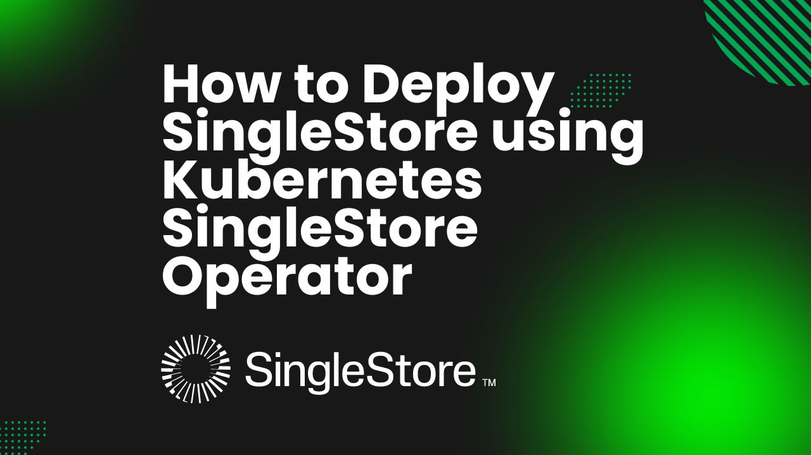

# How to Deploy SingleStore using Kubernetes SingleStore Operator



In today's data-driven world, high-performance, scalable databases are essential for businesses to thrive. SingleStore, a distributed SQL database, excels at handling complex workloads demanding both transactional and analytical processing. Integrating SingleStore with Kubernetes unlocks the full potential of both technologies, enabling you to build and scale robust, data-driven applications with ease.

Kubernetes has revolutionized application deployment and management. By leveraging Kubernetes orchestration capabilities, you can efficiently scale, update, and monitor your applications. This powerful platform provides the ideal foundation for deploying and managing modern databases.

To simplify the deployment and management of SingleStore clusters on Kubernetes, the **Kubernetes SingleStore** Operator comes to the rescue. This operator extends functionality of Kubernetes to manage SingleStore clusters as declarative resources, making it easier to deploy, configure, and operate your database infrastructure. In this article, we'll dive into the process of deploying SingleStore using the Kubernetes SingleStore Operator, exploring its benefits and providing step-by-step instructions.

## Why SingleStore in Kubernetes
SingleStore is a high-performance distributed SQL database capable of handling both transactional and analytical workloads with exceptional speed and scale. To fully unleash its potential, integrating SingleStore with Kubernetes is a strategic decision.

SingleStore’s in-memory architecture and distributed design enable it to process vast amounts of data in real-time, making it an ideal choice for applications demanding low latency and high throughput. When deployed on Kubernetes, SingleStore benefits from the platform’s self-healing capabilities, load balancing, and automatic scaling, ensuring optimal performance and availability.

Kubernetes provides a flexible and dynamic environment for deploying and managing applications, including databases. By running SingleStore on Kubernetes, organizations can easily scale their database infrastructure to meet changing demands, reducing operational overhead and improving resource utilization. Additionally, Kubernetes simplifies the management of complex database deployments, such as rolling updates and canary deployments, ensuring minimal disruption to services. The integration of SingleStore and Kubernetes creates a powerful combination, enabling organizations to build modern, data-driven applications that can handle increasing data volumes and complexity.

## Deploy SingleStore on Kubernetes
### Pre-requisites

We have to set up the environment to deploy SingleStore on Kubernetes using a [Kubernetes SingleStore Operator](https://kubedb.com/kubernetes/databases/run-and-manage-singlestore-on-kubernetes/). First, you must have a functional Kubernetes cluster. In this guide, we’ll create our cluster using [Kind](https://kubernetes.io/docs/tasks/tools/#kind). Additionally, you should have a basic understanding of SingleStore, as this will help you navigate the deployment process more effectively. Additionally, you should install [Helm](https://helm.sh/docs/intro/install/) to your Kubernetes cluster, as it is necessary for managing packages. 

This guide utilizes the Kubernetes SingleStore operator [KubeDB](https://kubedb.com/), so you’ll need to have KubeDB installed in your Kubernetes environment. To use KubeDB, you’ll also require a license, which you can obtain for free from the [Appscode License Server](https://appscode.com/issue-license/).

To get a license, use your Kubernetes cluster ID. Run the following command to retrieve your cluster ID:
 
```bash
$ kubectl get ns kube-system -o jsonpath='{.metadata.uid}'
250a26e3-2413-4ed2-99dc-57b0548407ff
```

The license server will email us with a "license.txt" file attached after we provide the necessary data. Run the following commands listed below to install KubeDB. 

```bash
$ helm install kubedb oci://ghcr.io/appscode-charts/kubedb \
  --version v2024.6.4 \
  --namespace kubedb --create-namespace \
  --set-file global.license=/path/to/the/license.txt \
  --set global.featureGates.Singlestore=true \
  --wait --burst-limit=10000 --debug
```

Verify the installation by the following command,

```bash
$ kubectl get pods --all-namespaces -l "app.kubernetes.io/instance=kubedb"
NAMESPACE   NAME                                            READY   STATUS    RESTARTS      AGE
kubedb      kubedb-kubedb-autoscaler-849f7b8d8-26xdx        1/1     Running   0             67s
kubedb      kubedb-kubedb-ops-manager-9f46c95b6-ffd6x       1/1     Running   0             67s
kubedb      kubedb-kubedb-provisioner-7cd66fc98c-cf8mm      1/1     Running   0             67s
kubedb      kubedb-kubedb-webhook-server-78f9bc4c6f-fsgx2   1/1     Running   0             67s
kubedb      kubedb-petset-operator-77b6b9897f-px2l2         1/1     Running   0             67s
kubedb      kubedb-petset-webhook-server-58df6f6488-lhtvl   2/2     Running   0             67s
kubedb      kubedb-sidekick-c898cff4c-w22l8                 1/1     Running   0             67s
``` 
We can go on to the next stage if every pod status is running.


### Create SingleStore License Secret
First, we need to create a namespace for our SingleStore deployment. Open your terminal and run the following command:

```bash
$ kubectl create namespace ss-demo
namespace/ss-demo created
```
Next, you’ll need a [SingleStore license](https://www.singlestore.com/self-managed-standard/) to create the SingleStore database. Ensure that you have acquired a license, then create a secret to store your license information. Run the following command, replacing `your-license-here` with your actual license key:

```bash
$ kubectl create secret generic -n ss-demo license-secret \
    --from-literal=username=license \
    --from-literal=password='your-license-here'
```
With the namespace and license secret created, we can now deploy the SingleStore cluster.

## Deploy SingleStore Cluster

Here is the yaml of the SingleStore CR we are going to use:

```yaml
apiVersion: kubedb.com/v1alpha2
kind: Singlestore
metadata:
  name: singlestore-cluster
  namespace: ss-demo
spec:
  version: "8.5.7"
  topology:
    aggregator:
      replicas: 2
      podTemplate:
        spec:
          containers:
          - name: singlestore
            resources:
              limits:
                memory: "2Gi"
                cpu: "600m"
              requests:
                memory: "2Gi"
                cpu: "600m"
      storage:
        storageClassName: "standard"
        accessModes:
        - ReadWriteOnce
        resources:
          requests:
            storage: 1Gi
    leaf:
      replicas: 3
      podTemplate:
        spec:
          containers:
            - name: singlestore
              resources:
                limits:
                  memory: "2Gi"
                  cpu: "600m"
                requests:
                  memory: "2Gi"
                  cpu: "600m"                      
      storage:
        storageClassName: "standard"
        accessModes:
          - ReadWriteOnce
        resources:
          requests:
            storage: 10Gi
  licenseSecret:
    name: license-secret
  storageType: Durable
  deletionPolicy: WipeOut
```

You can see the detailed yaml specifications in the [Kubernetes SingleStore documentation](https://kubedb.com/docs/latest/guides/singlestore/).

Let's save this yaml configuration into `singlestore-cluster.yaml`
Then create the above SingleStore CR,

```bash
$ kubectl apply -f singlestore-cluster.yaml
singlestore.kubedb.com/singlestore-cluster created
```

Once these are handled correctly and the SingleStore cluster is deployed, you will see that the following objects are created:

```bash
$ kubectl get all -n ss-demo
NAME                                   READY   STATUS    RESTARTS   AGE
pod/singlestore-cluster-aggregator-0   2/2     Running   0          4m55s
pod/singlestore-cluster-aggregator-1   2/2     Running   0          2m38s
pod/singlestore-cluster-leaf-0         2/2     Running   0          4m52s
pod/singlestore-cluster-leaf-1         2/2     Running   0          2m40s
pod/singlestore-cluster-leaf-2         2/2     Running   0          2m1s

NAME                               TYPE        CLUSTER-IP      EXTERNAL-IP   PORT(S)             AGE
service/singlestore-cluster        ClusterIP   10.128.124.98   <none>        3306/TCP,8081/TCP   4m59s
service/singlestore-cluster-pods   ClusterIP   None            <none>        3306/TCP            4m59s

NAME                                                     TYPE                     VERSION   AGE
appbinding.appcatalog.appscode.com/singlestore-cluster   kubedb.com/singlestore   8.5.7     74s
```
We have successfully deployed SingleStore to Kubernetes using the Kubernetes SingleStore operator. First, check the status of the `singlestore-cluster` to determine if it is ready.

```bash
$ kubectl get singlestore -n ss-demo singlestore-cluster
NAME                  TYPE                  VERSION   STATUS   AGE
singlestore-cluster   kubedb.com/v1alpha2   8.5.7     Ready    5m45s
```

### Accessing Database Through CLI

To access the database through CLI, we have to get the credentials to access. KubeDB will create Secret and Service for the database `singlestore-cluster` that we have deployed. Let’s check them using the following commands,

```bash
$ kubectl get secret -n ss-demo -l=app.kubernetes.io/instance=singlestore-cluster
NAME                            TYPE                       DATA   AGE
singlestore-cluster-root-cred   kubernetes.io/basic-auth   2      8m20s

$ kubectl get service -n ss-demo -l=app.kubernetes.io/instance=singlestore-cluster
NAME                       TYPE        CLUSTER-IP      EXTERNAL-IP   PORT(S)             AGE
singlestore-cluster        ClusterIP   10.128.124.98   <none>        3306/TCP,8081/TCP   8m55s
singlestore-cluster-pods   ClusterIP   None            <none>        3306/TCP            8m55s
```

Now, we are going to use `singlestore-cluster-root-cred` to get the credentials.

```bash
$ kubectl get secrets -n ss-demo singlestore-cluster-root-cred -o jsonpath='{.data.username}' | base64 -d
root

$ kubectl get secrets -n ss-demo singlestore-cluster-root-cred -o jsonpath='{.data.password}' | base64 -d
JpQuApDXJ3jJ3TwV
```

#### Insert Sample Data

In this section, we are going to login into our SingleStore database pod and insert some sample data.

```bash
$ kubectl exec -it singlestore-cluster-aggregator-0 -n ss-demo -- bash
Defaulted container "singlestore" out of: singlestore, singlestore-coordinator, singlestore-init (init)
[memsql@singlestore-cluster-aggregator-0 /]$ memsql -uroot -p"JpQuApDXJ3jJ3TwV"

Server version: 5.7.32 SingleStoreDB source distribution (compatible; MySQL Enterprise & MySQL Commercial)

Copyright (c) 2000, 2022, Oracle and/or its affiliates.

Oracle is a registered trademark of Oracle Corporation and/or its
affiliates. Other names may be trademarks of their respective
owners.

Type 'help;' or '\h' for help. Type '\c' to clear the current input statement.

singlestore> SHOW DATABASES;
+--------------------+
| Database           |
+--------------------+
| cluster            |
| information_schema |
| memsql             |
| singlestore_health |
+--------------------+
4 rows in set (0.00 sec)

singlestore> CREATE DATABASE Music PARTITIONS 2;
Query OK, 1 row affected (3.35 sec)

singlestore> SHOW DATABASES;
+--------------------+
| Database           |
+--------------------+
| Music              |
| cluster            |
| information_schema |
| memsql             |
| singlestore_health |
+--------------------+
5 rows in set (0.00 sec)

singlestore> CREATE TABLE Music.Artist (id INT(6) UNSIGNED AUTO_INCREMENT PRIMARY KEY, Name VARCHAR(50), Song VARCHAR(50));
Query OK, 0 rows affected, 1 warning (0.23 sec)

singlestore> INSERT INTO Music.Artist (Name, Song) VALUES ("John Denver", "Take Me Home, Country Roads");
Query OK, 1 row affected (1.10 sec)

singlestore> SELECT * FROM Music.Artist;
+----+-------------+-----------------------------+
| id | Name        | Song                        |
+----+-------------+-----------------------------+
|  1 | John Denver | Take Me Home, Country Roads |
+----+-------------+-----------------------------+
1 row in set (0.11 sec)

singlestore> exit
Bye
```

> We’ve successfully deployed SingleStore to Kubernetes using the SingleStore Kubernetes Operator, KubeDB. Additionally, we accessed SingleStore and inserted some sample data.

## SingleStore on Kubernetes: Best Practices
To ensure the smooth operation of your SingleStore applications within Kubernetes, consider implementing these best practices:

* **Optimize Resource Utilization:** Effectively manage SingleStore resources for optimal performance and cost efficiency. Accurately determine and allocate CPU, memory, and storage requirements based on workload characteristics. Leverage Kubernetes Horizontal Pod Autoscaler (HPA) to dynamically adjust resources in response to changing demands.

* **Implement High Availability:** Ensure continuous SingleStore operations by implementing robust high availability strategies. Deploy SingleStore in a multi-node cluster with appropriate replication factors. Utilize Kubernetes StatefulSets and persistent storage to protect against data loss and node failures. Implement comprehensive backup and recovery procedures.

* **Security Configurations:** Safeguard your SingleStore environment by implementing stringent security measures. Protect data confidentiality, integrity, and availability through network segmentation, data encryption, and role-based access control. Comply with industry regulations and compliance standards.

* **Monitoring and Observability:** Gain insights into SingleStore performance and health through comprehensive monitoring. Track key metrics, identify performance bottlenecks, and optimize query execution plans. Implement alerting mechanisms to proactively address issues.

* **Using the Kubernetes SingleStore Operator:** The Kubernetes SingleStore Operator simplifies the management of SingleStore clusters within Kubernetes environments. By automating deployment, scaling, and configuration tasks, the operator significantly reduces administrative overhead. It provides a declarative approach to managing SingleStore, enabling easier configuration and scaling. Additionally, the operator offers valuable insights into cluster health and performance, aiding in troubleshooting and optimization.

## Conclusion

SingleStore, known for its high-performance capabilities in managing real-time data workloads, offers a compelling solution for organizations seeking both speed and scalability in their database operations. Deploying SingleStore with Kubernetes using the SingleStore Operator streamlines the process, bringing together the power of a distributed SQL database and the flexibility of container orchestration. This approach enhances your deployment with automated provisioning, seamless scaling, and robust management, ensuring high availability and performance. For more details about SingleStore, visit the [SingleStore documentation](https://docs.singlestore.com/). Adopting best practices in database management, especially in a dynamic environment like Kubernetes, is crucial for achieving optimal efficiency and reliability. The Kubernetes SingleStore Operator KubeDB makes it easier to maintain these standards, supporting your infrastructure whether it’s on-premises or in the cloud. By leveraging this combination, you ensure that your database operations remain agile, resilient, and capable of meeting the demands of modern data-driven applications.
