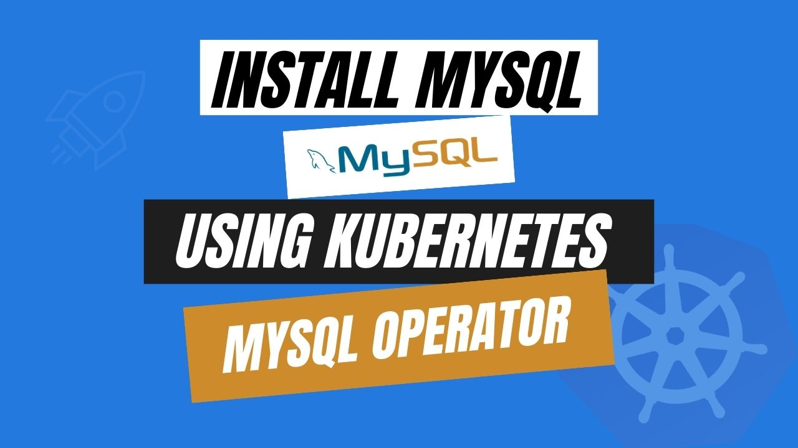

# Install MySQL using Kubernetes MySQL Operator



In the modern landscape of containerized applications and orchestration, deploying and managing relational databases like MySQL requires a dynamic and efficient approach. The **Kubernetes MySQL** Operator streamlines the process of deploying, managing, and scaling MySQL databases within a Kubernetes environment. This article covers the fundamentals of installing MySQL databases using the MySQL Kubernetes Operator, exploring its benefits, features, and step-by-step procedures. By leveraging this, you can achieve greater flexibility and automation in provisioning and maintaining your MySQL databases while following to the best practices of containerized infrastructure.

Imagine orchestrating the deployment of applications spread around a vast cloud infrastructure without the headache of managing each server individually. Kubernetes is a game-changing open-source platform that reduces the complexity of containerized applications. With Kubernetes, you gain the power to effortlessly deploy, scale, and manage applications, regardless of whether they run on a single machine or span a multi-cloud environment.

Kubernetes eliminates the challenges of juggling countless containers by automating tasks like load balancing, scaling based on real-time demands, and ensuring application resilience through automatic healing. Have a new version of your app to release? Kubernetes gracefully handles updates, minimizing downtime and reducing the risk of errors.

By using a simple declarative configuration, you define how your application should behave, and Kubernetes takes care of making sure it actually behaves that way. This means you can focus on crafting stellar applications while Kubernetes ensures they run reliably and efficiently. Now, people can say goodbye to manual provisioning and troubleshooting; Kubernetes empowers them to conquer the complexities of modern application deployment with finesse.

## Why MySQL in Kubernetes
MySQL is a resilient and versatile relational database management system (RDBMS) that offers a broad spectrum of capabilities and functionalities. MySQL employs a structured approach, allowing efficient data retrieval based on relationships within the database. As one of the leading open-source databases globally, MySQL is a favored choice, particularly for web-based applications. It excels in managing substantial data loads and accommodating numerous simultaneous connections, making it highly suitable for content management systems and e-commerce platforms.


The scalability aspect of MySQL simplifies the management of expanding data volumes and user numbers as your website or application grows. Beyond being fully compliant with ACID principles – Atomicity, Consistency, Isolation, and Durability – MySQL excels in transaction handling. The ACID standard evaluates a database's ability to ensure timely completion of transactions, crucial for applications prioritizing data integrity and consistency. Moreover, MySQL incorporates robust security measures including authentication and encryption for safeguarding sensitive information. It also supports role-based access control, granting precise control over data access and modification privileges.

The integration of Kubernetes MySQL is a powerful solution in modern application management, offering numerous benefits that transform traditional database management. Combining Kubernetes MySQL allows for seamless scalability and elasticity, ensuring optimal performance during high-demand periods while efficiently using resources during low-demand times. Built-in high availability and resilience of Kubernetes extends MySQL, enhancing data store reliability through failover and recovery mechanisms. Additionally, Kubernetes simplifies backup and disaster recovery, optimizes resource utilization, and streamlines development and testing processes. This integration aligns well with DevOps principles and provides flexibility across various environments, making it a strategic choice for modern IT landscapes.

## Install MySQL on Kubernetes
### Pre-requisites
We have to set up the environment to install MySQL on Kubernetes using a Kubernetes MySQL operator. A running Kubernetes cluster and a fundamental understanding of MySQL queries are required to conduct this tutorial. Here we are using [Kind](https://kubernetes.io/docs/tasks/tools/#kind) to create our Kubernetes cluster. Additionally, you should install [Helm](https://helm.sh/docs/intro/install/) to your Kubernetes cluster.

In this tutorial, We will use the Kubernetes MySQL operator [KubeDB](https://kubedb.com/) to install MySQL on Kubernetes. In our Kubernetes cluster, we must install KubeDB. To set up KubeDB in our Kubernetes cluster, we need a license. Through the [Appscode License Server](https://license-issuer.appscode.com/), we can get a free enterprise license. We must provide our Kubernetes cluster ID to obtain a license. Run the following command below to get the cluster ID.

 
```bash
$ kubectl get ns kube-system -o jsonpath='{.metadata.uid}'
8e336615-0dbb-4ae8-b72f-2e7ec34c399d
```

The license server will email us with a "license.txt" file attached after we provide the necessary data. Run the following commands listed below to install KubeDB. 

```bash
$ helm install kubedb oci://ghcr.io/appscode-charts/kubedb \
  --version v2023.12.11 \
  --namespace kubedb --create-namespace \
  --set-file global.license=/path/to/the/license.txt \
  --wait --burst-limit=10000 --debug
```

Verify the installation by the following command,

```bash
$ kubectl get pods --all-namespaces -l "app.kubernetes.io/instance=kubedb"
NAMESPACE   NAME                                            READY   STATUS    RESTARTS     AGE
kubedb      kubedb-kubedb-autoscaler-6d45d7d4df-cchnj       1/1     Running   0            94s
kubedb      kubedb-kubedb-dashboard-74879c5f86-rbrln        1/1     Running   0            94s
kubedb      kubedb-kubedb-ops-manager-c7cc578c5-l9jds       1/1     Running   0            94s
kubedb      kubedb-kubedb-provisioner-5ffc8fdb9f-7cglg      1/1     Running   0            94s
kubedb      kubedb-kubedb-schema-manager-68f845bbb6-4jwnf   1/1     Running   0            94s
kubedb      kubedb-kubedb-webhook-server-6fdd5b4857-v8tn5   1/1     Running   0            93s
``` 
We can go on to the next stage if every pod status is running.

## Create a Namespace
Now we'll create a new namespace in which we will install MySQL. To create a namespace, we can use the following command:

```bash
$ kubectl create namespace ms-demo
namespace/ms-demo created
``` 
## Install MySQL via Kubernetes MySQL operator

We need to create a yaml manifest to install MySQL on Kubernetes. And we will apply this yaml below,

```yaml
apiVersion: kubedb.com/v1alpha2
kind: MySQL
metadata:
  name: sample-mysql
  namespace: ms-demo
spec:
  version: "8.0.32"
  replicas: 3
  topology:
    mode: GroupReplication
  storageType: Durable
  storage:
    storageClassName: "standard"
    accessModes:
      - ReadWriteOnce
    resources:
      requests:
        storage: 1Gi
  terminationPolicy: WipeOut
```

You can see the detailed yaml specifications in the [Kubernetes MySQL](https://kubedb.com/docs/latest/guides/mysql/concepts/database/) documentation.

We will save this yaml configuration to `sample-mysql.yaml`. Then create the above MySQL object.

```bash
$ kubectl create -f sample-mysql.yaml
mysql.kubedb.com/sample-mysql created
```

If all the above steps are handled correctly and the MySQL is deployed, you will see that the following objects are created:


```bash
$ kubectl get all -n ms-demo
NAME                 READY   STATUS    RESTARTS   AGE
pod/sample-mysql-0   2/2     Running   0          2m34s
pod/sample-mysql-1   2/2     Running   0          2m3s
pod/sample-mysql-2   2/2     Running   0          85s

NAME                           TYPE        CLUSTER-IP      EXTERNAL-IP   PORT(S)    AGE
service/sample-mysql           ClusterIP   10.100.24.208   <none>        3306/TCP   2m38s
service/sample-mysql-pods      ClusterIP   None            <none>        3306/TCP   2m38s
service/sample-mysql-standby   ClusterIP   10.100.11.2     <none>        3306/TCP   2m38s

NAME                            READY   AGE
statefulset.apps/sample-mysql   3/3     2m41s

NAME                                              TYPE               VERSION   AGE
appbinding.appcatalog.appscode.com/sample-mysql   kubedb.com/mysql   8.0.32    2m44s

NAME                            VERSION   STATUS   AGE
mysql.kubedb.com/sample-mysql   8.0.32    Ready    2m59s
```

We have successfully deployed MySQL to Kubernetes via the Kubernetes MySQL operator. Now, we will connect to the MySQL database to insert some sample data and verify whether our MySQL is usable or not. First, check the database status,

```bash
$ kubectl get mysql -n ms-demo sample-mysql
NAME           VERSION   STATUS   AGE
sample-mysql   8.0.32    Ready    3m37s
```

In order to connect to the database, we required to obtain the appropriate credentials here. We need to access the `Secret` and `Service` for the database `sample-mysql` created by KubeDB. Using the commands below, let's check them,

```bash
$ kubectl get secret -n ms-demo -l=app.kubernetes.io/instance=sample-mysql
NAME                TYPE                       DATA   AGE
sample-mysql-auth   kubernetes.io/basic-auth   2      3m57s

$ kubectl get service -n ms-demo -l=app.kubernetes.io/instance=sample-mysql
NAME                   TYPE        CLUSTER-IP      EXTERNAL-IP   PORT(S)    AGE
sample-mysql           ClusterIP   10.100.24.208   <none>        3306/TCP   4m10s
sample-mysql-pods      ClusterIP   None            <none>        3306/TCP   4m10s
sample-mysql-standby   ClusterIP   10.100.11.2     <none>        3306/TCP   4m10s
``` 

Now, we are going to use `sample-mysql-auth` to get the credentials.

```bash
$ kubectl get secrets -n ms-demo sample-mysql-auth -o jsonpath='{.data.username}' | base64 -d
root

$ kubectl get secrets -n ms-demo sample-mysql-auth -o jsonpath='{.data.password}' | base64 -d
R9etGyj4v(KP6URi
```

## Insert sample data to the MySQL database
Now, we will connect to the MySQL database using the required credentials and insert some sample data,

```bash
$ kubectl exec -it sample-mysql-0 -n ms-demo -c mysql -- bash

bash-4.4# mysql --user=root --password='R9etGyj4v(KP6URi'
Welcome to the MySQL monitor.  Commands end with ; or \g.

mysql> CREATE DATABASE Music;
Query OK, 1 row affected (0.02 sec)

mysql> SHOW DATABASES;
+--------------------+
| Database           |
+--------------------+
| Music              |
| information_schema |
| kubedb_system      |
| mysql              |
| performance_schema |
| sys                |
+--------------------+
6 rows in set (0.00 sec)

mysql> CREATE TABLE Music.Artist (id INT(6) UNSIGNED AUTO_INCREMENT PRIMARY KEY, Name VARCHAR(50), Song VARCHAR(25));
Query OK, 0 rows affected (0.05 sec)

mysql> INSERT INTO Music.Artist (Name, Song) VALUES ("John Denver", "Country Roads");
Query OK, 1 row affected (0.01 sec)

mysql> SELECT * FROM Music.Artist;
+----+-------------+---------------+
| id | Name        | Song          |
+----+-------------+---------------+
|  1 | John Denver | Country Roads |
+----+-------------+---------------+
1 row in set (0.00 sec)

mysql> exit
Bye
```
We’ve successfully Installed MySQL to Kubernetes via **Kubernetes MySQL operator** KubeDB. Additionally, we establish a database connection and add some test data to it.

## MySQL on Kubernetes: Best Practices
To ensure the stability of your application while using MySQL on Kubernetes, there are some best practices that you should follow:

* **Using the Kubernetes MySQL Operator:** The Kubernetes MySQL Operator should be used to simplify MySQL installation and administration within a Kubernetes cluster. Kubernetes operators serve as controllers that package the practical expertise of the application, automating managerial duties. The Kubernetes MySQL Operator eases the setup and expansion of MySQL instances, alleviating the workload on database administrators.

* **High Availability:** Configure MySQL for high availability using solutions like MySQL Group Replication to minimize downtime in the event of node failures and ensure continuous service availability.

* **Monitoring and Logging:** Implement robust monitoring and logging solutions like Prometheus and Grafana to collect and visualize MySQL performance metrics, helping you proactively identify and address issues.

* **Regular Backups:**  Set up regular backups of your MySQL data and store backups securely to ensure data recoverability in case of failures or disasters.

## Conclusion

MySQL is a widely-used and highly-regarded relational database management system that is well-suited for managing modern data management challenges. Here, you have successfully Installed a MySQL database on Kubernetes using the Kubernetes MySQL operator, which is appropriate for a wide range of use cases. You can visit the official [MySQL documentation](https://dev.mysql.com/doc/) for further details. It requires significant skill and regular practice to manage database operations with the best performance and uptime.  You can utilize KubeDB to assist in managing the entire procedure in a production-grade environment, regardless of whether your database infrastructure is hosted on-premises, regionally distributed, via cloud services, or via database-as-a-service providers.


