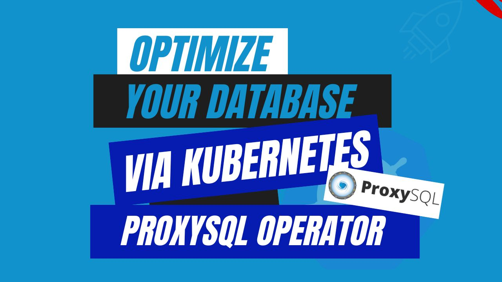

# Optimize Your Database via Kubernetes ProxySQL Operator



As enterprises increasingly adopt containerization and orchestration technologies, operating databases in a dynamic and scalable environment becomes quite challenging. Kubernetes, the popular container orchestration technology, provides powerful features for automating the deployment, scaling, and maintenance of containerized applications. However, when it comes to managing databases in a Kubernetes cluster, specific considerations need to be made to guarantee optimum performance and scalability.

This article explores the importance of ProxySQL in database management in a Kubernetes environment. We’ll go through what ProxySQL is, why it's useful in database management, and best practices for deploying and configuring ProxySQL on Kubernetes. By the end of this article, You will have a thorough understanding of how **Kubernetes ProxySQL** improves your database management in a Kubernetes environment. 

## Advantage of ProxySQL in Kubernetes
ProxySQL is a high-performance open-source SQL proxy that works between applications and databases. It serves as an intermediary layer, manages and optimizes database connections and queries. With ProxySQL, you can load balance queries across multiple database instances, route read and write operations to replicas, and provide failover support.

One of the key reasons to choose ProxySQL is its ability to boost database performance and scalability. By effectively load-balancing queries and connections, ProxySQL distributes the database workload precisely, preventing any single instance from becoming a bottleneck. This load distribution is especially important in a Kubernetes environment, where applications dynamically scale, and the database must keep up with changing demand.

Additionally, ProxySQL provides query caching capabilities, which can significantly minimize database load by providing frequently run queries directly from the cache. This functionality is very useful for read-heavy workloads and can result in significant improvements in application response times.

## Deploying ProxySQL on Kubernetes

### Pre-requisites

We have to set up the environment to deploy ProxySQL on Kubernetes using a Kubernetes ProxySQL operator. You requires to have a running Kubernetes cluster and a basic understanding of ProxySQL. Here we are using [Kind](https://kubernetes.io/docs/tasks/tools/#kind) to create our Kubernetes cluster. Additionally, you should install [Helm](https://helm.sh/docs/intro/install/) to your Kubernetes cluster.

In this tutorial, We will use the Kubernetes ProxySQL operator [KubeDB](https://kubedb.com/) to deploy ProxySQL on Kubernetes. First, We must install KubeDB in our Kubernetes cluster. We requires a license to setup KubeDB in our Kubernetes cluster. We can obtain a free enterprise license via the [Appscode License Server](https://license-issuer.appscode.com/). To obtain the license we must provide our Kubernetes cluster ID. Run the following command to get the cluster ID.

```bash
$ kubectl get ns kube-system -o jsonpath='{.metadata.uid}'
fc435a61-c74b-9243-83a5-f1110ef2462c
```

After providing the required information, we will receive an email from the license server including a `license.txt` file. To install KubeDB, use the following helm commands. 

```bash
$ helm install kubedb oci://ghcr.io/appscode-charts/kubedb \
  --version v2023.12.11 \
  --namespace kubedb --create-namespace \
  --set-file global.license=/path/to/the/license.txt \
  --wait --burst-limit=10000 --debug
```

Verify the KubeDB installation by the following command,

```bash
$ kubectl get pods --all-namespaces -l "app.kubernetes.io/instance=kubedb"
NAMESPACE   NAME                                            READY   STATUS    RESTARTS   AGE
kubedb      kubedb-kubedb-autoscaler-5b8b68c9d9-hqjlz       1/1     Running   0          59s
kubedb      kubedb-kubedb-dashboard-6bfc6fb797-lkl2b        1/1     Running   0          59s
kubedb      kubedb-kubedb-ops-manager-c67d67684-mrgfq       0/1     Running   0          59s
kubedb      kubedb-kubedb-provisioner-54898dd948-tfdd4      1/1     Running   0          59s
kubedb      kubedb-kubedb-schema-manager-fb749f8-ls9xl      1/1     Running   0          59s
kubedb      kubedb-kubedb-webhook-server-85b7fcffd6-vhnpp   1/1     Running   0          59s
``` 
If all of the pod status is running, we can move to the next step.

## Create a Namespace
We will now create a new namespace and deploy the server. The following command can be used to create a namespace:

```bash
$ kubectl create namespace proxydemo
namespace/proxydemo created
``` 

## Deploy MySQL Group Replication
We need to create a yaml manifest to Deploy MySQL on Kubernetes. Here is the yaml manifest we’ll be using,

```yaml
apiVersion: kubedb.com/v1alpha2
kind: MySQL
metadata:
  name: mysql-server
  namespace: proxydemo
spec:
  version: "8.0.32"
  replicas: 3
  topology:
    mode: GroupReplication
  storageType: Durable
  storage:
    storageClassName: "standard"
    accessModes:
      - ReadWriteOnce
    resources:
      requests:
        storage: 1Gi
  terminationPolicy: WipeOut
```

You can see the detailed yaml specifications in the [Kubernetes MySQL](https://kubedb.com/docs/latest/guides/mysql/concepts/database/) documentation.

We will save this yaml configuration to `mysql-server.yaml`. Then create the above MySQL object.

```bash
$ kubectl create -f mysql-server.yaml
mysql.kubedb.com/mysql-server created
```

Let’s check if the server is ready to use,

```bash
$ kubectl get mysql -n proxydemo mysql-server
NAME           VERSION   STATUS   AGE
mysql-server   8.0.32    Ready    3m21s
```

## Deploy ProxySQL Cluster
We will use KubeDB to deploy the ProxySQL cluster. Here is the yaml manifest that will be used.

```yaml
apiVersion: kubedb.com/v1alpha2
kind: ProxySQL
metadata:
  name: proxy-server
  namespace: proxydemo
spec:
  version: "2.4.4-debian"
  replicas: 3
  mode: GroupReplication
  backend:
      name: mysql-server
  syncUsers: true
  terminationPolicy: WipeOut
```
You can see the detailed yaml specifications in the [Kubernetes ProxySQL](https://kubedb.com/docs/latest/guides/proxysql/concepts/proxysql/) documentation.

We will save this yaml configuration to `proxy-server.yaml`. Then create the above ProxySQL object.

```bash
$ kubectl create -f proxy-server.yaml
proxysql.kubedb.com/proxy-server created
```

If all of the previous steps are followed correctly, and MySQL and ProxySQL are deployed, the following objects will be created:


```bash
$ kubectl get all -n proxydemo
NAME                 READY   STATUS    RESTARTS   AGE
pod/mysql-server-0   2/2     Running   0          9m13s
pod/mysql-server-1   2/2     Running   0          8m42s
pod/mysql-server-2   2/2     Running   0          6m3s
pod/proxy-server-0   1/1     Running   0          3m19s
pod/proxy-server-1   1/1     Running   0          3m10s
pod/proxy-server-2   1/1     Running   0          84s

NAME                           TYPE        CLUSTER-IP     EXTERNAL-IP   PORT(S)             AGE
service/mysql-server           ClusterIP   10.0.47.68     <none>        3306/TCP            9m14s
service/mysql-server-pods      ClusterIP   None           <none>        3306/TCP            9m14s
service/mysql-server-standby   ClusterIP   10.0.111.109   <none>        3306/TCP            9m14s
service/proxy-server           ClusterIP   10.0.102.106   <none>        6033/TCP            3m19s
service/proxy-server-pods      ClusterIP   None           <none>        6032/TCP,6033/TCP   3m19s

NAME                            READY   AGE
statefulset.apps/mysql-server   3/3     9m15s
statefulset.apps/proxy-server   3/3     3m21s

NAME                                              TYPE               VERSION   AGE
appbinding.appcatalog.appscode.com/mysql-server   kubedb.com/mysql   8.0.32    9m16s

NAME                            VERSION   STATUS   AGE
mysql.kubedb.com/mysql-server   8.0.32    Ready    9m20s

NAME                               VERSION        STATUS   AGE
proxysql.kubedb.com/proxy-server   2.4.4-debian   Ready    3m26s
```

We have successfully deployed ProxySQL to Kubernetes via the Kubernetes ProxySQL operator. Now, we will connect to the MySQL database through ProxySQL to insert some sample data to verify the deployed ProxySQL is working. 

Now, we must get the necessary credentials to connect to the database. KubeDB will generate Secret and Service for the `mysql-server` instance. Let’s check them using the following commands,

```bash
$ kubectl get secret -n proxydemo -l=app.kubernetes.io/instance=mysql-server
NAME                TYPE                       DATA   AGE
mysql-server-auth   kubernetes.io/basic-auth   2      10m

$ kubectl get service -n proxydemo -l=app.kubernetes.io/instance=mysql-server
NAME                   TYPE        CLUSTER-IP     EXTERNAL-IP   PORT(S)    AGE
mysql-server           ClusterIP   10.0.47.68     <none>        3306/TCP   11m
mysql-server-pods      ClusterIP   None           <none>        3306/TCP   11m
mysql-server-standby   ClusterIP   10.0.111.109   <none>        3306/TCP   11m
``` 

Now, we are going to use `mysql-server-auth` to get the required credentials.
```bash
$ kubectl get secrets -n proxydemo mysql-server-auth -o jsonpath='{.data.username}' | base64 -d
root

$ kubectl get secrets -n proxydemo mysql-server-auth -o jsonpath='{.data.password}' | base64 -d
3i7ig3RQXKD!2ksc
```
## Insert Sample Data
Now, we will connect to the MySQL database through ProxySQL pod using the required credentials and insert some sample data,

```bash
$ kubectl exec -it proxy-server-0 -n proxydemo -- bash
root@proxy-server-0:/# mysql --user=root --password='3i7ig3RQXKD!2ksc' --host 127.0.0.1 --port=6033

Type 'help;' or '\h' for help. Type '\c' to clear the current input statement.

MySQL [(none)]> CREATE DATABASE Music;
Query OK, 1 row affected (0.035 sec)

MySQL [(none)]> SHOW DATABASES;
+--------------------+
| Database           |
+--------------------+
| Music              |
| information_schema |
| kubedb_system      |
| mysql              |
| performance_schema |
| sys                |
+--------------------+
6 rows in set (0.004 sec)

MySQL [(none)]> CREATE TABLE Music.Artist (id INT(6) UNSIGNED AUTO_INCREMENT PRIMARY KEY, Name VARCHAR(50), Song VARCHAR(50));
Query OK, 0 rows affected, 1 warning (0.049 sec)

MySQL [(none)]> INSERT INTO Music.Artist (Name, Song) VALUES ("Bobby Bare", "Five Hundred Miles");
Query OK, 1 row affected (0.010 sec)

MySQL [(none)]> SELECT * FROM Music.Artist;
+----+----------+--------------+
| id | Name     | Song         |
+----+----------+--------------+
|  1 | Bon Jovi | It's My Life |
+----+----------+--------------+
1 row in set (0.014 sec)

MySQL [(none)]> exit
Bye
root@proxy-server-0:/# exit
exit

```

We’ve successfully deployed ProxySQL to Kubernetes via Kubernetes ProxySQL operator KubeDB. Also, we use ProxySQL to connect to the MySQL database and insert some sample data into it.

## ProxySQL on Kubernetes: Best Practices
To ensure the stability of your application when using ProxySQL on Kubernetes, there are some best practices that you should follow:

* **Leveraging the Kubernetes ProxySQL Operator:** To simplify the deployment and management of ProxySQL in a Kubernetes cluster, it is recommended to use the Kubernetes ProxySQL Operator. Kubernetes operators are controllers that encapsulate the operational knowledge of the application and automate administration tasks. The Kubernetes ProxySQL Operator simplifies the configuration and scaling of ProxySQL instances, reducing the strain on database administrators.

* **Ensuring High Availability:** High availability is essential in any production-grade database environment. When deploying ProxySQL on Kubernetes, Having the option of scaling provides the flexibility to meet increasing demands and ensure optimal performance. It enables enterprises to instantly allocate resources and handle expanding workloads in real-time.

* **Configuring Connection Pooling:** Connection pooling helps manage the number of connections between ProxySQL and the database backends. Properly configuring connection pooling ensures efficient use of resources and prevents overloading the database with excessive connections. It is important to achieve the proper balance between providing the maximum number of connections while still keeping some connections open to deal with the demand.

* **Monitoring & Security:** Implementing monitoring allows effectively identifying performance issues, optimizing resource utilization, and ensuring efficient operations. Tracking essential metrics, such as connection rate, query cache hit rate, and backend server status, allows administrators to proactively respond to changes in the database workload. Also, Enabling TLS/SSL Support in the database guarantees secure communication, safeguarding sensitive data against unauthorized access or interception. By establishing an encrypted connection between the client and the database, It improves data privacy and ensure high security standards.

## Conclusion
To summarize, ProxySQL is an extremely effective tool for scaling database management in a Kubernetes environment. ProxySQL can substantially boost database speed and scalability by properly load-balancing queries, supporting read/write splits, and giving query caching features.

When deploying ProxySQL on Kubernetes, following best practices such as leveraging the **Kubernetes ProxySQL** Operator, ensuring high availability, configuring connection pooling, and monitoring performance are essential for achieving optimal results.

As enterprises continue to adopt containerization and microservices architecture, the demand for effective database management in Kubernetes clusters grows. ProxySQL comes as a valuable solution for addressing the issues of expanding databases and satisfying the expectations of dynamic applications in Kubernetes systems. By introducing Kubernetes ProxySQL to your infrastructure, you will be able to use the full potential of your database while maintaining excellent performance and availability.
