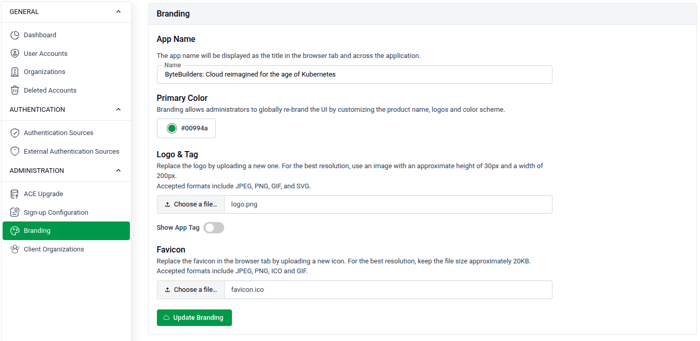

# Branding

Site administrators can customize the platform's appearance and identity — including the application name, logo, and favicon — to reflect their organization's branding.

## Configure Branding

Go to **SITE ADMINISTRATION > Branding** to update the platform's visual identity.

### App Name

- Enter a name in the **App Name** field. This name appears as the title in the browser tab and across the application.
- Example: `ByteBuilders Cloud managed for the age of Kubernetes`

### Logo & Tag

- Use the toggle to **enable or disable** custom branding globally across the platform.
- Click **Choose File** to upload a logo image.
- Accepted formats: **JPEG, PNG, SVG, and GIF**.

### Favicon

- Click **Choose File** to upload a favicon displayed in the browser tab.
- For best results, use an image approximately **32x32 pixels**.
- Accepted formats: **JPEG, PNG, SVG, and GIF**.

Click **Update Branding** to save all changes.
