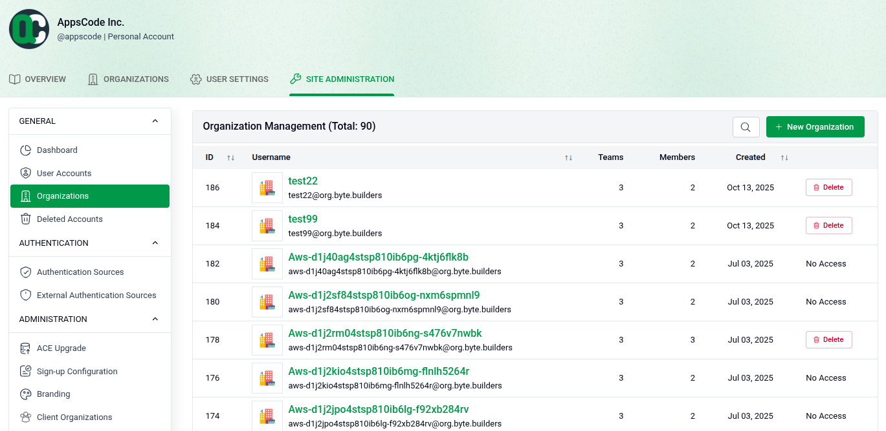
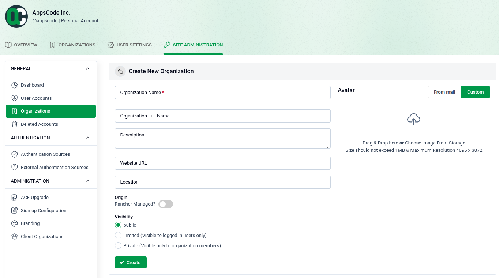

# Managing Organizations

Site administrators can view all organizations on the platform and create new ones from the **Organizations** section.

## 1. View All Organizations

Go to **SITE ADMINISTRATION > Organizations** to see the full list of organizations.

- **Total Count:** The page header shows the total number of organizations (e.g., Total: 90).
- **Organization Details:** Each row shows the ID, username, number of teams, number of members, and creation date.
- **Actions:** Each organization has a **Delete** button to remove it and a **No Access** button to restrict access.
- **Create:** Click **+ New Organization** in the top right to add a new organization.

## 2. Create a New Organization

Click **+ New Organization** to open the creation form.

- **Organization Name:** Enter a unique name (required).
- **Organization Full Name:** Optionally provide a display name.
- **Description:** Add a brief description of the organization.
- **Website URL:** Optionally link a website.
- **Location:** Optionally specify a location.
- **Origin:** Toggle **Rancher Managed?** if the organization is managed through Rancher.
- **Visibility:** Choose **Public**, **Limited** (logged-in users only), or **Private** (members only).
- **Avatar:** Upload a profile image from storage (Max: 1MB, 4096 x 3072 resolution).
- **Create:** Click **+ Create** to finish.
