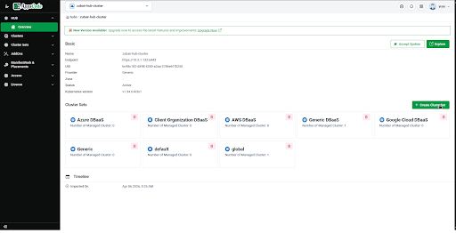
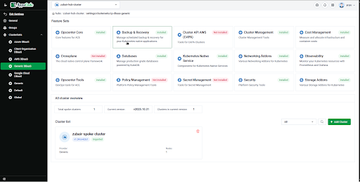
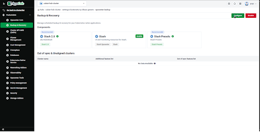
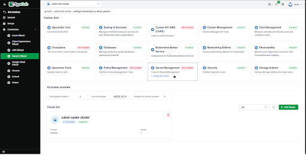
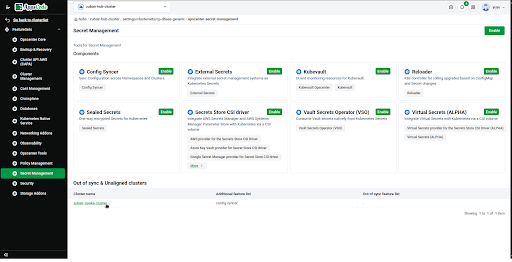
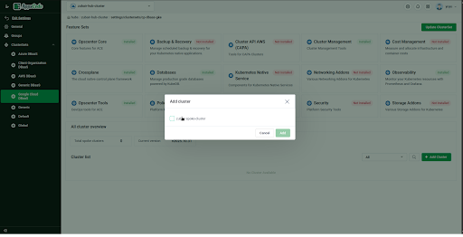

# Important Note

⚠️ Spoke users **should NOT manage feature sets directly**

* Feature updates must be handled from the **Hub**
* Hub must stay in sync

---

# ClusterSets

ClusterSets group multiple clusters together.

## Create ClusterSet

1. Go to **ClusterSets**
2. Click **Add ClusterSet**

3. Provide a name

---

## Feature Sets

* Select any feature you want to change in all of your connected spokes 

* Apply configurations across all clusters
* Centralized feature management

## Unaligned and Out of sync cluster 

### Unaligned cluster: If any spoke cluster has extra features enabled than hub that's unaligned 

Like in the image secret management have 1 unaligned cluster 

You can see config-syncer is enabled in spoke but not in hub

### Similarly if any hub update does not get applied in spoke that becomes out of sync 

---

## Add Clusters

You can add cluster from another clusterset if you want 

1. Select cluster(s)

2. Add to ClusterSet

