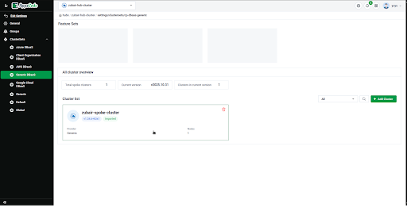
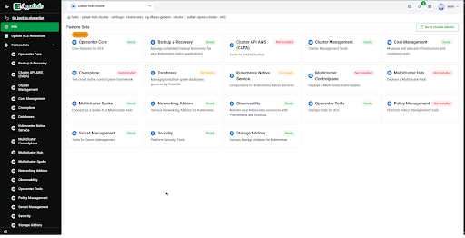
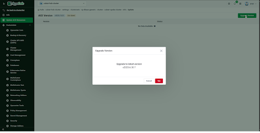

# Upgrade spoke cluster 

1. Go to clusterset of the cluster that you want to upgrade to latest version 

2. You will see a new interface a spoke featureset inside a hub

Here if you want a spoke to intentionally have different features than hub then you can configure them from here 

3. Go to the upgrade version from sidebar if there is any latest version available you will upgrade button click and Done

