# Deploying KubeDB Platform: AWS Marketplace

Welcome to the KubeDB Platform's **AWS Marketplace** deployment! This guide will walk you through the deployment process via the **AWS Marketplace**, ensuring your environment is configured correctly for a seamless installation.

To install **ACE**, you need to have the permissions to manage **EC2**, **IAM**, **CloudFormation** etc.

### Prerequisite

Before you begin, please ensure your Kubernetes cluster meets the following minimum system requirements:
* **Worker Nodes**: At least one dedicated worker node.
* **CPU**: 4–6 vCPUs.
* **Memory**: 16 GB of RAM.
* **Networking**: A routable IP address for external connectivity.

You have to create an `Access Key` and `Secret Key` with following policies attached. Check out similar [eksctl docs](https://eksctl.io/usage/minimum-iam-policies/) for reference. 

### For importing cluster to console:
ImportClusterCustomAccess
```json
{
  "Version": "2012-10-17",
  "Statement": [
    {
      "Effect": "Allow",
      "Action": [
            "eks:DescribeNodegroup",
            "ec2:DescribeAvailabilityZones",
            "ec2:DescribeRegions",
            "eks:DescribeCluster",
            "eks:ListClusters"
      ],
      "Resource": "*"
    }
  ]
}
```
### For creating and managing the EKS Cluster and EC2 resources:

AmazonEC2FullAccess (AWS Managed Policy)
```json
{
    "Version": "2012-10-17",
    "Statement": [
        {
            "Action": "ec2:*",
            "Effect": "Allow",
            "Resource": "*"
        },
        {
            "Effect": "Allow",
            "Action": "elasticloadbalancing:*",
            "Resource": "*"
        },
        {
            "Effect": "Allow",
            "Action": "cloudwatch:*",
            "Resource": "*"
        },
        {
            "Effect": "Allow",
            "Action": "autoscaling:*",
            "Resource": "*"
        },
        {
            "Effect": "Allow",
            "Action": "iam:CreateServiceLinkedRole",
            "Resource": "*",
            "Condition": {
                "StringEquals": {
                    "iam:AWSServiceName": [
                        "autoscaling.amazonaws.com",
                        "ec2scheduled.amazonaws.com",
                        "elasticloadbalancing.amazonaws.com",
                        "spot.amazonaws.com",
                        "spotfleet.amazonaws.com",
                        "transitgateway.amazonaws.com"
                    ]
                }
            }
        }
    ]
}
```
AWSCloudFormationFullAccess (AWS Managed Policy)
```json
{
    "Version": "2012-10-17",
    "Statement": [
        {
            "Effect": "Allow",
            "Action": [
                "cloudformation:*"
            ],
            "Resource": "*"
        }
    ]
}
```
EksAllAccess
```json
{
    "Version": "2012-10-17",
    "Statement": [
        {
            "Effect": "Allow",
            "Action": "eks:*",
            "Resource": "*"
        },
        {
            "Action": [
                "ssm:GetParameter",
                "ssm:GetParameters"
            ],
            "Resource": [
                "arn:aws:ssm:*:<account_id>:parameter/aws/*",
                "arn:aws:ssm:*::parameter/aws/*"
            ],
            "Effect": "Allow"
        },
        {
             "Action": [
               "kms:CreateGrant",
               "kms:DescribeKey"
             ],
             "Resource": "*",
             "Effect": "Allow"
        },
        {
             "Action": [
               "logs:PutRetentionPolicy"
             ],
             "Resource": "*",
             "Effect": "Allow"
        }        
    ]
}
```
IamLimitedAccess
```json
{
    "Version": "2012-10-17",
    "Statement": [
        {
            "Effect": "Allow",
            "Action": [
                "iam:CreateInstanceProfile",
                "iam:DeleteInstanceProfile",
                "iam:GetInstanceProfile",
                "iam:RemoveRoleFromInstanceProfile",
                "iam:GetRole",
                "iam:CreateRole",
                "iam:DeleteRole",
                "iam:AttachRolePolicy",
                "iam:PutRolePolicy",
                "iam:UpdateAssumeRolePolicy",
                "iam:AddRoleToInstanceProfile",
                "iam:ListInstanceProfilesForRole",
                "iam:PassRole",
                "iam:DetachRolePolicy",
                "iam:DeleteRolePolicy",
                "iam:GetRolePolicy",
                "iam:GetOpenIDConnectProvider",
                "iam:CreateOpenIDConnectProvider",
                "iam:DeleteOpenIDConnectProvider",
                "iam:TagOpenIDConnectProvider",
                "iam:ListAttachedRolePolicies",
                "iam:TagRole",
                "iam:UntagRole",
                "iam:GetPolicy",
                "iam:CreatePolicy",
                "iam:DeletePolicy",
                "iam:ListPolicyVersions"
            ],
            "Resource": [
                "arn:aws:iam::<account_id>:instance-profile/eksctl-*",
                "arn:aws:iam::<account_id>:role/eksctl-*",
                "arn:aws:iam::<account_id>:policy/eksctl-*",
                "arn:aws:iam::<account_id>:oidc-provider/*",
                "arn:aws:iam::<account_id>:role/aws-service-role/eks-nodegroup.amazonaws.com/AWSServiceRoleForAmazonEKSNodegroup",
                "arn:aws:iam::<account_id>:role/eksctl-managed-*"
            ]
        },
        {
            "Effect": "Allow",
            "Action": [
                "iam:GetRole",
                "iam:GetUser"
            ],
            "Resource": [
                "arn:aws:iam::<account_id>:role/*",
                "arn:aws:iam::<account_id>:user/*"
            ]
        },
        {
            "Effect": "Allow",
            "Action": [
                "iam:CreateServiceLinkedRole"
            ],
            "Resource": "*",
            "Condition": {
                "StringEquals": {
                    "iam:AWSServiceName": [
                        "eks.amazonaws.com",
                        "eks-nodegroup.amazonaws.com",
                        "eks-fargate.amazonaws.com"
                    ]
                }
            }
        }
    ]
}
```

### S3:FullAccess for storing cluster backups
AmazonS3FullAccess (AWS Managed Policy)
```json
{
    "Version": "2012-10-17",
    "Statement": [
        {
            "Effect": "Allow",
            "Action": [
                "s3:*",
                "s3-object-lambda:*"
            ],
            "Resource": "*"
        }
    ]
}
```
## Application Deployment

### 1. Visit the AppsCode Self-Hosted Page

Navigate to [AppsCode Self-Hosted](https://appscode.com/selfhost). Here you will find your previously generated self-hosted installers. <br>
Click on the `Create New Installer` button to get started.

### 2. Choose Deployment Mode And Environment

Choose `Deployment Type` -> `AWS Marketplace` and give it a name in the installer name section.

Before beginning the installation, identify your target infrastructure and cluster type.

### 3. Global Administrative Settings
These credentials define the primary super-user and the initial organizational structure.

* **System Admin:** In this section, provide the administrator's following information.
  - **Access Key ID:** AWS access key id.
  - **Secret Access Key:** AWS secret access key, these credentials will be used to manage resources to your aws account, like create bucket or create cluster.
  - **Admin Account Display Name:** The display name for the administrator account.
  - **Admin Account Email:** The email address for the administrator account.
  - **Admin Account Password:** The password for the administrator account.You may manually set a password or leave it blank to allow the system to **auto-generate** a secure administrative password.
  - **Initial Organization Name:** You can choose what will be the initial organization name for your account

For openshift cluster toggle Red Hat OpenShift cluster and give Kube API Server endpoint 

### 4. Registry
Ace requires access to various container registries and Helm repositories to pull necessary images and charts.

**Docker Registry:** Go to the docker registry section first then look for the following settings
* **Proxies:** Put registry name for Appscode `r.appscode.com` and other Public Registries like Docker Hub, GitHub Container Registry (`ghcr.io`), Kubernetes Registry, Microsoft (`mcr.microsoft.com`), and Quay.
* **Helm Repositories:** In the helm repositories section put your helm repository url
If using private or authenticated registries, provide:
* **Credentials:** Username and Password.
* **Certs:** Upload CA Cert, Client Cert, and Client Key if required for mutual TLS.
* **Image Pull Secrets:** Define the secrets used by the cluster to authenticate with the registries. You can enable create namespace during helm install, allow nondistributable artifacts and insecure option for insecure registry


### 5. Settings

#### Domain White List

* You must specify the end users domains, the system will only allow users with those specified domains. You can Add multiple domain whitelists at the same time.
* Put Login and Logout URL

### 6. Self Management
In this section you can enable or disable features. You can also create an initial `CAPI Cluster` from this section. 


### 7. Branding & UI Customization
Administrators can globally re-brand the Ace interface to match corporate identity.

* **App Name:** Changes the browser tab title.
* **Primary Color:** Enter a Hex code (default: `#009948`).
* **Assets:**
    * **Logo:** Upload a 200x30px image (SVG/PNG recommended).
    * **Favicon:** Upload a 20KB icon file.
* **App Tag:** Toggle **"Show App Tag"** to display or hide the version/tagging info in the UI.

### 8. Generate Installer and Documentation

Click the "Next" button to submit your information. AppsCode will generate the installer and provide the necessary documentation and further installation guideline in details.

You will find an `Installer URL` for this installer. You have to give this URL in the AWS Marketplace application.  

### 9. Deploy KubeDB Platform

The expiry time for this installer is 2 hours. You will find in detail deployment guideline after creating the installer.

### Set the IAM permission(optional).

### Step 1: Create IAM policy

  * Navigate to **IAM** -\> **Policy** -\> **Create policy**.
  * Select the **JSON** input tab and paste your JSON configuration. Click **Next** to continue.
```json
{
	"Version": "2012-10-17",
	"Statement": [
		{
			"Action": "ec2:*",
			"Effect": "Allow",
			"Resource": "*"
		},
		{
			"Effect": "Allow",
			"Action": "elasticloadbalancing:*",
			"Resource": "*"
		},
		{
			"Effect": "Allow",
			"Action": "cloudwatch:*",
			"Resource": "*"
		},
		{
			"Effect": "Allow",
			"Action": "autoscaling:*",
			"Resource": "*"
		},
		{
			"Effect": "Allow",
			"Action": "iam:CreateServiceLinkedRole",
			"Resource": "*",
			"Condition": {
				"StringEquals": {
					"iam:AWSServiceName": [
						"autoscaling.amazonaws.com",
						"ec2scheduled.amazonaws.com",
						"elasticloadbalancing.amazonaws.com",
						"spot.amazonaws.com",
						"spotfleet.amazonaws.com",
						"transitgateway.amazonaws.com"
					]
				}
			}
		},
		{
			"Action": [
				"aws-marketplace:MeterUsage"
			],
			"Effect": "Allow",
			"Resource": "*"
		},
		{
			"Effect": "Allow",
			"Action": [
				"iam:*",
				"organizations:DescribeAccount",
				"organizations:DescribeOrganization",
				"organizations:DescribeOrganizationalUnit",
				"organizations:DescribePolicy",
				"organizations:ListChildren",
				"organizations:ListParents",
				"organizations:ListPoliciesForTarget",
				"organizations:ListRoots",
				"organizations:ListPolicies",
				"organizations:ListTargetsForPolicy"
			],
			"Resource": "*"
		}
	]
}
```

<br/>
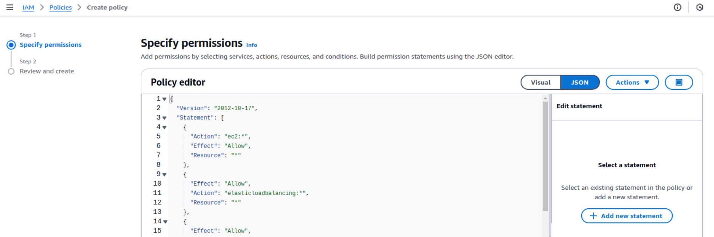

  * Give the policy the name **AWSMarketplacePolicyForCloudFormation** and click **Create Policy**.

<br/>
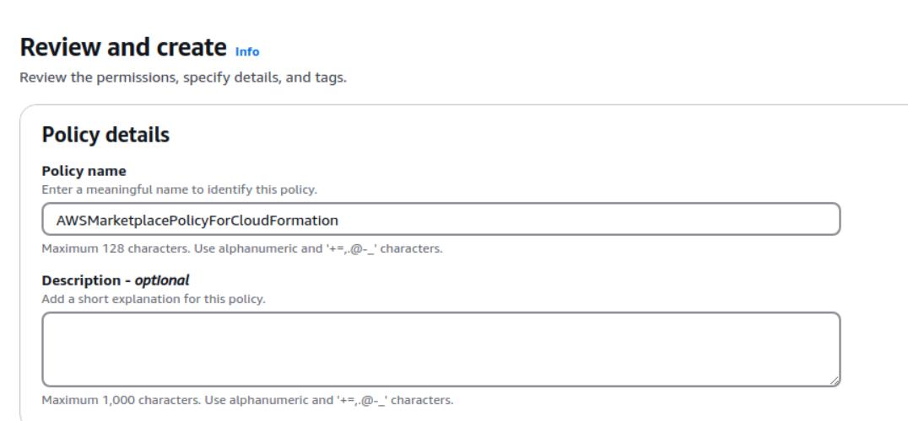  


### Step 2: Create IAM role

  * Navigate to **IAM** -\> **Roles** -\> **Create Role**.
  * Select **Trusted entity** type: `AWS service`.
  * Select **Use case**: `CloudFormation` and click **Next**.
<br/>
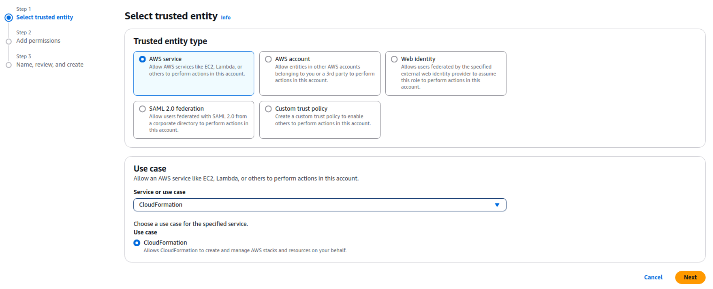
  * Search for and select the **AWSMarketplacePolicyForCloudFormation** policy you just created, then click **Next**.
  <br/>
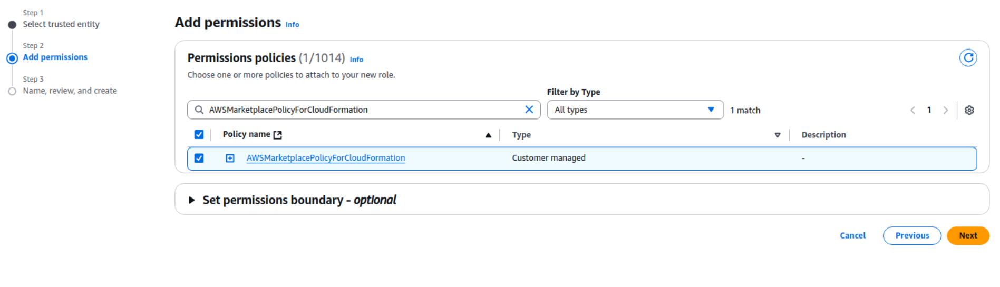
  * Name the role **AWSMarketplaceMeteringRoleForCloudFormation** and click **Create role**.
<br/>
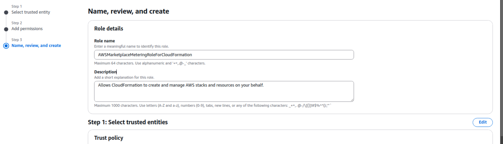


### Step 3: PassRole Permission

  * Copy the **Role ARN** of the role you just created: `arn:aws:iam::xxxxxxxx:role/AWSMarketplaceMeteringRoleForCloudFormation`.
 <br/>
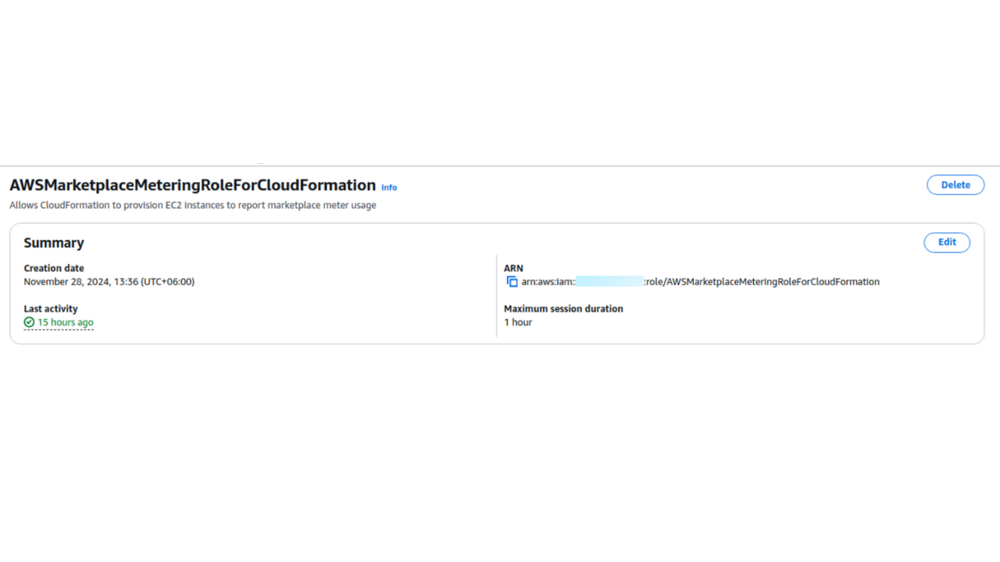 


### Step 4: Role JSON

  * Create another new policy.
  * Paste the required JSON and **replace the resource value with the Role ARN** you copied in the previous step.
  
```json
{
	"Version": "2012-10-17",
	"Statement": [
		{
			"Effect": "Allow",
			"Action": [
				"iam:GetRole",
				"iam:PassRole"
			],
			"Resource": "arn:aws:iam::XXXXXXXXXXX:role/AWSMarketplaceMeteringRoleForCloudFormation"
		}
	]
}
```

<br/>
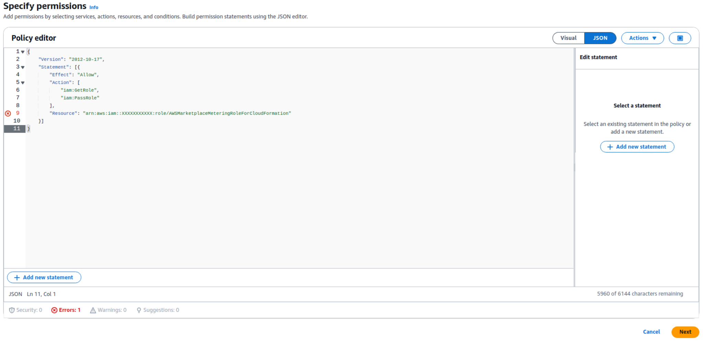 


### Step 5: Policy name

  * Provide a name for this policy (e.g., **AllowPassingMeterUsageRoleToCloudFormation**) and click **Create policy**.
  
   <br/>
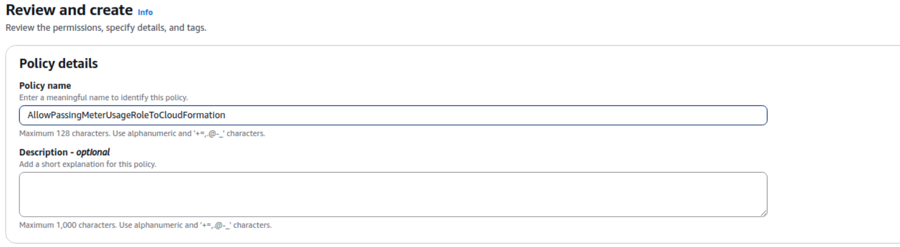 


### Step 6: Attach this policy to user or user group

  * Go to the **User** or **Group** that requires these permissions.
  * Click **Add permissions**.
  * Select the **AllowPassingMeterUsageRoleToCloudFormation** policy you just created to attach it.

 <br/>
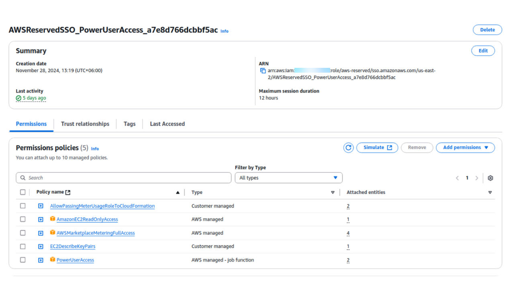 

Now follow the steps to configure the stack

### Step 1: Go to AWS Marketplace

  * Go to [AppsCode Cloud w/ Usage Billing](https://aws.amazon.com/marketplace/pp/prodview-izn7wxvkpbjuo) in the AWS Marketplace. Launch the application 
and subscribe to **AppsCode Cloud w/Usage Billing** product.
  * Click on Continue To Configuration.

 <br/>
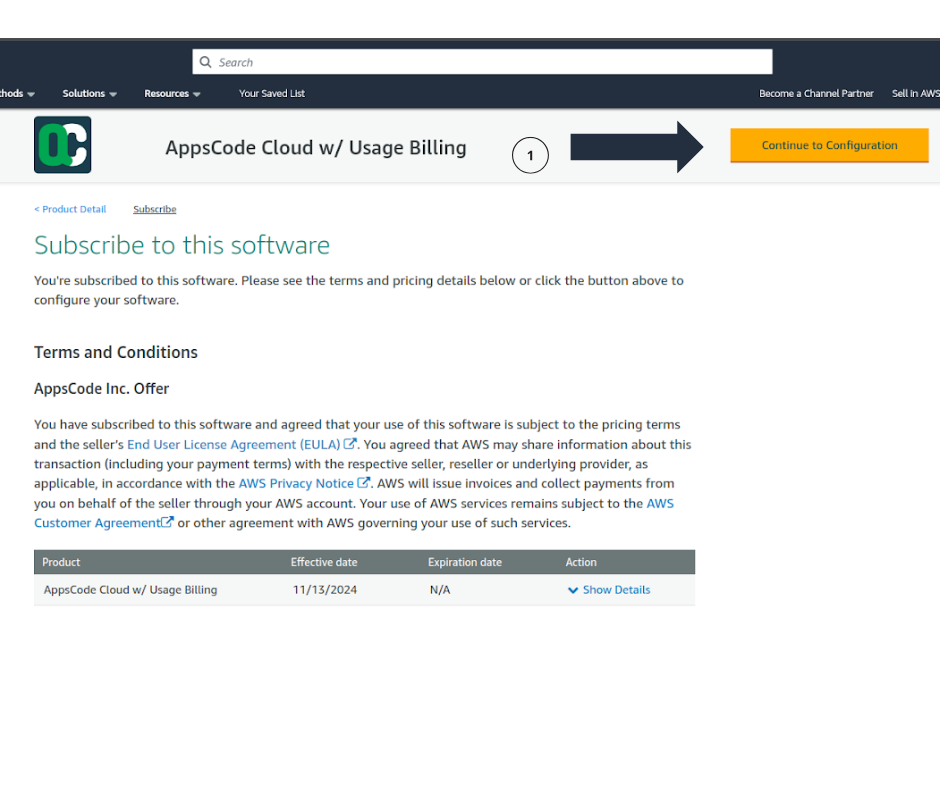 

### Step 2: Configuration

  * Select the latest software version, and region for the Application and click on **Continue to Launch.**

 <br/>
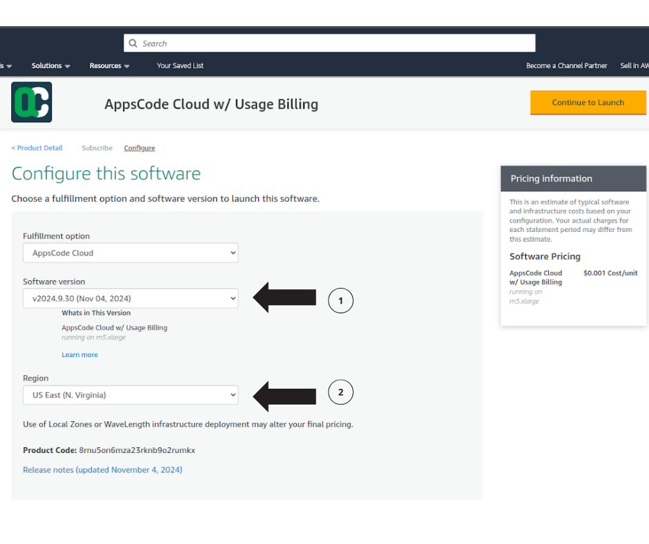 

### Step 3: Create stack

  * You will be forwarded to the Cloudformation selection page.
  * Keep the default selected template and click on **Next.**

 <br/>
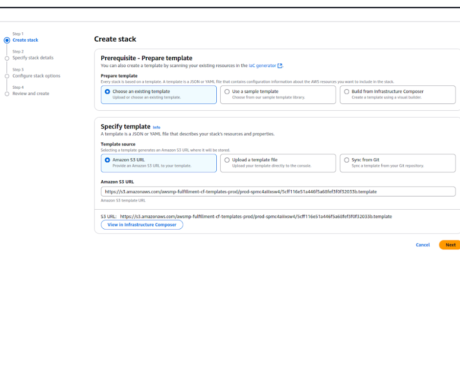 

### Step 4: Specify stack details

  * **ApplicationAccessIpCIDR:** The IP CIDR range from which the application will be accessed. **x.x.x.x/32** will allow one specific IP; we recommend using **0.0.0.0/0** so that it is publicly available.
  * **InstallerURL:** The URL that you have generated above.
  * **InstanceType:** Select an instance type; the instance must have at least **4 core** CPUs and **16GiB** of Memory.
  * **KeyPair:** Choose one of your existing KeyPairs. This KeyPair will be added as the known keys in the Instance for SSH.
  * **SSHIpCIDR:** This CIDR range IPs will have access to SSH on the application instance. **x.x.x.x/32** will allow one specific IP and **0.0.0.0/0** will allow all IPs.
  * Click **Next** and you will be forwarded to the **review and create page.**

 <br/>
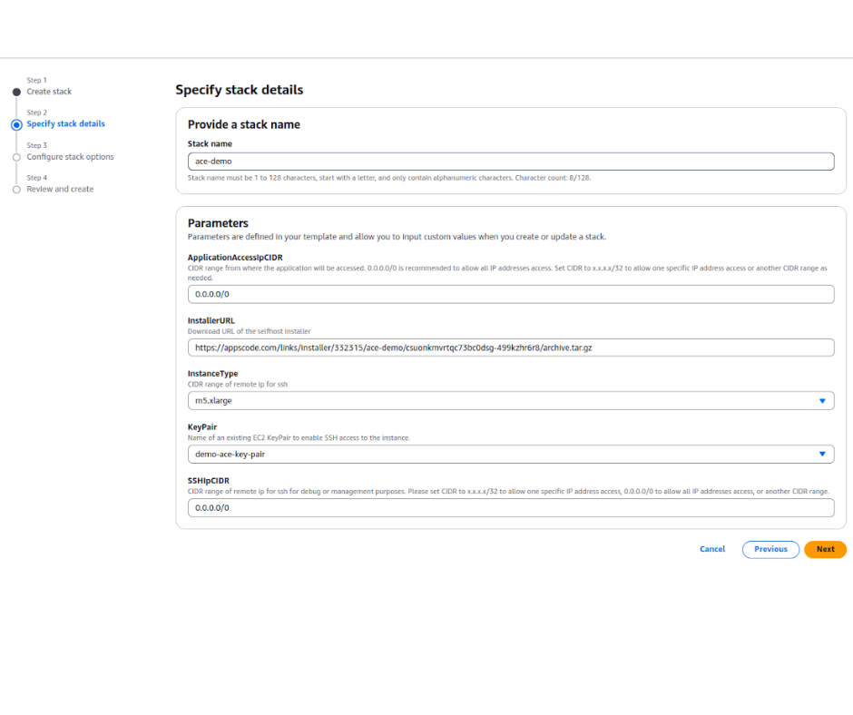 

### Step 5: Attach role to CloudFormation (Optional)

  * **Prerequisite:** You must have IAM roles for this.
  * When applying the cloudformation template (CFT), attach **AWSMarketplaceMeteringRoleForCloudFormation** role to the template. This way the CFT will have all the necessary permission to deploy the resources.

 <br/>
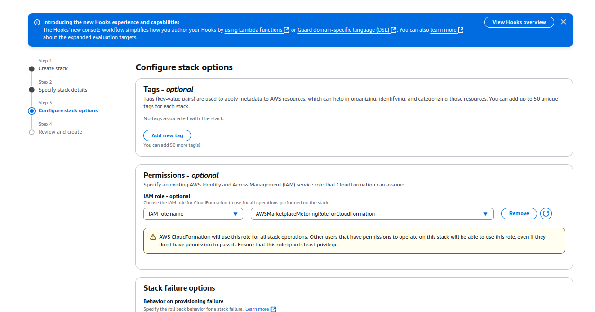 

### Step 6: Review & Deployment

  * Review the Cloudformation Template and click on **Submit** to start the application creation process.
  * Wait for some time to create the Cloudformation template.
  * Once the Cloudformation is created it will take **5-10min** to spin up the application.

 <br/>
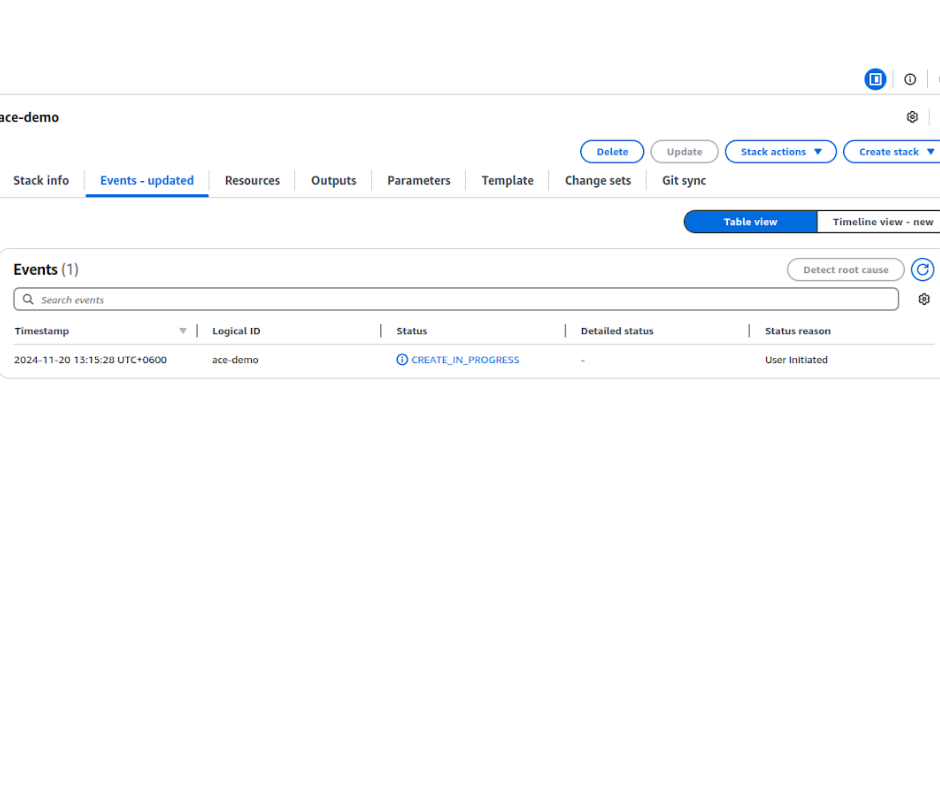 

### 10. Explore the Deployed Platform

Once deployed, access the **KubeDB Platform** using the specified domain. Log in with the admin account credentials provided during the creation process.