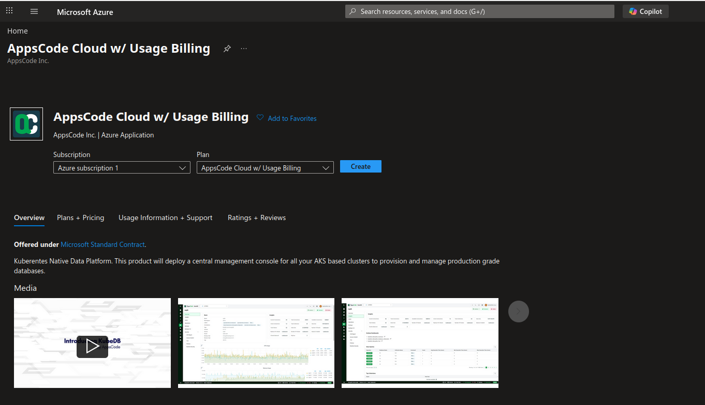
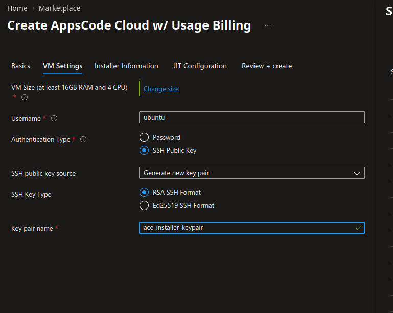
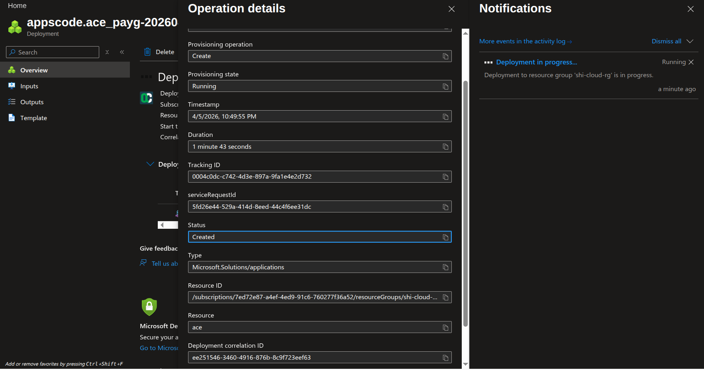
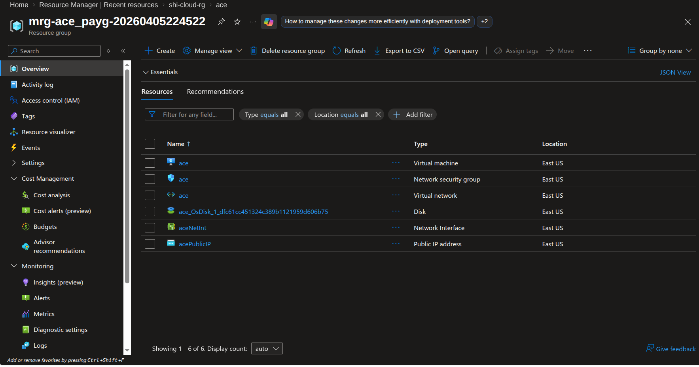

# 1. Deploying KubeDB Platform: Azure Marketplace

Welcome to the KubeDB Platform's **Azure Marketplace** deployment! This guide will walk you through the deployment process via the Azure Marketplace, ensuring your environment is configured correctly for a seamless installation.

### Prerequisites

Before you begin, please ensure your Kubernetes cluster meets the following minimum system requirements:
* **Worker Nodes**: At least one dedicated worker node.
* **CPU**: 4–6 vCPUs.
* **Memory**: 16 GB of RAM.
* **Networking**: A routable IP address for external connectivity.

## Getting Started

The **Azure Marketplace** installation wizard will prompt you for specific configuration parameters. Having these details ready beforehand will streamline your setup.

If you encounter any issues during the deployment, please refer to our Official Documentation or contact with us.

### 2. Visit the AppsCode Self-Hosted Page

Navigate to [AppsCode Self-Hosted](https://appscode.com/selfhost). Here you will find your previously generated self-hosted installers.  
Click on the `Create New Installer` button to get started.

### 3. Choose Deployment Mode And Environment

Choose `Deployment Type` -> `Azure Marketplace` and give it a name in the installer name section.

For deploying ACE using azure marketplace, you usually need these four pieces of information to establish a secure connection. These represent the "Identity" of your application and the "Address" of your billing/directory structure.

#### 1. Subscription ID
The unique identifier for your **Azure Subscription**. This is where the actual billing for Marketplace services occurs. To get Subscription ID: 
  1.  Log in to the [Azure Portal](https://portal.azure.com).
  2.  Search for **Subscriptions** in the top search bar.
  3.  Select your active subscription. 
  4.  Copy the **Subscription ID** (e.g., `a1b2c3d4-5678-90ab-cdef-1234567890ab`).

#### 2. Tenant ID
The identifier for your **Microsoft Entra ID** (formerly Azure AD) instance. It represents your entire organization in the cloud. To get Tenant ID: 
  1.  In the Azure Portal, search for **Microsoft Entra ID**.
  2.  On the **Overview** page, look for **Tenant ID**.
  3.  Copy the GUID.

#### 3. Client ID
This is the "username" for your application. When you register an app in Azure to interact with the Marketplace API, it is assigned this ID. To get Client ID: 
  1.  Go to **Microsoft Entra ID** > **App registrations**.
  2.  Select your application (if you haven't made one, click **New registration**).
  3.  Copy the **Application (client) ID** from the Essentials section.
Your application must have the necessary permissions to create deployment resources. It requires permissions to manage the cluster and blob storage, as well as to list regions. In this case, we have assigned the Contributor role.

#### 4. Client Secret
This is the "password" for your application. It allows the app to prove its identity to Azure. To get Client Secret: 
  1.  Inside your **App registration**, click **Certificates & secrets** in the left menu.
  2.  Click **+ New client secret**.
  3.  Add a description and expiry (e.g., 12 months).
  4.  **CRITICAL:** Copy the **Value** (not the Secret ID) immediately. Once you leave the page, it will be hidden forever.

Put **Subscription ID**, **Tenant ID**, **Client ID** and **Client Secret** in the respective field. For openshift cluster toggle Red Hat OpenShift cluster and give Kube API Server endpoint 

### 4. Global Administrative Settings

These credentials define the primary super-user and the initial organizational structure.

* **System Admin:** In this section, provide the administrator's following information.
  - **Admin Account Display Name:** The display name for the administrator account.
  - **Admin Account Email:** The email address for the administrator account.
  - **Admin Account Password:** The password for the administrator account.You may manually set a password or leave it blank to allow the system to **auto-generate** a secure administrative password.
  - **Initial Organization Name:** You can choose what will be the initial organization name for your account

For openshift cluster toggle Red Hat OpenShift cluster and give Kube API Server endpoint 

 

### 5. Registry

Ace requires access to various container registries and Helm repositories to pull necessary images and charts.

**Docker Registry:** Go to the docker registry section first then look for the following settings
* **Proxies:** Put registry name for Appscode `r.appscode.com` and other Public Registries like Docker Hub, GitHub Container Registry (`ghcr.io`), Kubernetes Registry, Microsoft (`mcr.microsoft.com`), and Quay.
* **Helm Repositories:** In the helm repositories section put your helm repository url
If using private or authenticated registries, provide:
* **Credentials:** Username and Password.
* **Certs:** Upload CA Cert, Client Cert, and Client Key if required for mutual TLS.
* **Image Pull Secrets:** Define the secrets used by the cluster to authenticate with the registries. You can enable create namespace during helm install, allow nondistributable artifacts and insecure option for insecure registry

### 6. Settings

#### Domain White List
* Add domain one by one for whitelisting
* Put Login and Logout URL 

 

### 7. Self Management

In this section you can enable or disable features.  You can also create an initial `CAPI Cluster` from this section. 

### 8. Branding & UI Customization

Administrators can globally re-brand the Ace interface to match corporate identity.

* **App Name:** Changes the browser tab title.
* **Primary Color:** Enter a Hex code (default: `#009948`).
* **Assets:**
    * **Logo:** Upload a 200x30px image (SVG/PNG recommended).
    * **Favicon:** Upload a 20KB icon file.
* **App Tag:** Toggle **"Show App Tag"** to display or hide the version/tagging info in the UI.

 

### 9. Generate Installer and Documentation

Click the "Deploy" button to submit your information. AppsCode will generate the installer and provide the necessary documentation.

### 10. Deploy KubeDB Platform

#### Step 1: Create Azure application
Go to Azure Marketplace and select AppsCode Cloud w/ Usage Billing application. [AppsCode Cloud w/ Usage Billing from Marketplace](https://portal.azure.com/#create/appscode.ace_paygace-payg)

 

#### Step 2: Basic Information
Provide basic information for the Azure application. Put your resource group and application name. 

 

#### Step 3: Select VM
Select a virtual machine for the Installer with at least 4 core CPU and 16GB of RAM.

 

#### Step 4: Authentication Type
By default Username user will be created to your Installer VM.
You can use one of the Password or SSH Key Pair to authenticate into the VM.

 

#### Step 5: Installer Information
Provide the URL link you found from the instruction in the Installer Url field

 

You can monitor the deployment progress through the **Managed Resource Group's** overview page and the **Activity Log**. Once the deployment is complete, the necessary resources will be provisioned within that managed resource group.

  
  

### 11. Explore the Deployed Platform

Once deployed, access the **KubeDB Platform** using the specified domain. Log in with the admin account credentials provided during the creation process.