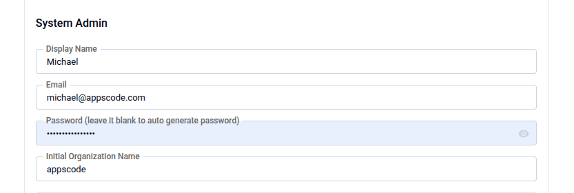
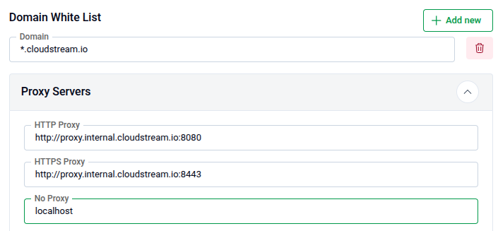
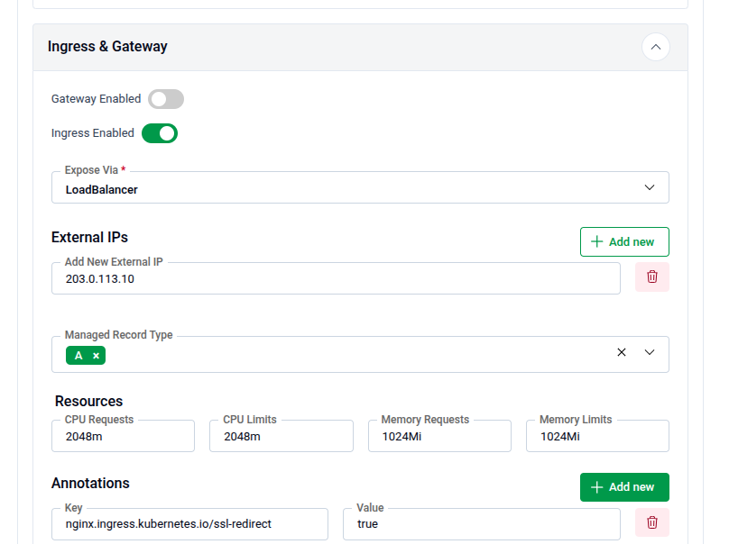
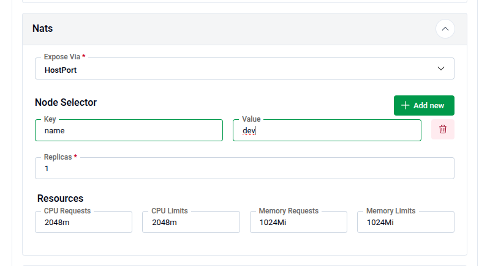
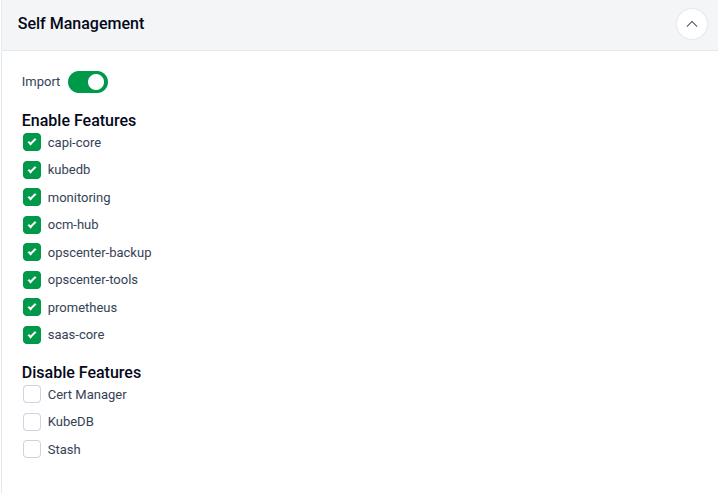
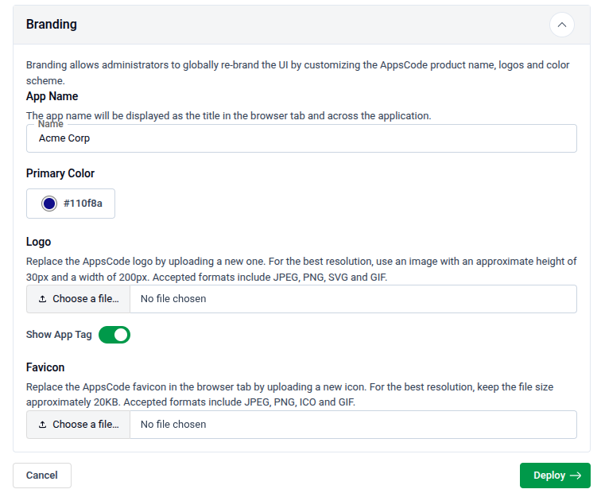

# Deploying KubeDB Platform: Onprem Demo

Welcome to the KubeDB Platform's "Onprem Demo" deployment! Follow these steps to deploy the KubeDB Platform in Onprem Demo mode.

### Prerequisites

Before you begin, please ensure your Kubernetes cluster meets the following minimum system requirements:
* Worker Nodes: At least one dedicated worker node.
* CPU: 4–6 vCPUs.
* Memory: 16 GB of RAM.
* Networking: A routable IP address for external connectivity.

You will get an instruction to deploy a k3s cluster in Ubuntu VM or you can skip this step if you already have a cluster. 

### 1. Visit the AppsCode Self-Hosted Page

Navigate to [AppsCode Self-Hosted](https://appscode.com/selfhost). Here you will find your previously generated self-hosted installers.  
Click on the `Create New Installer` button to get started.

### 2. Choose Deployment Mode

Choose `Deployment Type` -> `Onprem Demo` and give it a name in the installer name section.

Before beginning the installation, identify your target infrastructure and cluster type.

* **DNS & Connectivity:** 
  * **Enable DNS:** Toggle this to allow the installer to manage or integrate with your DNS provider.
  * **Target IP:** Provide the static IP addresses for your cluster nodes or load balancer.
* **Cluster Type:** Determine if you are installing on **Red Hat OpenShift Cluster**.
### 3. Global Administrative Settings
These credentials define the primary super-user and the initial organizational structure.

* **System Admin:** In this section, provide the administrator's following information.
  - **Admin Account Display Name:** The display name for the administrator account.
  - **Admin Account Email:** The email address for the administrator account.
  - **Admin Account Password:** The password for the administrator account.You may manually set a password or leave it blank to allow the system to **auto-generate** a secure administrative password.
  - **Initial Organization Name:** You can choose what will be the initial organization name for your account

 

### 4. Registry
Ace requires access to various container registries and Helm repositories to pull necessary images and charts.

**Docker Registry:** Go to the docker registry section first then look for the following settings
* **Proxies:** Put registry name for Appscode `r.appscode.com` and other Public Registries like Docker Hub, GitHub Container Registry (`ghcr.io`), Kubernetes Registry, Microsoft (`mcr.microsoft.com`), and Quay.
* **Helm Repositories:** In the helm repositories section put your helm repository url
If using private or authenticated registries, provide:
* **Credentials:** Username and Password.
* **Certs:** Upload CA Cert, Client Cert, and Client Key if required for mutual TLS.
* **Image Pull Secrets:** Define the secrets used by the cluster to authenticate with the registries. You can enable create namespace during helm install, allow nondistributable artifacts and insecure option for insecure registry

### 5. Settings

#### Domain White List and Proxy Servers

* Add domain one by one for whitelisting
* **Proxy Servers:** If you have proxy servers then put **HTTP Proxy**, **HTTPS Proxy** and **No Proxy**
* Put Login and Logout URL for your app

 

### 6. TLS
Configure TLS certificates for secure communication. You can choose the Issuer type from the following list.
  * **External**: Use this if you already have certificates from an external provider.
      * CA CERT: Paste the Certificate Authority certificate.
      * Certificate CERT: Paste the certificate issued for your domain.
      * Certificate Key: Paste the private key associated with the certificate.

  * **CA:** Use this if you want AppsCode to manage your certificates with its internal CA.
      * CA CERT: Paste the internal CA certificate.
      * CA Key: Paste the internal CA key.

### 7. Ingress & Gateway

Configure how the application is exposed to the internet or your internal network.

* **Ingress & Gateway:** Enable either the **Gateway API** or standard **Ingress**. 

 

### 8. NATS

Configure NATS, which is used as the internal messaging system for the platform.

**Expose Via:**
  Choose how NATS will be exposed:

  * **HostPort:** Exposes NATS directly on the node’s network interface.

    * **Node Selector:** Specify the node label (Key and Value) to control where NATS will be scheduled.
  * **Ingress:** Use this option to expose NATS externally via an ingress controller.
**Replicas:** For production, ensure at least 1 replica is active (consider 3 for high availability).
**Resources:** Configure CPU Requests, CPU Limits, Memory Request and  Memory Limit

 

### 9. Self Management
In this section you can enable or disable features

 

### 10. Branding & UI Customization
Administrators can globally re-brand the Ace interface to match corporate identity.

* **App Name:** Changes the browser tab title.
* **Primary Color:** Enter a Hex code (default: `#009948`).
* **Assets:**
    * **Logo:** Upload a 200x30px image (SVG/PNG recommended).
    * **Favicon:** Upload a 20KB icon file.
* **App Tag:** Toggle **"Show App Tag"** to display or hide the version/tagging info in the UI.

 

### 11. Generate Installer and Documentation

Click the "Deploy" button to submit your information. AppsCode will generate the installer and provide the necessary documentation.

### 12. Deploy KubeDB Platform

Follow the documentation provided by AppsCode to deploy the KubeDB Platform on your system.

### 13. Explore the Deployed Platform

Once deployed, access the KubeDB Platform using the specified domain. Log in with the admin account credentials provided during the creation process.

 

## Get Support

If you encounter any challenges during the deployment or have questions, reach out to AppsCode support for assistance.

Congratulations! You have successfully deployed the KubeDB Platform in Onprem Demo mode. Explore the features and capabilities of the platform in your customized environment.
