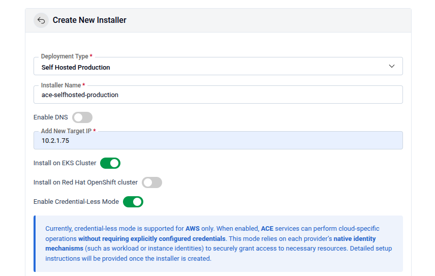
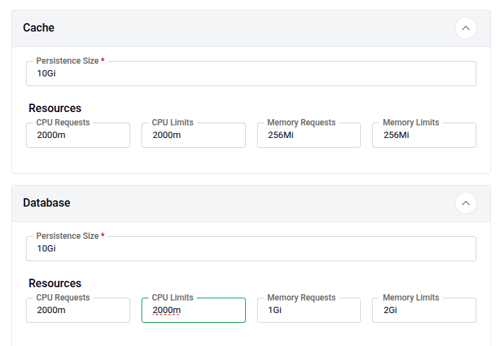

# Deploying KubeDB Platform: Self Hosted Production 

Welcome to the **Self-Hosted Production** deployment guide for the **KubeDB Platform**. This installation mode is designed for environments requiring high levels of customization and granular control. 

By following this walkthrough, you can tailor the deployment to meet your specific production requirements while ensuring a stable and optimized installation.

#### Why Choose Self-Hosted Production?

The self-hosted model provides the flexibility to:
* **Optimize Resources:** Tune performance parameters based on your specific workload.
* **Custom Configurations:** Integrate with existing infrastructure and security policies.
* **Production Readiness:** Implement the platform using best practices for high availability and reliability.


#### Deployment Overview

This guide provides a structured approach to deploying the platform manually. We will cover the prerequisite checks, configuration steps, and final verification to ensure your environment is ready for a seamless rollout.

> **Note:** Ensure your infrastructure meets the minimum system requirements before proceeding to the configuration steps.

Before you begin, please ensure your Kubernetes cluster meets the following minimum system requirements:
* **Worker Nodes**: At least one dedicated worker node.
* **CPU**: 4–6 vCPUs.
* **Memory**: 16 GB of RAM.
* **Networking**: A routable IP address for external connectivity.


You will get an instruction to deploy a k3s cluster in Ubuntu VM or you can skip this step if you already have a cluster 


### 1. Visit the AppsCode Self-Hosted Page

Navigate to [AppsCode Self-Hosted](https://appscode.com/selfhost). Here you will find your previously generated self-hosted installers. <br>
Click on the `Create New Installer` button to get started.

### 2. Choose Deployment Mode And Environment

Choose `Deployment Type` -> `Self Hosted Production` and give it a name in the installer name section.

Before beginning the installation, identify your target infrastructure and cluster type.

* **DNS & Connectivity:** 
  * **Enable DNS:** Toggle this to allow the installer to manage or integrate with your DNS provider.
  * **Target IP:** Provide the static IP addresses for your cluster nodes or load balancer.
* **Cluster Type:** Determine if you are installing on **AWS EKS Cluster** or **Red Hat OpenShift Cluster**. For openshift cluster toggle Red Hat OpenShift cluster and give Kube API Server endpoint 
* **Credential-Less Mode:** Enable this if you are using IAM roles for service accounts (IRSA) to avoid manual secret management.
<br/>


### Additional configuration for EKS cluster

**Prerequisite:** <br/>
* EBS CSI Driver must be installed
* AWS Load Balancer Controller must be installed

Run the following command to get Kube API Server put it in the API server field

```
aws eks describe-cluster --name <cluster-name> --region <region> --query "cluster.endpoint" --output text
```

Run the following command to get Subnet IDs and add them

```
aws ec2 describe-subnets --filters "Name=vpc-id,Values=$(aws eks describe-cluster --name <cluster-name> --region <region> --query "cluster.resourcesVpcConfig.vpcId" --output text)" "Name=map-public-ip-on-launch,Values=true" --region <region> --query "Subnets[*].SubnetId" --output text
```

**Subnet IDs:** Make sure you have added the allocation id of Target IP as well. Run the following command to create EIP Allocation IDs `aws ec2 allocate-address --region <region>`

**EIP Allocation IDs:** Give EIP allocation IDs for your public subnets. 

### Configuring AWS credentialless mode

For Database backup process **KubeDB** uses  **KubeStash** and KubeStash depends on Object storage for storing data. If you configure S3 in aws then by configuring credentialless mode you can avoid the hassle of using `Access Key` and `Secret Key`. You can configure credentialless mode for both EC2(K3s cluster VM) and EKS infrastucture. 

### EC2 Instance 

If you are managing credentialless mode in EC2 VM then you will get policy permission json file after clicking the deploy button. You need to attach this to EC2 instance profile. Follow the following steps for policy attachment

#### 1. Create the IAM Policy
First, create the policy in your AWS account. 

```bash
aws iam create-policy \
    --policy-name <your-policy-name> \
    --policy-document file://iam-selfhost-permission.json
```

**Note:** Copy the `Arn` from the output; you will need it for the next step. It will look like: `arn:aws:iam::123456789012:policy/<your-policy-name>`.

#### 2. Identify your IAM Role
If you don't know the exact name of the role currently attached to your EC2 instance, use this command to list the role attached to your specific instance:

```bash
aws ec2 describe-instances \
    --instance-id <your-instance-id> \
    --query "Reservations[0].Instances[0].IamInstanceProfile.Arn" \
    --output text
```

#### 3. Attach the Policy to the Role
Once you have the role name, attach the newly created policy to it.

```bash
aws iam attach-role-policy \
    --role-name <your-role-name> \
    --policy-arn arn:aws:iam::123456789012:policy/<your-policy-name>
```
#### Verifying the Setup
After running the command, you can verify that the policy is attached to the role:

```bash
aws iam list-attached-role-policies --role-name <your-role-name>
```

### EKS Cluster

Use following steps to give necessary permission to the credential manager controller through service acccount. 

Here you have to give IRSA related information. Create Role for IRSA and get OIDC ID

```
export CLUSTER_NAME=<cluster name>
export REGION=<cluster region>
export ACCOUNT_ID=<aws account id>

OIDC_ID=$(aws eks describe-cluster --name $CLUSTER_NAME --region $REGION --query "cluster.identity.oidc.issuer" --output text | cut -d '/' -f 5)
echo $OIDC_ID

#Verify the OIDC already created or not
aws iam list-open-id-connect-providers | grep $OIDC_ID | cut -d "/" -f4

#If the command doesn't return the oidc id then create one
eksctl utils associate-iam-oidc-provider --cluster $CLUSTER_NAME --region $REGION --approve

```

Download Policy and trust-relationship files
```
for file in iam-ec2-permissions.json iam-eks-permissions.json template-trust-relationship; do
  echo "http://cdn.appscode.com/files/products/appscode/aws-selfhost/$file"
done | xargs -n 1 -P 4 curl -O
```
Create Policy using the downloaded files skip if the policy already exists, take note of the policy arn which will be attached to the role next

```
# grab the policy arn’s from the output
aws iam create-policy --policy-name AceSelfhostInstallerEC2Policy --policy-document file://iam-ec2-permissions.json
EC2_POLICY_ARN=$(aws iam list-policies --query "Policies[?PolicyName==’AceSelfhostInstallerEC2Policy’].Arn" --output text)
aws iam create-policy --policy-name AceSelfhostInstallerEKSPolicy --policy-document file://iam-eks-permissions.json
EKS_POLICY_ARN=$(aws iam list-policies --query "Policies[?PolicyName==’AceSelfhostInstallerEKSPolicy’].Arn" --output text)
```
Create Role using the downloaded trust-relationship file
```
sed -e "s/OIDC_ID/$OIDC_ID/g" -e "s/ACCOUNT_ID/$ACCOUNT_ID/g" -e "s/REGION/$REGION/g" -e "s/SA_NAMESPACE/"ace"/g" -e "s/SA_NAME/"ace"/g" template-trust-relationship > ace-trust-relationship.json
aws iam create-role --role-name AceInstaller-$OIDC_ID --assume-role-policy-document file://ace-trust-relationship.json --description "A role to be used by ACE selfhost installer"
ROLE_ARN=$(aws iam get-role --role-name AceInstaller-$OIDC_ID --query "Role.Arn" --output text)
# attach Policies to the Role
aws iam attach-role-policy --role-name AceInstaller-$OIDC_ID --policy-arn=$EC2_POLICY_ARN
aws iam attach-role-policy --role-name AceInstaller-$OIDC_ID --policy-arn=$EKS_POLICY_ARN

```
Create and associate access policy

```
# Create access entry
aws eks create-access-entry \
  --cluster-name $CLUSTER_NAME \
  --region $REGION \
  --principal-arn $ROLE_ARN \
  --type STANDARD
# Associate access policy
aws eks associate-access-policy \
  --cluster-name $CLUSTER_NAME \
  --region $REGION \
  --principal-arn $ROLE_ARN \
  --policy-arn arn:aws:eks::aws:cluster-access-policy/AmazonEKSClusterAdminPolicy \
  --access-scope type=cluster
```

Provide the output role arn as Ace Installer Role ARN `echo $ROLE_ARN`in the **Ace Installer Role ARN** field. 

### 3. Global Administrative Settings
These credentials define the primary super-user and the initial organizational structure.

* **System Admin:** In this section, provide the administrator's following information.
  - **Admin Account Display Name:** The display name for the administrator account.
  - **Admin Account Email:** The email address for the administrator account.
  - **Admin Account Password:** The password for the administrator account.You may manually set a password or leave it blank to allow the system to **auto-generate** a secure administrative password.
  - **Initial Organization Name:** You can choose what will be the initial organization name for your account

<br/>


### 4. Release
Define the specific Kubernetes namespace and release information for the Ace components.

* **Release Name:** Defaults to `ace`.
* **Namespace:** Enter the target namespace (default: `ace`). 
* **Namespace Automation:** Toggle **"Create namespaces during Helm install"** if you want the installer to handle namespace lifecycle management.

### 5. Registry
Ace requires access to various container registries and Helm repositories to pull necessary images and charts.

**Docker Registry:** Go to the docker registry section first then look for the following settings
* **Proxies:** Put registry name for Appscode `r.appscode.com` and other Public Registries like Docker Hub, GitHub Container Registry (`ghcr.io`), Kubernetes Registry, Microsoft (`mcr.microsoft.com`), and Quay.
* **Helm Repositories:** In the helm repositories section put your helm repository url
If using private or authenticated registries, provide:
* **Credentials:** Username and Password.
* **Certs:** Upload CA Cert, Client Cert, and Client Key if required for mutual TLS.
* **Image Pull Secrets:** Define the secrets used by the cluster to authenticate with the registries. You can enable create namespace during helm install, allow nondistributable artifacts and insecure option for insecure registry


### 6. Settings
This secton is for Persistence & Resource Allocation. Properly sizing your resources is critical for production stability. Configure CPU Requests, CPU Limits, Memory Request and  Memory Limit for both cache and Database



<br/>

> [!IMPORTANT]
> Ensure your cluster has a **Storage Class** defined to fulfill the PVC requests for both the Cache and the Database.
If SMTP is enabled then put Host, Username, Password and From. You can also enable Send As Plain Text and TLS. 

#### Domain White List and Proxy Servers

* Add domain one by one for whitelisting
* **Proxy Servers:** If you have proxy servers then put **HTTP Proxy**, **HTTPS Proxy** and **No Proxy**
* Put Login and Logout URL for your app

<br/>


#### KubeStash
Ace uses **KubeStash** for automated backups and disaster recovery.

* **Retention Policy:** Define how long backups are kept (e.g., `keep-1mo`).
* **Schedule:** Set the backup frequency using Cron syntax (default: `0 */2 * * *` or every 2 hours).
* **Storage Secret:** Select the secret containing credentials for your cloud provider.

### 7. Infra 

* **Cloud Services:** Configure your **Provider** (e.g., AWS, GCP, Azure), **Bucket Name**, **Endpoint**, **Region** and **Prefix**. In the **Auth Section** put your `AWS Access Key ID`,`AWS Secret Access Key` and `CA CERT Data`
* **StorageClass:** Select your StorageClass in this section
* **TLS:** Configure TLS certificates for secure communication. You can choose the Issuer type from the following list.
  * **External**: Use this if you already have certificates from an external provider.
      * CA CERT: Paste the Certificate Authority certificate.
      * Certificate CERT: Paste the certificate issued for your domain.
      * Certificate Key: Paste the private key associated with the certificate.

  * **CA:** Use this if you want AppsCode to manage your certificates with its internal CA.
      * CA CERT: Paste the internal CA certificate.
      * CA Key: Paste the internal CA key.
  * **letsencrypt:** Use this for production environments to obtain globally trusted SSL/TLS certificates.
  * **letsencrypt-staging:** Use this for testing your installation

### 8. Ingress & Gateway
Configure how the application is exposed to the internet or your internal network.

* **Ingress & Gateway:** Enable either the **Gateway API** or standard **Ingress**. 

<br/>


### 9. NATS

Configure NATS, which is used as the internal messaging system for the platform.

**Expose Via:**
  Choose how NATS will be exposed:

  * **HostPort:** Exposes NATS directly on the node’s network interface.

    * **Node Selector:** Specify the node label (Key and Value) to control where NATS will be scheduled.
  * **Ingress:** Use this option to expose NATS externally via an ingress controller.
**Replicas:** For production, ensure at least 1 replica is active (consider 3 for high availability).
**Resources:** Configure CPU Requests, CPU Limits, Memory Request and  Memory Limit

<br/>


### 10. Self Management
In this section you can enable or disable features
<br/>


### 11. Branding & UI Customization
Administrators can globally re-brand the Ace interface to match corporate identity.

* **App Name:** Changes the browser tab title.
* **Primary Color:** Enter a Hex code (default: `#009948`).
* **Assets:**
    * **Logo:** Upload a 200x30px image (SVG/PNG recommended).
    * **Favicon:** Upload a 20KB icon file.
* **App Tag:** Toggle **"Show App Tag"** to display or hide the version/tagging info in the UI.

<br/>


### 12. Generate Installer and Documentation

Click the "Deploy" button to submit your information. AppsCode will generate the installer and provide the necessary documentation.

### 13. Deploy KubeDB Platform

Follow the documentation provided by AppsCode to deploy the KubeDB Platform on your system.

### 14. Explore the Deployed Platform

Once deployed, access the **KubeDB Platform** using the specified domain. Log in with the admin account credentials provided during the creation process.After the login process you will see the **ACE dashboard** user interface

<br/>
