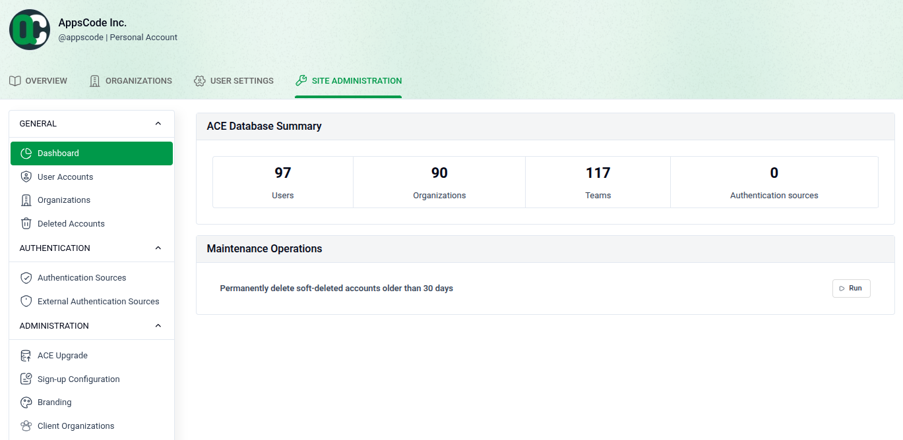

# Site Administration Dashboard

The Site Admin Dashboard gives administrators a high-level overview of the entire platform — users, organizations, and system activity.

## Accessing the Dashboard

Navigate to **SITE ADMINISTRATION > Dashboard** from the top navigation bar.

- **Users:** View the total number of registered users on the platform.
- **Organizations:** See the total count of organizations created across the system.
- **Recent Activity:** Monitor the latest actions taken by users and admins.
- **System Info:** Review platform version and environment details at a glance.

Use this page as your starting point for platform-wide management and monitoring.
