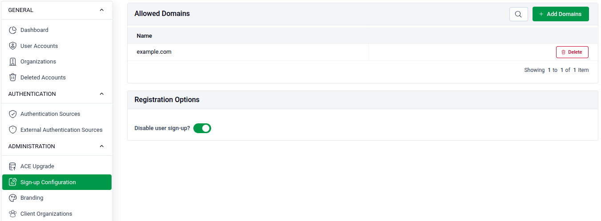
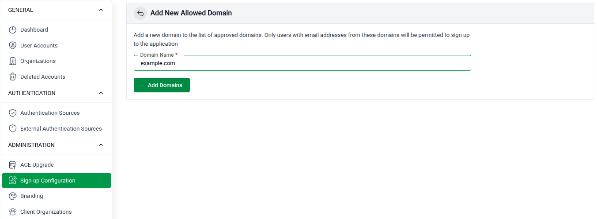

# Sign-up Configuration

Site administrators can control who is allowed to register on the platform by managing approved domains and toggling user sign-up access.

## Overview

Go to **SITE ADMINISTRATION > Sign-up Configuration** to manage registration settings.

## Allowed Domains

Restrict sign-ups to users with email addresses from specific approved domains.

- **List:** All currently allowed domains are shown in the table under **Name**.
- **Search:** Use the search bar to filter existing domains.
- **Delete:** Click the **Delete** button next to a domain to remove it from the allowed list.
- **Add:** Click **+ Add Domains** to add a new allowed domain.

## Registration Options

- **Disable user sign-up?** — Toggle this on to prevent new users from registering on the platform entirely.

## Add a New Allowed Domain

Click **+ Add Domains** to open the form.

- **Domain Name:** Enter the domain you want to allow (e.g., `example.com`). Only users with email addresses from this domain will be permitted to sign up.
- Click **+ Add Domains** to save the entry.
