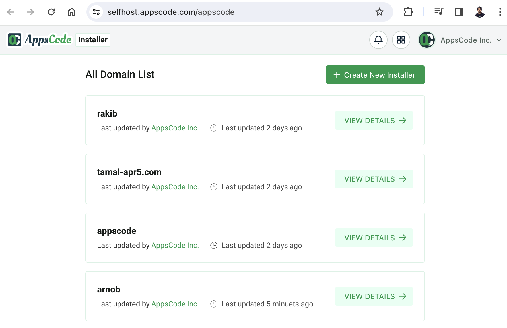

# Host KubeDB Platform as Your Own

Welcome to KubeDB Platform's Self-Hosted deployment! Whether you're looking for a quick trial in "Self Hosted Demo" mode or gearing up for a production-ready environment (`Self Hosted Production`), you're in control.

Navigate to [KubeDB Platform Self-Hosted](https://appscode.com/selfhost). Here you will find your previously generated self-hosted installers.

 
 
Click on the `Create New Installer` button to get started. You can either choose deployment type `Self Hosted Demo` or `Self Hosted Production`. Provide the required data and click `Done` button to generate the installer. Upon generation of the installer, you will get the documentation how to host KubeDB Platform Server on your own.
 
 
To get detailed documentation on `Self Hosted Demo` installer, head over to [Demo Deployment](install/selfhosted-demo.md).
 
 
To get detailed documentation on `Self Hosted Production` installer, head over to [Production Deployment](install/selfhosted-production.md).
