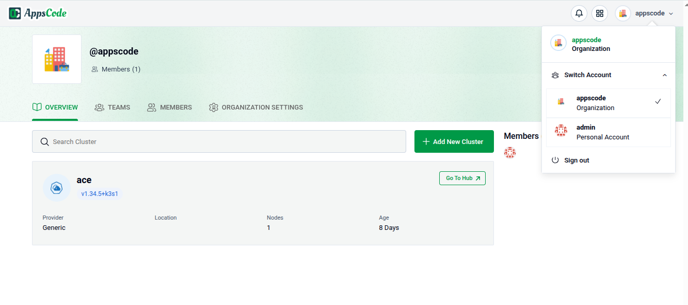

# Deploying KubeDB Platform: Cloud Demo

Welcome to the KubeDB Platform's "Cloud Demo" deployment! Follow these steps to deploy the KubeDB Platform in Cloud Demo mode.

### Prerequisites

See [Prerequisites](common-config.md#prerequisites) in the Common Configuration guide for the minimum cluster requirements and the optional k3s setup note. 

### 1. Visit the KubeDB Platform Self-Hosted Page

Navigate to [KubeDB Platform Self-Hosted](https://appscode.com/selfhost). Here you will find your previously generated self-hosted installers.  
Click on the `Create New Installer` button to get started.

### 2. Choose Deployment Mode

Choose `Deployment Type` -> `Cloud Demo` and give it a name in the installer name section.

Before beginning the installation, identify your target infrastructure and cluster type.

* **DNS & Connectivity:** 
  * **Enable DNS:** Toggle this to allow the installer to manage or integrate with your DNS provider.
  * **Target IP:** Provide the static IP addresses for your cluster nodes or load balancer.
* **Cluster Type:** Determine if you are installing on **AWS EKS Cluster** or **Red Hat OpenShift Cluster**.

> For Red Hat OpenShift clusters, see the [Deploying KubeDB Platform in OpenShift Cluster](openshift-cluster.md) guide.

#### Additional configuration for EKS cluster

See [Additional configuration for EKS cluster](common-config.md#additional-configuration-for-eks-cluster) in the Common Configuration guide for the EBS CSI / AWS Load Balancer Controller prerequisites and the commands to fetch the Kube API server endpoint, subnet IDs, and EIP allocation IDs.

### 3. Global Administrative Settings
See [Global Administrative Settings](common-config.md#global-administrative-settings) in the Common Configuration guide for the System Admin account fields (display name, email, password, and initial organization).

### 4. Registry
See [Registry](common-config.md#registry) in the Common Configuration guide for Docker registry proxies, Helm repositories, credentials, certs, and image pull secrets.

### 5. Monitoring

See [Monitoring](common-config.md#monitoring) in the Common Configuration guide for Alertmanager email and webhook configuration.

### 6. Settings

#### Domain White List and Proxy Servers

See [Domain White List and Proxy Servers](common-config.md#domain-white-list-and-proxy-servers) in the Common Configuration guide for whitelisting domains, proxy servers, and login/logout URLs.

### 7. Ingress & Gateway

See [Ingress & Gateway](common-config.md#ingress--gateway) in the Common Configuration guide for exposing the platform via the Gateway API or standard Ingress.

### 8. Self Management
See [Self Management](common-config.md#self-management) in the Common Configuration guide to enable or disable platform features.

### 9. Branding & UI Customization
See [Branding & UI Customization](common-config.md#branding--ui-customization) in the Common Configuration guide to re-brand the platform interface.

### 10. Generate Installer and Documentation

Click the "Deploy" button to submit your information. KubeDB Platform will generate the installer and provide the necessary documentation.

### 11. Deploy KubeDB Platform

Follow the documentation provided by AppsCode to deploy the KubeDB Platform on your system.

### 12. Explore the Deployed Platform

Once deployed, access the KubeDB Platform using the specified domain. Log in with the admin account credentials provided during the creation process.

 

## Get Support

If you encounter any challenges during the deployment or have questions, reach out to KubeDB Platform support for assistance.

Congratulations! You have successfully deployed the KubeDB Platform in Cloud Demo mode. Explore the features and capabilities of the platform in your customized environment.
