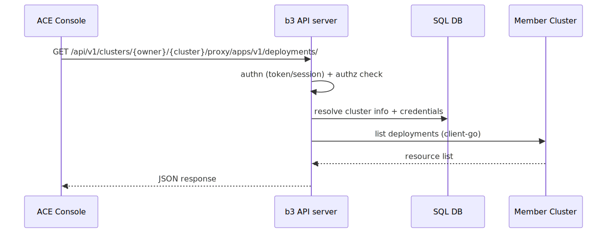
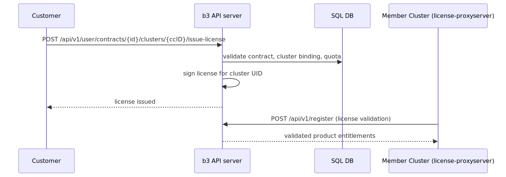

# KubeDB Platform API Reference

The **KubeDB Platform API Server** is the backend server of the KubeDB Platform. This page gives you both
the whole-system picture — what the server does, how it is put together, how
requests are authenticated and authorized, and how the pieces fit into typical
flows — and the entry point to the low-level, endpoint-by-endpoint reference. Every
endpoint on the per-group pages lists its HTTP method, path, authentication,
path/query parameters, and request/response shapes so you can implement a client
directly against it.

All routes are served under the `/api/v1` prefix unless noted otherwise. The
marketplace webhook service is a separate listener rooted at `/marketplace/api/v1`.

A machine-readable [OpenAPI 3.0.3 specification](../api/openapi.yaml) of this API is
also available (`openapi.yaml`) — load it into any OpenAPI tool (Swagger UI, Redoc,
`openapi-generator`) to explore the API or generate a client. A self-contained
Swagger UI viewer (`api.html`, with the spec inlined) is available at the repository
root.

## Overview

The KubeDB Platform API Server combines an identity foundation (users, organizations, teams,
authentication) with a multi-cluster Kubernetes management platform providing:

- **Identity & access management** — users, organizations, teams, fine-grained authorization.
- **Cluster management** — import, provision, and operate Kubernetes clusters (hub/spoke via Open Cluster Management, Rancher, cloud providers).
- **A full Kubernetes API proxy** — the KubeDB Platform UI talks to member clusters through the KubeDB Platform API Server.
- **Licensing & contracts** — issuing and enforcing product licenses (KubeDB, KubeStash, KubeVault, Voyager, ...).
- **Billing & usage reporting** — usage aggregation, invoices, cloud-marketplace metering (AWS/Azure/GCP).
- **Monitoring & telemetry** — telemetry stack provisioning, Prometheus/Trickster auth proxying.

## System Architecture



Key runtime facts:

- One binary, multiple subcommands. The default command is the API server; `marketplace`, `monitor`,
  `aggregator`, and `summary` run as separate processes for async/billing workloads.
- **NATS/JetStream** is the event backbone: member clusters push resource/usage events; `monitor` and
  `aggregator` consume them; the API server also uses NATS for its task manager and per-user credentials.
- **FluxCD (HelmRelease)** and **OCM (ManagedCluster)** are used to deploy KubeDB Platform features onto clusters and
  to manage hub→spoke relationships.
- Deployment modes are switched by `DEPLOYMENT_TYPE`: AppsCode-hosted, self-hosted (incl. offline
  installer), or AWS/GCP marketplace deployments. Some API groups only exist in specific modes (noted below).

## Authentication & Authorization

Most endpoints require a personal access token. Send it as an HTTP header:

```
Authorization: token <YOUR_TOKEN>
```

You can also pass it as a `token` or `access_token` query parameter. Token-management
endpoints accept HTTP Basic auth. The web console uses a session cookie
(`i_like_ace`); a session cookie alone does **not** authenticate the token-guarded
REST endpoints — use a token.

The server supports several authentication mechanisms:

| Mechanism | Used by | Notes |
|---|---|---|
| Session cookie | Web console | Cookie-based sign-in; CSRF-protected |
| Personal access token / Bearer token | API clients, CLI | `Authorization: token <t>`, `?token=`, `?access_token=` |
| Basic auth | Token management endpoints | With optional OTP (2FA) |
| OAuth2 / OIDC | SSO; the KubeDB Platform API Server is both provider and consumer | `/login/oauth/*`, `/.well-known/openid-configuration` |
| LDAP / PAM | Enterprise sign-in sources | Configured by site admins |
| 2FA / WebAuthn | User accounts | TOTP, scratch tokens, security keys |
| License-based auth | Member clusters | Clusters authenticate with issued licenses / cluster tokens |
| Sudo | Site admins | Impersonate a user via `sudo` param/header |

Authorization is relationship-based (OpenFGA-style checks, shown as `authzCheck(<permission>)` in the
reference tables). Common middleware referenced in the API tables:

- **Token** — authenticated request required (`reqToken`).
- **Site admin** — platform administrator only.
- **Org context** — org resolved from path or `?org=` query; membership/ownership verified.
- **Cluster assignment** — resolves owner+cluster, loads cluster credentials, builds a Kubernetes client.
- **Public** — no authentication beyond baseline middleware.

Baseline middleware on every `/api/v1` route: optional-sign-in, NATS connection cleanup,
security headers (`nosniff`), API context, sudo support.

## API Groups

The v1 API surface is organized into the following logical groups:

| # | Group | Base path(s) | What it covers | Availability |
|---|-------|--------------|----------------|--------------|
| 1 | [Identity: Users & Settings](../api/users-settings/) | `/api/v1/user`, `/api/v1/users` | Accounts, profile/security settings, tokens, credentials | always |
| 2 | [Identity: Organizations & Teams](../api/organizations-teams/) | `/api/v1/orgs`, `/api/v1/teams` | Orgs, members, teams, org tokens | always |
| 3 | [Administration](../api/administration/) | `/api/v1/admin`, `/api/v1/accounts/admin` | Admin console, site settings | always |
| 4 | [Authorization (Roles & Permissions)](../api/authorization/) | `/api/v1/authz` | Custom roles & permissions | always |
| 5 | [Cluster Management (v1 + K8s proxy + Helm)](../api/cluster-management-v1/) | `/api/v1/clusters` | Cluster lifecycle, Kubernetes proxy, Helm | always |
| 6 | [Cluster Management v2](../api/cluster-management-v2/) | `/api/v1/clustersv2` | Hub-aware cluster API, subscriptions, gateways | always |
| 7 | [Multi-cluster (OCM hub/spoke)](../api/multicluster-ocm/) | `/api/v1/clusters/:owner/:cluster/...` | Hub/spoke, cluster sets, feature sets | always |
| 8 | [Client Organizations](../api/client-organizations/) | `/api/v1/user/client*`, `/api/v1/clusters/.../permission` | Managed-service client orgs | always |
| 9 | [Cloud Providers](../api/cloud-providers/) | `/api/v1/clouds` | Provider discovery for provisioning | always |
| 10 | [Platform Installer](../api/ace-installer/) | `/api/v1/ace-installer` | Self-host installer bundles | AppsCode-hosted only |
| 11 | [Platform Upgrade](../api/ace-upgrade/) | `/api/v1/upgrade`, `/api/v1/clusters/.../upgrade` | Platform & cluster upgrades | always |
| 12 | [Licensing & Contracts](../api/licensing-contracts/) | `/api/v1/contracts`, `/api/v1/user/contracts`, `/api/v1/register`, `/api/v1/license` | Contracts, licenses, registration | contracts: AppsCode-hosted |
| 13 | [Billing Dashboard & Usage Reports](../api/billing-dashboard/) | `/api/v1/dashboard`, `/api/v1/user/dashboard`, `/api/v1/dbaas` | Usage reports & billing dashboards | billing-enabled deployments |
| 14 | [Marketplace](../api/marketplace/) | `/api/v1/marketplaces` (separate service), `/api/v1/proxy/metered-billing` | Cloud-marketplace webhooks & metering | marketplace deployments |
| 15 | [Monitoring & Telemetry](../api/monitoring-telemetry/) | `/api/v1/telemetry`, `/api/v1/trickster` | Telemetry stack, Trickster auth proxy | always |
| 16 | [Rancher Integration](../api/rancher/) | `/api/v1/rancher` | Rancher sync & proxy | always |
| 17 | [Helm Chart Repositories (public)](../api/chart-repositories/) | `/api/v1/chartrepositories` | Public Helm chart repositories | always |
| 18 | [Miscellaneous & Site Settings](../api/miscellaneous/) | `/api/v1/version`, `/api/v1/markdown`, `/api/v1/branding`, ... | Version, markdown, health | always |


## Typical Request Flows

### Cluster resource access via the Kubernetes proxy



### License issuance for a contract cluster



### Usage → billing pipeline


## Deployment Modes

| Mode | `DEPLOYMENT_TYPE` | Notes |
|---|---|---|
| AppsCode-hosted (SaaS) | `Hosted` | Full surface incl. contracts admin, installer, Firebase tokens |
| Self-hosted | `SelfHostedProduction` (offline installs also set the separate `OfflineInstaller` flag) | Runs from a generated installer bundle; `/selfhost` console URL |
| AWS Marketplace | `AWSMarketplace` | Marketplace webhooks + AWS metering proxy enabled |
| GCP Marketplace | `GoogleCloudMarketplace` | Marketplace webhooks + GCP metering proxy enabled |
| Azure Marketplace | `AzureMarketplace` | Recognized marketplace mode (webhooks); no metering proxy wired up |

Feature gating summary:

- `AppsCodeHosted` → contracts admin APIs, installer APIs, org claim, Firebase token.
- `IsBillingEnabled()` → billing dashboard APIs (admin, user, usage reports).
- `DeploymentType` → which marketplace metering proxy (if any) is registered.
- License enforcement is compiled in (`ENFORCE_LICENSE=true`); the server validates its own license at startup.
